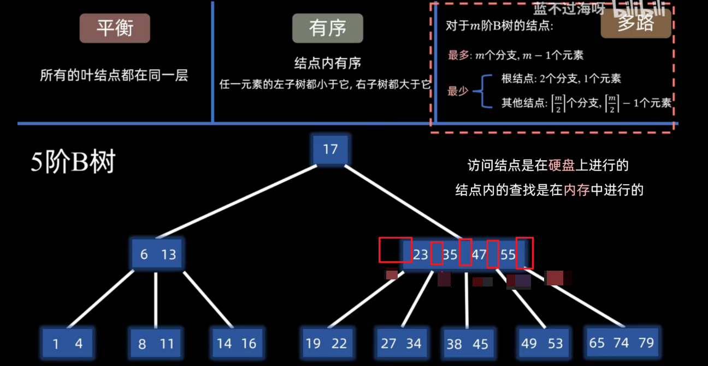
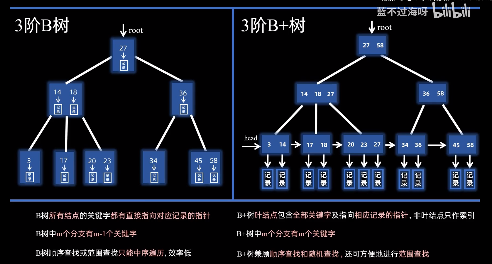
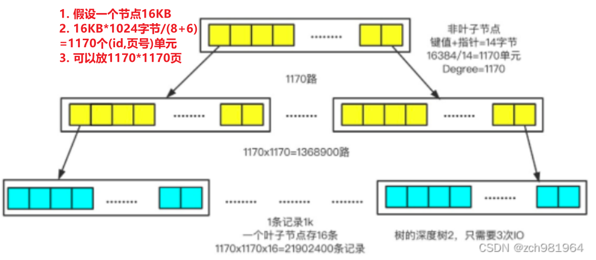
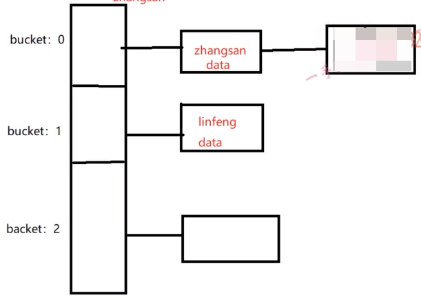
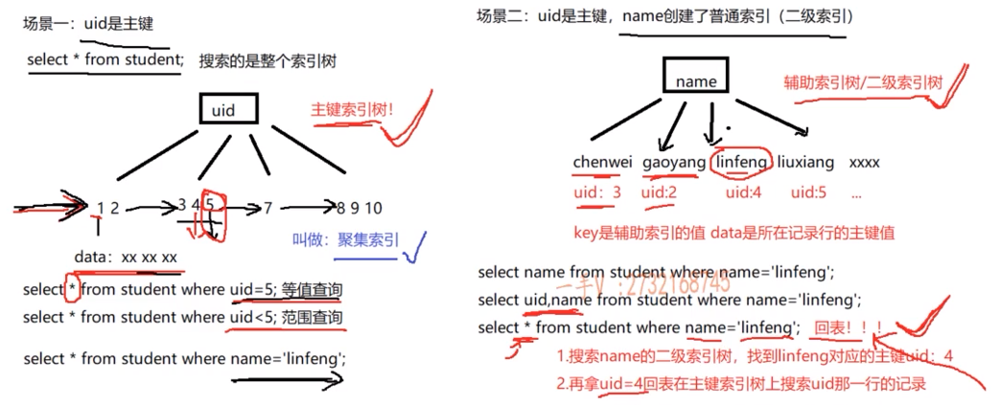
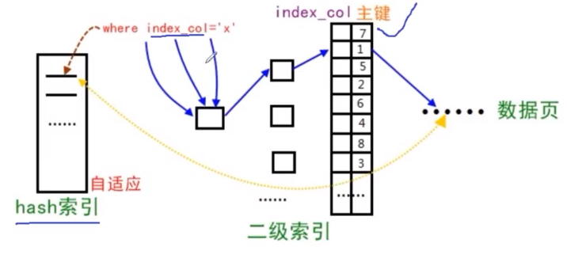
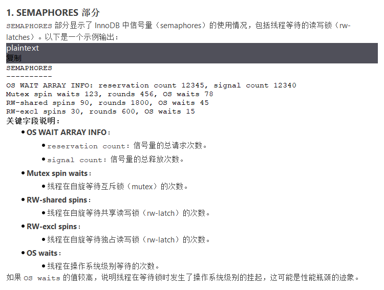

表结构、数据、索引  
# 文件目录
```mysql
 root@db211:/var/lib/mysql/mysql# ls | tail -16
tables_priv.frm
tables_priv.MYD
tables_priv.MYI
time_zone.frm
time_zone.ibd
time_zone_leap_second.frm
time_zone_leap_second.ibd
time_zone_name.frm
time_zone_name.ibd
time_zone_transition.frm
time_zone_transition.ibd
time_zone_transition_type.frm   #INNODB存储引擎-表结构
time_zone_transition_type.ibd   #INNODB存储引擎-表数据+表索引（包括所有索引）
user.frm   #MyISAM存储引擎-表结构
user.MYD   #MyISAM存储引擎-表数据
user.MYI   #MyISAM存储引擎-表索引
```
INNODE存储引擎的表主键聚簇索引和数据在同一个文件（所以即使没有设置主键，innodb也会为每一行自动生成一个默认的隐藏主键列，用来形成B+树）
# 索引
## 索引创建
### 建表时创建
```mysql
create table index1( id int, name varchar(20), index idx_id_name (id,name));
```
### 后续添加
```mysql
create index idx_name on bank_bill (name);
```
## B树
m阶B树  ,m个分支（或者说m个区间）  
x个元素就会有x+1个区间

## B+树和B树区别
    
### 从B树考虑
log2 2000万≈24.3
log500 2000万≈3 (m阶平衡树)
如果是500阶B树，那么2000万个节点最多只需要3层
### 从B+树考虑
MySQL中，一个节点1页，也就是16KB（可以改），而一个节点可以放（主键bigint(8字节)+页号地址 6字节)单元1170个，假设是1000，那两层可以放100 0000万个节点。由于1个节点16KB，如果一条数据用1KB的话，那么最底层每个叶子节点就是放16条数据。那就是3层可以放1600万条数据。这是估算，细算的话应该是2000万左右

### 其他
操作系统==内存管理==按页面4K为单位。MySQL默认使用InnoDB存储引擎，其数据块大小（block size）一般默认为16KB
## using index
```mysql
mysql> explain select name from student where name = 'liuxiang' \G
*************************** 1. row ***************************
           id: 1
  select_type: SIMPLE
        table: student
   partitions: NULL
         type: ref
possible_keys: idx_name
          key: idx_name
      key_len: 152
          ref: const
         rows: 1
     filtered: 100.00
        Extra: Using index (直接在二级索引搜索就结束了)
```
下面这个还需要回表
```mysql
mysql> explain select * from student where name = 'liuxiang' \G
*************************** 1. row ***************************
           id: 1
  select_type: SIMPLE
        table: student
   partitions: NULL
         type: ref
possible_keys: idx_name
          key: idx_name
      key_len: 152
          ref: const
         rows: 1
     filtered: 100.00
        Extra: NULL
```
## ordery by
```mysql
mysql> explain select * from student where age=20 order by name\G
*************************** 1. row ***************************
           id: 1
  select_type: SIMPLE
        table: student
   partitions: NULL
         type: ref
possible_keys: idx_age
          key: idx_age
      key_len: 1
          ref: const
         rows: 2
     filtered: 100.00
        Extra: Using index condition; Using filesort
#去除filesort
mysql> create index idx_age_name on student (age,name);
 mysql> explain select * from student where age=20 order by name\G
*************************** 1. row ***************************
           id: 1
  select_type: SIMPLE
        table: student
   partitions: NULL
         type: ref
possible_keys: idx_age,idx_age_name
          key: idx_age_name
      key_len: 1
          ref: const
         rows: 2
     filtered: 100.00
        Extra: Using index condition
```
## select *
```mysql
mysql> explain select * from student where age=20 \G
*************************** 1. row ***************************
           id: 1
  select_type: SIMPLE
        table: student
   partitions: NULL
         type: ref
possible_keys: idx_age,idx_age_name
          key: idx_age
      key_len: 1
          ref: const
         rows: 2
     filtered: 100.00
        Extra: NULL （这里回表拿数据了）

mysql> explain select uid,age,name from student where age=20 \G
*************************** 1. row ***************************
           id: 1
  select_type: SIMPLE
        table: student
   partitions: NULL
         type: ref
possible_keys: idx_age,idx_age_name
          key: idx_age_name
      key_len: 1
          ref: const
         rows: 2
     filtered: 100.00
        Extra: Using index （不需要回表拿数据，使用了覆盖索引，能够直接摒弃回表操作）
1 row in set, 1 warning (0.00 sec)

```
## hash索引(memory)
  
如图，链式哈希表。只能做等值查找。范围、前缀、order by都不合适
## 自适应哈希索引
  
InnoDB存储引擎检测到同样的二级索引不断被使用，那么它会根据这个二级索引，在内存上根据二级索引树（B+）树上的二级索引值，在内存上构建一个哈希索引，来加速搜索。
hash的data是整条记录的所有列值  
  
如果通过`SHOW ENGINE INNODB STATUS`看到多个线程堵塞，那么应该关闭`自适应哈希索引`
```mysql
OS WAIT ARRAY INFO: reservation count 45233
OS WAIT ARRAY INFO: signal count 34406
RW-shared spins 0, rounds 12022, OS waits 5057
RW-excl spins 0, rounds 496967, OS waits 18860
RW-sx spins 14517, rounds 435189, OS waits 12759
Spin rounds per wait: 12022.00 RW-shared, 496967.00 RW-excl, 29.98 RW-sx


Hash table size 34679, node heap has 0 buffer(s)
Hash table size 34679, node heap has 0 buffer(s)
Hash table size 34679, node heap has 0 buffer(s)
Hash table size 34679, node heap has 0 buffer(s)
Hash table size 34679, node heap has 1 buffer(s)
Hash table size 34679, node heap has 1 buffer(s)
Hash table size 34679, node heap has 1 buffer(s)
Hash table size 34679, node heap has 2 buffer(s)
0.00 hash searches/s, 0.00 non-hash searches/s
#使用频率
```
### 补充
> deepseek说明

## 索引相关问题
### 过滤量少导致失效
```mysq
mysql> explain select * from student where sex = 'M' \G;
*************************** 1. row ***************************
           id: 1
  select_type: SIMPLE
        table: student
   partitions: NULL
         type: ALL
possible_keys: idx_sex
          key: NULL
      key_len: NULL
          ref: NULL
         rows: 6
     filtered: 50.00
        Extra: Using where
```
## 强制使用索引
前提：已经为student创建了idx_age和idx_name
```mysql
mysql> explain select * from student where name = 'chenwei' and age = 20 \G
*************************** 1. row ***************************
           id: 1
  select_type: SIMPLE
        table: student
   partitions: NULL
         type: ref
possible_keys: idx_age,idx_name
          key: idx_name
      key_len: 152
          ref: const
         rows: 1
     filtered: 33.33
        Extra: Using where
1 row in set, 1 warning (0.00 sec)

mysql> explain select * from student force index(idx_age) where name = 'chenwei' and age = 20  \G
*************************** 1. row ***************************
           id: 1
  select_type: SIMPLE
        table: student
   partitions: NULL
         type: ref
possible_keys: idx_age
          key: idx_age (强制使用idx_age索引)
      key_len: 1
          ref: const
         rows: 2
     filtered: 16.67
        Extra: Using where
1 row in set, 1 warning (0.00 sec)

```
## not in相关问题
```mysql
mysql> explain select * from student where  age in( 20) \G
*************************** 1. row ***************************
           id: 1
  select_type: SIMPLE
        table: student
   partitions: NULL
         type: ref
possible_keys: idx_age
          key: idx_age
      key_len: 1
          ref: const
         rows: 2
     filtered: 100.00
        Extra: NULL
1 row in set, 1 warning (0.00 sec)

mysql> explain select * from student where  age not in( 20) \G
*************************** 1. row ***************************
           id: 1
  select_type: SIMPLE
        table: student
   partitions: NULL
         type: ALL (不走索引)
possible_keys: idx_age
          key: NULL
      key_len: NULL
          ref: NULL
         rows: 6
     filtered: 66.67
        Extra: Using where
1 row in set, 1 warning (0.00 sec)
#用索引
mysql> explain select age from student where  age not in( 20) \G
*************************** 1. row ***************************
           id: 1
  select_type: SIMPLE
        table: student
   partitions: NULL
         type: range
possible_keys: idx_age
          key: idx_age
      key_len: 1
          ref: NULL
         rows: 4
     filtered: 100.00
        Extra: Using where; Using index
1 row in set, 1 warning (0.00 sec)
#数据量少，也会用索引
mysql> explain select * from student where  age not in( 20) limit 1 \G
*************************** 1. row ***************************
           id: 1
  select_type: SIMPLE
        table: student
   partitions: NULL
         type: range (因为被转换成范围了  age <1 and age > 20)
possible_keys: idx_age
          key: idx_age
      key_len: 1
          ref: NULL
         rows: 4
     filtered: 100.00
        Extra: Using index condition
1 row in set, 1 warning (0.00 sec)
#上面的语句相当于
mysql> explain  select age from student where  age < 20 or age > 20 \G
*************************** 1. row ***************************
           id: 1
  select_type: SIMPLE
        table: student
   partitions: NULL
         type: range
possible_keys: idx_age
          key: idx_age
      key_len: 1
          ref: NULL
         rows: 4
     filtered: 100.00
        Extra: Using where; Using index

```
## or相关问题
```mysql
#由于成本太高，不会被转成union all语句
mysql> explain select * from student where age <18 or name = 'liuxian' \G
*************************** 1. row ***************************
           id: 1
  select_type: SIMPLE
        table: student
   partitions: NULL
         type: ALL
possible_keys: idx_age,idx_name
          key: NULL
      key_len: NULL
          ref: NULL
         rows: 6
     filtered: 44.44
        Extra: Using where
```

```mysql
mysql> explain select * from student where age <18 or uid=2 \G;
*************************** 1. row ***************************
           id: 1
  select_type: SIMPLE
        table: student
   partitions: NULL
         type: index_merge
possible_keys: PRIMARY,idx_age
          key: idx_age,PRIMARY
      key_len: 1,4
          ref: NULL
         rows: 2
     filtered: 100.00
        Extra: Using sort_union(idx_age,PRIMARY); Using where
1 row in set, 1 warning (0.00 sec)
#这个语句会被转换成union all : select * from student where age <18 union all select * from student where uid=2
```
## 面试切入点
从什么地方获取运行时间长、耗时的sql，再用explain分析它