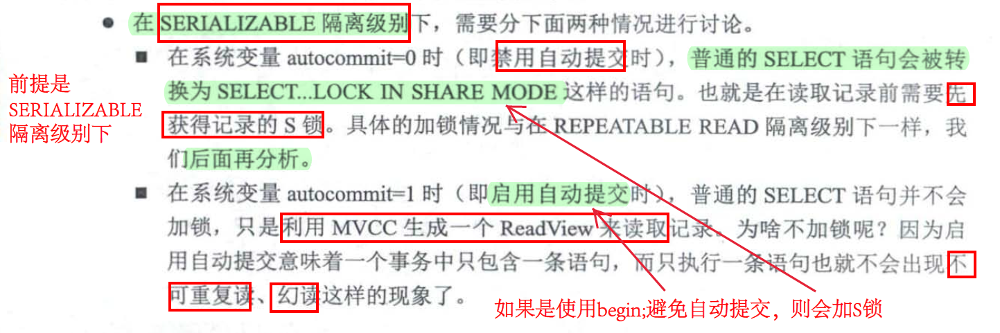
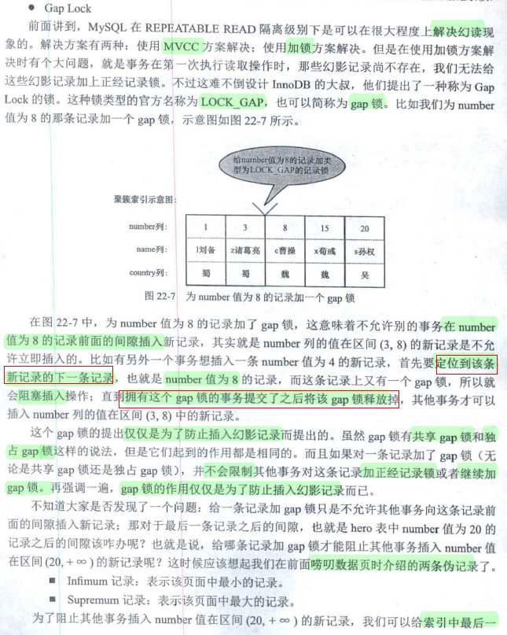
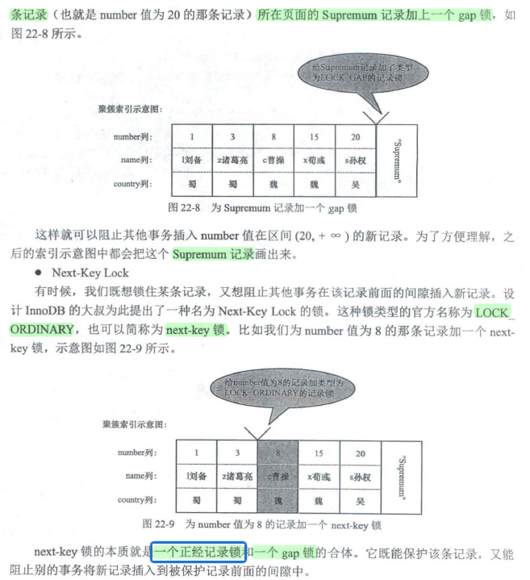
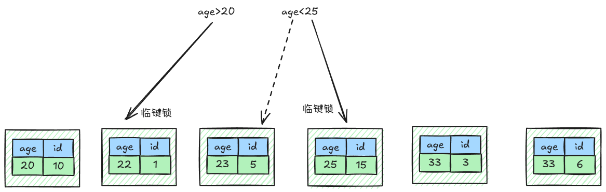
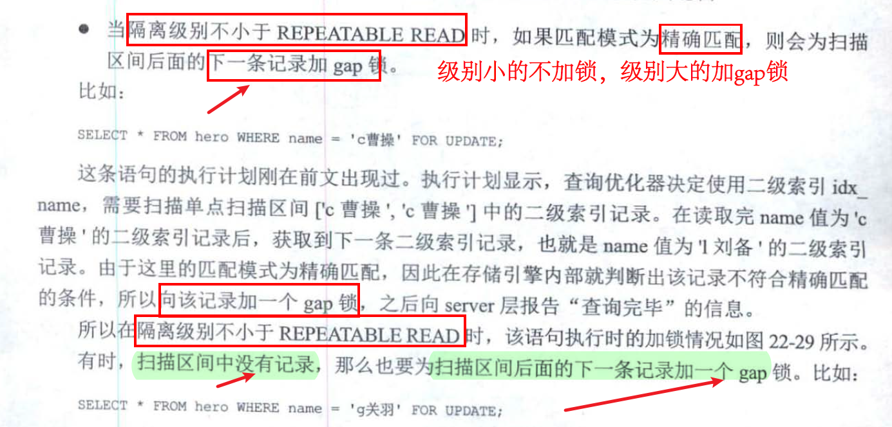

# 关闭自动提交

>在MySQL命令行的默认设置下，事务都是自动提交的，即执行SQL语句后就会马上执行COMMIT操作。因此开始一个事务，必须使用BEGIN、START TRANSACTION，(显示开启事务）或者执行SET AUTOCOMMIT=0，以禁用当前会话的自动提交。

1. select语句一般用来输出用户变量，比如select @变量名，用于输出数据源不是表格的数据。
2. 系统变量在变量名前面有==两个@==  

```mysql
mysql> show variables like 'autocommit';
+---------------+-------+
| Variable_name | Value |
+---------------+-------+
| autocommit    | ON    |
+---------------+-------+
1 row in set (0.00 sec)

mysql> select @@autocommit;
+--------------+
| @@autocommit |
+--------------+
|            1 |
+--------------+
1 row in set (0.00 sec)
# 修改变量
set autocommit=0;
```
本文中autocommit=0，开始事务需要使用`begin`显式开启
# 事务并发存在的问题
【隔离性】脏读（读到了还没有提交的数据）  

【隔离性】不可重复读（同一事务中，第1次读的数据和第2次读的数据不一样。读到了事务操作过程中其他事务提交的数据，也不应该，这个没法保证一致性。比如我第一次根据某个事务做了一个操作，第二次想同样的逻辑做一个判断操作，但是数据变了，导致同一个事务中对同一个(其实不是了）数据做的操作居然不一致  
	
【隔离性】虚读、幻读（同一事务中：我第一次读到某一条数据，但是第二次没读到；或者第一次没读到，第二次居然读到了。条数问题）
# 事务的隔离级别
READ_UNCOMMITTED  读未提交  
READ_COMMITTED  读已提交  
REPEATABLE_READ  重复读
SERIALIZABLE 串行化(行锁)
修改事务隔离级别：  
```mysql
set tx_isolation='SERIALIZABLE'; (可以加global，让新开的session也使用该事务隔离级别)
```
经测试，如果有三个session（mysql客户端），其中一个(a)是SERIALIZABLE,而其他两个(b,c)是READ_UNCOMMITTED，那么客户端b,c之间不会因为锁挂起，而ab或ac会导致(行)锁挂起  
## REPEATABLE_READ重复读
REPEATABLE_READ重复读的隔离级别只能在一定程度上防止幻读 ~~如果事务a(插入一条新数据，或者删除一条数据)后提交。那么变动的数据不会在事务b被查出来。但是如果插入的这条数据(在事务b，注意 不是事务a)被修改了，那么之后它会在事务b被查出来~~  
### 新增后修改
事务a新增数据后提交，在事务b执行中修改了该数据，则该数据会显示出来（影响了）
```mysql
#=======事务b=======
mysql> begin;
mysql> select * from user;
+----+-----+
| id | age |
+----+-----+
|  1 |  10 |
|  2 |  20 |
|  3 |  33 |
+----+-----+
#=======事务a=======
mysql> insert into user(age) values(44);
#=======事务b=======
mysql> select * from user;
+----+-----+
| id | age |
+----+-----+
|  1 |  10 |
|  2 |  20 |
|  3 |  33 |
+----+-----+
#=======事务a=======
mysql> update user set age=55 where id = 4;
#=======事务b=======
mysql> select * from user;
+----+-----+
| id | age |
+----+-----+
|  1 |  10 |
|  2 |  20 |
|  3 |  33 |
+----+-----+
#=======事务b=======
mysql> update user set age=55 where id = 4;
mysql> select * from user;
+----+-----+
| id | age |
+----+-----+
|  1 |  10 |
|  2 |  20 |
|  3 |  33 |
|  4 |  55 |
+----+-----+
##此时如果事务a进行 delete from user where id = 4; 那么事务a会阻塞，直到事务b commit
```
### 删除后修改
事务a删除数据后提交，在事务b执行中修改了该数据，该数据也照样存在（不影响）
```mysql
#=======事务b=======
mysql> begin;
mysql> select * from user;
+----+-----+
| id | age |
+----+-----+
|  1 |  10 |
|  2 |  20 |
|  3 |  33 |
+----+-----+
#=======事务a=======
mysql> delete from user where id = 3;
#=======事务b=======
mysql> select * from user;
+----+-----+
| id | age |
+----+-----+
|  1 |  10 |
|  2 |  20 |
|  3 |  33 |
+----+-----+
#=======事务a=======
mysql> update user set age=44 where id = 3;
Query OK, 0 rows affected (0.00 sec)
Rows matched: 0  Changed: 0  Warnings: 0
#=======事务b=======
# 实际上id为3的数据已经在事务a被删除了，但是
# 这里没有体现
mysql> select * from user;
+----+-----+
| id | age |
+----+-----+
|  1 |  10 |
|  2 |  20 |
|  3 |  33 |
+----+-----+
mysql> update user set age=33 where id = 3;
Query OK, 0 rows affected (0.00 sec)
Rows matched: 0  Changed: 0  Warnings: 0
# 更新后再次查询
mysql> select * from user;
+----+-----+
| id | age |
+----+-----+
|  1 |  10 |
|  2 |  20 |
|  3 |  33 |
+----+-----+
```
## SERIALIZABLE
~~我觉得先简单知道是通过锁来解决就行了~~
### MySQL是怎样运行的

### 查询某条后修改、删除
```mysql
#=======操作前======
mysql> select * from user;
+----+-----+
| id | age |
+----+-----+
|  1 |  10 |
|  2 |  20 |
+----+-----+
#=======事务b=======
mysql> begin;
mysql> select * from user where id = 2;
+----+-----+
| id | age |
+----+-----+
|  2 |  20 |
+----+-----+
#=======事务a=阻塞超时======
mysql> update user set age = 55 where id = 2;
ERROR 1205 (HY000): Lock wait timeout exceeded; try restarting transaction
#=======事务a=阻塞超时======
mysql> delete from user where id = 2;
ERROR 1205 (HY000): Lock wait timeout exceeded; try restarting transaction
#=======事务a=新增一条数据======
myql>  insert into user(age) values(55);
Query OK, 1 row affected (0.00 sec)
mysql> select * from user;
+----+-----+
| id | age |
+----+-----+
|  1 |  10 |
|  2 |  55 |
|  4 |  55 |
+----+-----+
```
查询了id=2的数据，只要不处理id为2的数据，其他的数据增删改查完全不影响
#### 通过id查询不存在的数据
~~我觉得这里涉及到了间隙锁，假设有id为1,13,15,18的数据，此时查询id为20的数据的话，id>18的所有数据都被锁定。如果删除了18，那么id>15的数据都会被锁定~~  
解决了读未提交；读已提交、可重复读？（事务b修改的数据在提交前，事务a如果读取的话会被阻塞）；幻读？（事务b查询的数据如果不存在，那么会被加入间隙锁）
```mysql
#=======操作前======
mysql> select * from user;
+----+-----+
| id | age |
+----+-----+
|  1 |  55 |
| 13 |  55 |
| 14 |  55 |
| 15 |  55 |
| 18 |  22 |
+----+-----+

#=======事务b=======
mysql> begin;
mysql> select * from user where id = 25;
Empty set (0.00 sec)
#=======事务a=======
mysql> select * from user;
+----+-----+
| id | age |
+----+-----+
|  1 |  55 |
| 13 |  55 |
| 14 |  55 |
| 15 |  55 |
| 18 |  22 |
+----+-----+
5 rows in set (0.00 sec)
##这里被阻塞了(id<18的数据都可以插入或修改删除。>19的数据全部被阻塞)
mysql> insert into user(id,age) values(20,55);
ERROR 1205 (HY000): Lock wait timeout exceeded; try restarting transaction
mysql> insert into user(id,age) values(31,55);
ERROR 1205 (HY000): Lock wait timeout exceeded; try restarting transaction
##如果这里把18的数据删除
mysql> delete from user where id = 18;
Query OK, 1 row affected (0.01 sec)
mysql> select * from user;
+----+-----+
| id | age |
+----+-----+
|  1 |  55 |
|  3 |  55 |
| 13 |  55 |
| 14 |  55 |
| 15 |  55 |
| 16 |  55 |
+----+-----+
#再次插入17或18就会失败
mysql> insert into user(id,age) values(18,55);
ERROR 1205 (HY000): Lock wait timeout exceeded; try restarting transaction
#此时可以修改id16的数据，但是如果删除了他，那么id>=16的数据都不能再操作
mysql> delete from user where id = 16;
Query OK, 1 row affected (0.00 sec)
mysql> insert into user(id,age) values(16,55);
ERROR 1205 (HY000): Lock wait timeout exceeded; try restarting transaction

```
### 查询全部
所有写操作都会被阻塞
```mysql
#=======事务b=======
mysql> begin;
mysql> select * from user where id = 5;
+----+-----+
| id | age |
+----+-----+
|  5 |  33 |
+----+-----+
#=======事务a=======
#插入成功
mysql> insert into user(age) values(33);
Query OK, 1 row affected (0.00 sec)

#=======事务b=======
mysql> select * from user ;
+----+-----+
| id | age |
+----+-----+
|  1 |  10 |
|  2 |  20 |
|  5 |  33 |
|  6 |  33 |
+----+-----+
4 rows in set (0.00 sec)
#=======事务a=======
#所有写操作都会被阻塞
#阻塞了，超时失败（除非事务b的查询提交了）
mysql> insert into user(age) values(33);
ERROR 1205 (HY000): Lock wait timeout exceeded; try restarting transaction
```
### 幻读解决
```mysql
#=======事务b=======
mysql> begin;
mysql> select * from user;
+----+-----+
| id | age |
+----+-----+
|  1 |  10 |
|  2 |  20 |
|  5 |  33 |
|  6 |  33 |
+----+-----+
#=======事务a=======
#这里被阻塞了，插入失败
mysql> insert into user(age) value(55);
#注意看，这里有锁
ERROR 1205 (HY000): Lock wait timeout exceeded; try restarting transaction
#=======事务b========
mysql> select * from user;
+----+-----+
| id | age |
+----+-----+
|  1 |  10 |
|  2 |  20 |
|  5 |  33 |
|  6 |  33 |
+----+-----+
```
# 事务隔离级别的实现原理
## 行锁
1. 行锁加在索引条件上（且用上了索引），如果是非索引条件（或者没用上索引），则是表锁  
2. 也就是说使用==主键索引(where id=xx)需要加一把锁，只使用二级索引(where index2=xx)需要在二级索引和主键索引上各加一把锁==。
## 串行化
自动使用共享锁和排他锁  
如果是其他隔离级别，则需要手动使用`lock in share mode`或者`for update`才会使用共享锁或排他锁  
  
## 锁
切记：间隙锁的区间是左开右开的，临键锁的区间是左开右闭的。  
间隙锁是为了在==串行化==下解决==幻读==问题而提出的  
间隙锁（gap-lock）和临键锁(next-key-lock)  
### 资料
  
  
### 二级索引
#### 范围查询
查询age>20且age<25的记录，且加排他锁  
此时会给==age>20且age<25的所有记录==及其==下一条记录==加临键锁(左开右闭)  
	拓展：如果索引上的条件是`age=25`（单点扫描区间，只包含一个值），那么下一条(33,3)加的是gap锁  
  

```mysql
mysql> select * from user;
+----+-----+----------+------+
| id | age | name     | sex  |
+----+-----+----------+------+
|  1 |  22 | zhangsan | W    |
|  3 |  33 | lisi     | M    |
|  5 |  23 | xx       | M    |
|  6 |  33 | xx       | M    |
| 10 |  20 | hah      | W    |
| 15 |  25 | lix      | M    |
+----+-----+----------+------+
6 rows in set (0.00 sec)
#=======事务b======
ysql> begin;
mysql> select * from user where  age > 20 and age < 25 for update;
+----+-----+----------+------+
| id | age | name     | sex  |
+----+-----+----------+------+
|  1 |  22 | zhangsan | W    |
|  5 |  23 | xx       | M    |
+----+-----+----------+------+
2 rows in set (0.01 sec)
#=======事务a======
mysql> insert into user(id,age,name,sex) values(5,21,'xx','M'));
erro!!!!
mysql> insert into user(id,age,name,sex) values(12,20,'xx','M');
erro!!!!
#(9,20)下一条记录是(20,10)，无锁
mysql> insert into user(id,age,name,sex) values(9,20,'xx','M'));
Query OK, 1 row affected (0.00 sec)

#(14,25)下一条记录是(25,15)，加了临键锁
mysql> insert into user(id,age,name,sex) values(14,25,'xx','M');
erro!!!!
#下一条记录(33,3)无锁
mysql> insert into user(id,age,name,sex) values(16,25,'xx','M');
Query OK, 1 row affected (0.00 sec) 

#包含记录(25,15)，加了临键锁  
mysql> select * from user where age = 25 for update;
erro!!!!
mysql> select * from user where age = 25 lock in share mode;
erro!!!!
```
#### 精确匹配

  
##### 记录存在
```mysql
mysql> select * from user;
+----+-----+----------+------+
| id | age | name     | sex  |
+----+-----+----------+------+
|  1 |  22 | zhangsan | W    |
|  3 |  33 | lisi     | M    |
|  6 |  33 | xx       | M    |
| 10 |  20 | hah      | W    |
| 15 |  25 | lix      | M    |
+----+-----+----------+------+
#=======事务b======
mysql> begin;
mysql> select * from user where  age=33 for update;
+----+-----+------+------+
| id | age | name | sex  |
+----+-----+------+------+
|  3 |  33 | lisi | M    |
|  6 |  33 | xx   | M    |
+----+-----+------+------+
2 rows in set (0.00 sec)
#我觉得这里为(33,3),(33,6)以及下一条(age=Supresum[页面最大值]，也就是额外为等值后的下一条记录加临键锁)都加了临键锁
#=======事务a======
mysql> insert into user(id,age,name,sex) values(2,33,'xx','M');
erro!!!! 
mysql> insert into user(id,age,name,sex) values(2,30,'xx','M'));
erro!!!!
mysql> insert into user(id,age,name,sex) values(16,25,'xx','M');
erro!!!!
#上面三条的下一条都是(33,3)，而这个记录有临键锁，所以无法插入。
mysql> insert into user(id,age,name,sex) values(5,33,'xx','M'));
erro!!!!
#下一条都是(33,6)，而这个记录有临键锁，所以无法插入。
#下面(25,14)的下一条是(25,15)并没有加锁，所以能正常插入
mysql> insert into user(id,age,name,sex) values(14,25,'xx','M);
Query OK, 1 row affected (0.01 sec)

```
##### 记录不存在
```mysql
mysql> select *   from user ;begin;
+----+-----+----------+------+
| id | age | name     | sex  |
+----+-----+----------+------+
|  1 |  22 | zhangsan | W    |
|  3 |  33 | lisi     | M    |
|  5 |  23 | xx       | M    |
|  6 |  33 | xx       | M    |
| 10 |  20 | hah      | W    |
| 15 |  25 | lix      | M    |
+----+-----+----------+------+
#=======事务b======
begin;
mysql> select * from user where  age=28 for update;
Empty set (0.00 sec)
#此时(33,3)加了gap锁（不是临键锁）
#=======事务a======
mysql> insert into user(id,age,name,sex) values(13,28,'xx','M');
^C^C -- query aborted
ERROR 1317 (70100): Query execution was interrupted
mysql> insert into user(id,age,name,sex) values(13,27,'xx','M' );
erro!!!!
mysql> insert into user(id,age,name,sex) values(13,26,'xx','M' );
erro!!!!
mysql> insert into user(id,age,name,sex) values(13,25,'xx','M' );
Query OK, 1 row affected (0.00 sec)
mysql> insert into user(id,age,name,sex) values(2,33,'xx','M'));
erro!!!!
#(33,3)后面，插入成功
mysql> insert into user(id,age,name,sex) values(4,33,'xx','M'));
Query OK, 1 row affected (0.00 sec)
#因为是gap锁而不是临键锁，所以成功
mysql> select * from user where age = 33 lock in share mode;
+----+-----+------+------+
| id | age | name | sex  |
+----+-----+------+------+
|  3 |  33 | lisi | M    |
|  4 |  33 | xx   | M    |
|  6 |  33 | xx   | M    |
+----+-----+------+------+
3 rows in set (0.00 sec)

```