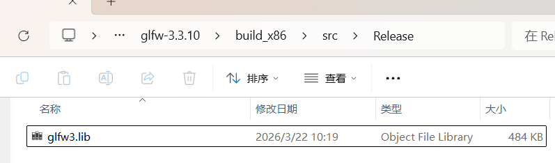
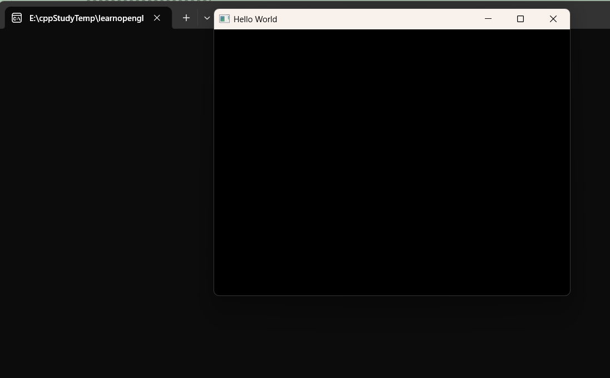
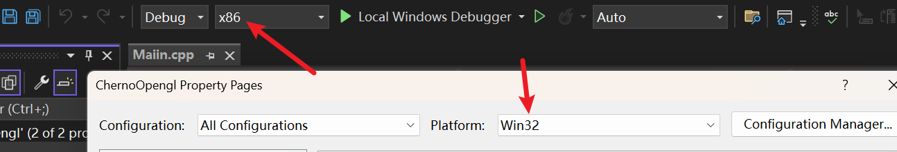
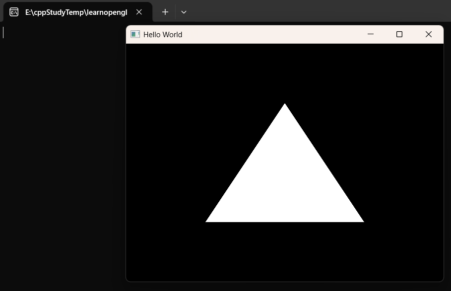
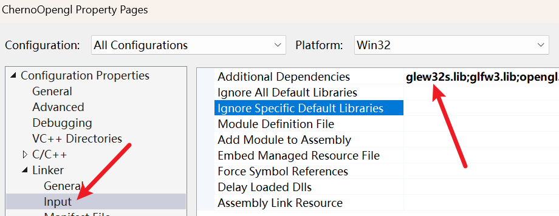
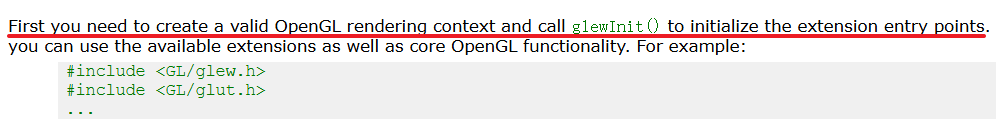

# 01-03基础配置

```shell
[16:04] 01-欢迎来到 OpenGL-Welcome to OpenGL
[22:03] 02-在 C++ 中设置 OpenGL 并创建窗口-Setting up OpenGL and Creating a Window in C++
[18:21] 03-在 C++ 中使用现代 OpenGL-Using Modern OpenGL in C++
[20:06] 04-顶点缓冲区与在 OpenGL 中绘制三角形-Vertex Buffers and Drawing a Triangle in OpenGL
[18:54] 05-OpenGL 中的顶点属性与布局-Vertex Attributes and Layouts in OpenGL
[17:37] 06-OpenGL 中的着色器工作原理-How Shaders Work in OpenGL
[28:21] 07-在 OpenGL 中编写着色器-Writing a Shader in OpenGL
[21:15] 08-我是如何处理 OpenGL 中的着色器的-How I Deal with Shaders in OpenGL
[16:54] 09-OpenGL 中的索引缓冲区-Index Buffers in OpenGL
[23:42] 10-处理 OpenGL 中的错误-Dealing with Errors in OpenGL
[11:27] 11-OpenGL 中的 Uniform 变量-Uniforms in OpenGL
[21:50] 12-OpenGL 中的顶点数组-Vertex Arrays in OpenGL
[26:46] 13-将 OpenGL 抽象为类-Abstracting OpenGL into Classes
[30:07] 14-OpenGL 中的缓冲区布局抽象-Buffer Layout Abstraction in OpenGL
[21:56] 15-OpenGL 中的着色器抽象-Shader Abstraction in OpenGL
[14:43] 16-在 OpenGL 中编写基础渲染器-Writing a Basic Renderer in OpenGL
[31:44] 17-OpenGL 中的纹理-Textures in OpenGL
[12:37] 18-OpenGL 中的混合-Blending in OpenGL
[18:07] 19-OpenGL 中的数学-Maths in OpenGL
[20:10] 20-OpenGL 中的投影矩阵-Projection Matrices in OpenGL
[15:53] 21-OpenGL 中的 MVP 矩阵-Model View Projection Matrices in OpenGL
[14:36] 22-在 OpenGL 中使用 ImGui-ImGui in OpenGL
[12:21] 23-在 OpenGL 中渲染多个物体-Rendering Multiple Objects in OpenGL
[16:52] 24-为 OpenGL 设置测试框架-Setting up a Test Framework for OpenGL
[22:46] 25-在 OpenGL 中创建测试-Creating Tests in OpenGL
[28:13] 26-在 OpenGL 中进行纹理测试-Creating a Texture Test in OpenGL
[11:37] 27-如何让你的 UNIFORMS 更快-How to make your UNIFORMS FASTER in OpenGL
[12:25] 28-批量渲染：简介-Batch Rendering - An Introduction
[09:15] 29-批量渲染：颜色-Batch Rendering - Colors
[15:51] 30-批量渲染：纹理-Batch Rendering - Textures
[23:17] 31-批量渲染：动态几何体-Batch Rendering - Dynamic Geometry
```

# 01WelcomToOpengl
-  课程初衷与背景
    - 作者介绍了为什么要制作这个系列：市面上很多教程只教“怎么做”，而不教“为什么”。   
    - 本系列的目标是不仅让你写出代码，还要让你理解 OpenGL 的底层工作原理及其与 GPU 的交互逻辑。   
- 什么是 OpenGL？    
    - ==核心定义==：OpenGL 本质上是一个==规范（Specification）== ~~接口，API~~ ，而不是一个具体的库。它==规定了函数应该如何命名、参数是什么以及预期的行为==。 ~~允许我们实际访问我们的GPU，GraphicsProcessingUnit，图形处理单元。OpenGL是其中之一的接口，还有Direct3D，Vulkan，Metal等~~ 
    - ==实现者==：*具体的实现通常由显卡厂商（NVIDIA, AMD, Intel）编写在驱动程序中*。
    - 跨平台，Windows、Linux、Mac、Android、IOS
    - ==状态机（State Machine）==：初步引入 ==OpenGL 是一个状态机==的概念，你==设置好状态（如颜色、缓冲区），然后发出指令进行渲染==。
- 现代 OpenGL vs 传统 OpenGL 
    - ==Legacy OpenGL (固定管线)==：简单但不够灵活，很多功能已经废弃（如 `glBegin`, `glEnd`）。   
    - ==Modern OpenGL (可编程管线)==：通过 ==着色器 (Shaders)== 控制渲染过程。虽然代码量显著增加，但提供了==极大的灵活性和性能优化==空间。  
    - Shader（着色器）是程序，在==*GPU*==上运行的代码程序
    - 本系列将专注于 ==Modern OpenGL (版本 3.3 及以上)==。   
- 学习 OpenGL 的难点与心态   
    - 强调了学习曲线：初期需要写==大量的“模板代码”（Boilerplate code）==才能在屏幕上画出一个简单的三角形。   
    - ==图形管线 (Graphics Pipeline)==：解释了==数据如何从 CPU 传输到 GPU==，并==经过顶点处理、光栅化最终变成像素==的过程。   
- 开发环境与工具链预告   
    - 虽然是跨平台的，但本系列主要在 Windows 下使用 ==Visual Studio== 演示。   
    - 提到后续会使用的关键第三方库：==GLFW==（窗口管理）和 ==GLEW/GLAD==（访问 OpenGL 扩展函数）。   
- 总结与后续计划
    - 鼓励初学者不要被前几集的复杂配置和概念吓退。   
    - 下一集将正式进入 C++ 环境配置，动手创建第一个窗口。

# 02设置Opengl和创建窗口

主要讲解如何在 Windows 环境下使用 Visual Studio 搭建 OpenGL 开发环境，并编写代码成功弹出一个窗口。这是所有图形编程的起点。

-   ==核心库的选择：GLFW==
    -   解释为什么需要第三方库：OpenGL 本身不负责创建窗口或处理键盘鼠标输入，这些是操作系统的任务。
    -   引入 ==GLFW==：一个开源、多平台的库，专门用于==处理窗口创建 ~~跨平台~~ 和上下文管理==。
-   ==下载与配置 GLFW==
    -   演示前往 `glfw.org` 下载二进制文件（Binary）。
    -   ==关键点==：Cherno 推荐下载 ==32位 (Windows pre-compiled binaries)==，因为这在库兼容性上通常更稳定，尽管你的系统是 64 位的。 ~~因为我们要让构建的应用在32位上运行。而能在32位系统运行的，也必定能在64位上运行。这里我直接下载源码并编译成了32位的，详见[learnopengl-02创建窗口](../../learnopengl/01入门/02创建窗口/index.md)~~ 
      
        
    - 把链接里的代码`https://www.glfw.org/documentation.html`复制进项目  
```cpp
#include <GLFW/glfw3.h>

int main(void)
{
    GLFWwindow* window;

    /* Initialize the library */
    if (!glfwInit())
        return -1;

    /* Create a windowed mode window and its OpenGL context */
    window = glfwCreateWindow(640, 480, "Hello World", NULL, NULL);
    if (!window)
    {
        glfwTerminate();
        return -1;
    }

    /* Make the window's context current */
    glfwMakeContextCurrent(window);

    /* Loop until the user closes the window */
    while (!glfwWindowShouldClose(window))
    {
        /* Render here */
        glClear(GL_COLOR_BUFFER_BIT);

        /* Swap front and back buffers */
        glfwSwapBuffers(window);

        /* Poll for and process events */
        glfwPollEvents();
    }

    glfwTerminate();
    return 0;
}      
```
-   ==Visual Studio 项目设置==
    -   在工程目录下创建 `Dependencies` 文件夹，在文件夹下又创建一个GLFW，将 GLFW 的头文件(夹)（Include）和库文件(夹)（Lib）放入其中。
      
    ```shell
    #头文件和库目录结构
    └─GLFW
    ├─include
    │  └─GLFW
    │          glfw3.h
    │          glfw3native.h
    │
    └─lib
            glfw3.lib
    ```
    
    - 配置项目属性：
        1.  ==`c/c++-->Additional Include Directories`==：添加头文件路径。 ~~`$(SolutionDir)ChernoOpengl\Dependencies\GLFW\include`~~ 
        2.  =`=Linker -> Gerneral -> Additional Library Directories`==：添加库文件路径。   ~~`E:\cppStudyTemp\learnopengl\HelloOpengl\ChernoOpengl\Dependencies\GLFW\lib`~~           
        3.  ==Linker -> Input==：手动输入 `glfw3.lib` 和 `opengl32.lib`（注意：`opengl32.lib` 是 Windows 系统自带的，不需要额外下载）。   
        4. 运行后出现黑框  
           
           
    - 注意：
      这是在Platform32的配置，所以运行/编译时也要配置成32位的，保持一致
      
-   ==静态链接与动态链接的权衡==    
    -   简述了静态库（.lib）和动态库（.dll）的区别。   
	    - library file ，微软把：静态库，导入库 都用 .lib 扩展名。
	    - 静态库本身包含了代码，而导入库只会告诉你(运行时)去哪里(哪个dll)找函数，所以需要在运行.exe时额外提供.dll（可以在.exe同级目录下）
    -   本集中采用==静态链接==，这样生成的 .exe 文件在运行时不需要寻找额外的 .dll 文件。        
-   ==编写基础代码==    
    -   包含头文件 `#include <GLFW/glfw3.h>`。        
    -   编写初始化代码：`glfwInit()`。        
    -   创建窗口对象：`glfwCreateWindow()`。        
    -   设置当前 OpenGL 上下文：`glfwMakeContextCurrent()`。        
-   ==渲染循环 (The Render Loop)==    
    -   引入 `while (!glfwWindowShouldClose(window))` 循环。        
    -   在循环内调用 `glClear(GL_COLOR_BUFFER_BIT)` 清理屏幕。        
    -   调用 `glfwSwapBuffers(window)` 进行==双缓冲交换==（防止画面闪烁）。       
    -   调用 `glfwPollEvents()` 处理操作系统事件（如关闭窗口、点击等）。      
-   ==调试与运行==    
    -   演示编译并解决常见的链接错误（Linker Errors）。        
    -   ==成果展示==：成功运行程序，屏幕上出现一个黑色的空白窗口，标志着 OpenGL 环境搭建成功。
==核心笔记：==
1.  ==不要漏掉 `opengl32.lib`==：即使你使用的是 64 位系统或现代显卡，在 Windows 下链接时依然使用这个名字。    
2.  ==双缓冲 (Double Buffering)==：这是图形学的重要概念，一个缓冲区用于显示，另一个在后台绘制，画好后再交换，保证视觉平滑。

## 使用传统OpenGL绘制三角形
```cpp
//在while中添加代码
while (!glfwWindowShouldClose(window))
{
    /* Render here */
    glClear(GL_COLOR_BUFFER_BIT);
    
    //===绘制三角形===
    glBegin(GL_TRIANGLES);
    glVertex2f(-0.5f, -0.5f);
    glVertex2f(0.0f, 0.5f);
    glVertex2f(0.5f, -0.5f);
    glEnd();
    //===绘制三角形===

    /* Swap front and back buffers */
    glfwSwapBuffers(window);

    /* Poll for and process events */
    glfwPollEvents();
}
```



# 03现代OpenGL

在前一集搭建好窗口的基础上，引入了 ==GLEW==，并深入探讨了现代 OpenGL 与传统 OpenGL 的本质区别。

- ==引入 GLEW (OpenGL Extension Wrangler Library)==    
    - ==痛点==：解释为什么只包含 `<GL/gl.h>` 不够。Windows 自带的头文件版本极低（1.1），无法直接调用现代显卡的函数。        
    - ==GLEW 的作用==：它是一个*加载库*，负责在运行时==动态获取现代 OpenGL 函数的地址==。 ~~注意，它并没有实现函数，它只是访问这些函数。这些函数是由显卡驱动实现的，早就在电脑里了~~ 
    - ==配置演示==：展示如何下载 GLEW ~~`https://glew.sourceforge.net/`~~ ，并==像上一集配置 GLFW 一样，将其 `include` 和 `lib` 路径添加到 Visual Studio 项目中==。
      最后，还要添加lib  
        
          
- ==初始化 GLEW 的陷阱==    
	- `#include <GL/glew.h>` 必须 在 `#include <GLFW/glfw3.h>`之前，否则会报错  
	- 关于链接错误，需要在属性-`c/c++-Preprocessor`中定义`GLEW_STATIC`
```shell
	  15:51:58:820	1>Main03_01.obj : error LNK2019: unresolved external symbol __imp__glewInit@0 referenced in function _main
```  
	  这是一个链接错误，接着查看glew.h源码  
```cpp
	  /*
 * GLEW_STATIC is defined for static library.
 * GLEW_BUILD  is defined for building the DLL library.
 */

#ifdef GLEW_STATIC
#  define GLEWAPI extern
#else
#  ifdef GLEW_BUILD
#    define GLEWAPI extern __declspec(dllexport)
#  else
#    define GLEWAPI extern __declspec(dllimport)
#  endif
#endif
```
   ~~如果遇到了链接错误（比如 LNK2019），通常就是因为这里的宏定义（比如 GLEW_STATIC）和实际链接的库文件类型没对上~~   
	    ~~如果非要用动态库的话，除了要设置 glew32.lib（不带s后缀），还要把一起的.dll放到.exe所在目录~~ 
	  我们这里使用的是glew32s.lib，这是静态库，所以需要在宏宇定义那里定义GLEW_STATIC 
- ==关键顺序==：必须先==创建 OpenGL 上下文（即调用 `glfwMakeContextCurrent`），然后才能调用 `glewInit()`==。 
             
    - 如果顺序反了，程序会崩溃或无法加载函数。        
    - 演示如何检查 `glewInit()` 的返回值以确保初始化成功。  
      
```cpp
/* Make the window's context current */
glfwMakeContextCurrent(window);
//先有窗口和上下文，加载器才能工作
if (glewInit() != GLEW_OK)
{
	std::cout << "Error!" << std::endl;
}
```      
- ==传统 OpenGL (Legacy) vs 现代 OpenGL (Modern)==    
    - ==Legacy (固定管线)==：使用 `glBegin()` 和 `glEnd()`。虽然简单，但效率极低，因为 CPU 每一帧都要向 GPU 发送大量指令。        
    - ==Modern (可编程管线)==：数据（顶点、颜色等）被打包成 ==缓冲区 (Buffers)== 一次性发送到 GPU 内存。GPU 通过 ==着色器 (Shaders)== 自行决定如何渲染。
    - ==Cherno 的观点==：虽然现代 OpenGL 代码量更多，但它是理解 GPU 运作方式的唯一途径。        
- ==绘制第一个“东西”：现代方式的雏形==    
    - 演示调用 `glDrawArrays(GL_TRIANGLES, 0, 3)`。        
    - 解释为什么此时屏幕上还是黑色的：因为我们还没有给 GPU 提供任何顶点数据，也没有编写着色器。
        
- ==验证 OpenGL 版本==    
    - 演示使用 `glGetString(GL_VERSION)` 打印当前驱动支持的 OpenGL 版本。
    - 这是一个非常实用的调试技巧，确保你的代码运行在预期的硬件环境下。 
- ==总结与展望==    
    - 确认开发环境（GLFW + GLEW）已完全就绪。        
    - 预告下一集：正式引入 ==顶点缓冲区 (Vertex Buffers)==，开始向显卡内存传输真实数据。
## 核心知识点笔记

| 概念             | 说明                                     |
| -------------- | -------------------------------------- |
| ==GLEW==       | 让你能用上显卡里那些“隐藏”的高级函数（函数加载器）。            |
| ==Context==    | 必须==先有窗口和上下文，加载器（GLEW/GLAD）才能工作==。     |
| ==GPU Buffer== | 现代 OpenGL 的核心，==把数据从内存搬到显存==，减少CPU 负担。 |

==下一步建议：== 下一集（04集）会涉及到非常抽象的 `glGenBuffers` 和 `glBindBuffer`。你在看视频时，可以重点关注数据是如何从一个普通的 C++ 数组“变”到显存里的。

## 源代码  

```cpp
#ifdef LY_EP03
#include <iostream>
#include <GL/glew.h>
#include <GLFW/glfw3.h>

int main(void)
{
	GLFWwindow* window;

	/* Initialize the library */
	if (!glfwInit())
		return -1;

	/* Create a windowed mode window and its OpenGL context */
	window = glfwCreateWindow(640, 480, "Hello World", NULL, NULL);
	if (!window)
	{
		glfwTerminate();
		return -1;
	}

	/* Make the window's context current */
	glfwMakeContextCurrent(window);
	//先有窗口和上下文，加载器才能工作
	if (glewInit() != GLEW_OK)
	{
		std::cout << "Error!" << std::endl;
	} 

	//4.6.0 Compatibility Profile Context 23.19.12.02.240618
	std::cout << glGetString(GL_VERSION) << std::endl;

	/* Loop until the user closes the window */
   //在while中添加代码
	while (!glfwWindowShouldClose(window))
	{
		/* Render here */
		glClear(GL_COLOR_BUFFER_BIT);

		//===绘制三角形===
		glBegin(GL_TRIANGLES);
		glVertex2f(-0.5f, -0.5f);
		glVertex2f(0.0f, 0.5f);
		glVertex2f(0.5f, -0.5f);
		glEnd();
		//===绘制三角形===

		/* Swap front and back buffers */
		glfwSwapBuffers(window);

		/* Poll for and process events */
		glfwPollEvents();
	}

	glfwTerminate();
	return 0;
}

#endif
```