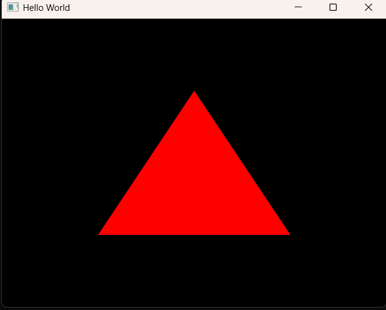

# 概述

编写最基础的==顶点着色器 (Vertex Shader)== 和==片段着色器 (Fragment Shader)==，并将它们链接成一个可以在显卡上运行的着色器程序。  
- ==课程引入== 回顾上一集关于着色器的理论概念，明确本集目标：编写实际代码让上一集绘制的三角形呈现特定的颜色（不再是默认的白色或黑色）。    
- ==创建基础字符串结构== 演示如何在 C++ 中以字符串形式编写 GLSL 代码。由于目前还没有文件读取系统，Cherno 直接在 `main` 函数中使用原始字符串（Raw Strings）来定义顶点和片段着色器的源码。    
- ==编写顶点着色器 (Vertex Shader)==
    - 指定版本：`#version 330 core`。        
    - 定义输入属性：`layout(location = 0) in vec4 position;`        
    - 主函数 `main`：将输入的坐标赋值给内置变量 `gl_Position`。        
- ==编写片段着色器 (Fragment Shader)==    
    - 定义输出颜色：`layout(location = 0) out vec4 color;`        
    - 主函数 `main`：为像素指定颜色值（例如红色 `vec4(1.0, 0.0, 0.0, 1.0)`）。
- ==创建编译与链接函数 `CreateShader`== 开始实现逻辑：如何将上述两个字符串交给 OpenGL。    
    - 调用 `glCreateProgram` 创建一个程序容器。        
    - 调用自定义的 `CompileShader` 函数分别编译顶点和片段部分。        
- ==实现 `CompileShader` 函数== 这是核心步骤：    
    1.  `glCreateShader`：根据类型创建着色器对象。        
    2.  `glShaderSource`：将 C++ 字符串传递给 OpenGL。        
    3.  `glCompileShader`：调用显卡驱动进行编译。        
- ==错误处理与调试 (Shader Debugging)== 这是新手最容易卡住的地方。Cherno 详细演示了如何使用 `glGetShaderiv` 检查编译状态，并用 `glGetShaderInfoLog` 打印出显卡报错信息。    
- ==链接着色器程序 (Linking)== 使用 `glAttachShader` 将编译好的两个着色器附加到程序上，然后调用 `glLinkProgram` 进行链接，最后用 `glValidateProgram` 验证。   
- ==清理工作== 链接成功后，调用 `glDeleteShader` 删除临时的中间产物（类似编译完 C++ 后删除 `.obj` 文件），以节省资源。    
- ==实际运行测试== 将编写好的 `CreateShader` 函数集成到渲染循环之前。    
- ==结果展示与总结== 屏幕上成功出现了一个红色的三角形。Cherno 总结了着色器在现代渲染管线中的重要角色。    

==学习要点提示：==
1.  ==GLSL 语法==：注意它和 C++ 很像，但对类型匹配非常严格（例如浮点数必须带小数点 `1.0`）。    
2.  ==GPU 通讯==：理解 `glShaderSource` 是 C++ 代码与显卡硬件之间的桥梁。
3.  ==不要背代码==：理解“*创建 -> 附加源码 -> 编译 -> 链接*”的流程比死记硬背 API 更重要。

# 代码

```cpp
#ifdef LY_EP07
#include <iostream>
#include <GL/glew.h>
#include <GLFW/glfw3.h>

//GLenum也就是unsigned int,这里不用GLenum是为了解耦
static unsigned int CompileShader(unsigned int type,
	const std::string& source)
{
	//创建着色器对象，向 OpenGL 申请一个空的“容器”来存放你的代码
	//把光标放在 glCreateShader( 的左括号后面，然后按下 Ctrl + Shift + Space。会弹出一个小黑框，显示：GLuint glCreateShader(GLenum type)
	//到glew.h搜索，发现typedef unsigned int GLenum;
	unsigned int id = glCreateShader(type);
	//返回一个指向该字符串首地址的只读指针（const char*）
	const char* src = source.c_str();

	//有了容器后，你需要把写好的字符串代码塞进去（拷贝）
	//3种用法
	//1. glShaderSource(id, 1, &src, nullptr);	只有一个字符串，且它是以 \0 结尾的。
	//2. glShaderSource(id, 1, &src, &len);	只有一个字符串，长度由 len 指定。
	//3. glShaderSource(id, 2, strings, lengths);	有两个字符串片段（数组形式），长度分别由 lengths[0] 和 lengths[1] 指定。
	glShaderSource(id, 1, &src, nullptr);

	//将你的 GLSL 代码翻译成显卡能理解的机器指令
	glCompileShader(id);

	//错误处理
	int result;

	// 查询编译状态：询问 OpenGL 这个 shader 编译成功了吗？
	// GL_COMPILE_STATUS 会把结果存入 result 中（成功为 GL_TRUE，失败为 GL_FALSE）
	glGetShaderiv(id, GL_COMPILE_STATUS, &result);

	if (result == GL_FALSE)
	{
		int length;
		//获取错误日志长度：如果编译失败，先问一下错误信息一共有多少个字符
		glGetShaderiv(id, GL_INFO_LOG_LENGTH, &length);
		//在栈上申请内存
		//如果申请的内存太大，alloca会导致栈溢出（1MB）
		char* message = (char*)alloca(length * sizeof(char));
		//提取错误信息：把显卡驱动里的具体报错文字拷贝到我们刚才申请的 message 内存中
		glGetShaderInfoLog(id, length, &length, message);
		std::cout << "Failed to compile " << ((type == GL_VERTEX_SHADER) ? "vertex" : "fragment") << " shader!";
		std::cout << message << std::endl;
		//清理：编译失败了，这个 shader 对象也就没用了，删掉它防止内存泄漏
		glDeleteShader(id);
		return 0;
	}


	return id;
}

static unsigned int CreateShader(const std::string& vertexShader,
	const std::string& fragmentShader)
{
	//在 GPU 中申请一个空的“程序对象”
	unsigned int program = glCreateProgram();

	//编译顶点着色器
	unsigned int vs = CompileShader(GL_VERTEX_SHADER,
		vertexShader);
	//编译片段着色器
	unsigned int fs = CompileShader(GL_FRAGMENT_SHADER,
		fragmentShader);

	//把已经编译好的顶点着色器和片段着色器附加到程序对象中
	glAttachShader(program, vs);
	glAttachShader(program, fs);
	//链接
	glLinkProgram(program);
	//验证当前的程序是否能在当前的 OpenGL 状态下执行（
	// 检查顶点着色器的输出是否与片段着色器的输入匹配，并
	// 生成最终的可执行二进制代码。）
	glValidateProgram(program);

	//删除临时的中间产物（类似编译完 C++ 后删除 .obj
	glDeleteShader(vs);
	glDeleteShader(fs);


	return program;
}

int main(void)
{
#pragma region 一些初始化
	GLFWwindow* window;
	// 初始化 GLFW 库，失败则退出
	if (!glfwInit())
		return -1;

	//强制指定使用 Core Profile（核心模式），如果
	//没有手动写着色器则不会渲染；如果不是核心模式，
	//在固定管线中默认颜色是白色，且默认顶点在NDC标准
	//设备坐标系中
	//glfwWindowHint(GLFW_OPENGL_PROFILE, GLFW_OPENGL_CORE_PROFILE);
	//glfwWindowHint(GLFW_CONTEXT_VERSION_MAJOR, 3);
	//glfwWindowHint(GLFW_CONTEXT_VERSION_MINOR, 3);

	// 创建窗口对象
	window = glfwCreateWindow(640, 480, "Hello World", NULL, NULL);
	if (!window)
	{
		// 创建失败则清理并退出
		glfwTerminate();
		return -1;
	}

	// 将当前窗口的上下文设置为 OpenGL 渲染的目标
	glfwMakeContextCurrent(window);

	// 初始化 GLEW 以加载 OpenGL 函数指针，需在有上下文后执行
	if (glewInit() != GLEW_OK)
	{
		std::cout << "Error!" << std::endl;
	}

#pragma endregion

	// 定义三角形的顶点坐标（CPU 内存）
	float positions[10] = {
		-0.5f, -0.5,
		0.0f, 0.5f,
		0.5f, -0.5f,
	};

	unsigned int buffer;
	// 生成一个缓冲区 ID
	glGenBuffers(1, &buffer);
	// 绑定该 ID 到顶点缓冲区插槽
	glBindBuffer(GL_ARRAY_BUFFER, buffer);
	// 将顶点数据从 CPU 内存拷贝到 GPU 显存，设为静态读取模式
	glBufferData(GL_ARRAY_BUFFER, 6 * sizeof(float),
		positions, GL_STATIC_DRAW);


	// 启用索引为 0 的(顶点)属性 
	glEnableVertexAttribArray(0);


	//1. 打标签：它把当前 GL_ARRAY_BUFFER 里的数据流，贴上了“0号”的标签。2. 定规则：它告诉 GPU，当你（Shader）想要 location = 0 的数据时，请按照“每 2 个 float 为一组”的规则去缓存里抓取。
	glVertexAttribPointer(0, 2, GL_FLOAT, GL_FALSE, sizeof(float) * 2, (const void*)0);

	std::string vertextShader = R"(
#version 330 core
layout(location = 0 ) in vec4 position;
void main()
{
  gl_Position=position;//自动转换，X, Y, Z：如果缺省，默认补 0.0。W：如果缺省，默认补 1.0
}
)";
	std::string fragmentShader = R"(
#version 330 core
layout(location = 0 ) out vec4 color; //这里应该不需要指定layout
void main()
{
  color=vec4(1.0,0.0,0.0,1.0);
}
)";

	// 将字符串源码编译并链接成一个完整的程序对象
	unsigned int program = CreateShader(vertextShader,fragmentShader);
	// 告诉 OpenGL 状态机：接下来的所有绘制指令（如 glDrawArrays）
	// 都请使用这个编译好的着色器程序进行渲染
	glUseProgram(program);


	// 游戏/渲染主循环
	while (!glfwWindowShouldClose(window))
	{
		// 清理屏幕颜色缓冲区
		glClear(GL_COLOR_BUFFER_BIT);

		// 读取当前绑定的缓冲区数据并绘制三角形：从
		// 索引0即第1个顶点开始画，读取三个顶点(
		//并行地读第1个顶点的0号属性_以及_第1个顶点的1号属性) 
		glDrawArrays(GL_TRIANGLES, 0, 3);

		// 交换前后缓冲区以刷新画面
		glfwSwapBuffers(window);

		// 轮询并处理窗口事件（如键盘输入、关闭动作）
		glfwPollEvents();
	}

	// 手动通知显卡驱动释放该程序占用的显存
	glDeleteProgram(program);

	// 退出前清理资源
	glfwTerminate();
	return 0;
}

#endif
```

## 效果

