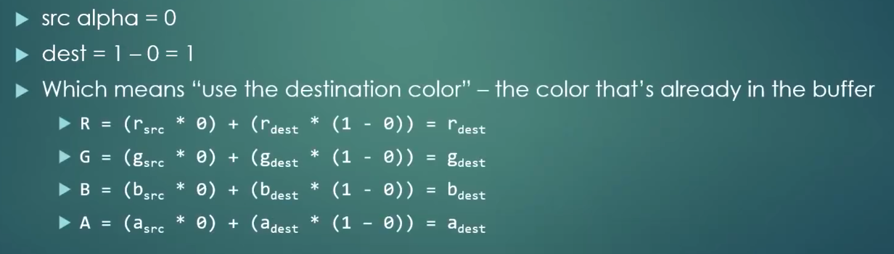

这一集是关于如何处理==透明度（Alpha Channel）==的关键。当两个物体重叠时，GPU 如何决定最终像素的颜色？这就是“混合”要解决的问题。

# 问题的引入：为什么我的图片有“黑边”？

在加载带透明通道的 `.png` 纹理时，如果不开启混合，透明区域通常会显示为==纯黑色==或==纯白色==。这是因为：

- 默认情况下，OpenGL 只是简单地用新像素 ==覆盖（Overwrite）==旧像素。    
- 即使你的纹理有 Alpha 值（例如 $0.0$ ），如果不告诉 OpenGL 如何处理它，它依然会把这个“透明”的像素颜色画上去。

# 开启混合 (Enable Blending)

OpenGL 是一个状态机，混合功能默认是关闭的。你必须手动开启：

```scss
GLCall(glEnable(GL_BLEND));
```

开启后，你需要定义==混合函数（Blend Function）==，即告诉 OpenGL：“拿新颜色（源）和旧颜色（目标）怎么算？”

# 核心公式：混合方程式

这是这一集最硬核的数学部分。OpenGL 计算最终像素颜色的公式如下：

$$C_{result} = (C_{src} * F_{src}) + (C_{dest} * F_{dest})$$

- ==(Source Color)==：即将画上去的颜色（来自 Fragment Shader）。    
- ==(Source Factor)==：源颜色的权重。    
- ==(Destination Color)==：已经在颜色缓冲区里的颜色（背景色）。    
- ==(Destination Factor)==：目标颜色的权重。    

# 最常用的配置：实现透明效果

为了实现自然的透明（即：新物体的透明度越高，透出的背景越多），Cherno 给出了最经典的配置方案：

```scss
GLCall(glBlendFunc(GL_SRC_ALPHA, GL_ONE_MINUS_SRC_ALPHA));
//函数glBlendFunc第一个参数默认值为：GL_ONE，第二个参数默认值为：GL_ZERO
```

==逻辑拆解：==

1. $F_{src} = GL\_SRC\_ALPHA$ 源颜色的权重是它自己的 $Alpha$ 值。    
2. $F_{dest} = GL\_ONE\_MINUS\_SRC\_ALPHA$ 背景颜色的权重是 $1 - Alpha$ 。    

==举个例子：== 如果你画一个 Alpha 为 $0.3$（ $30\%$ 不透明）的红色方块在黑色背景上：

- 最终颜色 = $(\text{红色} * 0.3) + (\text{背景黑} * 0.7)$。
- 结果就是一种半透明的暗红色。
另一个例子：  

  


# 混合方程式的进阶设置

除了 `glBlendFunc` 定义权重，还可以通过 `glBlendEquation` 定义中间的符号：

$$\text{结果} = (\text{源颜色} \times \text{权重A}) \quad \mathbf{\text{运算符}} \quad (\text{目标颜色} \times \text{权重B})$$  
- ==`GL_FUNC_ADD`==：相加（默认，最常用）。      
- ==`GL_FUNC_SUBTRACT`==：相减。    
- ==`GL_MIN / GL_MAX`==：取两者的最小值或最大值。

# 额外补充：深度测试与混合

虽然这一集 Cherno 侧重于 2D，但你需要记住一个原则：

- ==顺序很重要==：在 3D 环境中，必须==先画不透明物体，再按从远到近的顺序画透明物体==。否则，由于深度缓冲区（Depth Buffer）的存在，远处的透明物体可能无法正确透过近处的透明物体显示。
## 为什么“先画不透明，后画透明”？

如果不透明物体（比如一堵墙）在透明物体（比如一块玻璃）后面，结果很简单：

-   如果先画墙，再画玻璃：玻璃通过深度测试，并在墙的颜色基础上进行混合。==（正确）==    
-   如果先画玻璃，再画墙：墙在画的时候会发现，玻璃已经占据了那个像素，且玻璃离镜头更近。墙就会被深度测试丢弃。==（正确，因为墙确实被挡住了）==


所以，==不透明物体永远先画==，它们负责填满深度缓冲区，作为背景。


## 核心难题：透明物体之间的顺序

真正的问题出在 ==“两个透明物体”== 叠加时。

假设有一块 ==红色玻璃（近）== 和一块 ==蓝色玻璃（远）==：

### ==错误的顺序：先画近的（红），再画远的（蓝）==

1.  ==画红色玻璃==：GPU 发现这里没东西，于是画上红色，并在深度缓冲区记下：“这里的深度是 ”。    
2.  ==画蓝色玻璃==：GPU 准备画蓝色，但它查了一下深度缓冲区，发现现在的深度是 ，而蓝色玻璃的深度是 （更远）。    
3.  ==深度测试失败==：GPU 认为蓝色物体被“挡住”了，于是==直接把它丢弃==，连混合的机会都不给它！    
4.  ==结果==：你只看到了红色玻璃，远处的蓝色玻璃完全消失了，而不是透过红色显现出来。

### ==正确的顺序：先画远的（蓝），再画近的（红）==

1.  ==画蓝色玻璃==：GPU 记录深度为 。    
2.  ==画红色玻璃==：GPU 发现红色（深度 ）比蓝色更近，通过深度测试。    
3.  ==混合==：因为红色是透明的，OpenGL 按照公式，把红色和已经存在的蓝色背景进行混合。    
4.  ==结果==：你看到了红蓝叠加的正确透明效果。