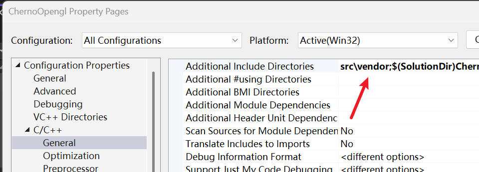
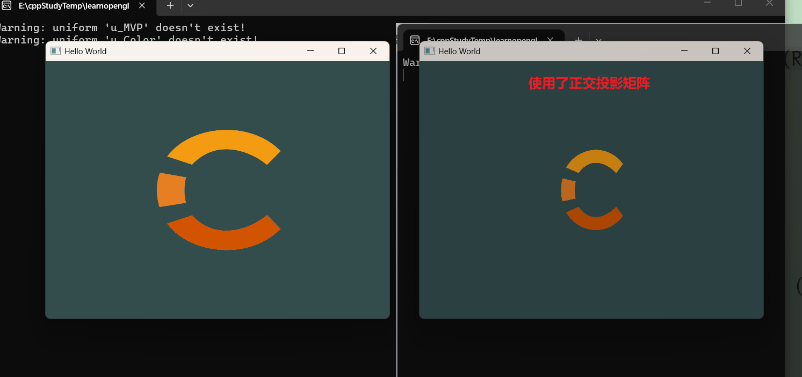
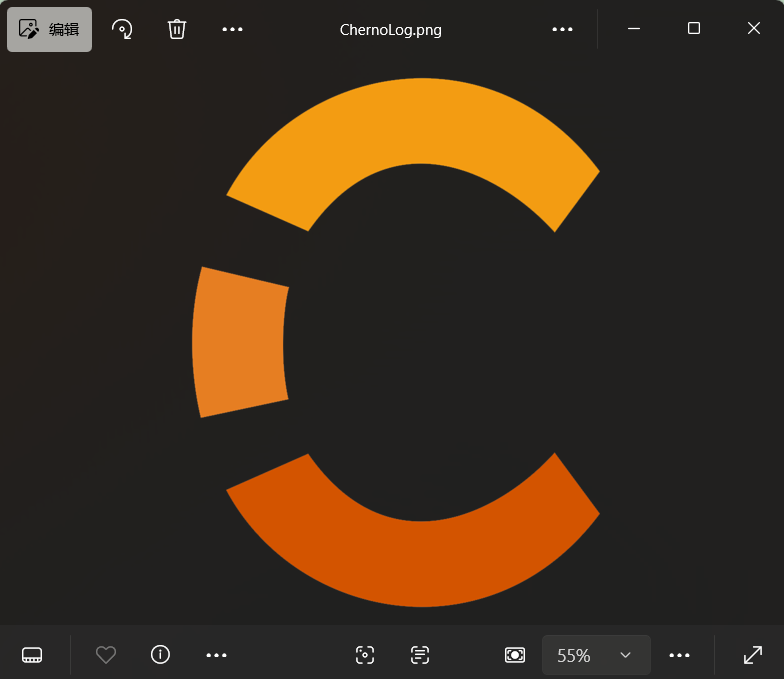

# 总结

引入 ==数学库 (Math Library)==，特别是处理==向量（Vector）和矩阵（Matrix）运算==。对于图形学来说，数学就是“画笔”，而矩阵就是“坐标转换器”。

以下是按时间线整理的核心知识点总结：

## 为什么需要第三方数学库？

- ==原生局限==：C++ 标准库没有提供专门针对图形学的向量（如 `vec3`）和矩阵（如 `mat4`）运算。    
- ==GLSL 同步==：我们需要在 CPU 端计算好矩阵，然后传递给 Shader。如果 CPU 端的数学库逻辑（比如数据排布）能与 Shader 中的 GLSL 保持一致，开发效率会极高。    
- ==GLM 的选择==：Cherno 选择了 ==GLM (OpenGL Mathematics)==。它是一个 ==Header-only==（仅头文件）的库，设计思路完全模仿 GLSL，且与 OpenGL 兼容性完美。
    
`https://github.com/g-truc/glm/releases/tag/1.0.3`  

项目属性中设置：  

  

之后这里把`Texture.cpp`的头文件前几行改为  

```cpp
#include "Texture.h"
#include "Renderer.h"
#include <iostream>

#include "stb_image/stb_image.h" //去除了vendor/
```

1. 把 glm这个文件夹 (ui-右键)`include` 
2. 把 `glm/detail/glm.cpp` 和 `glm/glm.cppm`  (ui-右键)`exclude project `

## 向量与矩阵的基本概念

- ==向量 (Vector)==：==不仅代表位置，还代表方向==。在 2D 中是 `vec2`，3D 中是 `vec3`，带上齐次坐标则是 `vec4`。    
- ==矩阵 (Matrix)==：图形学中的“魔法方阵”。`mat4`（4x4 矩阵）可以同时包含 ==旋转 (Rotation)==、==平移 (Translation)== 和 ==缩放 (Scale)== 信息。

## 正交投影矩阵 (Orthographic Projection)

这是本集的实战重点。Cherno 引入了 `glm::ortho` 函数：

- ==作用==：将你定义的坐标（比如 0 到 800）映射到 OpenGL 的 ==NDC 标准设备坐标系==（-1.0 到 1.0）。    
	- 告诉window窗口，如何将不同的顶点映射到它
- ==意义==：有了它，你就不需要再写 `-0.5f` 这种坐标了，可以直接按像素坐标（如 `0, 0` 到 `640, 480`）来定义你的顶点。
    

## 矩阵的乘法顺序 (重点/易错点)

Cherno 特别强调了数学上的乘法顺序：

- ==列主序 (Column Major)==：GLM 和 OpenGL 一样，默认采用列主序。
- ==计算逻辑==：如果你想对一个点进行变换，公式通常是：
  $$P' = Projection \times View \times Model \times P$$
- ==代码体现==：在代码里写乘法时，变换的顺序是从右往左读的。例如 `mvp = p * v * m`。


## MVP 矩阵模型

这是图形学的核心架构，Cherno 开始为后续章节铺垫这三个矩阵：

1.  ==Model (模型矩阵)==：物体在世界空间的位置、旋转、大小。    
2.  ==View (视图矩阵)==：相机在哪里，看向哪里。    
3.  ==Projection (投影矩阵)==：决定了空间如何投影到屏幕上。


## 将矩阵传给 Shader

- ==Uniform 变量==：在 Shader 中定义 `uniform mat4 u_MVP;`。    
- ==上传函数==：在 CPU 端使用 `glUniformMatrix4fv`。    
    - 参数中的 `GL_FALSE` 非常关键：它代表“是否转置矩阵”。因为 GLM 数据排布和 OpenGL 一致，所以不需要转置。
        


## 给你的特别提醒

1.  ==环境配置==：由于 GLM 是 ==Header-only==，你只需要把它的文件夹包含进 VS 的 ==“附加包含目录”== 即可，不需要编译成 `.lib`，也不需要处理 `dll`。这比配置 GLEW/GLFW 简单得多。    
2.  ==数据类型==：注意 `glm::mat4` 的初始化。默认情况下，它可能是一个零矩阵，通常需要初始化为 ==单位矩阵 (Identity Matrix)==：`glm::mat4 proj = glm::mat4(1.0f);`。    
3.  ==坐标轴==：OpenGL 默认是右手坐标系。在设置 `glm::ortho` 的近平面和远平面时，如果数值填反了，你的方块可能会因为“剔除”而消失。    

==总结：== 第 19 集让你的程序从“手动拼凑坐标”进化到了“使用数学工具精准控制”。

# 代码

## Basic.shader

```cpp
#shader vertex
#version 330 core
layout(location = 0 ) in vec4 position;
layout(location = 1 ) in vec2 texCoord;

out vec2 v_TextCoord;

//添加了这行--1
//模型，视图，投影  矩阵
uniform mat4 u_MVP;

void main()
{
  //添加了这行--2
  //经过 u_MVP * position 这一行代码计算后，赋值给
  //gl_Position 的结果必须落在 $[-1.0, 1.0]$ 的区间内，
  //否则它就会被丢弃
  gl_Position = u_MVP * position;
  //gl_Position=position;//自动转换，X, Y, Z：如果缺省，默认补 0.0。W：如果缺省，默认补 1.0
  v_TextCoord=texCoord;//从顶点着色器获取到的又传出来
}


#shader fragment
#version 330 core
//layout(location = 0 ) out vec4 color; //这里应该不需要指定layout
out vec4 color; 

in vec2 v_TextCoord;

uniform vec4 u_Color;//同意u_开头表示uniform变量
uniform sampler2D u_Texture;//目前给了2

void main()
{ 
  vec4 textColor = texture(u_Texture, v_TextCoord); 
 color=textColor;//只要纹理颜色  

}

```


## Shader.h添加定义  

```cpp

#include "glm/glm.hpp"


public:
	void SetUniformMat4f(const std::string& name, const glm::mat4& matrix);
```

## Shader.cpp添加实现

```cpp
 void Shader::SetUniformMat4f(const std::string& name, const glm::mat4& matrix)
 {
	 //参数2：要传输的矩阵数量
	 //参数3：是否需要转置（行列对调）
	 //参数4：矩阵数据的首地址（指针）
	 glUniformMatrix4fv(GetUniformLocation(name),1, 
		 GL_FALSE,&matrix[0][0]);

 }
```

## Main中修改

```cpp
		//宽高比：2.0:1.5即4:3
		//添加这行
		glm::mat4 proj = glm::ortho(-2.0f, 2.0f, -1.5f, 1.5f, -1.0f, 1.0f);

		Renderer renderer;
		Shader shader("res/shaders/Basic.shader");
		shader.Bind();
		shader.SetUniform1i("u_Texture", 2);
		//添加这行
		shader.SetUniformMat4f("u_MVP", proj);
```

# 效果

  

原图  

