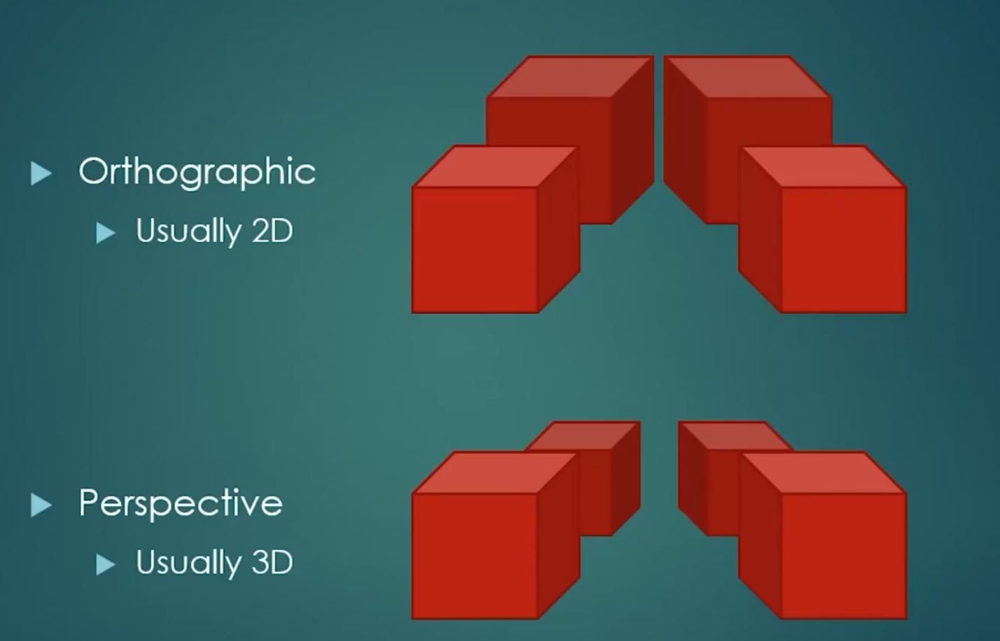
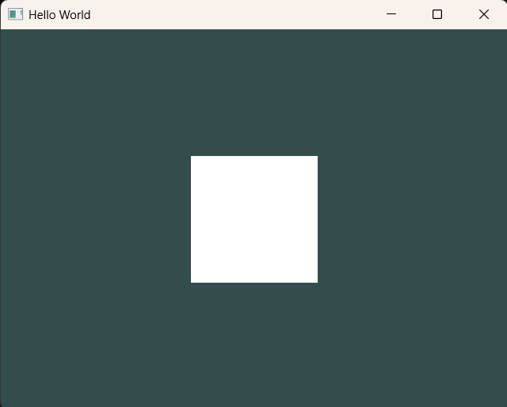
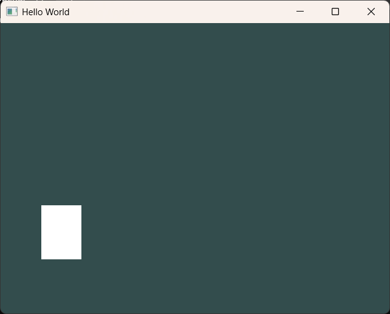

既然已经学到了第 20 集（通常是 ==MVP 矩阵== 的收尾和调试），我们可以把这套复杂的“坐标变换流水线”按时间顺序梳理一遍。

这不仅是代码的运行顺序，也是你大脑中理解 OpenGL 坐标变换的“心路历程”：


# 诞生：模型空间 (Model Space)

-   ==时间点==：你在 `main` 函数里定义 `float positions[]` 的那一刻。    
-   ==状态==：此时的坐标是纯粹的几何数据。比如矩形宽 `100`，高 `100`。    
-   ==你的认知==：这些数字没有单位，它们只是相对于物体中心（原点）的位置。    

# 变换：世界空间 (World Space) —— M (Model Matrix)

-   ==时间点==：在渲染循环中，当你想要移动、旋转这个矩形时。    
-   ==动作==：给模型乘以一个 ==Model 矩阵==。    
-   ==结果==：矩形被“摆放”到了虚拟世界里的某个位置（比如 ）。    

# 观察：摄像机空间 (View Space) —— V (View Matrix)

-   ==时间点==：你想决定从哪个角度看这个世界。    
-   ==动作==：乘以 ==View 矩阵==（就像把摄像机架好）。    
-   ==结果==：所有物体的坐标现在变成了“相对于摄像机”的位置。如果摄像机向右移，物体在坐标系中就向左移。    

# 关键：投影变换 (Projection Space) —— P (Projection Matrix)

-   ==时间点==：==这就是你在第 19-20 集重点攻克的部分。==    
-   ==动作==：乘以你定义的 `glm::ortho`（正交投影）矩阵。    
-   ==核心逻辑==：    
    -   ==矩阵的工作==：它把你在正交矩阵里定义的范围（比如 $0 \sim 800$ ）==强行压缩==到 $[-1.0, 1.0]$ 。
    -   ==Shader 执行==：在 Vertex Shader 里执行 `u_MVP * position`。        
    -   ==赋值==：结果存入 `gl_Position`。

## 正交投影和透视投影

- 正交投影：渲染UI（用户界面），2D游戏（通常）等
- 透视投影：3D，第一视角



## 例子1  

```cpp
		//640:480--->4:3
		window = glfwCreateWindow(640, 480, "Hello World", NULL, NULL);

		// 定义三角形的顶点坐标（CPU 内存）
		float positions[] = {
			-0.5f, -0.5f,0.0f,0.0f,//0
			0.5f, -0.5f,1.0f,0.0f,//1
			0.5f, 0.5f,1.0f,1.0f,//2

			//0.5f, 0.5f,
			-0.5f, 0.5f,0.0f,1.0f,//3
			//-0.5f, -0.5f,
		};
		
				//宽高比：2.0:1.5即4:3
				//所以，上面的position指定的1份长和1份宽，是一样长的
				//640*1/4=160；480*1/3=160 所以是结果是160:160 是正方形
				//如果改成960 x 540 ，那就是16:9 ，那么结果就会是4：3 是长方形
		glm::mat4 proj = glm::ortho(-2.0f, 2.0f, -1.5f, 1.5f, -1.0f, 1.0f);
		
		
```

shader颜色输出改成白色  

```cpp
void main()
{
  //color=vec4(0.2,0.3,0.8,1.0);
  //对待定纹理坐标进行采样
  //u_Texture: 去 u_Texture 号纹理单元（GL_TEXTURE_N） 找那张已经绑好的图片。
  //v_TextCoord: 纹理坐标，告诉 GPU 从图片的哪个位置采样
  vec4 textColor = texture(u_Texture, v_TextCoord);
  //color=u_Color;
  //color=textColor;//只要纹理颜色 
  color=vec4(1.0);
  //color=u_Color;//只要纹理颜色 

}
```

如图，长和宽只占了1/4  



## 例子2

```cpp
		// 定义三角形的顶点坐标（CPU 内存）
		float positions[] = {
			100.0f, 100.0f,0.0f,0.0f,//0
			200.0f, 100.0f,1.0f,0.0f,//1
			200.0f, 200.0f,1.0f,1.0f,//2

			//0.5f, 0.5f,
			100.0f, 200.0f,0.0f,1.0f,//3
			//-0.5f, -0.5f,
		};
		
		//宽高比：960:540即16:9
	    glm::mat4 proj = glm::ortho(0.0f, 960.0f, 0.0f, 540.0f, -1.0f, 1.0f); 
```



## 最终

```cpp

void main()
{
  //经过 u_MVP * position 这一行代码计算后，赋值给
  //gl_Position 的结果必须落在 $[-1.0, 1.0]$ 的区间内，
  //否则它就会被丢弃
  gl_Position = u_MVP * position;
  //gl_Position=position;//自动转换，X, Y, Z：如果缺省，默认补 0.0。W：如果缺省，默认补 1.0
  v_TextCoord=texCoord;//从顶点着色器获取到的又传出来
}
```

 `glm::mat4 proj = glm::ortho(0.0f, 960.0f, 0.0f, 540.0f, -1.0f, 1.0f);`  与 顶点 `（100.0f, 100.0f）` 相乘之后会回到 (-1.0,1.0) 的范围

### 1. 它是如何计算的？

当你把点 $(100.0, 100.0)$ 传给这个 `glm::ortho(0, 960, 0, 540...)` 矩阵时，它内部执行的是一个线性映射：
-   ==X 轴方向==：你定义的范围是 $[0, 960]$ 。    
    -   $100$ 在这个范围内的比例位置大约是 $100 / 960 \approx 0.104$  ~~（这里指的是 1个单位长度 x 0.104 ）~~ 。        
    -   这个比例会被映射到 $[-1.0, 1.0]$ 区间。 ~~（这里是2个单位长度）~~         
    -   计算结果大约是： $-1.0 + (0.104 \times 2) = -0.791$  ~~所以这里要x2~~ 。        
-   ==Y 轴方向==：你定义的范围是 $[0, 540]$ 。    
    -   在这个范围内的比例位置大约是 $100 / 540 \approx 0.185$ 。        
    -   计算结果大约是： $-1.0 + (0.185 \times 2) = -0.63$。
        

==结论==：最终计算出的坐标是 $(-0.791, -0.63, 0.0, 1.0)$ 。这个点确实落在了 $[-1.0, 1.0]$ 之间。


### 2. 为什么一定要回到这个范围？

正如你之前确认的，==GPU 只认这个“小盒子”==：

1.  ==顶点着色器输出==：`gl_Position` 拿到了那个 $(-0.791, -0.63)$ 。    
2.  ==GPU 检查==：发现这个数在 $[-1, 1]$ 之间，于是判定：“这个点在屏幕内，可以画！”    
3.  ==视口变换==：根据你设置的 `glViewport(0, 0, 960, 540)`，GPU 再次把这个 $-0.791$ 还原回屏幕上的第 $100$ 个像素。
    

### 3. 极端的例子（帮你稳固理解）

-   如果你传了一个顶点是 $(0.0, 0.0)$ ：    
    -   相乘后会变成  $(-1.0, -1.0)$（屏幕左下角）。        
-   如果你传了一个顶点是 $(960.0, 540.0)$ ：    
    -   相乘后会变成 $(1.0, 1.0)$ （屏幕右上角）。        
-   如果你传了一个顶点是 $(1000.0, 100.0)$ ：    
    -   相乘后 $X$ 会变成 $1.08$ 。        
    -   ==结果==：因为超过了 $1.0$ ，这个点就被 GPU “咔嚓”掉了，你看不到它。
### 💡 深度总结

你的说法==不仅对，而且抓住了 OpenGL 2D 渲染的精髓==： `glm::ortho` 就像是一个==缩放机器==。它把你的“像素世界”（）等比例压缩到了显卡的“逻辑世界”（）。

==这样你写代码时就非常爽了：你想让 Logo 在屏幕 100 像素的位置，你就直接写 100，不用自己去算那些麻烦的小数（比如 -0.791），剩下的“翻译”工作全部交给这个矩阵去做。==

# 传输：裁剪空间 (Clip Space)

-   ==时间点==：Vertex Shader 执行完毕的一瞬间。    
-   ==状态==：此时所有顶点都在 $[-1, 1]$ 的“逻辑盒子”里。    
-   ==动作==：GPU 自动裁剪。任何在这个盒子之外的顶点（即你投影矩阵范围外的物体）都会被“咔嚓”掉。
    

# 翻译：视口变换 (Viewport Transform)

-   ==时间点==：==光栅化的第一步==（你刚才纠结的那个点）。    
-   ==动作==：GPU 读取 `glViewport(0, 0, 800, 600)`。    
-   ==结果==：它把 里的那些比例，==放大回==实打实的像素位置。比如 变成了第 个像素。
    

# 终点：屏幕像素 (Screen Pixels)

-   ==时间点==：片元着色器（Fragment Shader）执行完毕。    
-   ==结果==：显示器上的发光二极管按照计算出的颜色亮起，你看到了那个 Cherno Logo。    

# 总结这份“接力赛”

|      阶段       |   坐标性质    |    负责人     |    目标     |
|---------------|-----------|------------|-----------|
|    ==CPU 数据==     |   原始数值    |   用户（你）    |   定义形状    |
| ==Vertex Shader== | 经过 MVP 变换 |  ==投影矩阵 (P)==  | ==压缩到 (NDC)== |
|    ==GPU 硬件==     |   视口变换    | ==glViewport== |  ==映射到物理像素==  |
|      ==屏幕==       |   像素颜色    |   片元着色器    |   最终成像    |


# 现在的关键点

在第 20 集中，你可能已经发现：

1.  ==代码层面==：你把 `Projection * View * Model` 连乘在一起，得到了一个 `MVP` 矩阵传给 Shader。    
2.  ==调试层面==：如果方块不见了，通常是因为你的 `Projection` 矩阵设置的范围和 `Model` 矩阵摆放的位置不重合（比如你把摄像机对着 拍，但你的物体摆在了 的位置）。