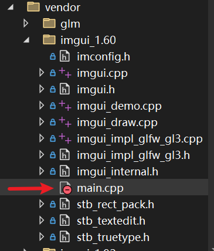

第 22 集是 Cherno 系列中非常爽的一集，因为它让你告别了“硬编码”坐标的痛苦，转而使用==可视化 UI== 来直接操控显卡里的数据。

# 代码

https://github.com/ocornut/imgui  下载1.6版本，和视频中保持一致  

根目录下所有.h和.cpp文件，以及`examples\opengl3_example`文件夹中的.h和.cpp文件都复制到项目中 ~~不要include main.cpp文件~~ 。  

  

修改`imgui_impl_glfw_gl3.cpp`中开头的 `#include <GL/gl3w.h>` 为`#include <GL/glew.h> `  

## 添加头文件

```cpp

#include "imgui_1.60/imgui.h"
#include "imgui_1.60/imgui_impl_glfw_gl3.h"
```

## shader后的修改

```cpp

		//=======imgui添加============
		//imGui创建上下文
		// Setup ImGui binding
		ImGui::CreateContext();
		//windows ,告诉 ImGui 你的程序窗口在哪里
		//允许 ImGui 自动接管窗口的回调函数（比如鼠标点击、滚轮滚动）
		ImGui_ImplGlfwGL3_Init(window, true);
		//设置 UI 的主题配色
		ImGui::StyleColorsDark();

		//解决白屏问题2：在进入 while 循环前，手动清一次屏并交换缓冲
		//设置“清除颜色”
		glClearColor(0.2f, 0.3f, 0.3f, 1.0f);
		//用上面选好的“油漆”填满整个颜色缓冲区（Color Buffer）
		glClear(GL_COLOR_BUFFER_BIT);
		//交换缓冲区
		glfwSwapBuffers(window); // 这一步把“深绿色”推送到显卡
		//解决白屏问题3：最后才显示窗口
		glfwShowWindow(window);


		//=======imgui添加============
		bool show_demo_window = true;
		bool show_another_window = false;
		ImVec4 clear_color = ImVec4(0.45f, 0.55f, 0.60f, 1.00f);

		// 游戏/渲染主循环
		while (!glfwWindowShouldClose(window))
		{
			// 清理屏幕颜色缓冲区
			renderer.Clear();

			//=======imgui添加============
			ImGui_ImplGlfwGL3_NewFrame();


			//必须先绑定program，因为vao不负责着色器程序的切换
			//va.Bind();

			if (r > 1.0f)
				increment = -0.05f;
			else if (r < 0.0f)
				increment = 0.05f;

			r += increment;

			//绘图前重新绑定
			shader.Bind();
			//在u_Color的位置上设置数值
			shader.SetUniform4f("u_Color", r, 0.3f, 0.0f, 1.0f);
			//========设置uniform========

			renderer.Draw(va, ib, shader);

			//小窗口
			//=======imgui添加============
			{
				static float f = 0.0f;
				static int counter = 0;
				ImGui::Text("Hello, world!");                           // Display some text (you can use a format string too)
				ImGui::SliderFloat("float", &f, 0.0f, 1.0f);            // Edit 1 float using a slider from 0.0f to 1.0f    
				ImGui::ColorEdit3("clear color", (float*)&clear_color); // Edit 3 floats representing a color

				ImGui::Checkbox("Demo Window", &show_demo_window);      // Edit bools storing our windows open/close state
				ImGui::Checkbox("Another Window", &show_another_window);

				if (ImGui::Button("Button"))                            // Buttons return true when clicked (NB: most widgets return true when edited/activated)
					counter++;
				ImGui::SameLine();
				ImGui::Text("counter = %d", counter);

				ImGui::Text("Application average %.3f ms/frame (%.1f FPS)", 1000.0f / ImGui::GetIO().Framerate, ImGui::GetIO().Framerate);
			}


			//=======imgui添加============
			ImGui::Render();
			//=======imgui添加============
			ImGui_ImplGlfwGL3_RenderDrawData(ImGui::GetDrawData());

			// 交换前后缓冲区以刷新画面
			glfwSwapBuffers(window);

			// 轮询并处理窗口事件（如键盘输入、关闭动作）
			glfwPollEvents();
		}

		//最后解绑vao
		//glBindVertexArray(0);
	}
	
	//=======imgui添加============
	ImGui_ImplGlfwGL3_Shutdown();

	// 退出前清理资源
	//glfwTerminate会破坏Context，导致析构函数中的glGetError()
	//返回一个OpenGL错误
	glfwTerminate();
	return 0;
```


按==程序生命周期的时间线==，我们可以把 ImGui 的 *==集成==* 与运行分为以下阶段：


# 1. 初始化阶段：建立连接

在窗口创建（GLFW）之后，但在渲染循环开始前，你需要为 ImGui 搭建好舞台。

- ==动作==：`ImGui::CreateContext()`。    
- ==绑定==：调用 `ImGui_ImplGlfw_InitForOpenGL` 和 `ImGui_ImplOpenGL3_Init`。   
- ==目的==：让 ImGui 知道两件事：它该去哪个窗口捕获鼠标/键盘（GLFW），以及它该用哪个版本的驱动来画出自己的 UI (OpenGL) 。


# 2. 渲染循环内：新帧准备

在 `while(!glfwWindowShouldClose)` 循环的最开始。

- ==动作==：`ImGui_ImplOpenGL3_NewFrame()` 和 `ImGui_ImplGlfw_NewFrame()`。    
- ==目的==：告诉 ImGui：“现在是新的一帧了，请清空上一帧的状态，开始记录我接下来的 UI 指令。”


# 3. UI 逻辑阶段：定义面板

这是你在第 22 集花最多时间写代码的地方。

- ==动作==：`ImGui::Begin("Debug Panel")` `ImGui::SliderFloat3(...)` `ImGui::End()`。    
- ==核心逻辑==：
    
    - 你定义了一个滑动条，并把它==绑定==到你 C++ 中的变量（比如 `translationA`）。        
    - ==关键点==：ImGui 并不直接操作显卡，它只是==修改了 CPU 里的变量值==。
    


# 4. 矩阵更新阶段：重新翻译 (MVP)

这是将 UI 和 3D 画面联动的关键点。

- ==动作==：利用刚才被 ImGui 修改的 `translationA`，重新计算 `model` 矩阵。
- ==计算==：`mvp = proj * view * model;`。    
- ==目的==：UI 改变了数值 数值改变了矩阵 矩阵改变了顶点位置。


# 5. 提交渲染阶段：绘制 UI

在你的物体（如 Logo）渲染完毕之后。

- ==动作==：`ImGui::Render()` `ImGui_ImplOpenGL3_RenderDrawData(...)`。
- ==顺序==：必须先画你的 Logo，再画 ImGui。否则，UI 可能会被你的 3D 物体遮挡住（因为 ImGui 也是一组顶点和索引）。    
- ==结果==：ImGui 把自己生成的三角形数据通过 `glDrawElements` 传给 GPU，叠放在画面最上层。


# 💡 核心总结：22 集的思维跃迁

|  维度  |      集成前       |         集成后 (第 22 集)         |
|------|----------------|------------------------------|
| ==调试方式== | 修改代码 编译 运行 观察  |        ==实时拖动滑动条 瞬间看到反馈==        |
| ==变量控制== | 硬编码在 `main` 函数里  |      暴露在 UI 面板上，支持动态交互       |
| ==渲染顺序== | 只有物体的 `DrawCall` | ==物体 DrawCall + ImGui DrawCall== |


# 🛠️ 这一集的“醍醐灌顶”

你在这一集最深刻的体验应该是：==当你拖动滑动条，那个矩形（Logo）在屏幕上丝滑移动的时候。==

本质上，ImGui 在这一帧修改了 `translationA.x`，而下一行代码立即用新的 `x` 算出了新的 `MVP` 传给 Shader。因为每秒钟这个过程发生 60 次（60 FPS），所以你看到的移动才是连贯的。

==你现在是不是已经成功把两个 Logo 摆在不同的位置了？这就是通过同一个 `Shader` 和 `Vertex Array`，但每画一个物体前更新一次不同的 `u_MVP` 来实现的。==