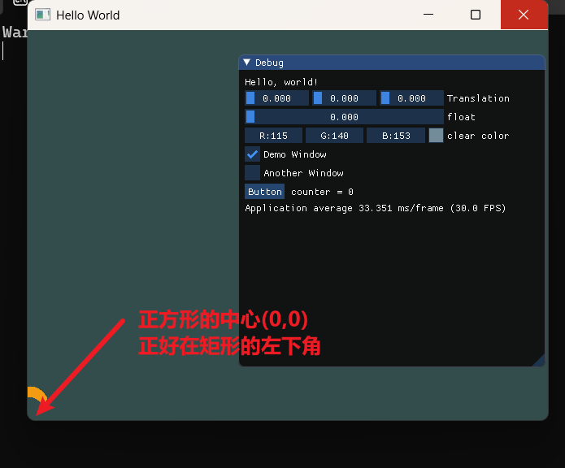
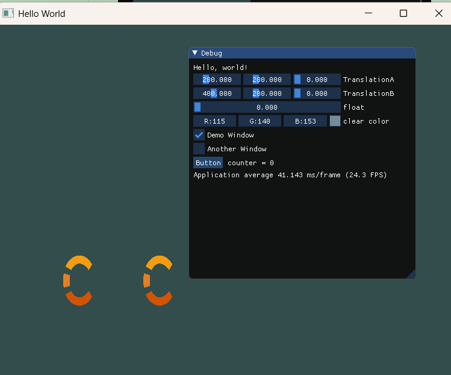

核心内容是如何通过修改 ==MVP（模型-视图-投影）矩阵== 在不同位置多次绘制同一个物体，并初步探讨了性能优化的思路。

# 第 23 集：在 OpenGL 中渲染多个物体

- ==\[00:00:00 - 01:25\] 核心目标与现状回顾==
    
    - 回顾之前只能在屏幕上渲染一个 Logo。        
    - 目标：在不同位置渲染两个或多个相同的物体。        
    - 解决 ImGui 鼠标位置偏移的小技巧：切换 GPU 驱动（由 Intel 切换至 Nvidia）解决了一些驱动层面的显示问题。
        
- ==渲染原理深究：Shader、VAO 与 Draw Call==
    - ==Shader (Program)：== 告诉 GPU “如何”绘制数据，而不仅仅是光照。  
    - ==Vertex Array (VAO)：== 包含实际的顶点数据（位置、纹理坐标等）。      
    - ==Index Buffer：== 决定顶点的组合顺序。
    - ==Draw Call：== 调用 `glDrawElements`，结合 Shader 和数据完成最终的光栅化。
        
- ==如何改变物体位置？（两种方案）==
    - ==方案 A（低效）：== 为每个物体创建独立的顶点缓冲区（Vertex Buffer）。缺点：浪费显存，频繁切换 Buffer 速度慢。        
    - ==方案 B（推荐）：== 保持顶点数据不变，但在每次绘制前修改 ==Uniform 变量==（即 Model 矩阵）。通过矩阵变换将同一组顶点映射到屏幕的不同位置。
        
- ==顶点坐标的标准化归零==
    - 为了方便平移，将顶点的原始坐标从 `[100, 200]` 修改为以原点为中心的 `[-50, 50]`。        
    - 这样做的好处是物体的 ==Origin（原点）== 位于其中心，应用平移矩阵时坐标计算更直观。
```cpp
		// 定义三角形的顶点坐标（CPU 内存）
		float positions[] = {
			-50.0f, -50.0f,0.0f,0.0f,//0
			50.0f, -50.0f,1.0f,0.0f,//1
			50.0f, 50.0f,1.0f,1.0f,//2

			//0.5f, 0.5f,
			-50.0f, 50.0f,0.0f,1.0f,//3
			//-0.5f, -0.5f,
		};
		
		//while之前的代码
		glm::vec3 translationA(200, 200, 0);
		glm::vec3 translationB(400, 200, 0);
		
		//while代码块内的代码
		
			if (r > 1.0f)
				increment = -0.05f;
			else if (r < 0.0f)
				increment = 0.05f;

			r += increment;
			//绘图前重新绑定
			shader.Bind();

			{
				//=======imgui添加============
				//imgui:这里吧mvp相关代码移到while循环中
				//向右向上移动200
				glm::mat4 model = glm::translate(glm::mat4(1.0f), translationA);

				glm::mat4 mvp = proj * view * model;
				shader.SetUniformMat4f("u_MVP", mvp);

				//=======imgui添加============
				//在u_Color的位置上设置数值
				//shader.SetUniform4f("u_Color", r, 0.3f, 0.0f, 1.0f);
				//========设置uniform========

				renderer.Draw(va, ib, shader);
			}

			{
				//批量渲染对象
				glm::mat4 model = glm::translate(glm::mat4(1.0f), translationB);
				glm::mat4 mvp = proj * view * model;
				shader.SetUniformMat4f("u_MVP", mvp);
				renderer.Draw(va, ib, shader);
			}

			//=======imgui添加============
			//{}//小窗口前面的代码
				
```
      





- ==代码实现：多次 Draw Call==
    - 在主循环中执行两次绘制逻辑。        
    - ==关键步骤：== 1. 计算第一个位置的 MVP 矩阵 设置 Uniform 执行 `Draw`。 2. 计算第二个位置的 MVP 矩阵 设置 Uniform 执行 `Draw`。        
    - 演示了使用 ImGui 控制两个不同变量（`translationA` 和 `translationB`）来实时移动两个 Logo。
        
- ==性能警示：Draw Call 的开销与批量渲染（Batch Rendering）==
    
    - 如果渲染成千上万个物体（如 2D 地图格子），使用上述“一物体一 Draw Call”的方法会导致严重的性能瓶颈。        
    - ==预告：== 引入 ==Batch Rendering（批量渲染）==。核心思想是将所有物体的顶点数据一次性塞进一个巨大的 Vertex Buffer 中，仅用 ==一次 Draw Call== 完成所有渲染。
        
- ==\[00:16:40 - 18:14\] 总结与后续预告==
    
    - 引出 ==Material（材质）== 的概念：Shader + 一组 Uniform 参数。
        
    - 后续将深入探讨批量渲染和更复杂的材质抽象。