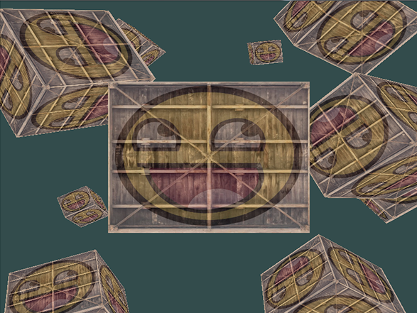

欢迎来到这本在线 OpenGL 学习书籍！无论您学习 OpenGL 的目的是==学术研究、职业发展还是纯粹出于兴趣爱好==，本书都将使用 ==现代== （核心配置文件）OpenGL，为您讲解 OpenGL 的==基础知识、中级知识以及所有高级知识==。本书旨在以清晰易懂的方式和示例，向您展示现代 OpenGL 的方方面面，同时为后续学习提供有用的参考资料。

# 那么，为什么要读这些章节呢？

互联网上有成千上万篇关于学习 OpenGL 的文档、书籍和资源，然而，其中大多数资源只关注 OpenGL 的即时模式（通常被称为旧版 OpenGL），内容不完整，缺乏完善的文档，或者不符合你的学习偏好。因此，我的目标是提供一个==既完整又易于理解==的平台。  

如果您喜欢阅读提供==循序渐进==的指导、==清晰示例==且不会让您被海量细节淹没的内容，那么这本书可能正合您意。本书各章节旨在==让没有任何图形编程经验的读者也能理解==，同时也能==为经验丰富的用户带来阅读乐趣==。我们还会探讨一些==实用的概念==，只需稍加创意，就能==将您的想法转化为真正的 3D 应用==。如果您觉得以上描述与您自身情况相符，那么请继续阅读。

# 你将学到什么？

这些章节的重点是==现代 OpenGL==。==学习（和使用）现代 OpenGL== 需要==扎实的图形编程知识==，以及==对 OpenGL 底层工作原理的了解==，才能真正获得最佳体验。因此，我们将==首先讨论核心图形方面==的内容，即 ==OpenGL 如何将像素绘制到屏幕上，以及如何利用这些知识来创建一些炫酷的效果==。

除了核心知识之外，我们还将探讨许多可用于应用程序的实用技巧，例如：==场景遍历、创建精美光照、从建模程序加载自定义对象、进行炫酷的后期处理==等等。我们还会推出一系列演示视频，实际创建一个==基于所学 OpenGL 知识的小游戏==，让您真正体验图形编程的乐趣。

# 从哪里开始呢？

学习 OpenGL 完全免费，而且永远免费，任何想要入门图形编程的人都可以使用。所有内容都可以在左侧菜单中找到。只需点击“简介”按钮，即可开始您的学习之旅！ 

