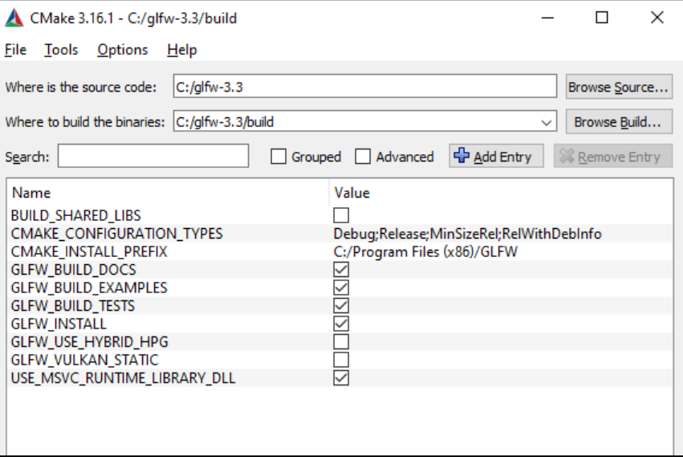
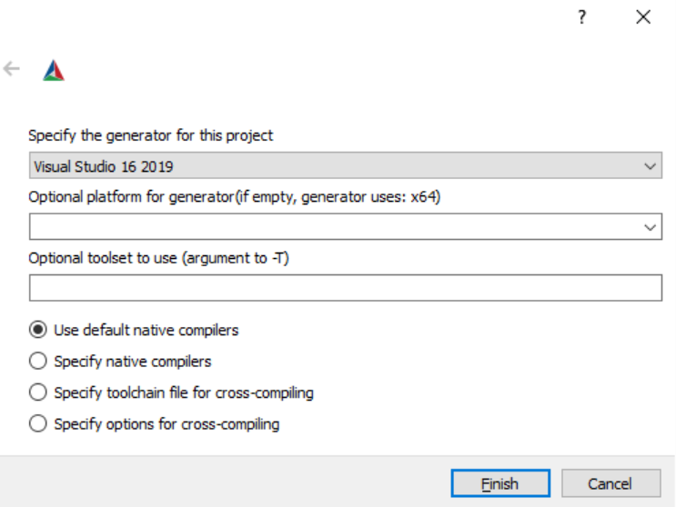
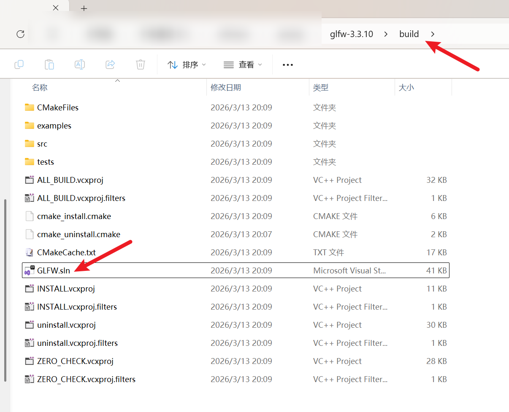
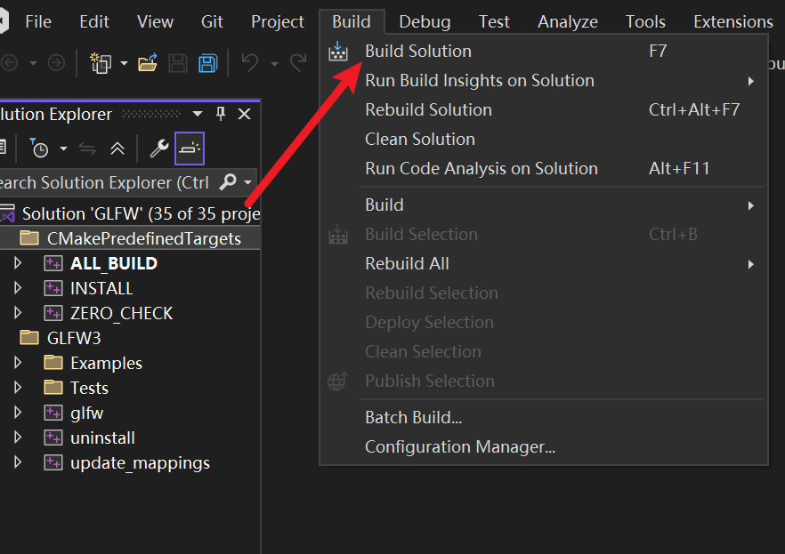
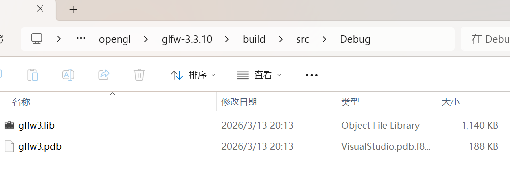
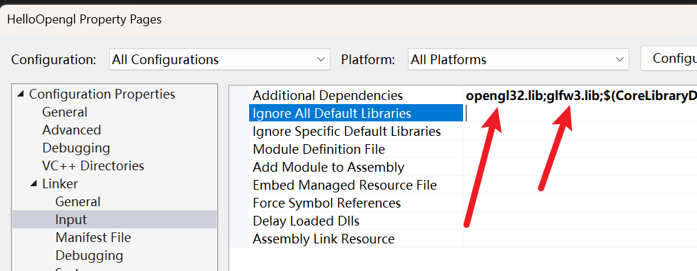
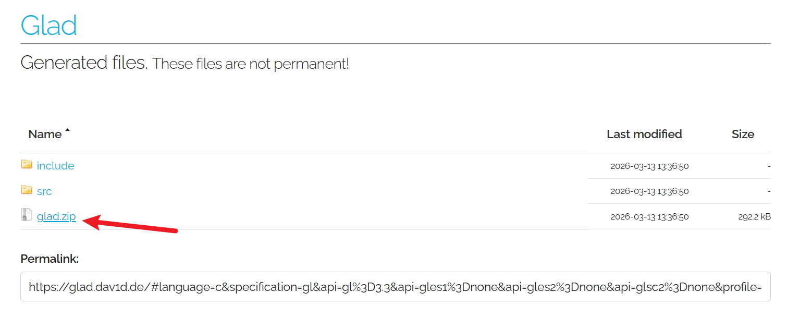
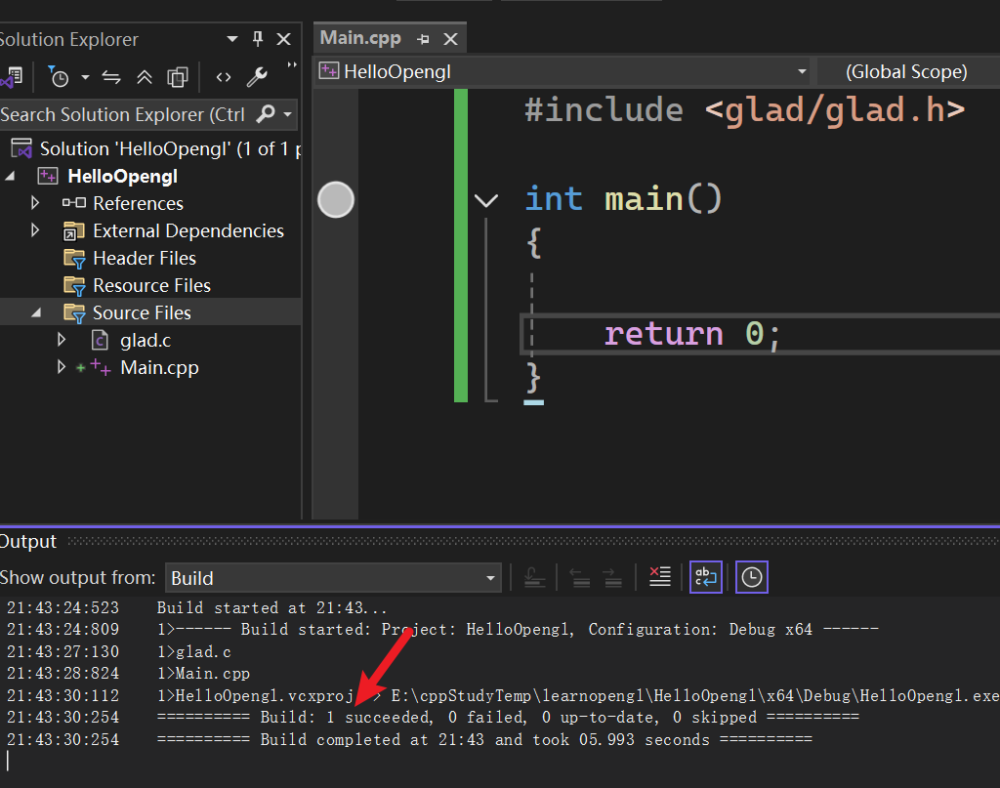

在开始创建精美图形之前，我们需要做的第一件事是==创建一个 OpenGL 上下文==和一个==用于绘制的应用程序窗口==。然而，这些操作因操作系统而异，OpenGL 也刻意将这些操作抽象化。这意味着我们==需要自行创建窗口、定义上下文并处理用户输入==。

幸运的是，有很多库可以提供我们所需的功能，其中一些是专门针对 OpenGL 的。==这些库省去了我们所有与操作系统相关的繁琐工作==，并为我们==提供了一个窗口==和一个 ==OpenGL 上下文==来进行渲染。一些比较流行的库包括 ==GLUT、SDL、SFML 和 GLFW==。在 LearnOpenGL 课程中，我们将使用 ==GLFW== 。当然，您也可以使用其他任何库，大多数库的设置都与 GLFW 的设置类似。

# GLFW

GLFW 是一个用 C 语言编写的库，专门针对 OpenGL。==GLFW 提供了在屏幕上渲染内容所需的基本功能。它允许我们创建 OpenGL 上下文、定义窗口参数并处理用户输入==，这些功能足以满足我们的需求。

本章及下一章的重点是==启动并运行 GLFW，确保它能正确创建 OpenGL 上下文，并显示一个简单的窗口==供我们进行实验。本章将采用循序渐进的方式，讲解==如何获取、构建和链接 GLFW 库==。截至本文撰写之时，我们将使用 Microsoft Visual Studio 2019 IDE（请注意，在更新的 Visual Studio 版本中，此过程相同）。如果您未使用 Visual Studio（或更早的版本），也无需担心，在大多数其他 IDE 中，此过程也类似。

# 建造 GLFW

您可以从 GLFW 的网页 [下载](http://www.glfw.org/download.html)页面获取它。GLFW 已经提供了适用于 Visual Studio 2012 到 2019 的预编译二进制文件和头文件，但为了完整起见，==我们将从源代码自行编译 GLFW==。这样做是为了让您体验自行编译开源库的过程，因为并非所有库都有预编译的二进制文件。那么，让我们下载_源代码包_吧。

我们将把所有库都构建成 64 位二进制文件，因此如果您使用的是预编译的二进制文件，请确保获取 64 位二进制文件。

下载完源代码包后，请解压缩并打开其内容。我们只需要其中的几个项目：

-   编译后生成的库。
-   `include`文件夹。

==从源代码编译库可以确保生成的库完美适配您的 CPU/操作系统==，这是预编译二进制文件并不总是能提供的（有时，您的系统甚至没有可用的预编译二进制文件）。然而，向开源社区提供源代码的问题在于，==并非所有人都使用相同的 IDE 或构建系统==来开发应用程序，这意味着提供的项目/解决方案文件可能与其他人的配置不兼容。因此，==其他人必须使用提供的 .c/.cpp 和 .h/.hpp 文件来配置自己的项目/解决方案，这非常繁琐。正是出于这些原因，才有了 CMake 这个工具==。

## CMake

CMake 是一款工具，它可以使用预定义的 CMake 脚本，从一组源代码文件生成用户选择的项目/解决方案文件（例如 Visual Studio、Code::Blocks、Eclipse）。这使得我们可以==从 GLFW 的源代码包生成一个 Visual Studio 2019 项目文件，并用它来编译库==。首先，我们需要下载并安装 CMake，可以从其 [下载](http://www.cmake.org/cmake/resources/software.html)页面下载。

安装 CMake 后，您可以选择从命令行或图形用户界面 (GUI) 运行 CMake。为了避免复杂化，我们将使用 GUI。CMake 需要一个源代码文件夹和一个用于存放二进制文件的目标文件夹。源代码文件夹我们将选择下载的 GLFW 源代码包的根文件夹，而构建文件夹我们将创建一个名为 _build 的_ 新目录，然后选择该目录。  ~~我用的是cmake3.31.11和visul studio 2022，以及glfw3.3.10 https://github.com/glfw/glfw/releases/download/3.3.10/glfw-3.3.10.zip  ~~ 



点击configure会让你选择  



设置好源文件夹和目标文件夹后，点击 `Configure` 按钮，以便 CMake 读取所需的设置和源代码。接下来，我们需要选择项目的生成器。由于我们使用的是 Visual Studio 2019，因此选择 `Visual Studio 16` 选项（Visual Studio 2019 也称为 Visual Studio 16） ~~这里我用的visual studio 2022~~ 。CMake 将显示可用于配置生成的库的构建选项。我们可以保留默认值，然后再次点击 `Configure` 保存设置。设置完成后，点击 `Generate` ，生成的项目文件将保存在您的 `build` 文件夹中。  ~~一开始会爆红，后面再点击一次Configure和Generate就行~~ 

build之后的文件夹  




## 汇编

现在可以在 `build` 文件夹中找到名为 `GLFW.sln` 的文件，我们使用 Visual Studio 2019 打开它。由于 CMake 生成的项目文件已经包含了正确的配置设置，我们只需要构建解决方案即可。CMake 应该已经自动配置解决方案，使其编译为 64 位库；现在点击“构建解决方案”。这将生成一个名为 `glfw3.lib` 的已编译库文件，该文件位于 `build/src/Debug` 下。  

  

```cpp
20:14:04:407	35>------ Skipped Build: Project: INSTALL, Configuration: Debug x64 ------
20:14:04:407	35>Project not selected to build for this solution configuration 
20:14:04:456	========== Build: 32 succeeded, 0 failed, 0 up-to-date, 3 skipped ==========
20:14:04:456	========== Build completed at 20:14 and took 41.900 seconds ==========

```

  


生成库文件后，我们需要确保 IDE 知道在哪里可以找到该库文件以及 OpenGL 程序所需的头文件。通常有两种方法可以实现这一点：

1.  我们找到 IDE/编译器的 `/lib` 和 `/include` 文件夹，并将 GLFW 的 `include` 文件夹的内容添加到 IDE 的 `/include` 文件夹中，同样地，将 `glfw3.lib` 添加到 IDE 的 `/lib` 文件夹中。这种方法虽然可行，但并非推荐做法。因为这样很难管理库文件和包含文件，而且每次重新安装 IDE/编译器后，都需要重新执行一遍这个过程。
2.  另一种方法（也是推荐的方法）是在您选择的位置创建一组新的目录，其中包含所有第三方库的头文件/库文件，以便您可以从 IDE/编译器中引用它们。例如，您可以创建一个包含 `Libs` 和 `Include` 文件夹的单个文件夹 ~~我创建的文件夹名为openglFiles~~ ，分别用于存储 OpenGL 项目的所有库文件和头文件。现在，所有第三方库都集中在一个位置（可以在多台计算机上共享）。但是，这样做的缺点是，每次创建新项目时，我们都必须告诉 IDE 这些目录的位置。 
   
```shell
openglFiles
    ├─Includes
    │  └─GLFW   #这个文件夹从glfw-3.3.10\include拷贝而来
    │          glfw3.h
    │          glfw3native.h
    │
    └─Libs
            glfw3.lib
```

一旦所需文件存储在您选择的位置，我们就可以开始创建我们的第一个 OpenGL GLFW 项目了。

# 我们的第一个项目

首先，我们打开 Visual Studio 并创建一个新项目。如果有多个选项，请选择 C++，然后选择 `Empty Project` （别忘了给项目起个合适的名字 ~~我用的HelloOpengl~~ ）。由于我们将使用 64 位系统，而项目默认是 32 位，因此我们需要将顶部“调试”旁边的下拉菜单从 x86 更改为 x64：


完成这些步骤后，我们就拥有了一个可以创建我们第一个 OpenGL 应用程序的工作空间！

# 链接

为了让项目能够使用 GLFW，我们需要将该库链接到我们的项目中。这可以通过在链接器设置中指定使用 `glfw3.lib` 来实现，但由于我们将第三方库存储在不同的目录中，因此我们的项目目前还不知道 `glfw3.lib` 位置。所以我们需要先将该目录添加到项目中。

我们可以告诉 IDE 在查找库文件和包含文件时考虑这个目录。在解决方案资源管理器中右键单击项目名称，然后转到 `VC++ Directories` 如下图所示：


之后，您可以添加自己的目录，让项目知道在哪里搜索。您可以手动将目录插入文本，或者单击相应的路径字符串并选择 `<Edit..>` 对 `Library Directories` 和 `Include Directories` 都执行此操作：


您可以在此处添加任意数量的额外目录，之后 IDE 在搜索库文件和头文件时也会搜索这些目录。一旦您包含了 GLFW 的 `Include` 文件夹，就可以通过包含 `<GLFW/..>` 来找到 GLFW 的所有头文件。库目录也同样适用。

由于 VS 现在可以找到所有必需的文件，我们终于可以通过转到 `Linker` 选项卡并 `Input` ，将 GLFW 链接到项目中：


要链接到库，您需要向链接器指定库的名称。由于库名称是 `glfw3.lib` ，我们将其添加到 `Additional Dependencies` 项”字段中（可以手动添加，也可以使用 `<Edit..>` 选项），之后编译时就会链接 GLFW。除了 GLFW 之外，我们还应该添加 OpenGL 库的链接条目，但这可能因操作系统而异：

## Windows 上的 OpenGL 库

如果您使用的是 Windows 系统，OpenGL 库 `opengl32.lib` 包含在 Microsoft SDK 中，该 SDK 会在安装 Visual Studio 时默认安装。由于本章使用 VS 编译器且运行在 Windows 系统上，我们需要将 `opengl32.lib` 添加到链接器设置中。请注意，OpenGL 库的 64 位版本名称与 32 位版本相同，都叫做 `opengl32.lib` ，这个名称略显不妥。

  

## Linux 上的 OpenGL 库

在 Linux 系统上，您需要在链接器设置中添加 `-lGL` 来链接到 `libGL.so` 库。如果您找不到该库，则可能需要安装 Mesa、NVIDIA 或 AMD 的开发包。

然后，将 GLFW 和 OpenGL 库都添加到链接器设置后，就可以按如下方式包含 GLFW 的头文件：

```cpp
#include <GLFW/glfw3.h>
```

对于使用 GCC 编译的 Linux 用户，以下命令行选项可能有助于编译项目： `-lglfw3 -lGL -lX11 -lpthread -lXrandr -lXi -ldl` 。如果相应的库链接不正确，将会产生许多_未定义引用_错误。

GLFW 的设置和配置到此完成。

# GLAD

我们还没完全完成，因为还有一件事需要做。由于 OpenGL 实际上只是一个标准/规范，因此驱动程序制造商需要负责将该规范实现到特定显卡支持的驱动程序中。由于 OpenGL 驱动程序有很多不同的版本，其大多数函数的位置在编译时是未知的，需要在运行时查询。因此，==开发人员的任务是检索所需函数的位置，并将其存储在函数指针中以供后续使用==。检索这些位置的方式与 [操作系统有关](https://www.khronos.org/opengl/wiki/Load_OpenGL_Functions) 。在 Windows 系统中，它看起来像这样：

```cpp
// define the function's prototype
typedef void (*GL_GENBUFFERS) (GLsizei, GLuint*);
// find the function and assign it to a function pointer
GL_GENBUFFERS glGenBuffers  = (GL_GENBUFFERS)wglGetProcAddress("glGenBuffers");
// function can now be called as normal
unsigned int buffer;
glGenBuffers(1, &buffer);
```

正如你所见，这段代码看起来很复杂，而且对于每个你可能需要但尚未声明的函数，都需要这样做，过程十分繁琐。幸运的是，现在有一些库可以解决这个问题，其中 ==GLAD== 就是一个流行且与时俱进的库。

## 设置 GLAD

GLAD 是一个 [开源](https://github.com/Dav1dde/glad)库，它负责处理我们之前提到的那些繁琐的工作。GLAD 的配置方式与大多数常见的开源库略有不同。GLAD 使用一个 [Web 服务](http://glad.dav1d.de/) ，我们可以告诉 GLAD 我们要为哪个版本的 OpenGL 定义和加载所有相关的 OpenGL 函数。

访问 GLAD [Web 服务](http://glad.dav1d.de/) ，确保语言设置为 C++，并在 API 部分选择至少 3.3 版本的 OpenGL（我们将使用此版本；更高版本也可以）。同时确保配置文件设置为 _Core_ ，并且勾选 _“生成加载器”_ 选项。暂时忽略文件扩展名，然后单击 _“生成”_ 按钮生成库文件。

请务必使用上方链接中的 GLAD1 版本： [https://glad.dav1d.de/](https://glad.dav1d.de/) 。这里还有一个 GLAD2 版本，但它无法编译。  

  


GLAD 现在应该已经提供了一个包含两个 include 文件夹和一个 `glad.c` 文件的 zip 文件。将这两个 include 文件夹（ `glad` 和 `KHR` ）复制到你的 include 目录中（或者添加一个指向这些文件夹的额外项），并将 `glad.c` 文件添加到你的项目中。

完成上述步骤后，您应该能够在文件上方添加以下包含指令：

```cpp
#include <glad/glad.h>
```

  

点击编译按钮后应该不会出现任何错误，此时我们就可以进入 [下一章](https://learnopengl.com/Getting-started/Hello-Window) ，讨论如何使用 GLFW 和 GLAD 配置 OpenGL 上下文并生成窗口。请务必检查所有包含目录和库目录是否正确，并确保链接器设置中的库名称与对应的库文件匹配。  

# 更多资源

-   [GLFW：窗口指南](http://www.glfw.org/docs/latest/window_guide.html) ：GLFW 官方窗口设置和配置指南。
-   [构建应用程序](http://www.opengl-tutorial.org/miscellaneous/building-your-own-c-application/) ：提供有关应用程序编译/链接过程的有用信息，以及可能出现的大量错误（以及解决方案）。
-   [使用 Code::Blocks 构建 GLFW](http://wiki.codeblocks.org/index.php?title=Using_GLFW_with_Code::Blocks) ：在 Code::Blocks IDE 中构建 GLFW。
-   [运行 CMake](http://www.cmake.org/runningcmake/) ：简要概述如何在 Windows 和 Linux 上运行 CMake。
-   [在 Linux 下编写构建系统](https://learnopengl.com/demo/autotools_tutorial.txt) ：Wouter Verholst 编写的 autotools 教程，介绍如何在 Linux 下编写构建系统。
-   [Polytonic/Glitter](https://github.com/Polytonic/Glitter) ：一个简单的样板项目，预配置了所有相关的库；如果您想要一个示例项目，又不想自己编译所有库，那么它非常适合。
-   [Linux (Debian) 中 OpenGL 的入门指南](https://medium.com/geekculture/a-beginners-guide-to-setup-opengl-in-linux-debian-2bfe02ccd1e) ：在 Ubuntu 中设置 OpenGL 的分步指南，以及所需库的安装：GLFW 和 GLAD。