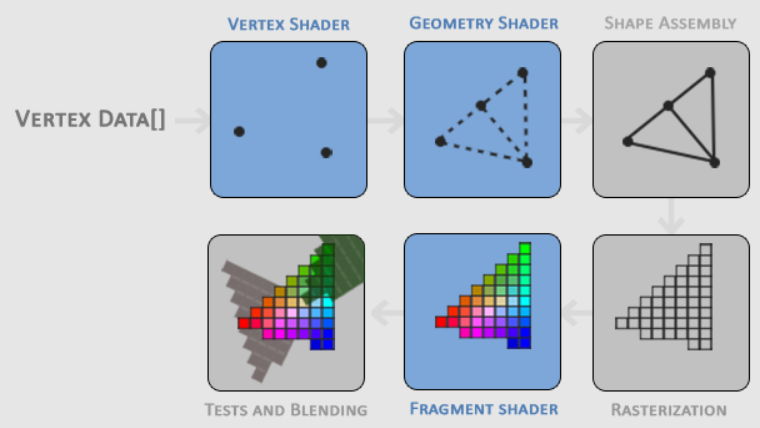

# 你好，三角

在 OpenGL 中，所有物体都处于三维空间，但屏幕或窗口是一个二维像素数组，因此 ==OpenGL 的大部分工作是将所有三维坐标转换为适合屏幕的二维像素==。将三维坐标转换为二维像素的过程由 OpenGL 的*图形管线 ~~graphics pipeline~~ *管理。图形管线可以分为两大部分：==第一部分将三维坐标转换为二维坐标，第二部分将二维坐标转换为实际的彩色像素  ~~第二部分第一步：把由坐标定义的几何形状，切割成数以万计的待处理像素（片段）。第二步才是填充像素~~ ==。本章将简要讨论图形管线以及如何利用它来创建精美的像素。

图形管线==以一组三维坐标作为输入，并将其转换为屏幕上的彩色二维像素==。图形管线可以分为多个步骤，每个步骤都需要前一步的输出作为输入 ~~串行，阶段性依赖~~ 。所有这些步骤都高度专业化（每个步骤都具有特定的功能），并且可以轻松地==并行==执行 ~~同一个步骤并行~~ 。由于其并行特性，==如今的显卡拥有数千个小型处理核心==，以便在图形管线中快速处理数据。==这些处理核心在 GPU 上运行小型程序，用于执行管线的每个步骤==。这些小型程序被称为==着色器==。  

>  ~~并行还有另一个意思：当第一批顶点处理完进入“光栅化”车间时，顶点车间并不需要闲着。它可以立刻开始处理下一批模型或者下一帧的顶点~~ 

==开发者可以配置部分着色器，从而编写自定义着色器来替换现有的默认着色器==。这使我们能够对==渲染管线的特定部分进行更精细的控制==，并且由于它们==运行在 GPU 上，因此还可以节省宝贵的 CPU 时间==。着色器使用 ==OpenGL 着色语言 (GLSL) ~~OpenGL Shading Language ~~== 编写，我们将在下一章中深入探讨。

下方是图形管线所有阶段的抽象表示。请注意，==蓝色部分表示我们可以注入自定义着色器==的部分。



如您所见，图形管线包含大量模块 ~~应该说的是这六个~~ ，每个模块负责==将顶点数据转换为完整渲染像素的特定 ~~某个步骤~~ 步骤==。我们将==以简化的方式简要解释管线的每个部分==，以便您对管线的工作原理有一个大致的了解。

作为图形管线的输入，我们传入一个名为 `Vertex Data` 的数组，其中包含三个 3D 坐标，它们应该构成一个三角形；这个顶点数据是一个顶点集合。每个顶点都是一个包含 3D 坐标数据的集合。==顶点数据使用顶点属性==来表示，这些属性可以包含我们想要的任何数据，但==为了简单起见，我们假设每个顶点仅包含一个 3D 位置和一个颜色值==。

为了让 OpenGL 知道==如何处理你的坐标和颜色值集合==，它需要你指定要用这些数据创建==哪种渲染类型==。你是想把数据渲染成点集、三角形集，还是一条长线？这些提示信息被称为==*图元*，在调用任何绘图命令时都会传递给 OpenGL==。一些常见的图元包括 GL\_POINTS  ~~散点~~  、 GL\_TRIANGLES  ~~3个点一组，效果：生成实心的面。~~  和 GL\_LINE\_STRIP  ~~顺序全连~~  

> 
> 散点：孤立的像素点。当你告诉显卡画一个点时，它默认会把这个坐标映射到屏幕上的一个像素。
> 三角形：显卡问：你的中心点是在这三个点组成的三角形内部吗？
> 		如果回答“是”：这个像素就被赋予三角形的颜色。
> 		如果回答“否”：这个像素就不动（保持背景色）
> 顺序全连：线段在光栅化阶段会被处理成覆盖了一系列像素的狭长区域。光栅化逻辑：显卡会计算哪一排像素最接近这条数学上的直线。
> 

渲染管线的第一部分是顶点着色器，它以单个顶点作为输入。顶点着色器的主要目的是==将三维坐标转换为不同的三维坐标（稍后会详细介绍）==，并且顶点着色器允许我们==对顶点属性进行一些基本处理==。

顶点着色器阶段的输出可以选择性地传递给几何着色器。几何着色器以构成图元的顶点集合作为输入，并能够通过发射新的顶点来生成其他形状，从而形成新的（或其他）图元。在本例中，它根据给定的形状生成了第二个三角形。

图元组装阶段以顶点（或几何）着色器中构成一个或多个图元的所有顶点（如果选择 GL\_POINTS ，则为顶点）作为输入，并将给定图元形状中的所有点组装起来；在本例中为两个三角形。

图元组装阶段的输出随后传递到光栅化阶段，光栅化阶段将生成的图元映射到最终屏幕上的相应像素，从而生成供片段着色器使用的片段。在片段着色器运行之前，会执行裁剪操作。裁剪会丢弃所有位于视图之外的片段，从而提高性能。

在 OpenGL 中，片段是指 OpenGL 渲染单个像素所需的所有数据。

片段着色器的主要目的是计算像素的最终颜色，通常所有高级的 OpenGL 特效都在这个阶段实现。片段着色器通常包含有关 3D 场景的数据，这些数据可用于计算像素的最终颜色（例如光照、阴影、光照颜色等）。

确定所有对应的颜色值后，最终对象将进入另一个阶段，我们称之为 Alpha 测试和混合阶段。此阶段会检查片段对应的深度（和模板）值（我们稍后会详细介绍），并使用这些值来判断生成的片段是位于其他对象的前面还是后面，从而决定是否将其丢弃。该阶段还会检查 Alpha 值（Alpha 值定义了对象的透明度），并据此对对象进行混合。因此，即使在片段着色器中计算出了像素输出颜色，渲染多个三角形时，最终的像素颜色仍然可能完全不同。

正如你所见，图形管线是一个相当复杂的整体，包含许多可配置的部分。然而，在几乎所有情况下，我们只需要用到顶点着色器和片段着色器。几何着色器是可选的，通常使用其默认着色器。此外，还有细分阶段和变换反馈循环，我们这里没有展示，但这些内容稍后会讲到。

在现代 OpenGL 中，我们 **需要**定义至少一个顶点着色器和一个片段着色器（GPU 上没有默认的顶点/片段着色器）。因此，学习现代 OpenGL 通常比较困难，因为在能够渲染第一个三角形之前，需要掌握大量的基础知识。不过，当你最终在本章末尾成功渲染出三角形时，你将会对图形编程有更深入的了解。

# 顶点输入

要开始绘制图形，我们首先需要向 OpenGL 提供一些顶点输入数据。OpenGL 是一个 3D 图形库，因此我们在 OpenGL 中指定的所有坐标都是 3D 坐标（ `x` 、 `y` 和 `z` 坐标）。OpenGL 并不会简单地将**所有** 3D 坐标转换为屏幕上的 2D 像素；它只处理在三个轴（ `x` 、 `y` 和 `z` ）上都位于 `-1.0` 到 `1.0` 特定范围内的 3D 坐标。所有位于这个所谓的归一化设备坐标范围内的坐标最终都会显示在屏幕上（而超出此范围的坐标则不会显示）。

因为我们想要渲染一个三角形，所以我们需要指定总共三个顶点，每个顶点都有一个 3D 位置。我们用归一化设备坐标（OpenGL 的可见区域）将它们定义在一个 `float` 组中：

```bash
float vertices[] = {
    -0.5f, -0.5f, 0.0f,
     0.5f, -0.5f, 0.0f,
     0.0f,  0.5f, 0.0f
};
```

由于 OpenGL 在 3D 空间中工作，我们渲染一个 2D 三角形，每个顶点的 `z` 坐标均为 `0.0` 。这样，三角形的_深度_保持不变，使其看起来像是 2D 的。

**归一化器件坐标 (NDC)**

顶点着色器处理完顶点坐标后，它们应该位于归一化设备坐标系中。归一化设备坐标系是一个很小的空间，其中 `x` 、 `y` 和 `z` 值都在 `-1.0` 到 `1.0` 之间变化。任何超出此范围的坐标都将被丢弃/裁剪，并且不会在屏幕上显示。下图显示了我们在归一化设备坐标系中指定的三角形（忽略 `z` 轴）：


与通常的屏幕坐标不同，这里的正 y 轴指向上方， `(0,0)` 坐标位于图表的中心，而不是左上角。最终，所有（变换后的）坐标都应落入这个坐标空间，否则它们将不可见。

然后，您的 NDC 坐标将通过视口变换，使用您通过 glViewport 提供的数据转换为屏幕空间坐标。生成的屏幕空间坐标随后将转换为片段，作为片段着色器的输入。

定义好顶点数据后，我们需要将其作为输入传递给图形管线的第一个进程：顶点着色器。这需要先在 GPU 上创建一块内存来存储顶点数据，然后配置 OpenGL 如何解析这块内存，并指定如何将数据发送到显卡。之后，顶点着色器会根据我们指示，从其内存中处理相应数量的顶点。

我们通过所谓的顶点缓冲区对象 (VBO) 来管理这部分内存，它可以将大量顶点存储在 GPU 的内存中。使用这些缓冲区对象的优势在于，我们可以一次性向显卡发送大量数据，并在内存充足的情况下将其保存在显卡内存中，而无需逐个顶点地发送数据。从 CPU 向显卡发送数据的速度相对较慢，因此我们会尽可能一次性发送尽可能多的数据。一旦数据进入显卡内存，顶点着色器几乎可以立即访问这些顶点，从而实现极快的渲染速度。

正如我们在 [OpenGL](https://learnopengl.com/Getting-Started/OpenGL) 章节中所讨论的，顶点缓冲区对象是我们遇到的第一个 OpenGL 对象。与 OpenGL 中的任何对象一样，此缓冲区具有与其对应的唯一 ID，因此我们可以使用 glGenBuffers 函数生成具有缓冲区 ID 的缓冲区：

```cpp
unsigned int VBO;
glGenBuffers(1, &VBO);
```

OpenGL 有多种缓冲区对象类型，顶点缓冲区对象的缓冲区类型为 GL\_ARRAY\_BUFFER。OpenGL 允许我们同时绑定多个缓冲区，只要它们的缓冲区类型不同即可。我们可以使用 glBindBuffer 函数将新创建的缓冲区绑定到 GL\_ARRAY\_BUFFER 目标：

```scss
glBindBuffer(GL_ARRAY_BUFFER, VBO);
```

从那时起，我们（对 GL\_ARRAY\_BUFFER 目标）进行的任何缓冲区调用都将用于配置当前绑定的缓冲区，即 VBO 。然后我们可以调用 glBufferData 函数会将先前定义的顶点数据复制到缓冲区内存中：

```scss
glBufferData(GL_ARRAY_BUFFER, sizeof(vertices), vertices, GL_STATIC_DRAW);
```

glBufferData 函数专门用于将用户定义的数据复制到当前绑定的缓冲区中。它的第一个参数是要将数据复制到的缓冲区类型：当前绑定到 GL\_ARRAY\_BUFFER 目标的顶点缓冲区对象。第二个参数指定要传递给缓冲区的数据大小（以字节为单位）；顶点数据的 `sizeof` 即可。第三个参数是要发送的实际数据。

第四个参数指定显卡如何处理给定的数据。它可以采用以下三种形式：

-   GL\_STREAM\_DRAW ：数据仅设置一次，GPU 最多使用几次。
-   GL\_STATIC\_DRAW ：数据仅设置一次，但可多次使用。
-   GL\_DYNAMIC\_DRAW ：数据变化频繁，使用次数很多。

三角形的位置数据不会改变，使用频率很高，并且在每次渲染调用中都保持不变，因此其使用类型最好设置为 GL\_STATIC\_DRAW 。例如，如果缓冲区中的数据可能会频繁变化，则使用 GL\_DYNAMIC\_DRAW 可以确保显卡将数据放置在能够实现更快写入的内存中。

目前，我们将顶点数据存储在显卡内存中，由名为 VBO 的顶点缓冲区对象进行管理。接下来，我们需要创建一个顶点着色器和一个片段着色器来实际处理这些数据，所以让我们开始构建它们吧。

# 顶点着色器

顶点着色器是少数几种可以由我们这样的程序员编程的着色器之一。现代 OpenGL 要求我们至少设置一个顶点着色器和一个片段着色器才能进行渲染，因此我们将简要介绍着色器，并配置两个非常简单的着色器来绘制我们的第一个三角形。下一章我们将更详细地讨论着色器。

首先，我们需要用 GLSL（OpenGL 着色语言）编写顶点着色器，然后编译该着色器，以便在应用程序中使用它。下面是一个非常基础的 GLSL 顶点着色器的源代码：

```csharp
#version 330 core
layout (location = 0) in vec3 aPos;

void main()
{
    gl_Position = vec4(aPos.x, aPos.y, aPos.z, 1.0);
}
```

如您所见，GLSL 的风格与 C 语言类似。每个着色器都以版本声明开头。从 OpenGL 3.3 及更高版本开始，GLSL 的版本号与 OpenGL 的版本号一致（例如，GLSL 版本 420 对应 OpenGL 版本 4.2）。我们还会明确指出正在使用核心配置文件功能。

接下来，我们使用 `in` 关键字在顶点着色器中声明所有输入顶点属性。目前我们只关心位置数据，所以只需要一个顶点属性。GLSL 有一个向量数据类型，它包含 1 到 4 个浮点数，具体数值取决于其后缀数字。由于每个顶点都有一个 3D 坐标，我们创建一个名为 \`aPos\` 的 `vec3` 输入变量。我们还通过 layout (location = 0) 专门设置了输入变量的位置，稍后您就会明白为什么需要这个位置信息。

**向量**  
在图形编程中，我们经常使用向量这个数学概念，因为它能简洁地表示任意空间中的位置/方向，并且具有许多有用的数学性质。在 GLSL 中，向量的最大长度为 4，其每个值分别可以通过 `vec.x` 、 `vec.y` 、 `vec.z` 和 `vec.w` 获取，其中每个值代表空间中的一个坐标。需要注意的是， `vec.w` 分量并非用作空间位置（我们处理的是 3D 空间，而非 4D 空间），而是用于透视除法。我们将在后续章节中更深入地讨论向量。

要设置顶点着色器的输出，我们需要将位置数据赋值给预定义的 gl\_Position 变量，该变量在底层是一个 `vec4` 。在主函数结束时， gl\_Position 的值将作为顶点着色器的输出。由于我们的输入是一个大小为 3 的向量，我们需要将其转换为大小为 4 的向量。我们可以通过将 `vec3` 值插入到 `vec4` 的构造函数中，并将其 `w` 分量设置为 `1.0f` 来实现这一点（我们将在后面的章节中解释原因）。

当前的顶点着色器可能是我们能想象到的最简单的顶点着色器，因为我们没有对输入数据进行任何处理，只是将其直接发送到着色器的输出。在实际应用中，输入数据通常并非已经采用归一化设备坐标，因此我们首先需要将输入数据转换为位于 OpenGL 可见区域内的坐标。

# 编译着色器

目前，我们将顶点着色器的源代码存储在代码文件顶部的常量 C 字符串中：

```swift
const char *vertexShaderSource = "#version 330 core\n"
    "layout (location = 0) in vec3 aPos;\n"
    "void main()\n"
    "{\n"
    "   gl_Position = vec4(aPos.x, aPos.y, aPos.z, 1.0);\n"
    "}\0";
```

为了让 OpenGL 使用着色器，它必须在运行时根据源代码动态编译它。首先，我们需要创建一个着色器对象，同样通过 ID 引用。因此，我们将顶点着色器存储为 `unsigned int` ，并使用 glCreateShader 创建着色器：

```cpp
unsigned int vertexShader;
vertexShader = glCreateShader(GL_VERTEX_SHADER);
```

我们将要创建的着色器类型作为参数传递给 glCreateShader。由于我们要创建的是顶点着色器，所以我们传入 GL\_VERTEX\_SHADER 。

接下来，我们将着色器源代码附加到着色器对象并编译着色器：

```scss
glShaderSource(vertexShader, 1, &vertexShaderSource, NULL);
glCompileShader(vertexShader);
```

glShaderSource 函数的第一个参数是要编译成的着色器对象。第二个参数指定要作为源代码传递的字符串数量，这里只能传递一个字符串。第三个参数是顶点着色器的实际源代码，第四个参数可以 `NULL` 。

调用 glCompileShader 后，您可能需要检查编译是否成功，如果失败，则需要检查发现了哪些错误，以便进行修复。检查编译时错误的方法如下：

```scss
int  success;
char infoLog[512];
glGetShaderiv(vertexShader, GL_COMPILE_STATUS, &success);
```

首先，我们定义一个整数来表示编译成功，并定义一个存储容器来存放错误信息（如果有）。然后，我们使用 glGetShaderiv 检查编译是否成功。如果编译失败，我们应该使用 glGetShaderInfoLog 获取错误信息并打印出来。

```scss
if(!success)
{
    glGetShaderInfoLog(vertexShader, 512, NULL, infoLog);
    std::cout << "ERROR::SHADER::VERTEX::COMPILATION_FAILED\n" << infoLog << std::endl;
}
```

如果在编译顶点着色器时未检测到任何错误，则顶点着色器现已编译完成。

# 片段着色器

片段着色器是我们为渲染三角形而创建的第二个也是最后一个着色器。片段着色器的主要功能是计算像素的颜色输出。为了简单起见，片段着色器始终输出橙色。

在计算机图形学中，颜色由四个值组成的数组表示：红色、绿色、蓝色和透明度（Alpha 通道），通常缩写为 RGBA。在 OpenGL 或 GLSL 中定义颜色时，我们将每个分量的强度设置为 `0.0` 到 `1.0` 之间的值。例如，如果我们把红色和绿色都设置为 `1.0` ，就会得到这两种颜色的混合，即黄色。有了这三个颜色分量 `1.0` 我们就可以生成超过 1600 万种不同的颜色！

```csharp
#version 330 core
out vec4 FragColor;

void main()
{
    FragColor = vec4(1.0f, 0.5f, 0.2f, 1.0f);
}
```

片段着色器只需要一个输出变量，即一个大小为 4 的向量，用于定义最终的颜色输出，我们需要自行计算该颜色。我们可以使用 `out` 关键字声明输出值，这里我们将其命名为 \`FragColor\` 。接下来，我们只需将一个 `vec4` 值赋给颜色输出，颜色为橙色，透明度为 `1.0` （ `1.0` 表示完全不透明）。

编译片段着色器的过程与编译顶点着色器的过程类似，不过这次我们使用 GL\_FRAGMENT\_SHADER 常量作为着色器类型：

```cpp
unsigned int fragmentShader;
fragmentShader = glCreateShader(GL_FRAGMENT_SHADER);
glShaderSource(fragmentShader, 1, &fragmentShaderSource, NULL);
glCompileShader(fragmentShader);
```

两个着色器都已编译完成，剩下的工作就是将这两个着色器对象链接到一个可用于渲染的着色器程序中。请务必检查此处是否存在编译错误！

## 着色器程序

着色器程序对象是多个着色器组合而成的最终链接版本。要使用最近编译的着色器，我们必须将它们链接到着色器程序对象，然后在渲染对象时激活该着色器程序。激活的着色器程序的着色器将在我们发出渲染调用时使用。

将着色器链接成程序时，它会将每个着色器的输出链接到下一个着色器的输入。如果输出和输入不匹配，也会出现链接错误。

创建程序对象很简单：

```cpp
unsigned int shaderProgram;
shaderProgram = glCreateProgram();
```

glCreateProgram 函数创建一个程序并返回新创建的程序对象的 ID 引用。现在我们需要将之前编译好的着色器附加到该程序对象，然后使用 glLinkProgram 将它们链接起来：

```scss
glAttachShader(shaderProgram, vertexShader);
glAttachShader(shaderProgram, fragmentShader);
glLinkProgram(shaderProgram);
```

这段代码应该很容易理解，我们将着色器附加到程序上，并通过 glLinkProgram 将它们链接起来。

与着色器编译类似，我们也可以检查着色器程序链接是否失败并检索相应的日志。但是，现在我们不再使用 glGetShaderiv 和 glGetShaderInfoLog，而是使用：

```scss
glGetProgramiv(shaderProgram, GL_LINK_STATUS, &success);
if(!success) {
    glGetProgramInfoLog(shaderProgram, 512, NULL, infoLog);
    ...
}
```

结果会得到一个程序对象，我们可以通过调用 glUseProgram 并将新创建的程序对象作为参数来激活它：

```scss
glUseProgram(shaderProgram);
```

glUseProgram 之后的每个着色器和渲染调用现在都将使用此程序对象（以及着色器）。

哦对了，别忘了在将着色器对象链接到程序对象后删除它们；我们不再需要它们了：

```scss
glDeleteShader(vertexShader);
glDeleteShader(fragmentShader);
```

现在，我们已经将输入顶点数据发送到 GPU，并指示 GPU 如何在顶点着色器和片段着色器中处理这些数据。我们离目标很近了，但还没完全完成。OpenGL 目前还不知道如何解释内存中的顶点数据，以及如何将顶点数据与顶点着色器的属性关联起来。我们会告诉 OpenGL 该怎么做。

# 链接顶点属性

顶点着色器允许我们以顶点属性的形式指定任何所需的输入。虽然这提供了极大的灵活性，但也意味着我们必须手动指定输入数据的哪一部分对应顶点着色器的哪个顶点属性。也就是说，在渲染之前，我们必须指定 OpenGL 应该如何解释顶点数据。

我们的顶点缓冲区数据格式如下：


-   位置数据以 32 位（4 字节）浮点值存储。
-   每个位置由这 3 个值组成。
-   每组三个值之间没有空格（或其他值）。这些值在数组中紧密排列。
-   数据中的第一个值位于缓冲区的开头。

有了这些信息，我们就可以使用 glVertexAttribPointer 告诉 OpenGL 如何解释顶点数据（每个顶点属性）：

```scss
glVertexAttribPointer(0, 3, GL_FLOAT, GL_FALSE, 3 * sizeof(float), (void*)0);
glEnableVertexAttribArray(0);
```

函数 glVertexAttribPointer 有很多参数，让我们仔细逐一了解：

-   第一个参数指定要配置的顶点属性。请记住，我们在顶点着色器中使用 `layout (location = 0)` 指定了位置顶点属性的位置。这会将顶点属性的位置设置为 `0` ，由于我们要向此顶点属性传递数据，因此我们传入 `0` 。
-   下一个参数指定顶点属性的大小。顶点属性是一个 `vec3` 类型，因此它由 `3` 值组成。
-   第三个参数指定数据类型为 GL\_FLOAT （GLSL 中的 `vec*` 由浮点值组成）。
-   下一个参数指定是否要对数据进行归一化。如果我们输入的是整数数据类型（int、byte），并且将其设置为 GL\_TRUE ，则整数数据会被归一化为 `0` （有符号数据为 `-1` ），转换为浮点数时归一化为 `1` 这与我们无关，所以我们将其设置为 GL\_FALSE 。
-   第五个参数称为步长，它表示相邻顶点属性之间的间距。由于下一组位置数据正好位于一个 `float` 大小的 3 倍处，我们将该值指定为步长。请注意，由于我们知道数组是紧密排列的（下一个顶点属性值之间没有间距），我们也可以将步长指定为 `0` ，让 OpenGL 自动确定步长（这仅在值紧密排列时有效）。当顶点属性数量较多时，我们需要仔细定义每个顶点属性之间的间距，稍后我们将看到更多示例。
-   最后一个参数的类型为 `void*` ，因此需要进行这种特殊的类型转换。它是位置数据在缓冲区中的起始偏移量。由于位置数据位于数据数组的开头，因此该值为 `0` 我们稍后会更详细地探讨这个参数。

每个顶点属性的数据都来自一个由 VBO 管理的内存，而它从哪个 VBO 获取数据（可以有多个 VBO）取决于调用 glVertexAttribPointer 时当前绑定到 GL\_ARRAY\_BUFFER 的 VBO。由于在调用 glVertexAttribPointer 之前，先前定义的 VBO 仍然绑定着，因此顶点属性 `0` 现在与其顶点数据关联。

现在我们已经指定了 OpenGL 如何解释顶点数据，接下来需要使用 \`glEnableVertexAttribArray\` 函数启用顶点属性，并将顶点属性的位置作为参数传递给它；顶点属性默认是禁用的。至此，一切就绪：我们使用顶点缓冲区对象初始化了缓冲区中的顶点数据，设置了顶点着色器和片段着色器，并告诉 OpenGL 如何将顶点数据链接到顶点着色器的顶点属性。现在，在 OpenGL 中绘制一个对象看起来会像这样：

```scss
// 0. copy our vertices array in a buffer for OpenGL to use
glBindBuffer(GL_ARRAY_BUFFER, VBO);
glBufferData(GL_ARRAY_BUFFER, sizeof(vertices), vertices, GL_STATIC_DRAW);
// 1. then set the vertex attributes pointers
glVertexAttribPointer(0, 3, GL_FLOAT, GL_FALSE, 3 * sizeof(float), (void*)0);
glEnableVertexAttribArray(0);  
// 2. use our shader program when we want to render an object
glUseProgram(shaderProgram);
// 3. now draw the object 
someOpenGLFunctionThatDrawsOurTriangle();
```

每次绘制对象时，我们都必须重复这个过程。这看起来似乎没什么，但想象一下，如果我们有超过 5 个顶点属性，以及数百个不同的对象（这种情况并不少见），那么绑定相应的缓冲区对象并为每个对象配置所有顶点属性很快就会变成一件繁琐的事情。如果有一种方法可以将所有这些状态配置存储到一个对象中，然后只需绑定该对象即可恢复其状态，那该多好？

## 顶点数组对象

顶点数组对象（也称为 VAO）可以像顶点缓冲区对象一样进行绑定，之后的所有顶点属性调用都会存储在 VAO 中。这样做的好处是，配置顶点属性指针时只需调用一次，之后每次需要绘制对象时，只需绑定相应的 VAO 即可。这样，切换不同的顶点数据和属性配置就像绑定不同的 VAO 一样简单。所有设置的状态都存储在 VAO 中。

OpenGL 核心 **要求**我们使用 VAO（顶点自适应对象）来处理顶点输入。如果未能绑定 VAO，OpenGL 很可能拒绝绘制任何内容。

顶点数组对象存储以下内容：

-   调用 glEnableVertexAttribArray 或 glDisableVertexAttribArray。
-   通过 glVertexAttribPointer 配置顶点属性。
-   通过调用 glVertexAttribPointer 将顶点属性与顶点缓冲区对象关联起来。


生成 VAO 的过程与生成 VBO 的过程类似：

```cpp
unsigned int VAO;
glGenVertexArrays(1, &VAO);
```

要使用 VAO，只需使用 glBindVertexArray 绑定 VAO 即可。之后，我们需要绑定/配置相应的 VBO 和属性指针，然后在需要时解绑 VAO 以备后用。一旦需要绘制对象，只需在绘制对象之前使用所需的设置绑定 VAO 即可。代码大致如下：

```scss
// ..:: Initialization code (done once (unless your object frequently changes)) :: ..
// 1. bind Vertex Array Object
glBindVertexArray(VAO);
// 2. copy our vertices array in a buffer for OpenGL to use
glBindBuffer(GL_ARRAY_BUFFER, VBO);
glBufferData(GL_ARRAY_BUFFER, sizeof(vertices), vertices, GL_STATIC_DRAW);
// 3. then set our vertex attributes pointers
glVertexAttribPointer(0, 3, GL_FLOAT, GL_FALSE, 3 * sizeof(float), (void*)0);
glEnableVertexAttribArray(0);  

  
[...]

// ..:: Drawing code (in render loop) :: ..
// 4. draw the object
glUseProgram(shaderProgram);
glBindVertexArray(VAO);
someOpenGLFunctionThatDrawsOurTriangle();
```

就是这样！过去几百万页代码所做的一切都是为了这一刻：一个存储顶点属性配置和要使用的 VBO 的 VAO。通常，当需要绘制多个对象时，首先要生成/配置所有 VAO（以及所需的 VBO 和属性指针），并将它们存储起来以备后用。当需要绘制某个对象时，我们获取相应的 VAO，绑定它，绘制对象，然后再次解绑 VAO。

## 我们一直期待的三角关系

为了绘制我们选择的对象，OpenGL 为我们提供了 glDrawArrays 函数，该函数使用当前活动的着色器、先前定义的顶点属性配置和 VBO 的顶点数据（通过 VAO 间接绑定）来绘制图元。

```scss
glUseProgram(shaderProgram);
glBindVertexArray(VAO);
glDrawArrays(GL_TRIANGLES, 0, 3);
```

glDrawArrays 函数的第一个参数是我们要绘制的 OpenGL 图元类型。既然我一开始就说了我们要绘制一个三角形，而且我也不想骗你，所以我们传入 GL\_TRIANGLES 。第二个参数指定我们要绘制的顶点数组的起始索引；我们将其设为 `0` 最后一个参数指定我们要绘制的顶点数量，这里是 `3` （我们的数据中只渲染一个三角形，它正好有 3 个顶点）。

现在尝试编译代码，如果出现任何错误，请从头开始排查。应用程序编译成功后，您应该看到以下结果：


完整的程序源代码可以 [在这里](https://learnopengl.com/code_viewer_gh.php?code=src/1.getting_started/2.1.hello_triangle/hello_triangle.cpp)找到。

如果你的输出结果与预期不符，那么很可能是你的操作过程中出现了错误，请检查完整的源代码，看看是否遗漏了什么。

# 元素缓冲区对象

最后，关于顶点渲染，我们还要讨论一点，那就是元素缓冲区对象（简称 EBO）。为了解释元素缓冲区对象的工作原理，最好举个例子：假设我们想绘制一个矩形而不是三角形。我们可以使用两个三角形来绘制矩形（OpenGL 主要处理三角形）。这将生成以下顶点集：

```cpp
float vertices[] = {
    // first triangle
     0.5f,  0.5f, 0.0f,  // top right
     0.5f, -0.5f, 0.0f,  // bottom right
    -0.5f,  0.5f, 0.0f,  // top left 
    // second triangle
     0.5f, -0.5f, 0.0f,  // bottom right
    -0.5f, -0.5f, 0.0f,  // bottom left
    -0.5f,  0.5f, 0.0f   // top left
};
```

正如你所见，指定的顶点存在一些重叠。我们竟然指定了两次 `bottom right` 和 `top left` ！这造成了 50% 的性能开销，因为同样的矩形其实只需要 4 个顶点就能表示，而不是 6 个。一旦模型变得更加复杂，包含上千个三角形，重叠区域会大幅增加，这种情况只会更加严重。更好的解决方案是只存储唯一的顶点，然后指定绘制这些顶点的顺序。这样一来，我们只需要存储矩形的 4 个顶点，然后指定它们的绘制顺序即可。如果 OpenGL 能提供这样的功能，那该有多好啊！

幸运的是，元素缓冲区对象 (EBO) 的工作原理正是如此。EBO 就像顶点缓冲区对象一样，是一个缓冲区，它存储着 OpenGL 用于决定绘制哪些顶点的索引。这种所谓的索引绘制正是解决我们问题的关键。首先，我们需要指定要绘制成矩形的（唯一）顶点及其索引：

```cpp
float vertices[] = {
     0.5f,  0.5f, 0.0f,  // top right
     0.5f, -0.5f, 0.0f,  // bottom right
    -0.5f, -0.5f, 0.0f,  // bottom left
    -0.5f,  0.5f, 0.0f   // top left 
};
unsigned int indices[] = {  // note that we start from 0!
    0, 1, 3,   // first triangle
    1, 2, 3    // second triangle
};
```

可以看到，使用索引时，我们只需要 4 个顶点而不是 6 个。接下来我们需要创建元素缓冲区对象：

```cpp
unsigned int EBO;
glGenBuffers(1, &EBO);
```

与 VBO 类似，我们使用 glBufferData 绑定 EBO 并将索引复制到缓冲区。此外，与 VBO 一样，我们希望将这些调用放在绑定和解绑调用之间，尽管这次我们将缓冲区类型指定为 GL\_ELEMENT\_ARRAY\_BUFFER 。

```scss
glBindBuffer(GL_ELEMENT_ARRAY_BUFFER, EBO);
glBufferData(GL_ELEMENT_ARRAY_BUFFER, sizeof(indices), indices, GL_STATIC_DRAW);
```

请注意，我们现在将缓冲区目标设置为 GL\_ELEMENT\_ARRAY\_BUFFER 。最后一步是将 glDrawArrays 调用替换为 glDrawElements，以表明我们希望从索引缓冲区渲染三角形。使用 glDrawElements 时，我们将使用当前绑定的元素缓冲区对象中提供的索引进行绘制：

```scss
glBindBuffer(GL_ELEMENT_ARRAY_BUFFER, EBO);
glDrawElements(GL_TRIANGLES, 6, GL_UNSIGNED_INT, 0);
```

第一个参数指定绘制模式，类似于 glDrawArrays。第二个参数是要绘制的元素数量。我们指定了 6 个索引，因此总共要绘制 6 个顶点。第三个参数是索引的类型，其值为 GL\_UNSIGNED\_INT 。最后一个参数允许我们指定元素缓冲区对象 (EBO) 中的偏移量（或者传入索引数组，但这适用于不使用元素缓冲区对象的情况），但我们将其设置为 0。

glDrawElements 函数从当前绑定到 GL\_ELEMENT\_ARRAY\_BUFFER 目标的 EBO 获取索引。这意味着每次渲染带有索引的对象时，我们都必须绑定相应的 EBO，这有点繁琐。恰好，顶点数组对象 (VAO) 也跟踪元素缓冲区对象 (EBO) 的绑定。在绑定 VAO 期间，最后绑定的 EBO 会被存储为 VAO 的 EBO。因此，绑定到 VAO 也会自动绑定该 EBO。

 当目标为 GL\_ELEMENT\_ARRAY\_BUFFER 时，VAO 会存储 glBindBuffer 调用。这也意味着它会存储其 unbind 调用，因此请确保在解除 VAO 绑定之前不要解除元素数组缓冲区绑定，否则它将没有配置 EBO。

最终得到的初始化和绘图代码如下所示：

```scss
// ..:: Initialization code :: ..
// 1. bind Vertex Array Object
glBindVertexArray(VAO);
// 2. copy our vertices array in a vertex buffer for OpenGL to use
glBindBuffer(GL_ARRAY_BUFFER, VBO);
glBufferData(GL_ARRAY_BUFFER, sizeof(vertices), vertices, GL_STATIC_DRAW);
// 3. copy our index array in a element buffer for OpenGL to use
glBindBuffer(GL_ELEMENT_ARRAY_BUFFER, EBO);
glBufferData(GL_ELEMENT_ARRAY_BUFFER, sizeof(indices), indices, GL_STATIC_DRAW);
// 4. then set the vertex attributes pointers
glVertexAttribPointer(0, 3, GL_FLOAT, GL_FALSE, 3 * sizeof(float), (void*)0);
glEnableVertexAttribArray(0);  

[...]
  
// ..:: Drawing code (in render loop) :: ..
glUseProgram(shaderProgram);
glBindVertexArray(VAO);
glDrawElements(GL_TRIANGLES, 6, GL_UNSIGNED_INT, 0);
glBindVertexArray(0);
```

运行程序后，应该会生成如下图所示的图像。左侧图像应该看起来很熟悉，右侧图像是以线框模式绘制的矩形。线框矩形显示，该矩形实际上由两个三角形组成。

 **线框模式**  
要以线框模式绘制三角形，您可以使用 `glPolygonMode(GL_FRONT_AND_BACK, GL_LINE)` 配置 OpenGL 的图元绘制方式。第一个参数表示要将其应用于所有三角形的正面和背面，第二个参数表示将它们绘制成线条。之后的所有绘制调用都会以线框模式渲染三角形，直到我们使用 `glPolygonMode(GL_FRONT_AND_BACK, GL_FILL)` 将其设置回默认值为止。

如果遇到任何错误，请从后往前检查，看看是否遗漏了什么。您可以 [在这里](https://learnopengl.com/code_viewer_gh.php?code=src/1.getting_started/2.2.hello_triangle_indexed/hello_triangle_indexed.cpp)找到完整的源代码。

如果你像我们一样成功画出了三角形或矩形，那么恭喜你，你已经克服了现代 OpenGL 中最难的部分之一：绘制你的第一个三角形。这之所以难，是因为在绘制第一个三角形之前需要掌握大量的知识。值得庆幸的是，我们现在已经跨过了这道坎，希望接下来的章节会更容易理解。

# 更多资源

-   [antongerdelan.net/hellotriangle：Anton](http://antongerdelan.net/opengl/hellotriangle.html) Gerdelan 对渲染第一个三角形的看法。
-   [open.gl/drawing：Alexander](https://open.gl/drawing) Overvoorde 对第一个三角形的渲染方式。
-   [antongerdelan.net/vertexbuffers](http://antongerdelan.net/opengl/vertexbuffers.html) ：关于顶点缓冲区对象的一些额外见解。
-   [learnopengl.com/In-Practice/Debugging](https://learnopengl.com/In-Practice/Debugging) ：本章涉及很多步骤；如果您遇到困难，建议您先阅读一些关于 OpenGL 调试的内容（直到调试输出部分）。

# 练习

为了帮助大家真正掌握所讨论的概念，我们设计了一些练习。建议大家在继续学习下一个主题之前先完成这些练习，以确保对所学内容有透彻的理解。

1.  尝试使用 glDrawArrays 绘制两个相邻的三角形，方法是向数据中添加更多顶点： [解决方案](https://learnopengl.com/code_viewer_gh.php?code=src/1.getting_started/2.3.hello_triangle_exercise1/hello_triangle_exercise1.cpp) 。
2.  现在使用两个不同的 VAO 和 VBO 为它们的数据创建相同的 2 个三角形： [解决方案](https://learnopengl.com/code_viewer_gh.php?code=src/1.getting_started/2.4.hello_triangle_exercise2/hello_triangle_exercise2.cpp) 。
3.  创建两个着色器程序，其中第二个程序使用不同的片段着色器输出黄色；再次绘制两个三角形，其中一个输出黄色： [解决方案](https://learnopengl.com/code_viewer_gh.php?code=src/1.getting_started/2.5.hello_triangle_exercise3/hello_triangle_exercise3.cpp) 。