## Textures

我们了解到，为了增加物体的细节，我们可以==为每个顶点设置颜色，从而创建一些有趣的图像==。然而，为了获得相当逼真的效果，我们需要大量的顶点才能指定多种颜色。这会带来相当大的额外开销，因为每个模型都需要更多的顶点，并且每个顶点都需要一个颜色属性。

==艺术家和程序员通常更喜欢使用纹理==。纹理是一种二维图像（甚至还有一维和三维纹理），用于为物体添加细节；可以把纹理想象成==一张印有精美砖块图案（例如）的纸，将其整齐地折叠覆盖在你的三维房屋上，使房屋看起来像是有石头外墙一样==。因为我们可以==在单个图像中添加大量细节，所以无需指定额外的顶点==，就能使物体看起来极其精细。

> 除了图像之外，==纹理还可以用来存储大量任意数据，以便发送到着色器==，但我们将把这留到另一个话题中讨论。

下面你会看到一张 [砖墙](https://learnopengl.com/img/textures/wall.jpg)的纹理图像，它映射到上一章中的三角形上。

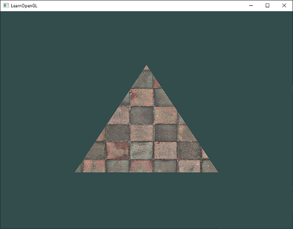

为了将纹理映射到三角形，我们需要告诉三角形的每个顶点它对应纹理的哪一部分。因此，==每个顶点都应该*关联*一个纹理坐标==，该坐标指定要从纹理图像的哪一部分进行采样。然后，==片段插值会处理其他片段的剩余部分==。 ~~先画屏幕(三角形)，然后再去纹理图片那里采样~~   

纹理坐标在 `x` 轴和 `y` 轴方向上的取值范围均为 `0` 到 `1` （请记住，我们使用的是==二维纹理图像==）。==*使用纹理坐标获取纹理颜色的过程称为采样*==。纹理坐标从纹理图像左下角的 `(0,0)` 开始，到纹理图像右上角的 `(1,1)` 结束。下图展示了如何将纹理坐标映射到三角形：

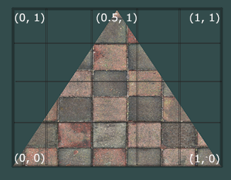

我们为三角形指定了 3 个纹理坐标点。我们希望三角形的左下角与纹理的左下角对应，因此我们使用纹理坐标 `(0,0)` 作为三角形左下角顶点的坐标。右下角也一样，使用纹理坐标 `(1,0)` 。三角形的顶部应与纹理图像的顶部中心对应，因此我们使用纹理坐标 `(0.5,1.0)` 。我们只需将这 3 个纹理坐标传递给顶点着色器，顶点着色器再将这些坐标传递给片段着色器，片段着色器会对每个片段的所有纹理坐标进行插值。

最终得到的纹理坐标如下所示：

```cpp
float texCoords[] = {
    0.0f, 0.0f,  // lower-left corner  
    1.0f, 0.0f,  // lower-right corner
    0.5f, 1.0f   // top-center corner
};
```

纹理采样有多种不同的实现方式，其定义也比较宽泛。因此，我们的任务是==告诉 OpenGL 应该如何对纹理 _进行采样_== 。

## Texture Wrapping

纹理坐标通常介于 `(0,0)` 和 `(1,1)` 之间，但如果我们指定超出此范围的坐标会发生什么？OpenGL 的默认行为是重复纹理图像（我们基本上忽略浮点纹理坐标的整数部分），但 OpenGL 还提供了更多选项：

- GL\_REPEAT ：纹理的默认行为。重复纹理图像。 ~~图片不断重复。坐标 1.1 看起来和 0.1 一样（忽略整数部分）~~ 
- GL\_MIRRORED\_REPEAT ：与 GL\_REPEAT 相同，但每次重复都会镜像图像。 ~~图片重复，但一次正、一次反。边缘处能完美衔接，没有裂缝感。~~ 
- GL\_CLAMP\_TO\_EDGE ：将坐标限制在 `0` 到 `1` 之间。结果是，较高的坐标会被限制在边缘，从而形成拉伸的边缘图案。 ~~坐标只要大于 1.0，就永远取 1.0 那一像素的颜色。结果是边缘被无限拉伸成直线。~~ 
- GL\_CLAMP\_TO\_BORDER ：超出范围的坐标现在会赋予用户指定的边框颜色。 ~~图片外面是一片纯色（你可以自己定颜色，比如黑色或透明）。~~ 

当使用超出默认范围的纹理坐标时，每个选项都会产生不同的视觉效果。让我们看看它们在示例纹理图像上的效果（原图由 Hólger Rezende 提供）：

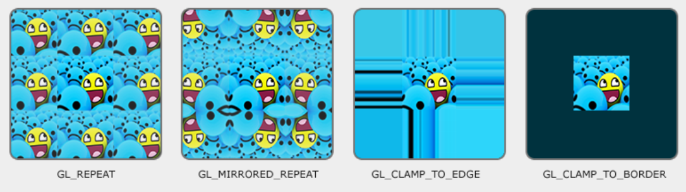

上述每个选项都可以使用 glTexParameter\* 函数按坐标轴（ `s` 、 `t` （如果使用 3D 纹理，则还包括 `r` ），分别等效于 `x` 、 `y` 、 `z` ）进行设置：

```scss
glTexParameteri(GL_TEXTURE_2D, GL_TEXTURE_WRAP_S, GL_MIRRORED_REPEAT);//水平重复
glTexParameteri(GL_TEXTURE_2D, GL_TEXTURE_WRAP_T, GL_MIRRORED_REPEAT);//垂直重复
```

第一个参数指定==纹理目标==；我们处理的是 2D 纹理，所以纹理目标是 GL\_TEXTURE\_2D 。第二个参数要求我们指定要设置的选项以及作用于哪个纹理轴；==我们希望同时配置 `S` 轴和 `T` 轴==。最后一个参数要求我们传入所需的纹理环绕模式，在本例中，OpenGL 会将当前活动纹理的纹理环绕选项设置为 GL\_MIRRORED\_REPEAT ~~镜像重复~~  。

如果我们选择 ==GL\_CLAMP\_TO\_BORDER== 选项，还应该指定边框颜色。这可以通过 `fv` 中等效的 glTexParameter 函数来实现，并将 GL\_TEXTURE\_BORDER\_COLOR 作为其选项，其中我们传入一个包含边框颜色值的浮点数组：

```bash
float borderColor[] = { 1.0f, 1.0f, 0.0f, 1.0f };
glTexParameterfv(GL_TEXTURE_2D, GL_TEXTURE_BORDER_COLOR, borderColor);
```

## 纹理过滤

纹理坐标不依赖于分辨率，可以是任何浮点值，因此 ==OpenGL 需要确定将纹理坐标映射到哪个纹理像素（也称为纹素）==。如果您有一个*非常大的物体和低分辨率的纹理*，这一点就显得尤为重要。您可能已经猜到，OpenGL 也提供了==纹理过滤==的选项。虽然有多种选项可用，但现在我们将讨论最重要的两个选项： ==GL\_NEAREST 和 GL\_LINEAR== 。

GL\_NEAREST （也称为最近邻或点过滤）是 OpenGL 的默认纹理过滤方法。设置为 GL\_NEAREST 时，OpenGL 会选择==中心距离*纹理坐标*最近的纹==素。下图显示了 4 个像素，十字标记代表了精确的*纹理坐标* ~~就是屏幕图片按照比例，在纹理图片的精准对应坐标~~ 。==左上角的*纹素中心* ~~纹素中心指的是每个小正方形的中心~~ 距离*纹理坐标*最近，因此被选为采样颜色==：

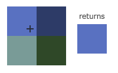

GL\_LINEAR （也称为（双）线性滤波）==从纹理坐标的相邻纹素中插值，近似表示纹素之间的颜色==。纹理坐标到纹素中心的距离越小，该纹素的颜色对采样颜色的贡献就越大。如下所示，返回的是相邻像素的混合颜色：

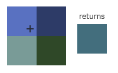

但这种纹理过滤方法的视觉效果如何呢？让我们看看当在大物体上使用低分辨率纹理时，这些方法是如何工作的（纹理会被放大，单个纹素会变得很明显）：


==GL\_NEAREST 会生成块状图案，我们可以清晰地看到构成纹理的像素==；而 ==GL\_LINEAR 则会生成更平滑的图案，单个像素不太明显==。GL\_LINEAR 的输出效果更逼真，但有些开发者更喜欢 8 位风格，因此会选择 GL\_NEAREST 。

纹理过滤可以针对放大和缩小操作（即向上或向下缩放）进行设置，例如，==当纹理向下缩放时，可以使用最近邻过滤；而当纹理向上缩放时，可以使用线性过滤==。因此，我们需要通过 \`glTexParameter\*\` 为这两种选项指定过滤方法。代码应该类似于设置包装方法：

```scss
glTexParameteri(GL_TEXTURE_2D, GL_TEXTURE_MIN_FILTER, GL_NEAREST);//当纹理向下缩放选择近邻过滤
glTexParameteri(GL_TEXTURE_2D, GL_TEXTURE_MAG_FILTER, GL_LINEAR);//当纹理向上缩放选择线性过滤
```

### Mipmaps

想象一下，我们有一个大房间，里面有成千上万个物体，每个物体都附带一个纹理。==远处的物体会和近处的物体一样，都附带高分辨率纹理==。由于这些物体距离较远，而且可能==只生成少量纹理片段== ~~就是说假设我本来物体是1920 x 1080 个(200万个)像素，及200万个片段，但由于距离很远只需要2x2个像素~~ ，OpenGL 很难==从高分辨率纹理中获取其对应片段的正确颜色值==，因为它需要为==覆盖纹理很大一部分的片段选择纹理颜色==。这会导致==小物体上出现可见的瑕疵==，更不用说在小物体上使用高分辨率纹理还会==浪费内存带宽==。

为了解决这个问题，OpenGL 使用了一种叫做 mipmap 的概念，它本质上是==一系列纹理图像==的集合，其中每个后续纹理的尺寸都是前一个的两倍。mipmap 的原理很容易理解：==当物体距离观察者超过一定距离阈值后，OpenGL 会使用最适合该距离的 mipmap 纹理==。==由于物体距离较远，用户几乎察觉不到分辨率的差异==。这样，OpenGL 就能采样到正确的纹素，并且在==采样 mipmap 的这部分时，所需的缓存内存也更少==。让我们仔细看看 mipmap 纹理的样子：

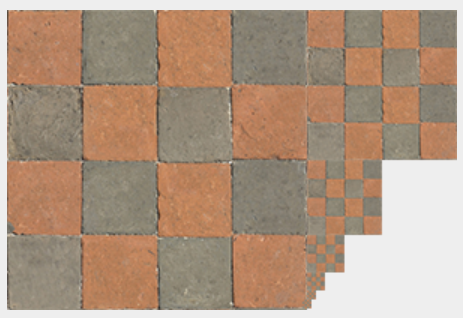  


手动为每个纹理图像创建 mipmap 纹理集合非常繁琐，但幸运的是，==OpenGL 能够在我们创建纹理后，通过一次调用 glGenerateMipmap 来为我们完成所有工作==。

在 OpenGL ==渲染过程中切换 mipmap 层级==时，可能会出现一些瑕疵，例如两个 mipmap 层之间出现明显的锐利边缘。与普通纹理过滤类似，也==可以使用 NEAREST 和 LINEAR 过滤来实现 mipmap 层级之间的切换==。要指定 mipmap 层级之间的过滤方法，我们可以将原始过滤方法替换为以下四个选项之一：

> 第一个NEAREST：图片内部有马赛克，只取一个像素
> 第一个是LINEAR：图片内部没有马赛克，取多个像素进行插值计算


> 第二个是NEAREST：由远到近会断层地突然清晰（层级切换断层），只取最接近的层级->进行插值计算
> 第二个是LINEAR：层级切换丝滑，多个层级->插值计算

- GL\_NEAREST\_MIPMAP\_NEAREST ：选择==与像素大小最匹配的 mipmap== ~~合适的缩略图~~ ，并使用==最近邻插值== ~~最靠近的那个像素~~ 进行纹理采样。 ~~会有马赛克，而且又远到近会断层的突然清晰~~ 
- GL\_LINEAR\_MIPMAP\_NEAREST ：选取最近的 mipmap 级别，并使用线性插值对该级别进行采样。
- GL\_NEAREST\_MIPMAP\_LINEAR ：在==两个与像素大小最接近的 mipmap 之间进行线性插值==，并通过==最近邻插值对插值级别进行采样==。
- GL\_LINEAR\_MIPMAP\_LINEAR ：在两个最接近的 ==mipmap 之间进行线性插值==，并==通过线性插值对插值级别进行采样==。

就像纹理过滤一样，我们可以使用 glTexParameteri 将过滤方法设置为上述 4 种方法之一：

```scss
glTexParameteri(GL_TEXTURE_2D, GL_TEXTURE_MIN_FILTER, GL_LINEAR_MIPMAP_LINEAR);
glTexParameteri(GL_TEXTURE_2D, GL_TEXTURE_MAG_FILTER, GL_LINEAR);
```

==一个常见的错误是将 mipmap 过滤选项之一设置为放大过滤器==  ~~上面的`glTexParameteri(GL_TEXTURE_2D, GL_TEXTURE_MAG_FILTER, GL_LINEAR);`不是对mipmap的过滤~~ 。这样做没有任何效果，因为 ==mipmap 主要用于纹理缩小时：纹理放大不使用 mipmap==，因此将其设置为 mipmap 过滤选项会生成 OpenGL GL\_INVALID\_ENUM 错误代码。

## 加载和创建纹理

要真正使用纹理，首先需要将它们加载到应用程序中。==纹理图像可以以数十种文件格式存储，每种格式都有其自身的数据结构和顺序==，那么我们该如何将这些图像导入到应用程序中呢？一种解决方案是==选择一种我们想要使用的文件格式，例如 `.PNG` ，然后编写自己的图像加载器，将图像格式转换为一个大型字节数组。==虽然编写自己的图像加载器并不难，但仍然很繁琐，而且如果想要支持更多文件格式该怎么办？那样的话，你就必须为每种想要支持的格式编写一个图像加载器。

另一个解决方案，而且可能是一个不错的解决方案，是使用一个==支持多种流行格式的图像加载库==，它可以为我们完成所有繁重的工作。例如 `stb_image.h` 这样的库。

## stb\_image.h

`stb_image.h` 是由 [Sean Barrett](https://github.com/nothings) 开发的非常流行的==单头文件*图像加载库*==，它能够加载大多数常用文件格式，并且易于集成到您的项目中。您可以从[这里](https://github.com/nothings/stb/blob/master/stb_image.h)下载 `stb_image.h` 。只需下载该头文件，将其添加到您的项目中并命名为 stb\_image.h ，然后创建一个包含以下代码的 C++ 文件：

```cpp
#define STB_IMAGE_IMPLEMENTATION
#include "stb_image.h"
```

通过定义 STB\_IMAGE\_IMPLEMENTATION， 预处理器会修改头文件，使其==仅包含相关的定义源代码==，从而有效地将头文件转换为 `.cpp` 文件，仅此而已。现在只需在程序中的某个位置包含 `stb_image.h` 并编译即可。

接下来的纹理部分我们将使用一张[木制容器](https://learnopengl.com/img/textures/container.jpg)的图片。要使用 `stb_image.h` 加载图片，我们使用其 stbi\_load 函数：

```cpp
int width, height, nrChannels;
unsigned char *data = stbi_load("container.jpg", &width, &height, &nrChannels, 0);
```

该函数首先接收图像文件的位置作为输入。然后，它需要你提供三个 `ints` 作为第二、第三和第四个参数， `stb_image.h` 会将生成的图像的 _宽度_ 、 _高度_ 和 _颜色通道_ 数分别_填充到这三个参数中。我们需要图像的宽度和高度用于后续的纹理生成。

## 生成纹理

与 OpenGL 中的其他对象一样，==纹理也是通过 ID 来引用==的；让我们创建一个纹理：

```cpp
unsigned int texture;
glGenTextures(1, &texture);
```

glGenTextures 函数首先接收==要生成的纹理数量==作为输入，并将它们存储在作为第二个参数（在本例中只有一个 `unsigned int` ）给出的 `unsigned int` 数组中。与其他对象一样，我们需要绑定它，以便任何后续的纹理命令都能配置当前绑定的纹理：

```scss
glBindTexture(GL_TEXTURE_2D, texture);
```

现在纹理已经绑定，我们可以开始使用之前加载的图像数据生成纹理了。纹理是用 glTexImage2D 生成的：

```scss
glTexImage2D(GL_TEXTURE_2D, 0, GL_RGB, width, height, 0, GL_RGB, GL_UNSIGNED_BYTE, data);
glGenerateMipmap(GL_TEXTURE_2D);
```

这是一个参数较多的大型函数，所以我们将逐步讲解：

- 第一个参数指定纹理目标；将其设置为 GL\_TEXTURE\_2D 表示==此操作将在当前绑定的纹理对象上生成同一目标的纹理（因此绑定到目标 GL\_TEXTURE\_1D 或 GL\_TEXTURE\_3D 的任何纹理都不会受到影响）==。
- 第二个参数指定了要为其==创建纹理的 mipmap 级别==（如果您想手动设置每个 mipmap 级别），但我们将其保留为基本级别 `0` 。
- 第三个参数==告诉 OpenGL 我们希望以何种格式存储纹理==。我们的图像只有 `RGB` 值，所以我们也将以 `RGB` 值存储纹理。
- 第 4 个和第 5 个参数分别设置==生成的纹理的宽度和高度==。我们在之前加载图像时已经存储了这些值，所以我们将使用相应的变量。
- 下一个参数应该始终为 `0` （一些遗留问题）。
- 第 7 个和第 8 个参数==指定源图像的格式和数据类型==。我们==加载图像时使用了 `RGB` 值，并将其存储为 `char` （字节）==，因此我们将传入相应的值。
- 最后一个参数是实际的图像数据。

调用 \`glTexImage2D\` 后，==当前绑定的纹理对象就附加了纹理图像==。但是，目前它==只加载了纹理图像的基础层==，如果我们想使用 mipmap，就必须手动指定所有不同的图像（通过不断递增第二个参数），或者，我们可以在生成纹理后调用 \`glGenerateMipmap\`。这将自动为当前绑定的纹理生成所有必需的 mipmap。

生成纹理及其对应的 mipmap 后，最好释放图像内存：

```scss
stbi_image_free(data);
```

因此，生成纹理的整个过程大致如下：

```cpp
unsigned int texture;
glGenTextures(1, &texture);
glBindTexture(GL_TEXTURE_2D, texture);
// set the texture wrapping/filtering options (on the currently bound texture object)
glTexParameteri(GL_TEXTURE_2D, GL_TEXTURE_WRAP_S, GL_REPEAT);
glTexParameteri(GL_TEXTURE_2D, GL_TEXTURE_WRAP_T, GL_REPEAT);
glTexParameteri(GL_TEXTURE_2D, GL_TEXTURE_MIN_FILTER, GL_LINEAR_MIPMAP_LINEAR);
glTexParameteri(GL_TEXTURE_2D, GL_TEXTURE_MAG_FILTER, GL_LINEAR);
// load and generate the texture
int width, height, nrChannels;
unsigned char *data = stbi_load("container.jpg", &width, &height, &nrChannels, 0);
if (data)
{
    glTexImage2D(GL_TEXTURE_2D, 0, GL_RGB, width, height, 0, GL_RGB, GL_UNSIGNED_BYTE, data);
    glGenerateMipmap(GL_TEXTURE_2D);
}
else
{
    std::cout << "Failed to load texture" << std::endl;
}
stbi_image_free(data);
```

## 应用纹理

接下来的章节我们将使用在 [“Hello Triangle”](https://learnopengl.com/Getting-started/Hello-Triangle) 章节最后一部分中用 glDrawElements 绘制的矩形形状。我们需要告诉 OpenGL 如何对纹理进行采样，因此我们需要使用纹理坐标更新顶点数据：

```cpp
float vertices[] = {
    // positions          // colors           // texture coords
     0.5f,  0.5f, 0.0f,   1.0f, 0.0f, 0.0f,   1.0f, 1.0f,   // top right
     0.5f, -0.5f, 0.0f,   0.0f, 1.0f, 0.0f,   1.0f, 0.0f,   // bottom right
    -0.5f, -0.5f, 0.0f,   0.0f, 0.0f, 1.0f,   0.0f, 0.0f,   // bottom left
    -0.5f,  0.5f, 0.0f,   1.0f, 1.0f, 0.0f,   0.0f, 1.0f    // top left 
};
```

由于我们添加了一个额外的顶点属性，因此我们需要再次通知 OpenGL 新的顶点格式：

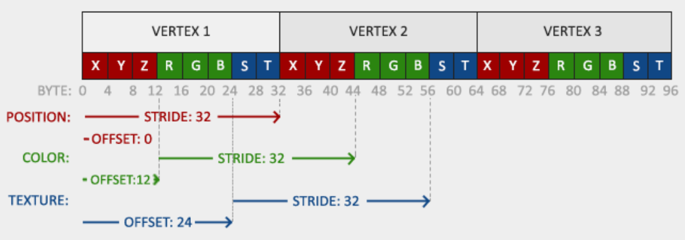

```scss
glVertexAttribPointer(2, 2, GL_FLOAT, GL_FALSE, 8 * sizeof(float), (void*)(6 * sizeof(float)));
glEnableVertexAttribArray(2);
```

请注意，我们还必须将前两个顶点属性的步长参数调整为 `8 * sizeof(float)` 。

接下来，我们需要修改顶点着色器，使其==接受纹理坐标作为顶点属性==，然后==将这些坐标传递给片段着色器==：

```csharp
#version 330 core
layout (location = 0) in vec3 aPos;
layout (location = 1) in vec3 aColor;
layout (location = 2) in vec2 aTexCoord;

out vec3 ourColor;
out vec2 TexCoord;

void main()
{
    gl_Position = vec4(aPos, 1.0);
    ourColor = aColor;
    TexCoord = aTexCoord;
}
```

然后，片段着色器应该将 `TexCoord` 输出变量作为输入变量。

片段着色器也需要访问纹理对象，但我们如何将纹理对象传递给片段着色器呢？==GLSL *内置*了一种用于*纹理对象*的数据类型，称为*采样器（sampler）==*，它*接受一个后缀来指定所需的纹理类型*，例如 `sampler1D` 、 `sampler3D` 或在本例中为 `sampler2D` 。然后，我们可以通过声明一个 `uniform sampler2D` 并将纹理赋值给它，从而将纹理添加到片段着色器中。

```csharp
#version 330 core
out vec4 FragColor;
  
in vec3 ourColor;
in vec2 TexCoord;

uniform sampler2D ourTexture;

void main()
{
    FragColor = texture(ourTexture, TexCoord);
}
```

==要*对纹理进行颜色采样*，我们使用 GLSL 内置的纹理 ~~texture~~ 函数==。该函数以==纹理采样器==作为第一个参数，以==对应的纹理坐标==作为第二个参数。然后，==纹理函数使用我们之前设置的纹理参数对相应的颜色值进行采样==。此片段着色器的输出是==纹理在（插值后的）纹理坐标处的（过滤后的）颜色==。

现在==只需在调用 glDrawElements 之前绑定纹理，它就会*自动将纹理分配给片段着色器的采样器*==：

```scss
glBindTexture(GL_TEXTURE_2D, texture);
glBindVertexArray(VAO);
glDrawElements(GL_TRIANGLES, 6, GL_UNSIGNED_INT, 0);
```

如果一切操作正确，您应该会看到以下图像：

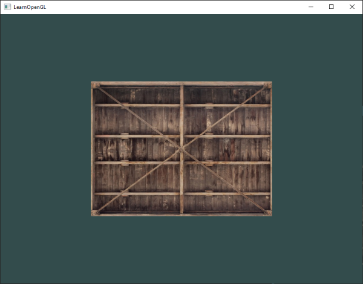

如果你的矩形完全是白色或黑色，那很可能是你的操作过程中出现了错误。检查你的着色器日志，并尝试将你的代码与应用程序的 [源代码](https://learnopengl.com/code_viewer_gh.php?code=src/1.getting_started/4.1.textures/textures.cpp)进行比较。

如果您的纹理代码不起作用或显示为全黑，请继续阅读并尝试最后一个 **应该可以**正常工作的示例。在某些驱动程序中， **需要**为每个采样器 uniform 变量分配一个纹理单元，我们将在本章中进一步讨论这一点。

为了获得一些特别的效果，我们还可以==将生成的纹理颜色与顶点颜色混合==。只需在片段着色器中将生成的纹理颜色与顶点颜色相乘，即可混合这两种颜色：

```ini
FragColor = texture(ourTexture, TexCoord) * vec4(ourColor, 1.0);
```

结果应该是顶点颜色和纹理颜色的混合：

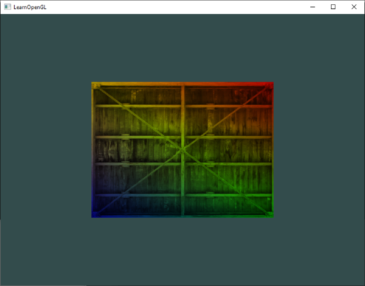

我想你可以说我们的集装箱喜欢跳迪斯科。

## 纹理单元

你可能想知道，既然我们==没有用 glUniform 给 `sampler2D` 变量赋值，为什么它还是一个 uniform 变量==。这是因为，使用 glUniform1i 我们可以==给纹理采样器分配一个 _位置_ 值==，这样我们就可以在片段着色器中一次设置多个纹理。纹理的这个位置通常被称为==纹理单元==。==纹理的默认纹理单元是 `0` ，也就是默认的活动纹理单元==，所以我们在上一节中不需要分配位置；需要注意的是，并非所有图形驱动程序都会分配默认纹理单元，因此上一节的内容可能无法正常渲染。

纹理单元的主要目的是允许我们==在着色器中使用多个纹理==。通过==将纹理单元分配给采样器==，只要我们先==激活相应的纹理单元，就可以同时绑定到多个纹理==。就像 glBindTexture 一样，我们可以使用 glActiveTexture 来激活纹理单元，并传入我们想要使用的纹理单元：

```scss
glActiveTexture(GL_TEXTURE0); // activate the texture unit first before binding texture
glBindTexture(GL_TEXTURE_2D, texture);
```

激活纹理单元后，后续的 glBindTexture 调用会将该纹理绑定到当前激活的纹理单元。==纹理单元 GL\_TEXTURE0 默认始终处于激活状态，因此在之前的示例中使用 glBindTexture 时，我们无需激活任何纹理单元==。

OpenGL 至少应该提供 16 个纹理单元供您使用，您可以使用 GL\_TEXTURE0 到 GL\_TEXTURE15 来激活它们。它们是按顺序定义的，因此我们也可以通过 GL\_TEXTURE0 + 8 来获得 GL\_TEXTURE8 ，例如，当我们需要遍历多个纹理单元时，这非常有用。

不过，我们仍然需要修改片段着色器以接受另一个采样器。现在这应该相对容易了：

```csharp
#version 330 core
...

uniform sampler2D texture1;
uniform sampler2D texture2;

void main()
{
    FragColor = mix(texture(texture1, TexCoord), texture(texture2, TexCoord), 0.2);
}
```

最终输出颜色是两个纹理查找结果的组合。GLSL 内置的 mix 函数接受两个输入值，并根据第三个参数在它们之间进行线性插值。如果第三个参数为 `0.0` ，则返回第一个输入值；如果为 `1.0` ，则返回第二个输入值。例如，如果第三个参数为 `0.2` ，则会==返回第一个输入颜色的 `80%` 和第二个输入颜色的 `20%`== ，==从而得到两个纹理的混合颜色==。

现在我们要加载并创建另一个纹理；你应该已经熟悉这些步骤了。请确保创建另一个纹理对象，加载图像，并使用 glTexImage2D 生成最终纹理。第二个纹理我们将使用你[在学习 OpenGL 时拍摄的面部表情](https://learnopengl.com/img/textures/awesomeface.png)图像：

```kotlin
unsigned char *data = stbi_load("awesomeface.png", &width, &height, &nrChannels, 0);
if (data)
{
    glTexImage2D(GL_TEXTURE_2D, 0, GL_RGB, width, height, 0, GL_RGBA, GL_UNSIGNED_BYTE, data);
    glGenerateMipmap(GL_TEXTURE_2D);
}
```

请注意，我们现在加载的是一个包含 alpha（透明度）通道的 `.png` 图像。这意味着我们需要使用 GL\_RGBA 来指定图像数据也包含 alpha 通道；否则 OpenGL 将错误地解释图像数据。

要使用第二个纹理（以及第一个纹理），我们需要稍微修改渲染过程，将两个纹理绑定到相应的纹理单元：

```scss
glActiveTexture(GL_TEXTURE0);
glBindTexture(GL_TEXTURE_2D, texture1);
glActiveTexture(GL_TEXTURE1);
glBindTexture(GL_TEXTURE_2D, texture2);

glBindVertexArray(VAO);
glDrawElements(GL_TRIANGLES, 6, GL_UNSIGNED_INT, 0);
```

我们还需要通过设置 glUniform1i 来==告诉 OpenGL 每个*着色器采样器*所属的纹理单元==。我们只需要设置一次，因此可以在进入渲染循环之前完成此操作：

```scss
ourShader.use(); // don't forget to activate the shader before setting uniforms!  
glUniform1i(glGetUniformLocation(ourShader.ID, "texture1"), 0); // set it manually
ourShader.setInt("texture2", 1); // or with shader class
  
while(...) 
{
    [...]
}
```

通过 glUniform1i 设置采样器，我们可以确保每个 uniform 采样器都对应于正确的纹理单元。您应该得到以下结果：

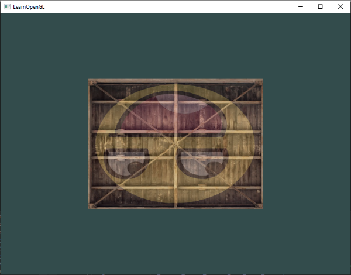

您可能已经注意到纹理上下颠倒了！这是因为 ==OpenGL 期望 y 轴上的 `0.0` 坐标位于图像的底部，但图像通常 y 轴上的 `0.0` 坐标位于顶部==。幸运的是， `stb_image.h` 可以在加载任何图像之前添加以下语句来翻转 y 轴：

```scss
stbi_set_flip_vertically_on_load(true);
```

在指示 `stb_image.h` 在加载图像时翻转 y 轴之后，您应该会得到以下结果：

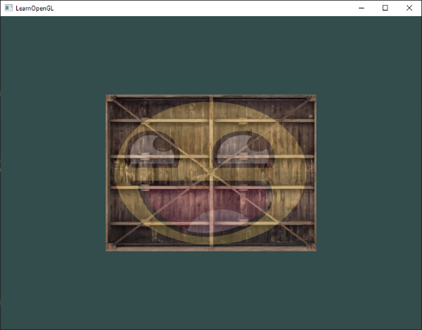

如果你看到一个正常的容器，那就说明你做对了。你可以把它和 [源代码](https://learnopengl.com/code_viewer_gh.php?code=src/1.getting_started/4.2.textures_combined/textures_combined.cpp)进行比较。

## 练习

为了更好地适应不同的质地，建议在继续之前完成这些练习。

- 通过更改片段着色器，确保==只有==笑脸朝向另一个/相反的方向： [解决方案](https://learnopengl.com/code_viewer_gh.php?code=src/1.getting_started/4.3.textures_exercise1/textures_exercise1.cpp) 。
  
```FragmentShader
//shader.fs
  FragColor = mix(texture(texture1, TexCoord), texture(texture2, vec2(-TexCoord.s,TexCoord.t)), 0.2);

```
  
- 尝试使用不同的纹理包裹方法，将纹理坐标的范围从 `0.0f` 到 `2.0f` 改为 `0.0f` 到 `1.0f` 。看看能否在边缘被限制的单个容器图像上显示 4 个笑脸： [解决方案](https://learnopengl.com/code_viewer_gh.php?code=src/1.getting_started/4.4.textures_exercise2/textures_exercise2.cpp) ， [结果](https://learnopengl.com/img/getting-started/textures_exercise2.png) 。同时，也尝试使用其他包裹方法。
  
```cpp
//修改顶点的coords
float vertices[] = {
	// positions          // colors           // texture coords
	 0.5f,  0.5f, 0.0f,   1.0f, 0.0f, 0.0f,   2.0f, 2.0f,   // top right
	 0.5f, -0.5f, 0.0f,   0.0f, 1.0f, 0.0f,   2.0f, 0.0f,   // bottom right
	-0.5f, -0.5f, 0.0f,   0.0f, 0.0f, 1.0f,   0.0f, 0.0f,   // bottom left
	-0.5f,  0.5f, 0.0f,   1.0f, 1.0f, 0.0f,   0.0f, 2.0f    // top left 
};

//箱子纹理那里，修改超出位置的纹理包裹方法
glTexParameteri(GL_TEXTURE_2D, GL_TEXTURE_WRAP_S, GL_CLAMP_TO_EDGE);//超出的位置形成拉伸的边缘
glTexParameteri(GL_TEXTURE_2D, GL_TEXTURE_WRAP_T, GL_CLAMP_TO_EDGE);//超出的位置形成拉伸的边缘
```

- 尝试仅显示矩形区域内纹理图像的中心像素，通过改变纹理坐标使各个像素可见。尝试将纹理过滤方法设置为 GL\_NEAREST 以更清晰地查看像素： [解决方案](https://learnopengl.com/code_viewer_gh.php?code=src/1.getting_started/4.5.textures_exercise3/textures_exercise3.cpp) 。
  
  mipmap主要用于缩小，这里明显是放大 ，所以我只更改了他们的GL_TEXTURE_MAG_FILTER  
```cpp
//两个纹理都改为
glTexParameteri(GL_TEXTURE_2D, GL_TEXTURE_MAG_FILTER, GL_NEAREST);
glTexParameteri(GL_TEXTURE_2D, GL_TEXTURE_MAG_FILTER, GL_NEAREST);

//其实是改了纹理坐标，只用中心点那0.1x0.1的地方来做纹理
float vertices[] = {
	// positions          // colors           // texture coords (note that we changed them to 'zoom in' on our texture image)
	 0.5f,  0.5f, 0.0f,   1.0f, 0.0f, 0.0f,   0.55f, 0.55f, // top right
	 0.5f, -0.5f, 0.0f,   0.0f, 1.0f, 0.0f,   0.55f, 0.45f, // bottom right
	-0.5f, -0.5f, 0.0f,   0.0f, 0.0f, 1.0f,   0.45f, 0.45f, // bottom left
	-0.5f,  0.5f, 0.0f,   1.0f, 1.0f, 0.0f,   0.45f, 0.55f  // top left 
};
```
  
- 使用统一变量作为混合 ~~mix~~ 函数的第三个参数，可以改变两种纹理的可见程度。使用上下箭头键可以改变容器或笑脸的可见程度： [解决方案](https://learnopengl.com/code_viewer_gh.php?code=src/1.getting_started/4.6.textures_exercise4/textures_exercise4.cpp) 。  

```FragmentShader
#version 330 core
out vec4 FragColor;
  
in vec3 ourColor;
//对应的纹理坐标
in vec2 TexCoord;

//所有的 Uniform 变量在初始化时默认值都是 0
//纹理采样器
uniform sampler2D ourTexture;
uniform sampler2D texture1;
uniform sampler2D texture2;
uniform float mixValue=0.1;

void main()
{
    //其实这里ourColor没用的，不过
    //这里给他强行加了奇怪的效果
    //这个不是向量乘积，a * b = (ar* br,ag*bg,ab*bb,aa*ba)
    //FragColor = texture(ourTexture, TexCoord) * vec4(ourColor, 1.0);
    FragColor = mix(texture(texture1, TexCoord), texture(texture2, TexCoord), mixValue);
    //FragColor = mix(texture(texture1, TexCoord), texture(texture2, vec2(-TexCoord.s,TexCoord.t)), 0.2);

}
```

```cpp

float mixValue = 0.2f;

void processInput(GLFWwindow* window)
{
	/*
	检查用户是否按下了 Esc 键（如果没有按下，glfwGetKey 返回 GLFW\_RELEASE ）。如果用户按下了 Esc 键，我们使用 glfwSetwindowShouldClose 将 GLFW 的 WindowShouldClose 属性设置为 `true` 来关闭 GLFW
	*/
	if (glfwGetKey(window, GLFW_KEY_ESCAPE) == GLFW_PRESS)
		glfwSetWindowShouldClose(window, true);
	if (glfwGetKey(window, GLFW_KEY_UP) == GLFW_PRESS)
	{

		mixValue += 0.001f;
		if (mixValue >= 1.0f)
		{
			mixValue = 1.0f;
		}
	}
	if (glfwGetKey(window, GLFW_KEY_DOWN) == GLFW_PRESS)
	{
		mixValue -= 0.001f;
		if (mixValue <= 0.0f)
		{
			mixValue = 0.0f;
		}
	}

}

//循环内的修改

		//将新创建的程序对象作为参数来激活
		ourShader.use();

		//这个setFloat要放在use()的后面，否则第一帧就不会
		// 是setFloat的值，而是在第一帧use()之后，第二
		// 帧在setFloat成功
		ourShader.setFloat("mixValue", mixValue);

```
  
  