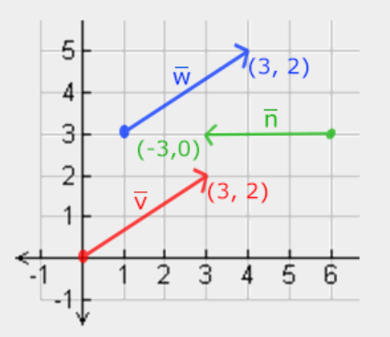
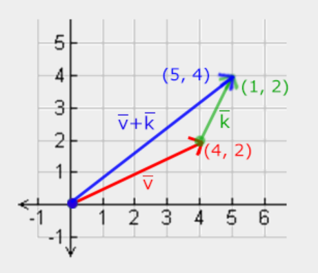
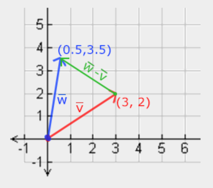
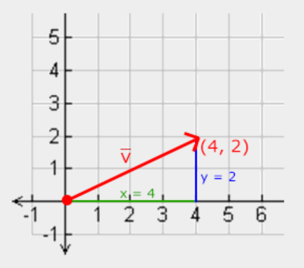
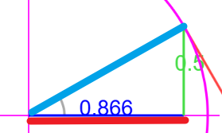
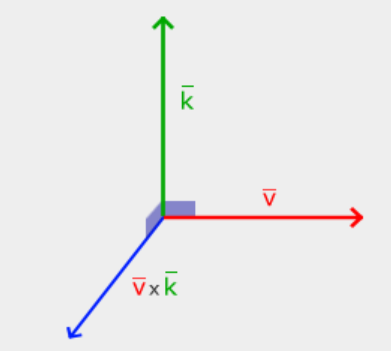
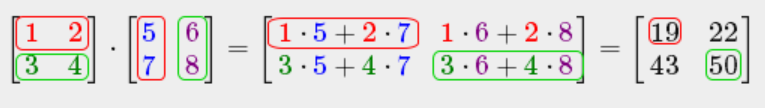
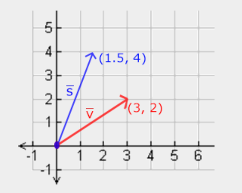
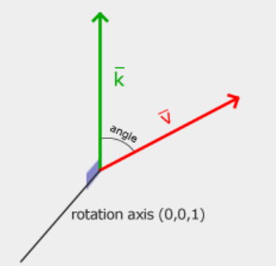
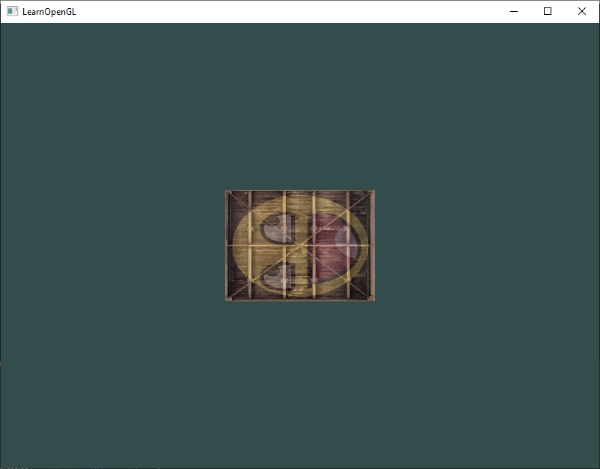

# 转变 Transformations

我们现在知道如何创建物体，给它们着色，或者用纹理赋予它们精细的外观，但它们仍然不够有趣，因为它们都是静态物体。我们可以==尝试通过改变它们的顶点并在每一帧重新配置它们的缓冲区来让它们动起来==，但这很麻烦，而且会消耗大量的处理能力。其实有更好的方法来变换物体，那就是==使用（多个）矩阵对象==。但这并不意味着我们要讨论功夫和庞大的数字人工世界。

矩阵是非常强大的数学结构，乍一看似乎令人生畏，但一旦你熟悉了它们，就会发现它们非常有用。在讨论矩阵时，我们需要==稍微了解一些数学知识==，对于数学基础较好的读者，我还会提供一些额外的阅读资源。

然而，要充分理解==变换==，我们首先需要深入研究==向量==，然后再讨论==矩阵==。本章的重点是为你提供一些我们后续会用到的==基本数学知识==。如果这些内容比较难懂，请==尽量理解==它们，并在需要时再回到本章复习相关概念。

# 向量 Vectors

从最基本的定义来看，==向量就是方向==，仅此而已。==向量具有*方向和大小*（也称为强度或长度）==。你可以把向量想象成藏宝图上的指示：“向左走10步，然后向北走3步，再向右走5步”；这里，“向左”是方向，“10步”是向量的大小。因此，藏宝图上的指示包含了3个向量。向量可以是任意维度，但我们通常处理的是==2到4维的向量==。==二维向量==表示平面上的一个方向（想想二维图形），==三维向量==可以表示==三维空间==中的任何方向。

下面你会看到三个向量，每个向量在二维图中用 $(x,y)$ 表示为箭头。由于二维（而非三维）表示向量更直观，你可以将这些二维向量视为 $z$ 坐标为 $0$ 的三维向量。由于向量表示方向，向量的原点不会改变其值。在下面的图中我们可以看到，向量 $\color{red}{\bar{v}}$ 和 $\color{blue}{\bar{w}}$ 即使原点不同，它们的值也相等：  



数学家在描述向量时，通常倾向于使用==头顶带横线的字符符号，例如 ${\bar{v}}$== 此外，在==公式中表示向量时，通常也采用以下方式==：

$$\bar{v} = \begin{pmatrix} \color{red}x \\ \color{green}y \\ \color{blue}z \end{pmatrix}$$

由于==向量被定义为方向，因此有时很难将其可视化为位置==。如果我们想==将向量可视化为位置，我们可以将*方向向量*的*原点*想象为 $(0,0,0)$== ，然后==指向某个特定方向==来确定该点，从而使其成为==位置向量==（我们也可以指定不同的原点，然后说：“该向量从该原点指向空间中的该点”）。位置向量 $(3,5)$ 则指向原点为 $(0,0)$ 的图上的 $(3,5)$ 点。因此，我们可以==利用向量来描述二维和三维空间中的*方向*和*位置*==。

就像对普通数字一样，我们也可以对向量定义几种运算（其中一些你已经见过了）。

## 标量向量运算 Scalar vector operations

标量是一个数字。当对向量进行加/减/乘/除运算时，我们只需将向量的每个元素分别乘以或减去该标量即可。例如，加法运算如下所示：

$$
\begin{pmatrix} \color{red}1 \\ \color{green}2 \\ \color{blue}3 \end{pmatrix} + x \rightarrow 
\begin{pmatrix} \color{red}1 \\ \color{green}2 \\ \color{blue}3 \end{pmatrix} + 
\begin{pmatrix} x \\ x \\ x \end{pmatrix} = 
\begin{pmatrix} \color{red}1+x \\ \color{green}2+x \\ \color{blue}3+x \end{pmatrix}
$$

其中 + 可以是 + 、 − 、 ⋅ 或 ÷ ，其中 ⋅ 是乘法运算符。

## 向量否定 Vector negation

向量取反后，其方向会反转。例如，==指向东北的向量取反后会指向西南==。要对向量取反，我们需要在每个分量后加上一个负号（也可以用标量乘法表示，结果为 $-1$ ）：

$$-\bar{v} = -\begin{pmatrix} \color{red}{v_x} \\ \color{blue}{v_y} \\ \color{green}{v_z} \end{pmatrix} = \begin{pmatrix} -\color{red}{v_x} \\ -\color{blue}{v_y} \\ -\color{green}{v_z} \end{pmatrix}$$

## 加法和减法 Addition and subtraction

==两个向量相加定义为分量相加，即一个向量的每个分量分别加到另一个向量的对应分量上==，如下所示：

$$\bar{v} = \begin{pmatrix} \color{red}1 \\ \color{green}2 \\ \color{blue}3 \end{pmatrix}, \bar{k} = \begin{pmatrix} \color{red}4 \\ \color{green}5 \\ \color{blue}6 \end{pmatrix} \rightarrow \bar{v} + \bar{k} = \begin{pmatrix} \color{red}1 + \color{red}4 \\ \color{green}2 + \color{green}5 \\ \color{blue}3 + \color{blue}6 \end{pmatrix} = \begin{pmatrix} \color{red}5 \\ \color{green}7 \\ \color{blue}9 \end{pmatrix}$$

从视觉上看，对于向量 $v=(4,2)$ 和 $k=(1,2)$ ，它看起来像这样，其中==第二个向量加到第一个向量的末端以找到结果向量的端点（首尾相连法）==：   



就像普通的加减运算一样，向量减法等同于==将第二个向量取反后的加法==运算：

$$\bar{v} = \begin{pmatrix} \color{red}{1} \\ \color{green}{2} \\ \color{blue}{3} \end{pmatrix}, \bar{k} = \begin{pmatrix} \color{red}{4} \\ \color{green}{5} \\ \color{blue}{6} \end{pmatrix} \rightarrow \bar{v} + -\bar{k} = \begin{pmatrix} \color{red}{1} + (-\color{red}{4}) \\ \color{green}{2} + (-\color{green}{5}) \\ \color{blue}{3} + (-\color{blue}{6}) \end{pmatrix} = \begin{pmatrix} -\color{red}{3} \\ -\color{green}{3} \\ -\color{blue}{3} \end{pmatrix}$$

两个==向量相减==的结果是一个向量，它表示==这两个向量所指向位置的差值==。这在某些情况下非常有用，例如我们需要获取两个点之间的差值向量时。



## 长度 Length

要计算向量的长度/大小，我们需要用到勾股定理，你可能在数学课上学过。当把向量的 $x$ 和 $y$ 分量分别看作三角形的两条边时，向量就构成了一个三角形：



由于已知两条边 $(x, y)$ 的长度，我们想知道倾斜边 $\color{red}{\bar{v}}$ 的长度，我们可以使用勾股定理计算如下：

$$||\color{red}{\bar{v}}|| = \sqrt{\color{green}x^2 + \color{blue}y^2}$$

其中 $||\color{red}{\bar{v}}||$ 表示_向量 $\color{red}{\bar{v}}$ 的长度 。通过在方程中添加 $z^2$ ，可以很容易地将其扩展到 3D。  

在这种情况下，向量 $(4, 2)$ 的长度等于：

$$||\color{red}{\bar{v}}|| = \sqrt{\color{green}4^2 + \color{blue}2^2} = \sqrt{\color{green}16 + \color{blue}4} = \sqrt{20} = 4.47$$

也就是 $4.47$ 。

还有一种特殊的向量，我们称之为==单位向量==。==单位向量有一个额外的性质，那就是它的长度恰好为 1==。我们可以通过==将任意向量的每个分量除以其长度，来计算出一个单位向量== $\hat{n}$ ：

$$\hat{n} = \frac{\bar{v}}{||\bar{v}||}$$

我们称这种行为==归一化向量==。单位向量上方会显示一个小屋顶，而且通常更容易处理，尤其是在我们==只关心向量方向==的时候（==改变向量的长度不会改变其方向==）。

## 向量乘法 Vector-vector multiplication

两个向量相乘有点特殊。普通的乘法在向量上并没有定义，因为它没有视觉意义，但我们有两种特殊的乘法可以选择：一种是==*点积*==，表示为 $\bar{v} \cdot \bar{k}$ ；另一种是==*叉积*==，表示为 $\bar{v} \times \bar{k}$ 。

### 点积 Dot product

两个向量的点积等于==它们长度的标量积==乘以它们之间==夹角的余弦值==。如果这听起来令人困惑，请查看其公式：

$$\bar{v} \cdot \bar{k} = ||\bar{v}|| \cdot ||\bar{k}|| \cdot \cos \theta$$

其中它们之间的夹角用 theta ( $\theta$ ) 表示。这有什么意义呢？想象一下，如果 $\bar{v}$ 和 $\bar{k}$ 是==单位向量==，那么它们的长度就等于 $1$。这将有效地简化公式为：

$$\hat{v} \cdot \hat{k} = 1 \cdot 1 \cdot \cos \theta = \cos \theta$$

现在，点积==*只*==定义了两个向量之间的夹角。你可能还记得，*当角度为 90 度时，余弦函数（或 cos 函数）的值为 $0$ ，当角度为 0 度时，其值为 $1$ 。* 这使得我们可以使==用*点积*轻松地判断两个向量是否*正交*或*平行*==（正交意味着向量彼此垂直）。如果你想了解更多关于 $sin$ 函数或 $cos$ 函数的知识，我建议你观看[可汗学院关于基础三角学的以下视频](https://www.khanacademy.org/math/trigonometry/basic-trigonometry/basic_trig_ratios/v/basic-trigonometry) 。 你也可以计算两个非单位向量之间的角度，但那样的话，你必须从结果中除以两个向量的长度，才能得到 $cosθ$ 。   

> 
> cosθ = 斜边*向下垂直*在x轴上的映射长度/斜边
>   
> 所以 $cos0°=1$  ~~此时映射长度=斜边~~ , $cos(90°)= 0$ ~~此时斜边无限长~~ 
> 

那么，我们如何计算点积呢？==点积是将各个分量相乘，然后将结果相加==。对于两个单位向量，点积的表达式如下（您可以验证它们的长度都恰好为 $1$ ）：

$$\begin{pmatrix} \color{red}{0.6} \\ -\color{green}{0.8} \\ \color{blue}0 \end{pmatrix} \cdot \begin{pmatrix} \color{red}0 \\ \color{green}1 \\ \color{blue}0 \end{pmatrix} = (\color{red}{0.6} * \color{red}0) + (-\color{green}{0.8} * \color{green}1) + (\color{blue}0 * \color{blue}0) = -0.8$$

为了计算这两个单位向量之间的角度，我们使用余弦函数的反函数 $cos^{-1}$ ，结果为 $143.1$ 度。至此，我们==有效地计算出了这两个向量之间的角度==。点积在后续的==光照计算==中非常有用。   ~~如果结果为0，说明两向量正交/垂直；如果为1，说明两向量平行~~ 

### 交叉乘积 Cross product

==叉积仅在三维空间中定义==，它==接受两个不平行的向量作为*输入*，并*生成* ~~输出~~ 一个与这两个输入向量都正交的第三个向量==。如果两个输入向量彼此正交，则叉积将产生三个正交向量；这在后续章节中将非常有用。下图展示了叉积在三维空间中的样子：



与其他运算不同，==叉积运算并不直观，需要借助线性代数==才能理解，所以最好记住公式，这样就没问题了（当然，不记住公式也一样可以）。下面你会看到两个正交向量 A 和 B 的叉积：

$$\begin{pmatrix} \color{red}{A_{x}} \\ \color{green}{A_{y}} \\ \color{blue}{A_{z}} \end{pmatrix} \times \begin{pmatrix} \color{red}{B_{x}} \\ \color{green}{B_{y}} \\ \color{blue}{B_{z}}  \end{pmatrix} = \begin{pmatrix} \color{green}{A_{y}} \cdot \color{blue}{B_{z}} - \color{blue}{A_{z}} \cdot \color{green}{B_{y}} \\ \color{blue}{A_{z}} \cdot \color{red}{B_{x}} - \color{red}{A_{x}} \cdot \color{blue}{B_{z}} \\ \color{red}{A_{x}} \cdot \color{green}{B_{y}} - \color{green}{A_{y}} \cdot \color{red}{B_{x}} \end{pmatrix}$$

如你所见，这看起来似乎不太合理。但是，如果你按照这些步骤操作，你就会==得到另一个与输入向量正交的向量==。

> 1. 叉积结果的模（长度） 在几何上等于==以 和 为邻边构成的平行四边形的面积== $||\vec{a} \times \vec{b}|| = ||\vec{a}|| \cdot||\vec{b}|| \cdot \sin(\theta)$  ~~注意，这里是sin，不是cos~~ 
> 2. 结果那个向量的方向，用右手螺旋法则

# 矩阵 Matrices

既然我们已经讨论了向量的几乎所有内容，现在是时候进入矩阵了！ 矩阵是由数字、符号和/或数学表达式组成的矩形阵列。==矩阵中的每个元素==都称为==矩阵的元素==。下面是一个 $2 \times 3$ 矩阵的示例：

$$\begin{bmatrix} 1 & 2 & 3 \\ 4 & 5 & 6 \end{bmatrix}$$

矩阵的索引是 $(i,j)$ 其中 $i$ 代表行， $j$ 代表列，这就是为什么上面的矩阵被称为 2x3 矩阵（==3 列 2 行，也就是矩阵的维度==）。这与您通常使用 $(x,y)$ 索引二维图的方式相反。要检索值 4，我们需要将其索引为 $(2,1)$ （第二行，第一列）。

矩阵本质上就是==数学表达式的矩形阵列==。它们确实具有一系列非常好的数学性质，就像向量一样，我们可以==对矩阵定义几种运算，即：加法、减法和乘法==。

## 加法和减法 Addition and subtraction

两个矩阵之间的加减运算是逐个元素进行的。因此，我们熟悉的==普通数字加减运算规则==同样适用于两个矩阵，但==运算对象是具有相同索引的元素==。这意味着==加减运算仅适用于相同维度的矩阵==。3x2 矩阵和 2x3 矩阵（或 3x3 矩阵和 4x4 矩阵）不能直接相加或相减。让我们看看两个 2x2 矩阵的加法运算是如何进行的：

$$\begin{bmatrix} \color{red}1 & \color{red}2 \\ \color{green}3 & \color{green}4 \end{bmatrix} + \begin{bmatrix} \color{red}5 & \color{red}6 \\ \color{green}7 & \color{green}8 \end{bmatrix} = \begin{bmatrix} \color{red}1 + \color{red}5 & \color{red}2 + \color{red}6 \\ \color{green}3 + \color{green}7 & \color{green}4 + \color{green}8 \end{bmatrix} = \begin{bmatrix} \color{red}6 & \color{red}8 \\ \color{green}{10} & \color{green}{12} \end{bmatrix}$$

矩阵减法也适用同样的规则：

$$\begin{bmatrix} \color{red}4 & \color{red}2 \\ \color{green}1 & \color{green}6 \end{bmatrix} - \begin{bmatrix} \color{red}2 & \color{red}4 \\ \color{green}0 & \color{green}1 \end{bmatrix} = \begin{bmatrix} \color{red}4 - \color{red}2 & \color{red}2  - \color{red}4 \\ \color{green}1 - \color{green}0 & \color{green}6 - \color{green}1 \end{bmatrix} = \begin{bmatrix} \color{red}2 & -\color{red}2 \\ \color{green}1 & \color{green}5 \end{bmatrix}$$

~~对应位置元素相加减~~  

## 矩阵标量积 Matrix-scalar products

矩阵标量积是将矩阵的每个元素乘以一个标量。以下示例说明了这种乘法运算：

$$\begin{array}{c} \color{green}2 \cdot \begin{bmatrix} 1 & 2 \\ 3 & 4 \end{bmatrix} = \begin{bmatrix} \color{green}2 \cdot 1 & \color{green}2 \cdot 2 \\ \color{green}2 \cdot 3 & \color{green}2 \cdot 4 \end{bmatrix} = \begin{bmatrix} 2 & 4 \\ 6 & 8 \end{bmatrix} \end{array}$$

现在也明白了为什么这些单个数字被称为标量。标量本质上 _是将_ 矩阵中的所有元素乘以自身的值。在前面的例子中，所有元素都被乘以了 $2$ 。

到目前为止一切顺利，我们遇到的情况都不算太复杂。直到我们开始处理矩阵乘法。

## 矩阵乘法 Matrix-Vector multiplication
 
矩阵乘法本身并不复杂，只是需要一些时间才能熟练掌握。矩阵乘法本质上就是遵循一套预先定义的规则进行运算。不过，也存在一些限制：

1.  只有==当左侧矩阵的列数等于右侧矩阵的行数时，两个矩阵才能相乘==。
2.  矩阵乘法==不满足交换律==，即 A⋅B≠B⋅A 。

让我们从两个 $2 \times 2$ 矩阵的矩阵乘法示例开始：

$\begin{bmatrix} \color{red}1 & \color{red}2 \\ \color{green}3 & \color{green}4 \end{bmatrix} \cdot \begin{bmatrix} \color{blue}5 & \color{purple}6 \\ \color{blue}7 & \color{purple}8 \end{bmatrix} = \begin{bmatrix} \color{red}1 \cdot \color{blue}5 + \color{red}2 \cdot \color{blue}7 & \color{red}1 \cdot \color{purple}6 + \color{red}2 \cdot \color{purple}8 \\ \color{green}3 \cdot \color{blue}5 + \color{green}4 \cdot \color{blue}7 & \color{green}3 \cdot \color{purple}6 + \color{green}4 \cdot \color{purple}8 \end{bmatrix} = \begin{bmatrix} 19 & 22 \\ 43 & 50 \end{bmatrix}$

你现在可能正在努力搞清楚刚才到底发生了什么？矩阵乘法是将普通乘法和加法结合起来，==用左边矩阵的行和右边矩阵的列==进行运算。我们来通过下图来讨论一下：   



我们首先取左侧矩阵的第一行，然后取右侧矩阵的一列。我们选择的行和列决定了我们要计算的 $2 \times 2$ 矩阵的哪个输出值。如果我们取左侧矩阵的第一行，结果值将位于结果矩阵的第一行；然后我们选择一列，如果是第一列，结果值将位于结果矩阵的第一列。红色路径的情况正是如此。要计算右下角的结果，我们取第一个矩阵的最后一行和第二个矩阵的最右列。~~结果的第一行第二列的值：由左矩阵的第一行元素与右矩阵的第二列元素，相乘后相加得到~~    

为了计算结果值，我们首先将行和列的第一个元素相乘，然后对第二个、第三个、第四个元素等重复此操作。最后将各个乘法的结果相加，即可得到最终结果。现在也明白了，其中一个要求是==左矩阵的列数和右矩阵的行数必须相等，否则运算将无法完成==！ ~~因为结果矩阵第m行第n列的值，是左矩阵第m行所有值，依次与右矩阵第n列所有值，对应相乘并相加的值。所以第m行的所有列必须与第n列所有行的元素个数相等，即左矩阵的列数和右矩阵的行数必须相等。如上，结果矩阵第一行第一列的结果，由1,2所代表的2列元素，和5,7所代表2列元素，依次运算的结果~~ 

==*结果是一个维度为 ( $n,m$ ) 的矩阵，其中 $n$ 等于左侧矩阵的行数， $m$ 等于右侧矩阵的列数*==。

如果你在脑海中进行乘法运算有困难，别担心。只需坚持手动计算，遇到困难时就回到这个页面。久而久之，矩阵乘法就会成为你的本能反应。

让我们用一个更大的例子来结束关于矩阵乘法的讨论。试着用颜色来形象化这个规律。作为一项有益的练习，尝试自己计算出乘法结果，然后与结果矩阵进行比较（一旦你尝试手动进行矩阵乘法运算，你很快就会掌握要领）。

$$ \begin{bmatrix} \color{red}4 & \color{red}2 & \color{red}0 \\ \color{green}0 & \color{green}8 & \color{green}1 \\ \color{blue}0 & \color{blue}1 & \color{blue}0 \end{bmatrix} \cdot \begin{bmatrix} \color{red}4 & \color{green}2 & \color{blue}1 \\ \color{red}2 & \color{green}0 & \color{blue}4 \\ \color{red}9 & \color{green}4 & \color{blue}2 \end{bmatrix} = \begin{bmatrix} \color{red}4 \cdot \color{red}4 + \color{red}2 \cdot \color{red}2 + \color{red}0 \cdot \color{red}9 & \color{red}4 \cdot \color{green}2 + \color{red}2 \cdot \color{green}0 + \color{red}0 \cdot \color{green}4 & \color{red}4 \cdot \color{blue}1 + \color{red}2 \cdot \color{blue}4 + \color{red}0 \cdot \color{blue}2 \\ \color{green}0 \cdot \color{red}4 + \color{green}8 \cdot \color{red}2 + \color{green}1 \cdot \color{red}9 & \color{green}0 \cdot \color{green}2 + \color{green}8 \cdot \color{green}0 + \color{green}1 \cdot \color{green}4 & \color{green}0 \cdot \color{blue}1 + \color{green}8 \cdot \color{blue}4 + \color{green}1 \cdot \color{blue}2 \\ \color{blue}0 \cdot \color{red}4 + \color{blue}1 \cdot \color{red}2 + \color{blue}0 \cdot \color{red}9 & \color{blue}0 \cdot \color{green}2 + \color{blue}1 \cdot \color{green}0 + \color{blue}0 \cdot \color{green}4 & \color{blue}0 \cdot \color{blue}1 + \color{blue}1 \cdot \color{blue}4 + \color{blue}0 \cdot \color{blue}2 \end{bmatrix} = \begin{bmatrix} 20 & 8 & 12 \\ 25 & 4 & 34 \\ 2 & 0 & 4 \end{bmatrix} $$


正如你所见，矩阵乘法是一个相当繁琐且极易出错的过程（这也是我们通常让计算机来完成这项工作的原因），而且当矩阵规模增大时，问题会迅速变得尤为突出。如果你仍然渴望了解更多，并且对矩阵的更多数学性质感兴趣，我强烈建议你观看 [可汗学院关于矩阵的这些视频](https://www.khanacademy.org/math/algebra-home/alg-matrices) 。

总之，既然我们已经知道如何进行矩阵乘法，就可以开始学习一些有趣的东西了。

# 矩阵向量乘法 Matrix-Vector multiplication

到目前为止，我们已经接触过很多向量。我们用它们来表示==位置、颜色，甚至是纹理坐标==。让我们更深入地了解一下，向量本质上是一个 $N \times 1$ 矩阵 ~~N行1列~~ ，其中 $N$ 是向量的元素个数（也称为 N 维向量）。仔细想想，这很有道理。向量就像矩阵一样，都是数字数组，只不过向量只有一列。那么，这个新信息对我们有什么帮助呢？如果我们有一个 $M \times N$ 矩阵 ~~M行N列~~ ，我们可以用这个矩阵 ~~M x N~~ 乘以我们的 $N \times 1$ 向量，因为矩阵的列数 ~~N~~ 等于向量的行数 ~~N~~ ，所以矩阵乘法是有定义的。

但我们为什么要关心==矩阵能否与向量相乘==呢？原因很简单，我们可以将许多有趣的二维/三维变换放入矩阵中，而==将该矩阵与向量相乘，就能 _变换_ 该向量==。如果您仍然有些困惑，让我们从几个例子开始，您很快就会明白我们的意思。  ~~(A x B) x v = A x (B x v)~~ 

## 单位矩阵 Identity matrix

在 OpenGL 中，我们通常使用 `4x4` 变换矩阵，原因有很多，其中之一是大多数向量的长度都是 4。最简单的变换矩阵就是单位矩阵。==单位矩阵是一个 `NxN` 矩阵，除了对角线元素外，其余元素均为 0==。正如你将看到的，==这种变换矩阵不会对向量造成任何影响==：  

$$\begin{bmatrix} \color{red}1 & \color{red}0 & \color{red}0 & \color{red}0 \\ \color{green}0 & \color{green}1 & \color{green}0 & \color{green}0 \\ \color{blue}0 & \color{blue}0 & \color{blue}1 & \color{blue}0 \\ \color{purple}0 & \color{purple}0 & \color{purple}0 & \color{purple}1 \end{bmatrix} \cdot \begin{bmatrix} 1 \\ 2 \\ 3 \\ 4 \end{bmatrix} = \begin{bmatrix} \color{red}1 \cdot 1 \\ \color{green}1 \cdot 2 \\ \color{blue}1 \cdot 3 \\ \color{purple}1 \cdot 4 \end{bmatrix} = \begin{bmatrix} 1 \\ 2 \\ 3 \\ 4 \end{bmatrix}$$

> 1. 单位矩阵：是一个 $N \times N$ 的方阵。
> 2. 主对角线（Main Diagonal）上的所有元素必须全部为 1。
> 3. 非主对角线上的所有元素全部为 0。
> 	1. 在矩阵中，通常有两条对角线，但单位矩阵只认“主对角线”（主对角线（Main Diagonal）： 确实是从左上角到右下角）


向量本身完全未受影响。这一点从乘法规则即可看出：第一个结果元素是==矩阵第一行的每个元素分别与向量的每个元素相乘==的结果。由于第一行除第一个元素外其余元素均为 0，因此我们得到：$\color{red}1\color{black}\cdot\color{black}1 + \color{red}0\color{black}\cdot2 + \color{red}0\color{black}\cdot3 + \color{red}0\color{black}\cdot4 = 1$  ，向量的其他三个元素也遵循同样的规则。 你可能想知道，一个不进行变换的变换矩阵有什么用？==单位矩阵通常是生成其他变换矩阵的起点==，如果我们更深入地研究线性代数，它还是一个==在证明定理和求解线性方程组中非常有用的矩阵==。  

 ~~附：(5 x 4的矩阵) x (4 x 1的矩阵)  ，结果为(5 x 1的矩阵)~~     

 $$
\begin{bmatrix} 1 & 0 & 0 & 0 \\ 0 & 1 & 0 & 0 \\ 0 & 0 & 1 & 0 \\ 0 & 0 & 0 & 1 \\ 1 & 0 & 0 & 0 \end{bmatrix} \times \begin{bmatrix} 1 \\ 2 \\ 3 \\ 4 \end{bmatrix} = \begin{bmatrix} 1 \\ 2 \\ 3 \\ 4 \\ 1 \end{bmatrix}
$$  


## 缩放 Scaling

当我们==缩放一个向量==时，我们实际上是==将箭头的长度增加所需的缩放比例，同时保持其方向不变==。由于我们处理的是二维或三维空间，我们可以用一个==包含两个或三个缩放变量的向量来定义缩放==，每个变量分别缩放一个轴（ $x$ 、 $y$ 或 $z$ ）。

我们来尝试缩放向量 $\color{red}{\bar{v}} = (3,2)$ 。我们将沿 x 轴将向量缩放为 $0.5$ 倍，使其宽度变为原来的一半；我们将沿 y 轴将向量缩放为 $2$ 倍，使其高度变为原来的2倍。让我们看看如果将向量缩放 $(0.5,2)$ 得到 $\color{blue}{\bar{s}}$ 会是什么样子：



请记住，OpenGL 通常在 3D 空间中运行，因此对于这个 2D 场景，我们可以将 z 轴缩放比例设置为 $1$ ，而不会影响图形效果。我们刚刚执行的缩放操作是==非均匀缩放，因为每个轴的*缩放因子*并不相同==。==如果所有轴上的缩放比例都相等，则称为均匀缩放==。

让我们开始构建一个变换矩阵来进行缩放。从==单位矩阵==可以看出，==每个对角线元素都与其对应的向量元素相乘==。如果我们把单位矩阵中的 $1$ 替换成 $3$ 呢？在这种情况下，我们将每个向量元素乘以 $3$ ，从而有效地将向量均匀缩放 3 倍。如果我们用 (S1,S2,S3) 表示缩放变量，我们可以定义任意向量 (x,y,z) 的缩放矩阵如下：

$$\begin{bmatrix} \color{red}{S_1} & \color{red}0 & \color{red}0 & \color{red}0 \\ \color{green}0 & \color{green}{S_2} & \color{green}0 & \color{green}0 \\ \color{blue}0 & \color{blue}0 & \color{blue}{S_3} & \color{blue}0 \\ \color{purple}0 & \color{purple}0 & \color{purple}0 & \color{purple}1 \end{bmatrix} \cdot \begin{pmatrix} x \\ y \\ z \\ 1 \end{pmatrix} = \begin{pmatrix} \color{red}{S_1} \cdot x \\ \color{green}{S_2} \cdot y \\ \color{blue}{S_3} \cdot z \\ 1 \end{pmatrix}$$

请注意，==我们将第 4 个缩放值保持为 $1$ , $w$ 将用于其他用途，我们稍后会看到==。

## 平移Translation

平移是指==在原向量的基础上加上另一个向量==，得到一个位置不同的新向量，从而实现==基于*平移向量*的向量 _移动_ == 。我们之前已经讨论过向量加法，所以这应该不算太陌生。

与缩放矩阵类似，$4 \times4$ 矩阵中也存在多个可用于执行特定操作的位置，对于==平移==操作，这些位置是==第四列的前三个值==。如果我们用 $(\color{red}{T_x},\color{green}{T_y},\color{blue}{T_z})$ 表示平移向量，则可以定义平移矩阵如下：  

$$\begin{bmatrix}  \color{red}1 & \color{red}0 & \color{red}0 & \color{red}{T_x} \\ \color{green}0 & \color{green}1 & \color{green}0 & \color{green}{T_y} \\ \color{blue}0 & \color{blue}0 & \color{blue}1 & \color{blue}{T_z} \\ \color{purple}0 & \color{purple}0 & \color{purple}0 & \color{purple}1 \end{bmatrix} \cdot \begin{pmatrix} x \\ y \\ z \\ 1 \end{pmatrix} = \begin{pmatrix} x + \color{red}{T_x} \\ y + \color{green}{T_y} \\ z + \color{blue}{T_z} \\ 1 \end{pmatrix}$$

之所以可行，是因为==所有平移值都乘以向量的第 $w$ 列，然后加到向量的原始值上（记住矩阵乘法规则）==。这对于 3x3 矩阵来说是不可能实现的。 ==*齐次坐标向量的 $w$ 分量*==也称为==齐次坐标==。 ==要从*齐次向量*得到*三维向量*，我们需要将 $x$ 、 $y$ 和 $z$ 坐标除以其 $w$ 坐标==。通常情况下，我们不会注意到这一点，因为 ==$w$ 分量大多数时候都为 $1.0$== 。使用 *==齐次坐标有几个优点==* ：它允许我们==对三维向量进行矩阵平移==（如果没有 $w$ 分量，我们就无法平移向量），并且在下一章中，我们将==使用 $w$ 值来创建三维透视效果==。此外，==当齐次坐标等于 $0$ 时，该向量被称为方向向量，因为 $w$ 坐标为 $0$ 的向量不能平移==。

通过平移矩阵，我们可以沿三个轴方向（ $x$ 、 $y$ 、 $z$ ）移动物体，使其成为我们==变换工具包中非常有用的变换矩阵==。

## 旋转Rotation

最后几个变换相对容易理解，也容易在二维或三维空间中可视化，但旋转变换就稍微复杂一些。如果你想确切地==了解这些矩阵是如何构造==的，我建议你观看可汗学院 [线性代数](https://www.khanacademy.org/math/linear-algebra/matrix_transformations)视频中关于==旋转变换==的部分。

首先，我们来定义一下向量的旋转究竟是什么。二维或三维空间中的旋转可以用角度来表示。角度可以用==度数或弧度==来表示，一个完整的圆周运动有 360 度或 [2π](http://en.wikipedia.org/wiki/Pi) 弧度。我更倾向于用度数来解释旋转，因为我们通常更习惯使用度数。  

>  ==大多数旋转函数需要弧度作为角度单位，但幸运的是，角度很容易转换为弧度==：  
>  `angle in degrees = angle in radians * (180 / PI)`
   `angle in radians = angle in degrees * (PI / 180) `
>  其中 $PI$ 等于（四舍五入） $3.14159265359$ 。 

旋转半圆等于旋转 $360/2 = 180$ 度，向右旋转 $1/5$ 圆等于向右旋转 $360/5 = 72$ 度。以下以一个基本的二维向量为例进行说明：$\color{red}{\bar{k}}$ 相对于 ==*$\color{red}{\bar{v}}$ 向右（顺时针）旋转 72 度*==。

  

~~Rotation Axis (0, 0, 1)：这说明旋转是绕着 Z 轴进行的（在 OpenGL 的坐标系里，Z 轴通常是指向屏幕内外的那根轴）。~~  

==在三维空间中，旋转由角度和旋转轴==指定。指定的角度会使物体==绕指定的旋转轴==旋转。你可以想象一下，一边转动头部，一边持续注视着同一个旋转轴。例如，在三维空间中旋转二维向量时，我们==将旋转轴设置为 z 轴==（试着想象一下）。  ~~旋转轴z轴，跟向量v和向量k都垂直。v所谓的旋转， 说的是在v和k组成的那个面上旋转~~ 

利用三角函数，==*可以根据给定的角度将向量变换为新的旋转向量*==。这通常是通过巧妙地结合 $sine$ 函数和 $cosine$ 函数（通常简写为 $sin$ 和 $cos$ ）来实现的。==旋转矩阵的生成方法不在本章的讨论范围之内==。

在三维空间中，每个单位轴都定义了一个旋转矩阵，其中角度用 theta 符号表示 θ 。

绕 X 轴旋转：

$$\begin{bmatrix} \color{red}1 & \color{red}0 & \color{red}0 & \color{red}0 \\ \color{green}0 & \color{green}{\cos \theta} & - \color{green}{\sin \theta} & \color{green}0 \\ \color{blue}0 & \color{blue}{\sin \theta} & \color{blue}{\cos \theta} & \color{blue}0 \\ \color{purple}0 & \color{purple}0 & \color{purple}0 & \color{purple}1 \end{bmatrix} \cdot \begin{pmatrix} x \\ y \\ z \\ 1 \end{pmatrix} = \begin{pmatrix} x \\ \color{green}{\cos \theta} \cdot y - \color{green}{\sin \theta} \cdot z \\ \color{blue}{\sin \theta} \cdot y + \color{blue}{\cos \theta} \cdot z \\ 1 \end{pmatrix}$$

绕 Y 轴旋转：

$$\begin{bmatrix} \color{red}{\cos \theta} & \color{red}0 & \color{red}{\sin \theta} & \color{red}0 \\ \color{green}0 & \color{green}1 & \color{green}0 & \color{green}0 \\ - \color{blue}{\sin \theta} & \color{blue}0 & \color{blue}{\cos \theta} & \color{blue}0 \\ \color{purple}0 & \color{purple}0 & \color{purple}0 & \color{purple}1 \end{bmatrix} \cdot \begin{pmatrix} x \\ y \\ z \\ 1 \end{pmatrix} = \begin{pmatrix} \color{red}{\cos \theta} \cdot x + \color{red}{\sin \theta} \cdot z \\ y \\ - \color{blue}{\sin \theta} \cdot x + \color{blue}{\cos \theta} \cdot z \\ 1 \end{pmatrix}$$

绕 Z 轴旋转：

$$\begin{bmatrix} \color{red}{\cos \theta} & - \color{red}{\sin \theta} & \color{red}0 & \color{red}0 \\ \color{green}{\sin \theta} & \color{green}{\cos \theta} & \color{green}0 & \color{green}0 \\ \color{blue}0 & \color{blue}0 & \color{blue}1 & \color{blue}0 \\ \color{purple}0 & \color{purple}0 & \color{purple}0 & \color{purple}1 \end{bmatrix} \cdot \begin{pmatrix} x \\ y \\ z \\ 1 \end{pmatrix} = \begin{pmatrix} \color{red}{\cos \theta} \cdot x - \color{red}{\sin \theta} \cdot y  \\ \color{green}{\sin \theta} \cdot x + \color{green}{\cos \theta} \cdot y \\ z \\ 1 \end{pmatrix}$$

==利用旋转矩阵，我们*可以绕三个单位轴之一变换位置向量*==。==要绕任意三维轴旋转，我们可以先绕 X 轴旋转，再绕 Y 轴旋转，最后绕 Z 轴旋转，从而将三个旋转矩阵组合起来==。然而，这种方法很快就会引入一个称为==万向节锁==的问题。我们在此不赘述细节，但更好的解决方案是直接绕任意==*单位轴*==（例如 $(0.662,0.2,0.722)$ ，注意这是一个==*单位向量*==）旋转，而不是组合旋转矩阵。这样的（略显冗长的）矩阵是存在的，如下所示，其中 ==(Rx,Ry,Rz) 代表任意旋转轴==：

$$\begin{bmatrix} \cos \theta + \color{red}{R_x}^2(1 - \cos \theta) & \color{red}{R_x}\color{green}{R_y}(1 - \cos \theta) - \color{blue}{R_z} \sin \theta & \color{red}{R_x}\color{blue}{R_z}(1 - \cos \theta) + \color{green}{R_y} \sin \theta & 0 \\ \color{green}{R_y}\color{red}{R_x} (1 - \cos \theta) + \color{blue}{R_z} \sin \theta & \cos \theta + \color{green}{R_y}^2(1 - \cos \theta) & \color{green}{R_y}\color{blue}{R_z}(1 - \cos \theta) - \color{red}{R_x} \sin \theta & 0 \\ \color{blue}{R_z}\color{red}{R_x}(1 - \cos \theta) - \color{green}{R_y} \sin \theta & \color{blue}{R_z}\color{green}{R_y}(1 - \cos \theta) + \color{red}{R_x} \sin \theta & \cos \theta + \color{blue}{R_z}^2(1 - \cos \theta) & 0 \\ 0 & 0 & 0 & 1 \end{bmatrix}$$

==生成此类矩阵的数学讨论超出了本章的范围==。请记住，即使是这种矩阵也不能完全防止万向节锁（尽管难度会大大增加）。要==真正防止万向节锁，我们必须使用*四元数*来表示旋转，这不仅更安全，而且计算效率更高==。然而，关于四元数的讨论也超出了本章的范围。

> 虽然我们可以通过分别绕 $X, Y, Z$ 轴旋转再相乘的方法来处理旋转（这叫欧拉角），但这种方法不靠谱。因为旋转是有先后顺序的，一旦中间那个轴转到了特定角度，另外两个轴就会“打架”并重叠，导致你无法朝某些方向旋转。所以，文章后面才会推荐你：不要分三步走，要直接“绕任意轴”一气呵成地旋转
## 合并矩阵Combining matrices

使用矩阵进行变换的真正优势在于，我们可以借助*矩阵乘法*将==多个变换组合到一个矩阵==中。让我们看看==能否生成一个包含多个变换的变换矩阵==。假设我们有一个向量 $(x,y,z)$ ，我们想要将其缩放 2 倍，然后平移 $(1,2,3)$ 。我们需要一个平移矩阵和一个缩放矩阵来实现所需的步骤。最终得到的变换矩阵如下所示：

$$\begin{array}{c} Trans . Scale = \begin{bmatrix} \color{red}1 & \color{red}0 & \color{red}0 & \color{red}1 \\ \color{green}0 & \color{green}1 & \color{green}0 & \color{green}2 \\ \color{blue}0 & \color{blue}0 & \color{blue}1 & \color{blue}3 \\ \color{purple}0 & \color{purple}0 & \color{purple}0 & \color{purple}1 \end{bmatrix} . \begin{bmatrix} \color{red}2 & \color{red}0 & \color{red}0 & \color{red}0 \\ \color{green}0 & \color{green}2 & \color{green}0 & \color{green}0 \\ \color{blue}0 & \color{blue}0 & \color{blue}2 & \color{blue}0 \\ \color{purple}0 & \color{purple}0 & \color{purple}0 & \color{purple}1 \end{bmatrix} = \begin{bmatrix} \color{red}2 & \color{red}0 & \color{red}0 & \color{red}1 \\ \color{green}0 & \color{green}2 & \color{green}0 & \color{green}2 \\ \color{blue}0 & \color{blue}0 & \color{blue}2 & \color{blue}3 \\ \color{purple}0 & \color{purple}0 & \color{purple}0 & \color{purple}1 \end{bmatrix} \end{array}$$

注意，矩阵乘法运算中，我们先进行 ~~指的是先写平移矩阵~~ 平移，再进行 ~~再写缩放矩阵~~ 缩放。矩阵乘法不满足交换律，这意味着运算顺序很重要。矩阵乘法运算中，==最右边的矩阵先与向量相乘，因此您应该从右到左阅读乘法运算==。==建议在合并矩阵时，*先进行缩放操作，然后是旋转操作，最后是平移操作* ~~很重要！！！~~ ，否则它们可能会相互影响（产生负面影响）==。例如，如果您先进行平移再进行缩放，则平移向量也会被缩放！

对向量运行最终变换矩阵，得到以下向量：

$$\begin{bmatrix} \color{red}2 & \color{red}0 & \color{red}0 & \color{red}1 \\ \color{green}0 & \color{green}2 & \color{green}0 & \color{green}2 \\ \color{blue}0 & \color{blue}0 & \color{blue}2 & \color{blue}3 \\ \color{purple}0 & \color{purple}0 & \color{purple}0 & \color{purple}1 \end{bmatrix} . \begin{bmatrix} x \\ y \\ z \\ 1 \end{bmatrix} = \begin{bmatrix} \color{red}2x + \color{red}1 \\ \color{green}2y + \color{green}2  \\ \color{blue}2z + \color{blue}3 \\ 1 \end{bmatrix}$$

太好了！向量首先被缩放 2 倍，然后平移 $(1,2,3)$ 。

# 实际应用In practice

现在我们已经解释了变换背后的所有理论，是时候看看如何实际运用这些知识了。==OpenGL 本身并不内置任何矩阵或向量知识==，因此==我们需要定义自己的*数学类和函数*==。本书旨在抽象化所有细枝末节的数学细节，直接使用现成的数学库。幸运的是，==有一个易于使用且*专为 OpenGL 定制的数学库*，名为 GLM==。

## 广义线性模型


GLM 代表 ==OpenGL数学==(==Open**GL** **M**athematics==)   ，它是一个 ==_仅包含头文件_ 的库==，这意味着我们==只需要包含正确的头文件即可；无需链接和编译==。GLM 可以从其 [网站](https://glm.g-truc.net/0.9.8/index.html)下载。将头文件根目录复制到您的 _includes_ 文件夹中，然后就可以开始使用了。  ~~在github上：`https://github.com/g-truc/glm/releases/tag/1.0.3`~~ 

下载后，把文件夹glm放到`02创建窗口`那集设置的includes目录下即可  


GLM 的大部分功能都包含在以下 3 个头文件中：

```cpp
#include <glm/glm.hpp>
#include <glm/gtc/matrix_transform.hpp>
#include <glm/gtc/type_ptr.hpp>
```

让我们看看能否充分利用变换知识，将向量 $(1,0,0)$ 平移到 $(1,1,0)$ （注意，我们将其定义为 $glm::vec4$ ，其齐次坐标设置为 $1.0$ ：

```cpp
glm::vec4 vec(1.0f, 0.0f, 0.0f, 1.0f); //注意，这里是双冒号
glm::mat4 trans = glm::mat4(1.0f);
trans = glm::translate(trans, glm::vec3(1.0f, 1.0f, 0.0f));
vec = trans * vec;
std::cout << vec.x << vec.y << vec.z << std::endl;
```

我们首先使用 GLM 的内置向量类定义一个名为 $vec$ 的向量 ~~w=1.0时应理解为点~~ 。接下来，我们 *定义一个 $mat4$ ，并通过将矩阵的对角线元素初始化为 $1.0$ 来显式地将其初始化为单位矩阵*；==如果我们不将其初始化为单位矩阵，则该矩阵将为空矩阵（所有元素 $0$ ），并且所有后续的矩阵运算结果也将为空矩阵==。

下一步是通过将*单位矩阵*和*变换向量*一起传递给 $glm::translate$ 函数来创建变换矩阵（然后==将给定的矩阵与变换矩阵相乘，并返回结果矩阵==）。  
然后我们==将向量乘以变换矩阵并输出结果==。如果我们还记得矩阵平移的原理，那么结果向量应该是 $(1+1,0+1,0+0)$ ，即 $(2,1,0)$ 。这段代码输出 $210$ ，所以平移矩阵成功完成了它的使命。

让我们来做一些更有趣的事情，对上一章中的容器对象进行缩放和旋转：

```cpp
glm::mat4 trans = glm::mat4(1.0f);
trans = glm::rotate(trans, glm::radians(90.0f), glm::vec3(0.0, 0.0, 1.0));
trans = glm::scale(trans, glm::vec3(0.5, 0.5, 0.5));  
```

~~注意：矩阵是倒序的，先对最后面的矩阵变换进行处理~~  

首先，我们将容器沿每个轴缩放 $0.5$ ，然后==绕 Z 轴 ~~(0.0,0.0,1.0)~~ 旋转 $90$ 度==。GLM 期望角度以弧度为单位，因此我们使用 $glm::radians$ 将角度转换为弧度。请注意，==纹理矩形位于 XY 平面上，因此我们需要绕 Z 轴旋转==。请记住，==旋转轴应该是单位向量，因此如果您不是绕 X、Y 或 Z 轴旋转，请务必先对向量进行归一化==。由于我们将矩阵传递给 GLM 的每个函数，GLM 会自动将这些矩阵相乘，==从而生成一个包含所有变换的变换矩阵==。

下一个重要问题是：如何将变换矩阵传递给着色器？我们之前简要提到过，GLSL 也有一个 $mat4$ 类型。因此，我们将修改顶点着色器，使其接受一个 $mat4$ uniform 变量，并==将位置向量乘以该矩阵 uniform 变量==：

```cpp
#version 330 core
layout (location = 0) in vec3 aPos;
layout (location = 1) in vec2 aTexCoord;

out vec2 TexCoord;
  
uniform mat4 transform;

void main()
{
    gl_Position = transform * vec4(aPos, 1.0f);
    TexCoord = vec2(aTexCoord.x, aTexCoord.y);
} 
```

GLSL 还提供了 $mat2$ 和 $mat3$ 类型，==它们允许像向量一样进行类似矩阵交换（swizzling）的操作==。所有上述数学运算（例如标量矩阵乘法、矩阵向量乘法和矩阵矩阵乘法）都适用于这些矩阵类型。我们会在每次使用特殊矩阵运算时都进行解释。

我们添加了 uniform 变量，并==将位置向量与变换矩阵相乘，然后将其传递给 gl\_Position== 。现在我们的容器应该缩小了一半，并且旋转了 $90$ 度（向左倾斜）。不过，我们仍然需要==将变换矩阵传递给着色器==：

```cpp
unsigned int transformLoc = glGetUniformLocation(ourShader.ID, "transform");
glUniformMatrix4fv(transformLoc, 1, GL_FALSE, glm::value_ptr(trans));
```

我们首先查询 uniform 变量的位置，然后使用带有 $Matrix4fv$ 后缀的 glUniform 函数将矩阵数据发送到着色器。第一个参数应该已经很熟悉了，它是 uniform 变量的位置。第二个参数告诉 OpenGL 我们想要发送多少个矩阵，这里是 $1$ 。第三个参数询问我们是否要转置矩阵，也就是交换列和行。==OpenGL 开发者通常使用一种称为列优先顺序的内部矩阵布局，这也是 GLM 的默认矩阵布局，因此无需转置矩阵==；我们可以将其设置为 GL\_FALSE 。最后一个参数是实际的矩阵数据，但 ==GLM *存储矩阵数据的方式*并不总是符合 OpenGL 的预期，因此我们首先使用 GLM 的内置函数 value\_ptr 转换数据==。

我们创建了一个变换矩阵，在顶点着色器中声明了一个 uniform 变量，并将该矩阵发送到着色器，用于变换顶点坐标。结果应该类似于这样：



完美！我们的容器确实向左倾斜，并且缩小了一半，所以变换成功了。让我们来点更有趣的，看看能否让容器随时间旋转，为了好玩，我们还==将容器重新定位到窗口的右下角==。要==让容器随时间旋转，我们需要在*渲染循环中更新*变换矩阵，因为它需要每帧都更新==。我们使用 GLFW 的 time 函数来获取随时间变化的角度：

```cpp
glm::mat4 trans = glm::mat4(1.0f);
trans = glm::translate(trans, glm::vec3(0.5f, -0.5f, 0.0f));
trans = glm::rotate(trans, (float)glfwGetTime(), glm::vec3(0.0f, 0.0f, 1.0f));
```

请记住，在之前的情况下，我们可以将变换矩阵声明在任何地方，但==现在我们必须在每次迭代中都创建它，才能持续更新旋转==。这意味着我们==必须在渲染循环的每次迭代中重新创建变换矩阵==。通常，在渲染场景时，我们会有多个变换矩阵，它们会在每一帧中使用新的值重新创建。

首先，我们将容器绕原点 $(0,0,0)$ 旋转，旋转完成后，将其平移到屏幕右下角。请记住，实际的变换顺序应该与此相反：尽管代码中我们先平移后旋转，但==实际的变换是先旋转后平移==。理解所有这些变换组合以及它们如何应用于对象并非易事。尝试进行一些类似的变换实验，你很快就能掌握要领。

如果你的操作正确，你应该得到以下结果：


瞧，这就是答案。一个容器随着时间推移而旋转，这一切都由一个变换矩阵完成！现在你应该明白为什么矩阵在图形学领域如此强大了。==我们可以定义无限多的变换，并将它们全部组合到一个矩阵中，然后根据需要重复使用==。在顶点着色器中使用这样的变换，可以==省去重新定义顶点数据的麻烦，还能节省一些处理时间，因为我们不必总是重新发送数据（这很慢）；我们只需要更新变换 uniform 变量即可==。

如果你没有得到正确的结果，或者在其他地方遇到了问题，请查看 [源代码](https://learnopengl.com/code_viewer_gh.php?code=src/1.getting_started/5.1.transformations/transformations.cpp)和更新后的[着色器](https://learnopengl.com/code_viewer_gh.php?code=includes/learnopengl/shader_m.h)类。

下一章我们将讨论==如何使用矩阵为顶点定义不同的坐标空间==。这将是我们迈入 3D 图形领域的第一步！

# 延伸阅读

- [线性代数的精髓](https://www.youtube.com/playlist?list=PLZHQObOWTQDPD3MizzM2xVFitgF8hE_ab) ：格兰特·桑德森制作的关于变换和线性代数的基本数学原理的精彩视频教程系列。
- [矩阵乘法 XYZ](http://matrixmultiplication.xyz/) ：快来看看这个超棒的交互式可视化工具，它能清晰地展示矩阵乘法。尝试几个例子应该有助于巩固你的理解。

# 练习

- 使用容器的最后一个变换，尝试交换“先旋转再平移”的顺序。观察会发生什么，并尝试推断其原因： [解决方案](https://learnopengl.com/code_viewer_gh.php?code=src/1.getting_started/5.2.transformations_exercise1/transformations_exercise1.cpp) 。  
  - 先旋转再平移：就像是平移后自转 
  - 先平移再旋转，就像是绕着平移的路径旋转。
  - 代码 $T \rightarrow R$ = 平移后自转代码。 $R \rightarrow T$ = 绕路径旋转（公转）
- 尝试使用另一个 glDrawElements 函数绘制第二个容器，但**仅**使用变换将其放置在不同的位置。确保第二个容器位于窗口的左上角，并且不要旋转它，而是随时间缩放它（这里使用 $sin$ 函数很有用；请注意，使用 $sin$ 函数会导致对象在应用负缩放后立即反转）： [解决方案](https://learnopengl.com/code_viewer_gh.php?code=src/1.getting_started/5.2.transformations_exercise2/transformations_exercise2.cpp) 。
~~这里需要注意的是`glDrawElements(GL_TRIANGLES, 6, GL_UNSIGNED_INT, 0);`这个方法重新调用的话，GPU就会再复制一次~~  

```cpp


		glm::mat4 trans = glm::mat4(1.0f);
		unsigned int transformLoc = glGetUniformLocation(ourShader.ID, "transform");


		//往右下角移动
		//旋转角度（随时间）
		//trans = glm::rotate(trans, (float)glfwGetTime(), glm::vec3(0.0f, 0.0f, 1.0f));
		////平移：x平移0.5f，y平移-0.5f
		trans = glm::translate(trans, glm::vec3(0.5f, -0.5f, 0.0f));

		glUniformMatrix4fv(transformLoc, 1, GL_FALSE, glm::value_ptr(trans));


		//绘制对象,0表示要绘制的顶点数组的起始索引，6表示我们要绘制的顶点数量
		//glDrawElements会去查找绑定的那个EBO
		glDrawElements(GL_TRIANGLES, 6, GL_UNSIGNED_INT, 0);


		//往左上角移动
		trans = glm::mat4(1.0f);

		//glfwGetTime()返回自 GLFW 初始化（调用 glfwInit()）以来所经过的秒数
		//sin()输入值$(-\infty, +\infty)$，输出值始终在$[-1.0, 1.0]$之间
		float timeAngle = sin(glfwGetTime()) * 0.5f + 0.5f; //（范围变成 $[0, 1]$）;
		trans = glm::translate(trans, glm::vec3(-0.5f, 0.5f, 0.0f));
		trans = glm::scale(trans, glm::vec3(timeAngle, timeAngle, timeAngle));

		glUniformMatrix4fv(transformLoc, 1, GL_FALSE, glm::value_ptr(trans));
		glDrawElements(GL_TRIANGLES, 6, GL_UNSIGNED_INT, 0);

```