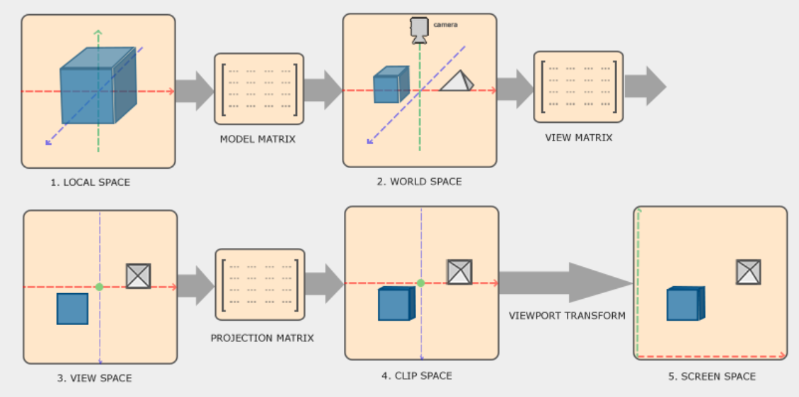
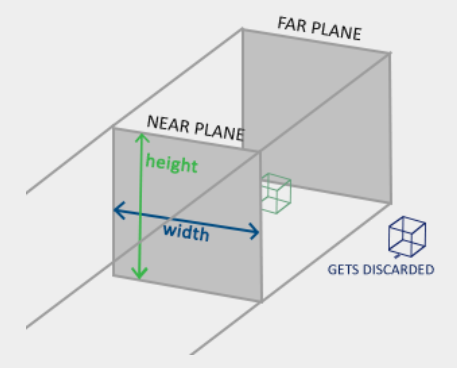
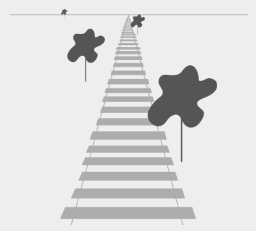

# 坐标系 Coordinate Systems

上一章我们学习了如何利用变换矩阵来变换所有顶点，从而更好地使用矩阵。OpenGL 要求所有我们希望可见的顶点在每次==顶点着色器运行后==都处于==归一化设备坐标系==中。也就是说，每个顶点的 `x` 、 `y` 和 `z` 坐标应该介于 `-1.0` 和 `1.0` 之间；超出此范围的坐标将不可见。通常的做法是，我们指定一个自定义范围（或空间）内的坐标，然后==在顶点着色器中将这些坐标变换为*归一化设备坐标 (NDC)*==。之后，这些 NDC 坐标会被传递给光栅化器，由光栅化器将其转换为屏幕上的二维坐标/像素。  

> 顶点着色器：处理的是“点”（数学上的位置）。
> 光栅化器：把“点”连接成“面”，并把这个“面”切碎成一个个对应屏幕像素的“小方块”（片段）。 ~~确定哪些像素属于这个图形~~ 
> 片段着色器：给这些被选中的“小方块”涂上最终的颜色。

将坐标系转换为 NDC 坐标系通常是分步进行的，即先将对象的顶点转换到多个坐标系，最后再转换到 NDC _坐标_ 系。这样做的好处是，==某些操作/计算在某些坐标系中更容易进行==，这一点很快就会显现出来。总共有 5 个对我们来说比较重要的坐标系：

-   *局部空间（或对象空间）* ~~Local Space，也称物体空间~~ 
-   *世界空间* ~~World Space，乘以 Model Matrix (模型矩阵)后得到。把所有物体放到同一个大地图里，有了各自的相对位置~~ 
-   *视野空间（或眼睛空间）* ~~乘以 View Matrix (观察矩阵)后得到。状态： 以摄像机为原点(0,0,0)，看所有物体在哪里。类比： 摄影师扛起摄像机对准桌子。现在的坐标不再是“距离片场中心多远”，而是“距离镜头多远、在镜头画面的左边还是右边”~~ 
-   *裁剪空间*  ~~乘以 Projection Matrix (投影矩阵)后得到。状态： 决定哪些东西在镜头里，哪些在镜头外。类比： 摄影师决定用“广角镜头”还是“长焦镜头”。在这个空间里，超出镜头范围的物体（比如演员伸到画面外的手）会被直接剪掉。透视除法也发生在这个阶段之后。~~ 
-   *屏幕空间* ~~Viewport Transform (视口变换)。状态： 将坐标映射到显示器的实际像素（如 $1920 \times 1080$）。类比： 电影最后投映在电影院的银幕上。*原本的比例坐标变成了具体的像素点位置*~~

这些都是顶点在最终变成片段之前会经历的不同状态。

你现在可能对空间或坐标系究竟是什么感到很困惑，所以我们首先会==以更宏观的方式解释它们==，展示==整体情况==以及==每个特定空间所代表的含义==。

# 全球概况 The global picture

为了将坐标从一个空间转换到另一个坐标空间，我们将使用几个变换矩阵，其中最重要的包括==*模型矩阵*==、==*视图矩阵*==和==*投影矩阵*==。我们的顶点坐标首先在*局部空间*中作为局部坐标出现，然后进一步转换为==*世界坐标 ~~World Coordinates~~ 、视图坐标 ~~View Coordinates)~~ 、裁剪坐标 ~~Clip Coordinates~~ ，最终转换为屏幕坐标 ~~Screen Coordinates~~ *==。下图展示了这一过程，并说明了每个变换的作用：



1.  局部坐标系是指==物体*相对于其局部原点*的坐标==；它是物体最初所在的坐标系。 ~~如上图所示，它是以物体自己的中心点作为原点来定坐标~~ 
2.  下一步是将局部坐标转换为世界空间坐标，即相对于更大世界的坐标。这些坐标是==相对于世界的*某个全局原点*==而言的，许多*其他物体也相对于这个世界的原点放置*。 ~~这里的原点是随意定的，不一定是哪个~~ 
3.  接下来，我们将世界坐标转换为视图空间坐标，使得每个坐标都是*从相机或观察者的角度*看到的。
4.  在将坐标转换到视图空间后，我们需要将其投影到裁剪坐标系。*裁剪坐标系的范围是 `-1.0` 到 `1.0` ，它决定了哪些顶点最终会出现在屏幕上*。如果使用==透视投影==，投影到裁剪空间坐标系可以添加==透视==效果。
5.  最后，我们将裁剪坐标转换为屏幕坐标，这个过程称为==视口变换，它将坐标从 `-1.0` 到 `1.0` 转换为 glViewport 定义的坐标范围==。然后，==将转换后的坐标发送到光栅化器，将其转换为片段==。

你可能已经对每个空间的用途略知一二了。我们之所以要将顶点变换到这些不同的空间，是因为==某些操作在特定的坐标系中更有意义或更容易==操作。例如，==修改对象时，在局部空间==中进行最为合理；而==计算对象相对于其他对象位置的某些操作时，在世界坐标系中==则最为合理，等等。如果我们愿意，==我们可以定义*一个*变换矩阵，一次性完成从局部空间到裁剪空间的转换，但这会降低我们的灵活性==。

下面我们将更详细地讨论每个坐标系。

# 局部空间 Local space

局部空间是指与你的物体相关的坐标空间，也就是物体初始所在的位置。假设你在建模软件（例如 Blender）中创建了一个立方体。即使立方体在最终应用中的位置可能不同，它的原点很可能位于 `(0,0,0)` 。你创建的所有模型可能都以 `(0,0,0)` 为初始位置。因此，模型的所有顶点都位于 _局部_ 空间中：它们都与你的物体相关。

我们使用的容器的顶点坐标被指定为介于 `-0.5` 和 `0.5` 之间的值，原点为 `0.0` 。这些是局部坐标。  

> 我们的顶点数组里写的是 -0.5 到 0.5，这只是在定义这个“书柜”长什么样、有多大。至于它最后出现在屏幕哪个角落，那是后面模型矩阵该操心的事

# 世界空间 World space- 模型矩阵

如果我们直接将所有对象导入应用程序，它们很可能都会位于世界坐标原点 $(0,0,0)$世界的坐标。我们希望==将对象转换到这个坐标空间==，使它们能够==以某种方式分散在场景==中（最好是以一种逼真的方式）。对象的坐标==从局部空间转换到世界空间==；这是通过==模型矩阵==实现的。

模型矩阵是一个变换矩阵，它==通过平移、缩放和/或旋转==来==将物体放置在场景中它*所属的位置/方向*==。你可以把它想象成对一栋房子进行变换：先==将其缩小（它在局部空间中显得有点大），然后将其平移到郊区小镇，并沿 y 轴向左旋转一点==，使其与周围的房子完美契合。你也可以把==上一章中用于在场景中定位容器的矩阵看作是一种*模型矩阵*==；我们把容器的局部坐标变换到了场景/世界中的其他位置。 ~~相对(原点)的位置~~ 

# 视图空间 View space - 观察矩阵

人们通常将视图空间称为 OpenGL 中的摄像机（有时也称为相机空间或眼睛空间）。视图空间是==将*世界空间坐标*变换到*用户视野前方坐标*==的结果。因此，视图空间是*从摄像机视角看到的空间*。这通常是通过==*平移和旋转*==的组合来实现的，通过平移/旋转场景，*==使某些物体变换到摄像机前方==*。这些组合变换通常存储在*视图矩阵*中，该矩阵将世界坐标变换到视图空间。==在下一章中，我们将详细讨论如何创建这样的视图矩阵来模拟摄像机==。

# 裁剪空间 - 投影矩阵

在==每次顶点着色器运行结束时，OpenGL 要求坐标必须在一个特定范围内，任何超出此范围的坐标都会被裁剪==。被裁剪的坐标会被丢弃，因此剩余的坐标最终会以片段的形式显示在屏幕上。这也是“裁剪空间”名称的由来。

因为==将所有可见坐标指定在 `-1.0` 到 `1.0` 范围内并*不直观*，所以我们*指定了自己的坐标集，并将其转换回 OpenGL 所期望的 NDC 坐标*==。 ~~这句话很重要，说明了为什么会需要裁剪空间以及需要投影矩阵~~ 

为了==将顶点坐标从视图空间转换到裁剪空间==，我们==定义了一个所谓的投影矩阵，它*指定了每个维度上的坐标范围，例如 `-1000` 到 `1000` 然后，投影矩阵会将指定范围内的坐标转换为归一化设备坐标 ( `-1.0` , `1.0` )*（并非直接转换，*中间会经过一个称为透视除法*的步骤）==。超出此范围的所有坐标都不会映射到 `-1.0` 到 `1.0` 之间，因此会被裁剪。根据我们在*投影矩阵*中指定的范围，坐标 ( `1250` , `500` , `750` ) 将不可见，因为 `x` 坐标超出了范围，因此会被转换为大于 `1.0` 的 NDC 坐标，从而被裁剪。

请注意，==如果图元（例如三角形）只有一部分位于裁剪体积之外，OpenGL 会将该三角形重建为一个或多个三角形，以适应裁剪范围==。

投影矩阵创建的这个 _视锥体_ 称为视锥体，落入该==视锥体==内的每个坐标最终都会显示在用户的屏幕上。==将指定范围内的坐标转换为*易于映射到二维视空间坐标的 NDC（归一化数字坐标）* 的整个过程==称为投影，因为投影矩阵==将三维坐标投影到易于映射到二维的归一化设备坐标==上。

当所有顶点都被转换到裁剪空间后，==会执行一个称为*透视除法*的最终操作，即将位置向量的 `x` 、 `y` 和 `z` 分量除以该向量的齐次 `w` 分量；透视除法将 4D 裁剪空间坐标转换为 3D 归一化设备坐标==。此步骤在顶点着色器步骤结束时*自动执行* ~~注意，是自动执行~~ 。

在此阶段之后，生成的坐标将被映射到屏幕坐标（使用 glViewport 的设置），并转换为片段。

==将视图坐标转换为裁剪坐标的*投影矩阵*==通常有两种不同的形式，每种形式都定义了其独特的视锥体。我们可以创建*正交投影矩阵*或*透视投影矩阵*。

## 正投影

正交投影矩阵定义了一个类似立方体的视锥体，该视锥体定义了裁剪空间，位于该视锥体外部的每个顶点都会被裁剪掉。创建正交投影矩阵时，我们需要==指定可见视锥体的宽度、高度和长度==。该视锥体内部的==所有坐标经矩阵变换后都将位于 NDC 范围内==，因此不会被裁剪。该视锥体看起来有点像一个容器：



视锥体定义了可见坐标，它由==宽度、高度以及近平面 ~~near plane~~ 和远平面 ~~far plane~~ 指定==。近平面前方的任何坐标都会被裁剪，远平面后方的坐标也是如此。正交视锥体==直接==将视锥体内的所有坐标映射到归一化的设备坐标，没有任何特殊副作用，因为它不会影响变换向量的 `w` 分量；==如果 `w` 分量始终等于 `1.0` 则透视除法不会改变坐标。==

为了创建正交投影矩阵，我们使用 GLM 的内置函数 `glm::ortho` ：

```css
glm::ortho(0.0f, 800.0f, 0.0f, 600.0f, 0.1f, 100.0f);
```

前两个参数指定==视锥体的左右 ~~x~~ 坐标==，第三个和第四个参数指定==视锥体的上下坐标 ~~y~~ ==。利用这四个点，我们定义了近平面和远平面的大小，第五个和第六个参数则定义了==近平面 ~~离相机最近的可见距离~~ 和远平面 ~~离相机最远的可见距离~~ ==的距离。这个特定的投影矩阵将 `x` 、 `y` 和 `z` 范围内的所有坐标值转换为归一化的设备坐标。

正交投影矩阵==直接将坐标映射到屏幕所在的二维平面上==，但实际上，直接投影会==产生不真实的结果，因为它没有考虑透视效果==。而透视投影矩阵则可以解决这个问题。

## 透视投影

如果你仔细观察过_现实生活_中的景象，你会发现==远处的物体看起来要小得多。这种奇特的现象我们称之为透视==。当我们沿着无限延伸的高速公路或铁路线向下看时，透视效果尤为明显，如下图所示：



正如你所见，由于透视原理，在足够远的距离上，线条看起来会重合。这正是==透视投影试图模拟的效果==，它使用==透视投影矩阵==来实现这一点。投影矩阵将*给定的视锥体范围*映射到裁剪空间，同时还会==调整每个顶点坐标的 `w` 值，使得*顶点坐标距离观察者越远，其 `w` 分量就越大==*。*坐标转换到裁剪空间后，其范围为 `-w` 到 `w` （超出此范围的任何值都会被裁剪）*。OpenGL 要求最终顶点着色器输出的可见坐标落在 `-1.0` 到 `1.0` 范围内，因此，==一旦坐标进入裁剪空间，就会对裁剪空间坐标应用透视除法==：

$$\begin{array}{c} out = \begin{pmatrix} x /w \\ y / w \\ z / w \end{pmatrix} \end{array}$$

顶点坐标的每个分量都除以其 `w` 分量，因此顶点距离观察者越远，其坐标值就越小。这也是 ==`w` 分量重要的另一个原因，因为它有助于透视投影==。最终得到的坐标位于==归一化的设备空间==中。如果您有兴趣了解*正交投影矩阵和透视投影矩阵*的实际计算方法（并且不畏惧数学），我推荐您阅读 Songho 的[这篇优秀文章](http://www.songho.ca/opengl/gl_projectionmatrix.html) 。

在 GLM 中，透视投影矩阵可以按如下方式创建：

```cpp
glm::mat4 proj = glm::perspective(glm::radians(45.0f), (float)width/(float)height, 0.1f, 100.0f);
```

`glm::perspective` 作用是创建一个大的_视锥体_来定义可见空间，视锥体之外的任何物体都不会被裁剪到裁剪空间中，因此会被裁剪掉。==视锥体可以想象成一个形状不规则的立方体==，==立方体内部的每个坐标都会映射到裁剪空间中的一个点==。下图展示了一个视锥体：


它的第一个参数定义了视场角（FOV）值，即==视野范围==，它决定了视场的大小。为了获得逼真的视觉效果，==通常将其设置为 45 度==，但如果想要更接近《毁灭战士》风格的效果，可以将其设置为更大的值。第二个参数设置了==宽高比==，它是通过将视口的宽度除以其高度计算得出的。第三个和第四个参数分别设置了==视锥体的 _近_ 平面和 _远_ 平面==。我们==通常将近距离设置为 `0.1` ，远距离设置为 `100.0`== 。所有位于近平面和远平面之间且在视锥体内部的顶点都将被渲染。

>  ~~关于第二个参数~~   
>  1. 投影矩阵的“预压” (Matrix Pre-scaling)由于你的窗口是 $1920 \times 1080$，宽高比 $aspect \approx 1.77$。在投影矩阵里，$X$ 轴的缩放系数变成了 $\frac{1}{1.77}$。这意味着，在数据传给 GPU 之前，投影矩阵先把所有的 $X$ 坐标横向压缩了。原本的正方形，在这一步变成了细长的长方形。
>  2. 窗口的“拉伸” (Viewport Stretching)当 GPU ==把算好的坐标画到 $1920 \times 1080$ 的屏幕上时，它会执行一个物理操作：*把坐标平铺到整个像素区域* ~~这里就是关键了，很重要~~ ==。因为窗口本身是横向很宽的，它会把刚才那个“细长”的形状横向拉伸。

当透视矩阵的 _近场_ 值设置得太高（例如 `10.0` ）时，OpenGL 会将所有靠近摄像机的坐标（介于 `0.0` 和 `10.0` 之间）裁剪掉，这可能会产生一种视觉效果，你可能以前在电子游戏中见过，即当你靠近某些物体时，可以看到它们穿过物体。

> 正常情况下（Near=0.1）：你几乎要贴到墙面上，才会看到墙消失。异常情况下（Near=10.0）：当你距离墙还有 9.9米 的时候，这面墙就已经进入了 OpenGL 的“裁剪禁区”（$0.0 \sim 10.0$）。于是，神奇的事情发生了：虽然你的相机（也就是你的“头”）还在墙外面，但因为墙距离你小于 10，OpenGL 停止渲染这面墙了。既然==墙不画了，你就能直接看到墙后面的东西==（比如房间里的桌子、敌人或者天空）。这时候给你的视觉反馈就是：你好像“看穿”了物体，或者你的头“钻”进了物体内部

使用正交投影时，每个顶点坐标都直接映射到裁剪空间，而没有进行任何复杂的透视分割（它*仍然会进行透视分割，但 `w` 分量不会被修改（它始终为 `1` ），因此不会产生任何影响*）。由于正交投影不使用透视投影，远处的物体看起来不会变小，这会导致视觉效果怪异。因此，==正交投影主要用于 2D 渲染以及一些建筑或工程应用==，在这些应用中，我们不希望顶点因透视而变形。像 _Blender_ 这样的 3D 建模软件有时也会使用正交投影进行建模，因为它能==更准确地描绘每个物体的尺寸==。下面您将看到 Blender 中两种投影方法的比较：


==你可以看到，在透视投影中，距离较远的顶点看起来要小得多，而在正交投影中，每个顶点到用户的距离都相同==。

# 把所有东西整合起来

我们为上述每个步骤创建*变换矩阵*：*模型矩阵*、*视图矩阵*和*投影矩阵*。然后，顶点坐标按如下方式变换为裁剪坐标：

$$V_{clip} = M_{projection} \cdot M_{view} \cdot M_{model} \cdot V_{local}$$

注意矩阵乘法的顺序是相反的（记住，矩阵乘法运算要从右到左进行）。然后，==将得到的顶点赋值给顶点着色器中的 gl\_Position 变量 ，OpenGL 将自动执行透视除法和裁剪==。 进而*顶点着色器的输出要求坐标位于裁剪空间*，这正是我们刚才使用变换矩阵所做的。OpenGL 随后对 _裁剪空间坐标_ 执行 _透视除法_ ，将其转换为 _归一化设备坐标_ 。OpenGL 再使用 glViewPort 的参数==将归一化设备坐标映射到 _屏幕坐标，_ 其中每个坐标对应于屏幕上的一个点（在本例中为 800x600 的屏幕）==。这个过程称为 _视口变换_ 。

这是一个比较难理解的主题，所以如果您还不完全清楚每个坐标空间的具体用途，也不用担心。下面您将看到我们如何有效地利用这些坐标空间，后续章节中还会提供更多示例。


# 迈向 3D

现在我们知道如何将 3D 坐标转换为 2D 坐标，我们可以开始渲染真正的 3D 物体，而不是我们目前为止展示的简陋的 2D 平面。

要开始绘制 3D 模型，我们首先要创建一个模型矩阵。模型矩阵包含*平移、缩放和/或旋转变换*，这些变换将用于把所有对象的顶点 _转换_ 到全局世界空间。我们先绕 x 轴旋转一下平面，让它看起来像是平放在地板上。此时，模型矩阵如下所示：

```cpp
glm::mat4 model = glm::mat4(1.0f);
//图片的下面两个顶点往上转，离眼睛更近，所以图片下面变大了
model = glm::rotate(model, glm::radians(-55.0f), glm::vec3(1.0f, 0.0f, 0.0f));
```

==通过将顶点坐标与该模型矩阵相乘，我们将顶点坐标转换为世界坐标== ~~局部空间坐标---(模型矩阵)--->世界坐标~~ 。因此，我们略微位于地面上的平面就代表了全局世界中的平面。

接下来我们需要创建一个视图矩阵。我们希望在场景中稍微向后移动，使物体可见（==在世界空间中，我们位于原点 `(0,0,0)` ~~这里是指摄像机位于原点~~ == ）。为了在场景中移动，请考虑以下几点：

-   将摄像机向后移动，就相当于将整个场景向前移动。

这正是视图矩阵的作用，我们将整个场景反向移动到我们希望摄像机移动的位置。  
因为我们想要向后移动，而 OpenGL 是右手坐标系，所以我们必须沿正 z 轴方向移动。我们通过沿负 z 轴方向平移场景来实现这一点。这样就产生了向后移动的错觉。 

***右手系统***  

按照惯例，==OpenGL 是一个右手坐标系==。这意味着 x 轴正方向位于你的右侧，y 轴正方向位于上方，z 轴正方向位于你的后方。你可以想象屏幕是这三个坐标轴的中心，z 轴正方向穿过屏幕指向你。坐标轴的绘制方式如下：


要了解为什么称之为右手习惯，请执行以下操作：

-   将右臂沿正 y 轴方向伸展，手放在手臂上方。
-   让你的(大)拇指指向右边。
-   让你的食指指向上方。
-   现在将你的中指向下弯曲90度。

如果操作正确，你的(大)拇指应该指向正 x 轴，食指指向正 y 轴，中指指向正 z 轴。如果你用左手这样做，你会发现 z 轴的方向是相反的。这被称为==左手坐标系，DirectX 通常使用这种坐标系==。需要注意的是，==在归一化设备坐标系中，OpenGL 实际上也使用左手坐标系（投影矩阵会改变坐标方向）==。

我们将在下一章更详细地讨论如何在场景中移动。目前，视图矩阵如下所示：

```rust
glm::mat4 view = glm::mat4(1.0f);
// note that we're translating the scene in the reverse direction of where we want to move
//如果不用投影，不会处理w，直接就超出了[1.0,1.0]的范围
view = glm::translate(view, glm::vec3(0.0f, 0.0f, -3.0f));
```

==最后需要定义的是*投影矩阵*==。我们希望场景使用透视投影，因此我们将这样声明投影矩阵：

```ruby
glm::mat4 projection;
projection = glm::perspective(glm::radians(45.0f), 800.0f / 600.0f, 0.1f, 100.0f);
```

现在我们==已经创建了变换矩阵，应该将它们传递给着色器==。首先，让我们在顶点着色器中将变换矩阵声明为 uniform 变量，并将其与顶点坐标相乘：

```csharp
#version 330 core
layout (location = 0) in vec3 aPos;
...
uniform mat4 model;
uniform mat4 view;
uniform mat4 projection;

void main()
{
    // note that we read the multiplication from right to left
    gl_Position = projection * view * model * vec4(aPos, 1.0);
    ...
}
```

我们还应该==将矩阵发送到着色器==（这通常在每一帧都执行，因为变换矩阵往往会发生很大变化）：

```cpp
int modelLoc = glGetUniformLocation(ourShader.ID, "model");
glUniformMatrix4fv(modelLoc, 1, GL_FALSE, glm::value_ptr(model));
... // same for View Matrix and Projection Matrix
```

现在，经过模型矩阵、视图矩阵和投影矩阵的变换，顶点坐标已经转换完毕，最终对象应该是：

-   ==向后倾斜至地面==。
-   离我们稍微远一点。
-   要以透视方式显示（==顶点越远，图像应该越小==）。

让我们来检验一下结果是否确实满足这些要求： 

看起来这架飞机确实像是一个静止在某个假想地面上的三维平面。如果你没有得到相同的结果，请将你的代码与完整的 [源代码](https://learnopengl.com/code_viewer_gh.php?code=src/1.getting_started/6.1.coordinate_systems/coordinate_systems.cpp)进行比较。

# 更多 3D 效果

到目前为止，我们一直在处理二维平面，即使在三维空间中也是如此。现在，让我们尝试一下，将二维平面扩展到三维立方体。渲染一个立方体总共需要 36 个顶点（6 个面 \* 2 个三角形 \* 每个三角形 3 个顶点）。36 个顶点数量很多，难以一一计算，您可以从 [这里](https://learnopengl.com/code_viewer.php?code=getting-started/cube_vertices)获取它们。 ~~注意，这里把顶点改了~~ 

```cpp
float vertices[] = {
    -0.5f, -0.5f, -0.5f,  0.0f, 0.0f,
     0.5f, -0.5f, -0.5f,  1.0f, 0.0f,
     0.5f,  0.5f, -0.5f,  1.0f, 1.0f,
     0.5f,  0.5f, -0.5f,  1.0f, 1.0f,
    -0.5f,  0.5f, -0.5f,  0.0f, 1.0f,
    -0.5f, -0.5f, -0.5f,  0.0f, 0.0f,

    -0.5f, -0.5f,  0.5f,  0.0f, 0.0f,
     0.5f, -0.5f,  0.5f,  1.0f, 0.0f,
     0.5f,  0.5f,  0.5f,  1.0f, 1.0f,
     0.5f,  0.5f,  0.5f,  1.0f, 1.0f,
    -0.5f,  0.5f,  0.5f,  0.0f, 1.0f,
    -0.5f, -0.5f,  0.5f,  0.0f, 0.0f,

    -0.5f,  0.5f,  0.5f,  1.0f, 0.0f,
    -0.5f,  0.5f, -0.5f,  1.0f, 1.0f,
    -0.5f, -0.5f, -0.5f,  0.0f, 1.0f,
    -0.5f, -0.5f, -0.5f,  0.0f, 1.0f,
    -0.5f, -0.5f,  0.5f,  0.0f, 0.0f,
    -0.5f,  0.5f,  0.5f,  1.0f, 0.0f,

     0.5f,  0.5f,  0.5f,  1.0f, 0.0f,
     0.5f,  0.5f, -0.5f,  1.0f, 1.0f,
     0.5f, -0.5f, -0.5f,  0.0f, 1.0f,
     0.5f, -0.5f, -0.5f,  0.0f, 1.0f,
     0.5f, -0.5f,  0.5f,  0.0f, 0.0f,
     0.5f,  0.5f,  0.5f,  1.0f, 0.0f,

    -0.5f, -0.5f, -0.5f,  0.0f, 1.0f,
     0.5f, -0.5f, -0.5f,  1.0f, 1.0f,
     0.5f, -0.5f,  0.5f,  1.0f, 0.0f,
     0.5f, -0.5f,  0.5f,  1.0f, 0.0f,
    -0.5f, -0.5f,  0.5f,  0.0f, 0.0f,
    -0.5f, -0.5f, -0.5f,  0.0f, 1.0f,

    -0.5f,  0.5f, -0.5f,  0.0f, 1.0f,
     0.5f,  0.5f, -0.5f,  1.0f, 1.0f,
     0.5f,  0.5f,  0.5f,  1.0f, 0.0f,
     0.5f,  0.5f,  0.5f,  1.0f, 0.0f,
    -0.5f,  0.5f,  0.5f,  0.0f, 0.0f,
    -0.5f,  0.5f, -0.5f,  0.0f, 1.0f
};
```

为了增加趣味性，我们会让立方体随时间旋转：

```ini
model = glm::rotate(model, (float)glfwGetTime() * glm::radians(50.0f), glm::vec3(0.5f, 1.0f, 0.0f));
```

然后我们将使用 glDrawArrays 绘制立方体（因为我们没有指定索引），但这次顶点数为 36。

```scss
glDrawArrays(GL_TRIANGLES, 0, 36);
```

你应该会得到类似以下内容：

 

它确实有点像个立方体，但总感觉哪里不对劲。==立方体的某些面被绘制到了其他面之上==。这是因为 OpenGL 在绘制立方体时，会==逐个三角形、逐个片段==地绘制，这==会覆盖之前已经绘制过的像素颜色==。由于 OpenGL 无法保证三角形的渲染顺序（在同一次绘制调用中），因此==即使一个三角形应该在另一个三角形的前面，有些三角形也会被绘制在彼此之上==。

幸运的是，OpenGL ==将深度信息存储在一个名为 z 缓冲区的缓冲区中，该缓冲区允许 OpenGL 决定何时在某个像素上绘制，何时不绘制==。利用 z 缓冲区，我们可以配置 OpenGL 进行深度检测。

## Z 缓冲区

OpenGL 将所有==深度信息==存储在 ==z 缓冲区（也称为深度缓冲区）==中。GLFW 会自动创建这样一个缓冲区（就像它有一个颜色缓冲区来存储输出图像的颜色一样）。深度信息存储在每个片段中（作为片段的 `z` 值），每当片段需要输出颜色时，OpenGL 都会将其深度值与 z 缓冲区进行比较。==如果当前片段位于其他片段之后，则会丢弃该片段；否则，覆盖其深度值。此过程称为深度测试，由 OpenGL 自动完成==。 

>  ~~每个片段会有一个z值，且每个片段会在深度缓冲区存储一个z_has，如果要绘制某个片段（他的z为z_now）且深度缓冲区已经有这个片段对应的z_has，如果z_now 在 z_has后面， 那么就不会绘制那个片段，否则就会绘制~~ 

但是，如果我们想确保 OpenGL 实际执行深度测试，首先需要告诉 OpenGL 我们想要启用深度测试；默认情况下它是禁用的。我们可以使用 \`glEnable\` 函数启用==深度测试==。\`glEnable\` 和 \`glDisable\` 函数允许我们启用/禁用 OpenGL 中的某些功能。这些功能会一直保持启用/禁用状态，直到再次调用该函数来启用/禁用它。现在，我们想通过启用 \`GL\_DEPTH\_TEST\` 来启用深度测试：

```scss
glEnable(GL_DEPTH_TEST);
```

由于我们使用了深度缓冲区，因此需要在每次渲染迭代之前清除深度缓冲区（否则上一帧的深度信息会保留在缓冲区中）。与清除颜色缓冲区类似，我们可以通过在 glClear 函数中指定 DEPTH\_BUFFER\_BIT 位来清除深度缓冲区：

```scss
glClear(GL_COLOR_BUFFER_BIT | GL_DEPTH_BUFFER_BIT);
```

让我们重新运行程序，看看 OpenGL 现在是否执行深度测试：

 

好了！一个带有完整纹理、具备正确深度检测功能且会随时间旋转的立方体。点击 [此处](https://learnopengl.com/code_viewer_gh.php?code=src/1.getting_started/6.2.coordinate_systems_depth/coordinate_systems_depth.cpp)查看源代码。

## 更多方块！

假设我们要在屏幕上显示 10 个立方体。每个立方体看起来都一样，==唯一的区别在于它们在*世界*中的位置，每个立方体的*旋转角度都不同*==。立方体的图形布局已经定义好，因此在渲染更多对象时，我们*无需更改缓冲区或属性数组*。我们唯一需要==为每个对象更改的是它们的*模型矩阵*，该矩阵用于将立方体变换到世界坐标系中==。

首先，我们为每个立方体定义一个平移向量，用于指定其在世界空间中的位置。我们将在 `glm::vec3` 数组中定义 10 个立方体的位置：

```css
glm::vec3 cubePositions[] = {
    glm::vec3( 0.0f,  0.0f,  0.0f), 
    glm::vec3( 2.0f,  5.0f, -15.0f), 
    glm::vec3(-1.5f, -2.2f, -2.5f),  
    glm::vec3(-3.8f, -2.0f, -12.3f),  
    glm::vec3( 2.4f, -0.4f, -3.5f),  
    glm::vec3(-1.7f,  3.0f, -7.5f),  
    glm::vec3( 1.3f, -2.0f, -2.5f),  
    glm::vec3( 1.5f,  2.0f, -2.5f), 
    glm::vec3( 1.5f,  0.2f, -1.5f), 
    glm::vec3(-1.3f,  1.0f, -1.5f)  
};
```

现在，在渲染循环中，我们要调用 glDrawArrays 10 次，但==每次调用之前，都要向顶点着色器发送不同的模型矩阵==。我们将在渲染循环中创建一个小循环，每次使用不同的模型矩阵渲染对象 10 次。请注意，==我们还会为每个容器添加一个独特的旋转==。

```ruby
glBindVertexArray(VAO);
for(unsigned int i = 0; i < 10; i++)
{
    glm::mat4 model = glm::mat4(1.0f);
    model = glm::translate(model, cubePositions[i]);
    float angle = 20.0f * i; 
    model = glm::rotate(model, glm::radians(angle), glm::vec3(1.0f, 0.3f, 0.5f));
    ourShader.setMat4("model", model);

    glDrawArrays(GL_TRIANGLES, 0, 36);
}
```

这段代码会在*每次绘制新立方体时更新模型矩阵*，总共执行 10 次。现在我们应该看到一个充满 10 个旋转角度各异的立方体的世界：


太好了！看来我们的容器找到了一些志同道合的朋友。如果你遇到问题，可以尝试将你的代码与 [源代码](https://learnopengl.com/code_viewer_gh.php?code=src/1.getting_started/6.3.coordinate_systems_multiple/coordinate_systems_multiple.cpp)进行比较。

# 练习

-   尝试调整 GLM `projection` 函数的 `FoV` 和 `aspect-ratio` 参数，看看能否找出它们如何影响透视锥体。
-   通过沿多个方向平移来调整视图矩阵，观察场景的变化。可以将视图矩阵视为一个相机对象。
-   尝试使每隔 3 个容器（包括第 1 个容器）随时间旋转，而其他容器保持静止，仅使用模型矩阵： [解决方案](https://learnopengl.com/code_viewer_gh.php?code=src/1.getting_started/6.4.coordinate_systems_exercise3/coordinate_systems_exercise3.cpp) 。