# Camera  

上一章我们讨论了视图矩阵以及如何利用视图矩阵在场景中移动（我们稍微向后移动了一下）。OpenGL 本身并不支持 _摄像机_ 的概念，但我们可以尝试通过==反向移动场景中的所有物体来模拟摄像机，从而产生*移动*的错觉==。

本章我们将讨论如何在 OpenGL 中设置摄像机。我们将介绍一种==飞行式摄像机==，它允许您==在 3D 场景中自由移动==。我们还==将讨论键盘和鼠标输入==，最后介绍==自定义摄像机类==。

# 相机/视图空间 Camera/View space

当我们讨论相机/视图空间时，指的是从相机视角（即场景原点）观察到的所有顶点坐标：视图矩阵将所有==世界坐标==转换为==相对于*相机位置和方向*的视图坐标==。要*定义一个相机*，我们需要它在世界空间中的位置、它的朝向、一个指向右侧的向量和一个指向上方的向量。细心的读者可能会注意到，我们实际上要==创建一个以*相机位置*为原点的、具有*三个相互垂直的单位轴*的坐标系==。 ~~本章前面的目的，那转换成这个坐标系的目的又是什么呢？--->(重要★★)：世界上所有的物体坐标都重新量一遍，量出它们==*相对*于你*眼睛*的*距离和角度*==。~~   
 ~~注意下面这个公式：~~   
 $$\begin{array}{c} LookAt = \begin{bmatrix} \color{red}{R_x} & \color{red}{R_y} & \color{red}{R_z} & 0 \\ \color{green}{U_x} & \color{green}{U_y} & \color{green}{U_z} & 0 \\ \color{blue}{D_x} & \color{blue}{D_y} & \color{blue}{D_z} & 0 \\ 0 & 0 & 0  & 1 \end{bmatrix} * \begin{bmatrix} 1 & 0 & 0 & -\color{purple}{P_x} \\ 0 & 1 & 0 & -\color{purple}{P_y} \\ 0 & 0 & 1 & -\color{purple}{P_z} \\ 0 & 0 & 0  & 1 \end{bmatrix} \end{array}$$  

   
左边这个矩阵，是用以观察点为原点的坐标系算出的三个点，来形成新坐标系。由于矩阵 乘法是先进行右边的换算，P表示cameraPos，所以就是说，先乘以右边矩阵，把世界坐标系的原点移到和cameraPos重叠；再乘以左边矩阵，得出在新坐标系下以cameraPos为原点，他的坐标该是多少（也就是换算成了原坐标系下的每个点，在新坐标系下与cameraPos的x,y,z的距离）


------  


~~下面这张图符合右手定则，即其中一个轴的正方向都是其他两个轴正方向的叉积~~  

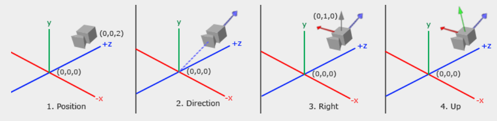  

> 移动摄像机的效果，有点像，让view 在xyz轴前后左右加减。必要的时候还有旋转  

```cpp
//让相机先向上，再靠近(向前，即-z轴方向)
//view = glm::translate(view, glm::vec3(0.0f, -0.5f, 2.0f));
```


## 1\. 摄像机位置 Camera position

获取摄像机位置很简单。摄像机位置是世界空间中的一个向量，指向摄像机的实际位置。我们将摄像机设置在与上一章相同的位置：

```cpp

//这是上一章，在视图中设置成了 -3.0f，即让图上所有顶点向负z轴移动，也就是摄像机向正z轴移动
//试图空间，观察矩阵
//view = glm::translate(view, glm::vec3(0.0f, 0.0f, -3.0f));

glm::vec3 cameraPos = glm::vec3(0.0f, 0.0f, 3.0f);
```

别忘了正 z 轴是穿过屏幕朝向你的方向，所以如果我们想让相机向后移动，我们就沿着正 z 轴移动。

## 2\. 摄像机方向 Camera direction

接下来需要的是摄像机的==方向向量==，也就是它指向的方向。现在我们假设摄像机==指向场景的原点： `(0,0,0)`== 。记住，两个向量相减会得到一个向量，这个向量就是这两个向量的差值。因此，==从场景原点向量中减去摄像机位置向量，就能得到我们想要的方向向量==。对于视图矩阵的坐标系，我们希望它的 z 轴为正，并且由于按照惯例（在 OpenGL 中），==摄像机指向 z 轴的负方向==，所以我们需要对方向向量取反。如果我们交换一下减法的顺序，现在就能得到一个==指向摄像机 z 轴正方向的向量==：

```cpp
glm::vec3 cameraTarget = glm::vec3(0.0f, 0.0f, 0.0f);

//把观察点位置取反，然后加上代表摄像机的向量，结果就是观察点指向摄像机方向的向量，即正z轴方向的单位向量。（A-B的结果就是让B首端指向A末端）
//normalize：归一化，让向量的长度变成1，但是方向不变。把它变成长度为 1 的单位向量后，它就能作为一个标准的轴（Axis）--z轴
glm::vec3 cameraDirection = glm::normalize(cameraPos - cameraTarget);
```

名称 _方向_ 向量并不是最佳选择，因为它实际上==指向的方向与它指向目标的方向相反==。

## 3\. 右轴 Right axis

接下来我们需要的向量是一个 _右_ 向量，它代表相机空间的正 x 轴方向。为了得到这个 _右_ 向量，我们先用一个小技巧：首先指定一个指向世界空间上方的 _上_ 向量。然后，我们对这个上向量和步骤 2 中得到的方向向量进行叉积运算。由于叉积的结果是一个垂直于这两个向量的向量，我们将得到一个指向正 x 轴方向的向量（如果我们交换叉积的顺序，就会得到一个指向负 x 轴方向的向量）：

```cpp

//这里的目的是得到一个垂直于cameraDirection的单位向量，所以这个up向量其实可以是任意的，只要不和cameraDirection平行  都可以得到cameraRight。但是如果不是(0.0f, 1.0f, 0.0f)，摄像机拍出来的图像就不是那么正（相对于原图）
glm::vec3 up = glm::vec3(0.0f, 1.0f, 0.0f); 
//这里最重要的是，得到一个和正z轴垂直的指向正x轴方向的单位向量
//叉积，得到一个垂直于这两个向量的向量
//叉积（Cross Product）的方向遵循右手定则，伸出右手，平整手掌。四指指向第一个向量：也就是 up）。向第二个向量弯曲四指：也就是 cameraDirection。大拇指的指向：就是叉积的结果 cameraRight
glm::vec3 cameraRight = glm::normalize(glm::cross(up, cameraDirection));
```

 ~~这里举个例子说一下这个 up 向量的作用：  ~~ 

```cpp
//这里把这个up改成了 (-1.0f, 1.0f, 0.0f)【(0.0f, 1.0f, 0.0f)旋转45的结果】 ，之后图像反而是正的
view = glm::lookAt(glm::vec3(0.0f, 0.0f,  3.0f),
	glm::vec3(0.0f, 0.0f, 0.0f), glm::vec3(-1.0f, 1.0f, 0.0f));

//这里让他绕着z轴旋转了45度
model = glm::rotate(model, glm::radians(45.0f), glm::vec3(0.0f, 0.0f, 1.0f));
```

## 4\. 上轴 Up axis

现在我们有了 x 轴向量和 z 轴向量，要得到指向相机正 y 轴的向量就相对容易了：我们计算右向量和方向向量的叉积：

```cpp
//指向相机正 y 轴的向量
glm::vec3 cameraUp = glm::cross(cameraDirection, cameraRight);
```

借助叉积和一些技巧，我们得以==创建构成视图/相机空间的所有向量==。对于数学爱好者来说，这个过程在线性代数中被称为[格拉姆-施密特正交](http://en.wikipedia.org/wiki/Gram%E2%80%93Schmidt_process)化过程。==利用这些相机向量，我们现在可以创建一个 LookAt 矩阵，它对于创建相机非常有用==。

# LookAt

矩阵的一个优点是，如果你==用三个相互垂直（或非线性）的坐标轴定义一个坐标空间==，你可以创建一个==包含这三个坐标轴和一个平移向量的矩阵==，然后==*将任何向量乘以这个矩阵，就能将其变换到该坐标空间*==。这正是 _LookAt_ 矩阵的工作原理。现在我们有了==*三个相互垂直的坐标轴和一个位置向量*==来定义相机空间，就可以创建我们自己的 LookAt 矩阵了：

$$\begin{array}{c} LookAt = \begin{bmatrix} \color{red}{R_x} & \color{red}{R_y} & \color{red}{R_z} & 0 \\ \color{green}{U_x} & \color{green}{U_y} & \color{green}{U_z} & 0 \\ \color{blue}{D_x} & \color{blue}{D_y} & \color{blue}{D_z} & 0 \\ 0 & 0 & 0  & 1 \end{bmatrix} * \begin{bmatrix} 1 & 0 & 0 & -\color{purple}{P_x} \\ 0 & 1 & 0 & -\color{purple}{P_y} \\ 0 & 0 & 1 & -\color{purple}{P_z} \\ 0 & 0 & 0  & 1 \end{bmatrix} \end{array}$$

其中 R 是右向量， U 是上向量， D 是方向向量， P 是摄像机的位置向量。注意，旋转（左矩阵）和平移（右矩阵）部分是取反的（分别取转置和取反），因为我们==希望世界坐标系沿与摄像机移动方向相反的方向*旋转和平移*==。使用这个 LookAt 矩阵作为视图矩阵，可以有效地*将所有世界坐标系转换到我们刚刚定义的视图空间*  ~~这是上述所有操作的目的~~ 。LookAt 矩阵的作用正如其名：它==创建一个 _指向_ 给定目标的视图矩阵==。   

>  ~~通俗点讲，LookAt以摄像头为中心，给世界换一把尺子。原点挪到了相机，轴也换成了相机的轴。先乘以右边矩阵，把*世界坐标系的原点移到和cameraPos重叠*；再乘以左边矩阵，得出*在新坐标系下以cameraPos为原点，他的坐标该是多少*（也就是换算成了原坐标系下的每个点，在新坐标系下与cameraPos的x,y,z的距离），然后==*再把这个坐标掰回来放到屏幕上（以原来的(0,0)为基准）放正*==！
>  OpenGL 的视角（以世界原点为中心）：它觉得相机是不能动的（屏幕中心必须是 $0,0,0$），所以它把整个世界往反方向（这里是往$(0.0,0.0,3.0)$）拽，拽到相机重合原点，再把世界转个身，转到相机看正前方。~~ 

幸运的是，GLM 已经帮我们完成了所有这些工作。我们只需要指定*相机位置*、*目标位置*以及*表示世界空间中向上向量*的向量（即我们用于计算右向量的向上向量）。GLM 随后会创建 LookAt 矩阵，我们可以将其用作视图矩阵：

```ruby
glm::mat4 view;
view = glm::lookAt(glm::vec3(0.0f, 0.0f, 3.0f), 
     glm::vec3(0.0f, 0.0f, 0.0f), 
     glm::vec3(0.0f, 1.0f, 0.0f));
```

 ~~LookAt创建出的矩阵，用来将任意向量变换到该坐标系中：  
~~ 
$$\begin{array}{c} LookAt = \begin{bmatrix} \color{red}{R_x} & \color{red}{R_y} & \color{red}{R_z} & 0 \\ \color{green}{U_x} & \color{green}{U_y} & \color{green}{U_z} & 0 \\ \color{blue}{D_x} & \color{blue}{D_y} & \color{blue}{D_z} & 0 \\ 0 & 0 & 0  & 1 \end{bmatrix} * \begin{bmatrix} 1 & 0 & 0 & -\color{purple}{P_x} \\ 0 & 1 & 0 & -\color{purple}{P_y} \\ 0 & 0 & 1 & -\color{purple}{P_z} \\ 0 & 0 & 0  & 1 \end{bmatrix} \end{array}$$

glm::LookAt 函数分别需要位置向量、目标向量和向上向量。==本例创建的视图矩阵与上一章创建的视图矩阵相同。 ~~跟上一章的 view 等价(他把相机往外3.0f)~~ ==

在深入探讨用户输入之前，我们先来做一些有趣的事情，比如让摄像机==围绕场景旋转==。我们==将场景的目标点保持在 `(0,0,0)`== 。我们使用一些三角函数知识，在每一帧中创建一个代表圆上一个点的 `x` 和 `z` 坐标，并将这些坐标用作摄像机的位置。通过不断重新计算 `x` 和 `y` 坐标，我们遍历了圆上的所有点，从而实现了摄像机围绕场景的旋转。我们以预定义的半径放大这个圆，并在每一帧中使用 GLFW 的 glfwGetTime 函数创建一个新的视图矩阵：

```cpp
const float radius = 10.0f;
float camX = sin(glfwGetTime()) * radius; //0->10
float camZ = cos(glfwGetTime()) * radius; //10->0
glm::mat4 view;
view = glm::lookAt(glm::vec3(camX, 0.0, camZ), glm::vec3(0.0, 0.0, 0.0), glm::vec3(0.0, 1.0, 0.0)); //所以其实这里就是往右上绕
```

运行这段代码后，你应该会得到类似这样的结果：


这段代码可以==让摄像机随着时间推移围绕场景旋转==。您可以==随意调整半径和位置/方向参数==，来感受一下 _LookAt_ 矩阵的工作原理。如果遇到问题，也可以查看[源代码](https://learnopengl.com/code_viewer_gh.php?code=src/1.getting_started/7.1.camera_circle/camera_circle.cpp) 。  

## camZ固定为3.0，只让camX变化  

`0->3->6->10`:  

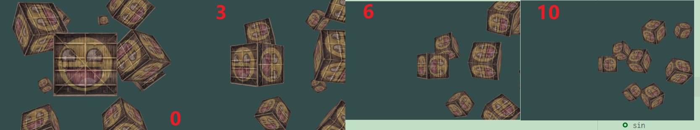  

`10->6->3->0`:    

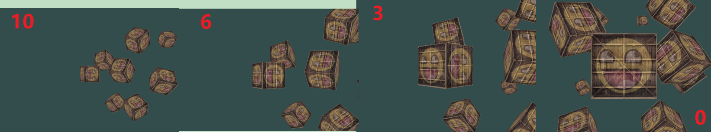

`-3->-6->-10`:  

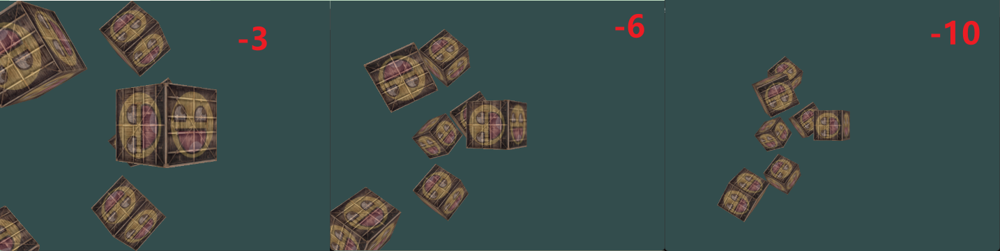  

`-6->-3->0`:  

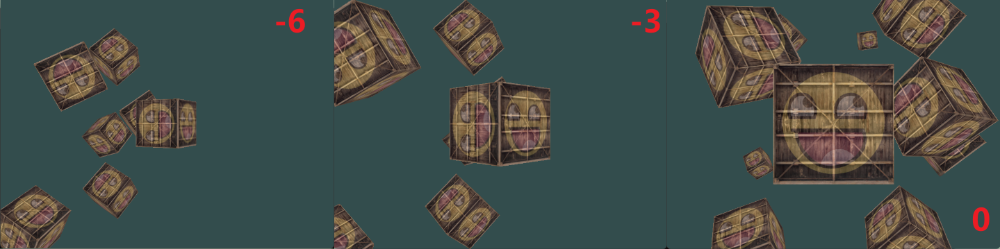  


# 正弦余弦函数图  

 ~~由于经常出现，这里附上sin 函数和cos函数的图像~~   
## sin

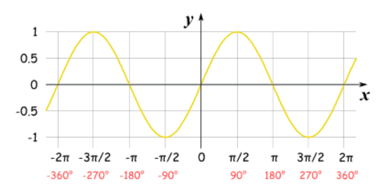  

## cos

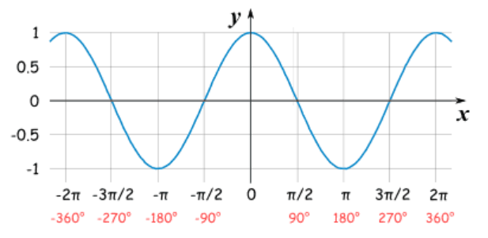

# 走动 Walk around
 
转动摄像机拍摄场景固然有趣，但自己控制所有镜头运动更有意思！首先我们需要搭建一个摄像机系统，因此在程序开头定义一些摄像机变量会很有帮助：

```cpp
glm::vec3 cameraPos   = glm::vec3(0.0f, 0.0f,  3.0f);
glm::vec3 cameraFront = glm::vec3(0.0f, 0.0f, -1.0f);
glm::vec3 cameraUp    = glm::vec3(0.0f, 1.0f,  0.0f);
```

`LookAt` 函数现在变为：

```cpp
//第一个参数(摄像头放哪里)：摄像头的位置
//第二个参数(盯着的位置)：摄像头的位置+ (z轴-1.0f)[摄像头前方1.0f的位置]
view = glm::lookAt(cameraPos, cameraPos + cameraFront, cameraUp);
```

首先，我们将相机位置设置为之前定义的 cameraPos 。方向是当前位置加上我们刚刚定义的方向向量。这样可以确保无论我们移动什么位置，相机始终朝向目标方向。接下来，我们通过==在按下某些按键时*更新 cameraPos 向量*来测试一下这些变量==。

我们已经定义了一个 processInput 函数来管理 GLFW 的键盘输入，所以让我们添加一些额外的按键命令：

```javascript
void processInput(GLFWwindow *window)
{
    ...
    const float cameraSpeed = 0.05f; // adjust accordingly
    //按一次w就+0.05个cameraFront【 glm::vec3(0.0f, 0.0f, -1.0f) 】,
    //也就是相机的位置朝负z轴前进
    if (glfwGetKey(window, GLFW_KEY_W) == GLFW_PRESS)
        cameraPos += cameraSpeed * cameraFront;
    //按一次w就-0.05个cameraFront【 glm::vec3(0.0f, 0.0f, -1.0f) 】,
    //也就是相机的位置朝正z轴前进
    if (glfwGetKey(window, GLFW_KEY_S) == GLFW_PRESS)
        cameraPos -= cameraSpeed * cameraFront;
    //往左就是往负x轴移动
    if (glfwGetKey(window, GLFW_KEY_A) == GLFW_PRESS)
        cameraPos -= glm::normalize(glm::cross(cameraFront, cameraUp)) * cameraSpeed;
    //往右就是往正x轴移动
    if (glfwGetKey(window, GLFW_KEY_D) == GLFW_PRESS)
        cameraPos += glm::normalize(glm::cross(cameraFront, cameraUp)) * cameraSpeed;
}
```

每次按下 `WASD` 键，摄像机的位置都会相应更新。如果要向前或向后移动，则将方向向量加到或减去位置向量，并乘以一个速度值。如果要左右移动，则进行叉积运算生成一个_向右的_向量，然后沿着该向右的向量移动。这样就产生了我们熟悉的平移效果。

请注意，我们对得到的 _右_ 向量进行了归一化。如果不进行归一化，则叉积运算的结果可能会根据 cameraFront 变量的不同而产生大小不同的向量。如果不进行归一化，则移动速度会根据相机的方向而变化，而不是保持恒定的移动速度。

现在，你应该已经能够稍微移动相机了，尽管移动速度取决于系统，所以你可能需要调整 cameraSpeed 。

## 移动速度 Movement speed

目前，我们为角色行走时的移动速度设定了一个固定值。理论上这似乎没问题，但实际上，==不同用户的电脑处理能力各不相同，导致一些用户*每秒渲染的帧数远高于其他用户*==。当一个用户渲染的帧数高于其他用户时，他调用 \`processInput\` 函数的频率也会更高。最终，根据电脑配置的不同，一些用户的移动速度会非常快，而另一些用户则会非常慢。==在发布应用程序时，您需要确保它在*各种硬件*上都能正常运行==。

图形应用程序和游戏通常会==跟踪一个 deltaTime 变量，用于存储渲染上一帧所花费的时间。==然后，我们将所有速度值乘以这个 deltaTime 值。这样一来，==当某一帧的 deltaTime 值较大时（意味着上一帧的渲染时间比平均时间长），该帧的速度值也会略微提高，以达到平衡==。使用这种方法，无论你的电脑配置很高还是很低，摄像机的速度都会相应地进行调整，从而确保每个用户都能获得相同的体验。

为了计算 deltaTime 值，我们需要跟踪 2 个全局变量：

```sql
float deltaTime = 0.0f;// Time between current frame and last frame
float lastFrame = 0.0f; // Time of last frame
```

然后，我们在每一帧中计算新的 deltaTime 值以供后续使用：

```makefile
float currentFrame = glfwGetTime();
deltaTime = currentFrame - lastFrame;
lastFrame = currentFrame;
```

现在我们有了 时间差（deltaTime） ，就可以在计算速度时将其考虑在内：

```javascript
void processInput(GLFWwindow *window)
{
    float cameraSpeed = 2.5f * deltaTime;
    [...]
}
```

由于我们使用了 deltaTime， 摄像机现在将以每秒 `2.5` 单位的恒定速度移动。结合上一节的内容，我们现在应该拥有一个更加流畅、更加稳定的摄像机系统，可以围绕场景移动：

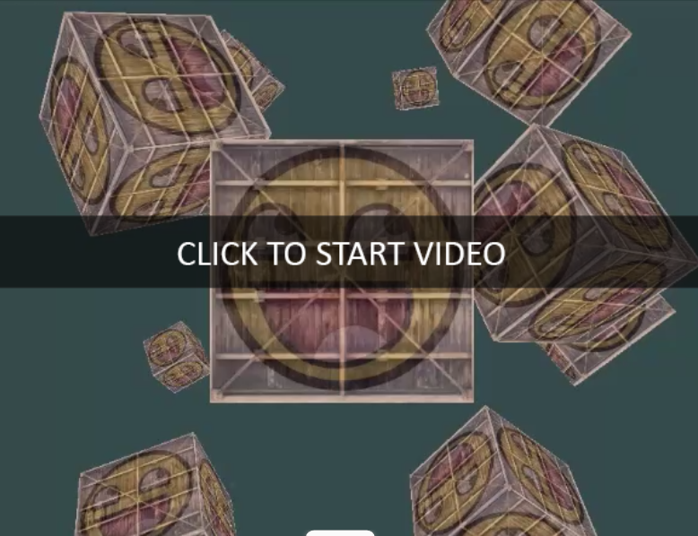

现在我们有了一个在任何系统上都能以相同速度移动和呈现的摄像头。如果遇到问题，请查看 [源代码](https://learnopengl.com/code_viewer_gh.php?code=src/1.getting_started/7.2.camera_keyboard_dt/camera_keyboard_dt.cpp) 。我们会看到，在任何与运动相关的操作中， deltaTime 值都会频繁出现。

# 环顾四周 Look around

只用键盘按键移动没什么意思。尤其是我们还不能转身，移动范围相当有限。这时候鼠标就派上用场了！

==为了环顾四周，我们需要根据鼠标的输入来改变 cameraFront 向量==。然而，根据鼠标旋转来改变方向向量有点复杂，需要用到一些三角函数知识。如果您不理解三角函数，不用担心，您可以直接跳到代码部分并粘贴到您的代码中；如果您想了解更多，可以稍后再回来学习。

# 欧拉角

欧拉角是三个可以表示三维空间中任意旋转的数值，由莱昂哈德·欧拉在 18 世纪左右定义。这三个欧拉角分别是： _俯仰角_ 、 _偏航角_ 和 _滚转角_ 。下图直观地展示了它们的含义：

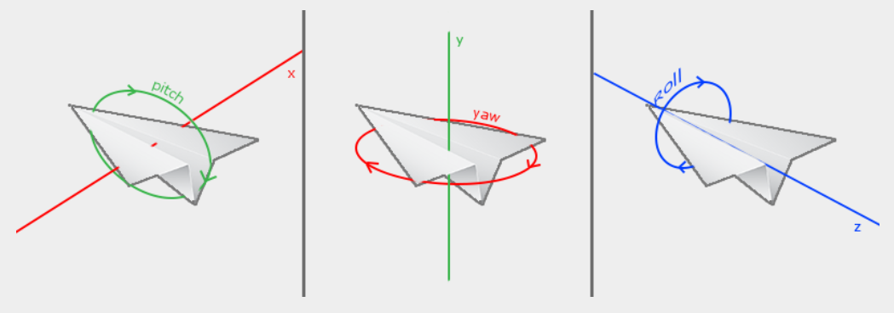

俯仰角表示我们向上或向下看的角度，如图一所示。图二显示的是偏航角，表示我们向左或向右看的角度。横滚角表示我们向右 _滚动的_ 角度，主要用于航天相机。每个欧拉角都用一个单独的值表示，结合这三个角度，我们可以计算出三维空间中的任何旋转矢量。

==对于我们的相机系统，我们只关心*偏航角*和*俯仰角*的值，因此这里不讨论滚转角的值。==给定一个俯仰角和偏航角值，我们可以将它们==转换为一个表示新方向向量的三维向量==。将偏航角和俯仰角值转换为方向向量的过程需要用到一些三角函数知识。我们从一个基本情况开始：

让我们先回顾一下，看看一般的直角三角形情况（其中一条边为 90 度角）：   

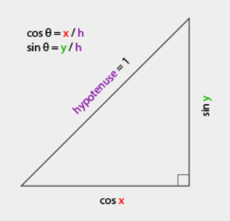

如果我们定义斜边长度为 `1` ，根据三角函数（soh cah toa），我们知道邻边长度为 $\cos \ \color{red}x/\color{purple}h = \cos \ \color{red}x/\color{purple}1 = \cos\ \color{red}x$ ，对边长度为 $\sin \ \color{green}y/\color{purple}h = \sin \ \color{green}y/\color{purple}1 = \sin\ \color{green}y$ 。这为我们提供了根据给定角度计算直角三角形 `x` 边和 `y` 边长度的一些通用公式。让我们利用这些公式来计算方向向量的分量。

让我们想象同样的三角形，但现在从俯视的角度观察它，相邻边和对边分别平行于场景的 x 轴和 z 轴（就像沿着 y 轴向下看一样）。

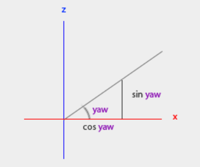

如果我们把偏航角想象成从 `x` 边开始逆时针旋转的角度，我们可以看到 `x` 边的长度与 `cos(yaw)` 相关。类似地， `z` 边的长度与 `sin(yaw)` 相关。

如果我们利用这些信息和给定的 `yaw` 值，就可以创建相机方向向量：

```cpp
glm::vec3 direction;
direction.x = cos(glm::radians(yaw)); // Note that we convert the angle to radians first
direction.z = sin(glm::radians(yaw));
```

这样就解决了如何从偏航角值获取三维方向向量的问题，但俯仰角也需要考虑。现在让我们假设自己位于 `xz` 平面上，来看一下 `y` 轴方向：

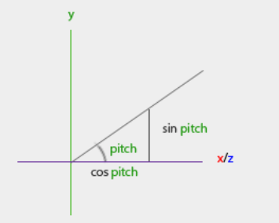

同样地，从这个三角形我们可以看出，方向的 y 分量等于 `sin(pitch)` 所以我们来填入这个值：

```ini
direction.y = sin(glm::radians(pitch));
```

然而，从俯仰角三角形可以看出， `xz` 边也受到 `cos(pitch)` 的影响，因此我们需要确保它也包含在方向向量中。加上这个因素后，我们就得到了由偏航角和俯仰角欧拉角转换而来的最终方向向量：

```ini
direction.x = cos(glm::radians(yaw)) * cos(glm::radians(pitch));
direction.y = sin(glm::radians(pitch));
direction.z = sin(glm::radians(yaw)) * cos(glm::radians(pitch));
```

这为我们提供了一个公式，可以将偏航角和俯仰角值转换为三维方向向量，我们可以利用该向量环顾四周。

我们已经设置好场景世界，使所有物体都沿负 z 轴方向定位。但是，如果我们查看 `x` 和 `z` 轴的偏航三角形，会发现当 θ 为 `0` 时，摄像机的 `direction` 向量会指向正 x 轴。为了确保摄像机默认指向负 z 轴，我们可以将 `yaw` 的默认值设置为顺时针旋转 90 度。正角度表示逆时针旋转，因此我们将默认偏航 `yaw` 值设置为：

```ini
yaw = -90.0f;
```

你现在可能想知道：我们如何设置和修改这些偏航角和俯仰角值？

# 鼠标输入

偏航角和俯仰角的值是通过鼠标（或控制器/操纵杆）的移动获得的，其中鼠标的水平移动影响偏航角，垂直移动影响俯仰角。其原理是存储上一帧的鼠标位置，并在当前帧中计算鼠标位置的变化量。水平或垂直方向的变化越大，俯仰角或偏航角的更新幅度就越大，因此摄像机的移动幅度也应该越大。

首先，我们要告诉 GLFW 隐藏并捕获光标。捕获光标意味着，一旦应用程序获得焦点，鼠标光标就会保持在窗口中心（除非应用程序失去焦点或退出）。我们可以通过一个简单的配置调用来实现这一点：

```scss
glfwSetInputMode(window, GLFW_CURSOR, GLFW_CURSOR_DISABLED);
```

调用此函数后，无论鼠标移动到哪里，它都不会显示，并且不会离开窗口。这对于第一人称射击游戏（FPS）的摄像机系统来说非常理想。

为了计算俯仰角和偏航角的值，我们需要告诉 GLFW 监听鼠标移动事件。我们通过创建一个具有以下原型的回调函数来实现这一点：

```cpp
void mouse_callback(GLFWwindow* window, double xpos, double ypos);
```

这里 xpos 和 ypos 代表鼠标的当前位置。每次鼠标移动时，一旦我们向 GLFW 注册了回调函数，mouse\_callback 函数就会被调用：

```scss
glfwSetCursorPosCallback(window, mouse_callback);
```

在处理飞行式摄像机的鼠标输入时，我们需要执行以下几个步骤才能完全计算出摄像机的方向向量：

1.  计算鼠标自上一帧以来的偏移量。
2.  将偏移值添加到相机的偏航角和俯仰角值中。
3.  对最小/最大音高值添加一些限制。
4.  计算方向向量。

第一步是计算鼠标自上一帧以来的偏移量。我们首先需要将鼠标的最后位置存储在应用程序中，初始状态下，我们将鼠标位置初始化为屏幕中心（屏幕尺寸为 `800` x `600` ）：

```bash
float lastX = 400, lastY = 300;
```

然后，在鼠标的回调函数中，我们计算上一帧和当前帧之间的偏移移动距离：

```cpp
float xoffset = xpos - lastX;
float yoffset = lastY - ypos; // reversed since y-coordinates range from bottom to top
lastX = xpos;
lastY = ypos;

const float sensitivity = 0.1f;
xoffset *= sensitivity;
yoffset *= sensitivity;
```

请注意，我们需要将偏移值乘以一个 灵敏度值。如果省略此乘法运算，鼠标移动的灵敏度会过高；您可以根据自己的喜好调整灵敏度值。

接下来，我们将偏移值添加到全局声明的 俯仰角和偏航角值中：

```makefile
yaw   += xoffset;
pitch += yoffset;
```

第三步，我们希望对摄像机添加一些约束，以防止用户进行异常的摄像机移动（当方向向量与世界坐标系的上方方向平行时，还会导致“看向翻转”）。俯仰角需要受到约束，使用户的视线高度不能超过 `89` 度（ `90` 度会导致“看向翻转”），也不能低于 `-89` 度。这样可以确保用户只能向上看天空或向下看自己的脚，而不能看得更远。这些约束的工作原理是：当欧拉角值违反约束时，将其替换为相应的约束值。

```
if(pitch > 89.0f)
  pitch =  89.0f;
if(pitch < -89.0f)
  pitch = -89.0f;
```

请注意，我们没有对偏航角值设置任何限制，因为我们不想限制用户水平旋转。当然，如果您需要，也很容易为偏航角添加限制。

第四步也是最后一步，是使用上一节中的公式计算实际方向向量：

```ruby
glm::vec3 direction;
direction.x = cos(glm::radians(yaw)) * cos(glm::radians(pitch));
direction.y = sin(glm::radians(pitch));
direction.z = sin(glm::radians(yaw)) * cos(glm::radians(pitch));
cameraFront = glm::normalize(direction);
```

计算出的方向向量包含了根据鼠标移动计算出的所有旋转。由于 cameraFront 向量已经包含在 glm 的 lookAt 函数中，我们可以继续了。

现在运行这段代码，你会注意到，当鼠标光标首次聚焦到窗口时，相机会发生一次大幅度的突然跳动。造成这种突然跳动的原因是，当光标进入窗口时，鼠标回调函数会被立即调用，并传入鼠标进入屏幕时的 xpos 和 ypos 坐标值。这个位置通常距离屏幕中心很远，导致较大的偏移量，从而产生较大的移动跳动。我们可以通过定义一个全局 `bool` 变量来规避这个问题，该变量用于检查是否是第一次接收到鼠标输入。如果是第一次，则将初始鼠标位置更新为新的 xpos 和 `ypos` 值。之后，鼠标的移动将使用新输入的鼠标位置坐标来计算偏移量：

```bash
if (firstMouse) // initially set to true
{
    lastX = xpos;
    lastY = ypos;
    firstMouse = false;
}
```

最终代码如下：

```cpp
void mouse_callback(GLFWwindow* window, double xpos, double ypos)
{
    if (firstMouse)
    {
        lastX = xpos;
        lastY = ypos;
        firstMouse = false;
    }
  
    float xoffset = xpos - lastX;
    float yoffset = lastY - ypos; 
    lastX = xpos;
    lastY = ypos;

    float sensitivity = 0.1f;
    xoffset *= sensitivity;
    yoffset *= sensitivity;

    yaw   += xoffset;
    pitch += yoffset;

    if(pitch > 89.0f)
        pitch = 89.0f;
    if(pitch < -89.0f)
        pitch = -89.0f;

    glm::vec3 direction;
    direction.x = cos(glm::radians(yaw)) * cos(glm::radians(pitch));
    direction.y = sin(glm::radians(pitch));
    direction.z = sin(glm::radians(yaw)) * cos(glm::radians(pitch));
    cameraFront = glm::normalize(direction);
}
```

好了！试试看，你会发现我们现在可以在 3D 场景中自由移动了！

# 飞涨

作为相机系统的补充，我们还将实现缩放界面。在上一章中我们提到， _视野范围_ （ _FOV）_ 很大程度上决定了我们能看到的场景范围。当视野范围缩小时，场景的投影空间也会缩小。这个缩小的空间会投影到相同的 NDC 上，从而产生放大的错觉。要实现放大，我们将使用鼠标滚轮。与鼠标移动和键盘输入类似，我们也有一个用于鼠标滚轮滚动的回调函数：

```cpp
void scroll_callback(GLFWwindow* window, double xoffset, double yoffset)
{
    fov -= (float)yoffset;
    if (fov < 1.0f)
        fov = 1.0f;
    if (fov > 45.0f)
        fov = 45.0f; 
}
```

滚动时， yoffset 值表示垂直方向的滚动量。调用 scroll\_callback 函数时，我们会改变全局声明的 fov 变量的内容。由于默认 fov 值为 `45.0` ，我们希望将缩放级别限制在 `1.0` 到 `45.0` 之间。

现在我们需要在每一帧都将透视投影矩阵上传到 GPU，但这次要将 fov 变量作为其视野范围：

```ini
projection = glm::perspective(glm::radians(fov), 800.0f / 600.0f, 0.1f, 100.0f);
```

最后，别忘了注册滚动回调函数：

```scss
glfwSetScrollCallback(window, scroll_callback);
```

这就是全部内容。我们实现了一个简单的摄像系统，它允许在 3D 环境中自由移动。

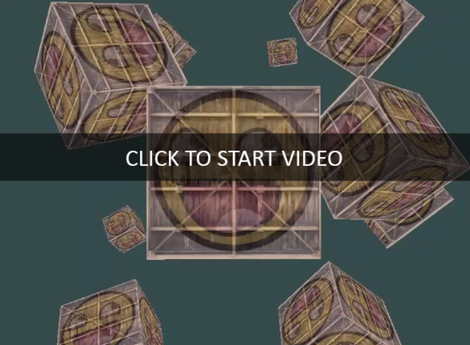

您可以随意尝试一下，如果遇到困难，请将您的代码与 [源代码](https://learnopengl.com/code_viewer_gh.php?code=src/1.getting_started/7.3.camera_mouse_zoom/camera_mouse_zoom.cpp)进行比较。

## 源代码

```cpp
#include <glad/glad.h>
#include <GLFW/glfw3.h>
#include <stb_image.h>

#include <glm/glm.hpp>
#include <glm/gtc/matrix_transform.hpp>
#include <glm/gtc/type_ptr.hpp>

#include <learnopengl/shader_m.h>

#include <iostream>

void framebuffer_size_callback(GLFWwindow* window, int width, int height);
void mouse_callback(GLFWwindow* window, double xpos, double ypos);
void scroll_callback(GLFWwindow* window, double xoffset, double yoffset);
void processInput(GLFWwindow *window);

// settings
const unsigned int SCR_WIDTH = 800;
const unsigned int SCR_HEIGHT = 600;

// camera
glm::vec3 cameraPos   = glm::vec3(0.0f, 0.0f, 3.0f);
glm::vec3 cameraFront = glm::vec3(0.0f, 0.0f, -1.0f);
glm::vec3 cameraUp    = glm::vec3(0.0f, 1.0f, 0.0f);

bool firstMouse = true;
float yaw   = -90.0f;	// yaw is initialized to -90.0 degrees since a yaw of 0.0 results in a direction vector pointing to the right so we initially rotate a bit to the left.
float pitch =  0.0f;
float lastX =  800.0f / 2.0;
float lastY =  600.0 / 2.0;
float fov   =  45.0f;

// timing
float deltaTime = 0.0f;	// time between current frame and last frame
float lastFrame = 0.0f;

int main()
{
    // glfw: initialize and configure
    // ------------------------------
    glfwInit();
    glfwWindowHint(GLFW_CONTEXT_VERSION_MAJOR, 3);
    glfwWindowHint(GLFW_CONTEXT_VERSION_MINOR, 3);
    glfwWindowHint(GLFW_OPENGL_PROFILE, GLFW_OPENGL_CORE_PROFILE);

#ifdef __APPLE__
    glfwWindowHint(GLFW_OPENGL_FORWARD_COMPAT, GL_TRUE);
#endif

    // glfw window creation
    // --------------------
    GLFWwindow* window = glfwCreateWindow(SCR_WIDTH, SCR_HEIGHT, "LearnOpenGL", NULL, NULL);
    if (window == NULL)
    {
        std::cout << "Failed to create GLFW window" << std::endl;
        glfwTerminate();
        return -1;
    }
    glfwMakeContextCurrent(window);
    glfwSetFramebufferSizeCallback(window, framebuffer_size_callback);
    glfwSetCursorPosCallback(window, mouse_callback);
    glfwSetScrollCallback(window, scroll_callback);

    // tell GLFW to capture our mouse
    glfwSetInputMode(window, GLFW_CURSOR, GLFW_CURSOR_DISABLED);

    // glad: load all OpenGL function pointers
    // ---------------------------------------
    if (!gladLoadGLLoader((GLADloadproc)glfwGetProcAddress))
    {
        std::cout << "Failed to initialize GLAD" << std::endl;
        return -1;
    }

    // configure global opengl state
    // -----------------------------
    glEnable(GL_DEPTH_TEST);

    // build and compile our shader zprogram
    // ------------------------------------
    Shader ourShader("7.3.camera.vs", "7.3.camera.fs");

    // set up vertex data (and buffer(s)) and configure vertex attributes
    // ------------------------------------------------------------------
    float vertices[] = {
        -0.5f, -0.5f, -0.5f,  0.0f, 0.0f,
         0.5f, -0.5f, -0.5f,  1.0f, 0.0f,
         0.5f,  0.5f, -0.5f,  1.0f, 1.0f,
         0.5f,  0.5f, -0.5f,  1.0f, 1.0f,
        -0.5f,  0.5f, -0.5f,  0.0f, 1.0f,
        -0.5f, -0.5f, -0.5f,  0.0f, 0.0f,

        -0.5f, -0.5f,  0.5f,  0.0f, 0.0f,
         0.5f, -0.5f,  0.5f,  1.0f, 0.0f,
         0.5f,  0.5f,  0.5f,  1.0f, 1.0f,
         0.5f,  0.5f,  0.5f,  1.0f, 1.0f,
        -0.5f,  0.5f,  0.5f,  0.0f, 1.0f,
        -0.5f, -0.5f,  0.5f,  0.0f, 0.0f,

        -0.5f,  0.5f,  0.5f,  1.0f, 0.0f,
        -0.5f,  0.5f, -0.5f,  1.0f, 1.0f,
        -0.5f, -0.5f, -0.5f,  0.0f, 1.0f,
        -0.5f, -0.5f, -0.5f,  0.0f, 1.0f,
        -0.5f, -0.5f,  0.5f,  0.0f, 0.0f,
        -0.5f,  0.5f,  0.5f,  1.0f, 0.0f,

         0.5f,  0.5f,  0.5f,  1.0f, 0.0f,
         0.5f,  0.5f, -0.5f,  1.0f, 1.0f,
         0.5f, -0.5f, -0.5f,  0.0f, 1.0f,
         0.5f, -0.5f, -0.5f,  0.0f, 1.0f,
         0.5f, -0.5f,  0.5f,  0.0f, 0.0f,
         0.5f,  0.5f,  0.5f,  1.0f, 0.0f,

        -0.5f, -0.5f, -0.5f,  0.0f, 1.0f,
         0.5f, -0.5f, -0.5f,  1.0f, 1.0f,
         0.5f, -0.5f,  0.5f,  1.0f, 0.0f,
         0.5f, -0.5f,  0.5f,  1.0f, 0.0f,
        -0.5f, -0.5f,  0.5f,  0.0f, 0.0f,
        -0.5f, -0.5f, -0.5f,  0.0f, 1.0f,

        -0.5f,  0.5f, -0.5f,  0.0f, 1.0f,
         0.5f,  0.5f, -0.5f,  1.0f, 1.0f,
         0.5f,  0.5f,  0.5f,  1.0f, 0.0f,
         0.5f,  0.5f,  0.5f,  1.0f, 0.0f,
        -0.5f,  0.5f,  0.5f,  0.0f, 0.0f,
        -0.5f,  0.5f, -0.5f,  0.0f, 1.0f
    };
    // world space positions of our cubes
    glm::vec3 cubePositions[] = {
        glm::vec3( 0.0f,  0.0f,  0.0f),
        glm::vec3( 2.0f,  5.0f, -15.0f),
        glm::vec3(-1.5f, -2.2f, -2.5f),
        glm::vec3(-3.8f, -2.0f, -12.3f),
        glm::vec3( 2.4f, -0.4f, -3.5f),
        glm::vec3(-1.7f,  3.0f, -7.5f),
        glm::vec3( 1.3f, -2.0f, -2.5f),
        glm::vec3( 1.5f,  2.0f, -2.5f),
        glm::vec3( 1.5f,  0.2f, -1.5f),
        glm::vec3(-1.3f,  1.0f, -1.5f)
    };
    unsigned int VBO, VAO;
    glGenVertexArrays(1, &VAO);
    glGenBuffers(1, &VBO);

    glBindVertexArray(VAO);

    glBindBuffer(GL_ARRAY_BUFFER, VBO);
    glBufferData(GL_ARRAY_BUFFER, sizeof(vertices), vertices, GL_STATIC_DRAW);

    // position attribute
    glVertexAttribPointer(0, 3, GL_FLOAT, GL_FALSE, 5 * sizeof(float), (void*)0);
    glEnableVertexAttribArray(0);
    // texture coord attribute
    glVertexAttribPointer(1, 2, GL_FLOAT, GL_FALSE, 5 * sizeof(float), (void*)(3 * sizeof(float)));
    glEnableVertexAttribArray(1);


    // load and create a texture 
    // -------------------------
    unsigned int texture1, texture2;
    // texture 1
    // ---------
    glGenTextures(1, &texture1);
    glBindTexture(GL_TEXTURE_2D, texture1);
    // set the texture wrapping parameters
    glTexParameteri(GL_TEXTURE_2D, GL_TEXTURE_WRAP_S, GL_REPEAT);
    glTexParameteri(GL_TEXTURE_2D, GL_TEXTURE_WRAP_T, GL_REPEAT);
    // set texture filtering parameters
    glTexParameteri(GL_TEXTURE_2D, GL_TEXTURE_MIN_FILTER, GL_LINEAR);
    glTexParameteri(GL_TEXTURE_2D, GL_TEXTURE_MAG_FILTER, GL_LINEAR);
    // load image, create texture and generate mipmaps
    int width, height, nrChannels;
    stbi_set_flip_vertically_on_load(true); // tell stb_image.h to flip loaded texture's on the y-axis.
    unsigned char *data = stbi_load(FileSystem::getPath("resources/textures/container.jpg").c_str(), &width, &height, &nrChannels, 0);
    if (data)
    {
        glTexImage2D(GL_TEXTURE_2D, 0, GL_RGB, width, height, 0, GL_RGB, GL_UNSIGNED_BYTE, data);
        glGenerateMipmap(GL_TEXTURE_2D);
    }
    else
    {
        std::cout << "Failed to load texture" << std::endl;
    }
    stbi_image_free(data);
    // texture 2
    // ---------
    glGenTextures(1, &texture2);
    glBindTexture(GL_TEXTURE_2D, texture2);
    // set the texture wrapping parameters
    glTexParameteri(GL_TEXTURE_2D, GL_TEXTURE_WRAP_S, GL_REPEAT);
    glTexParameteri(GL_TEXTURE_2D, GL_TEXTURE_WRAP_T, GL_REPEAT);
    // set texture filtering parameters
    glTexParameteri(GL_TEXTURE_2D, GL_TEXTURE_MIN_FILTER, GL_LINEAR);
    glTexParameteri(GL_TEXTURE_2D, GL_TEXTURE_MAG_FILTER, GL_LINEAR);
    // load image, create texture and generate mipmaps
    data = stbi_load(FileSystem::getPath("resources/textures/awesomeface.png").c_str(), &width, &height, &nrChannels, 0);
    if (data)
    {
        // note that the awesomeface.png has transparency and thus an alpha channel, so make sure to tell OpenGL the data type is of GL_RGBA
        glTexImage2D(GL_TEXTURE_2D, 0, GL_RGB, width, height, 0, GL_RGBA, GL_UNSIGNED_BYTE, data);
        glGenerateMipmap(GL_TEXTURE_2D);
    }
    else
    {
        std::cout << "Failed to load texture" << std::endl;
    }
    stbi_image_free(data);

    // tell opengl for each sampler to which texture unit it belongs to (only has to be done once)
    // -------------------------------------------------------------------------------------------
    ourShader.use();
    ourShader.setInt("texture1", 0);
    ourShader.setInt("texture2", 1);


    // render loop
    // -----------
    while (!glfwWindowShouldClose(window))
    {
        // per-frame time logic
        // --------------------
        float currentFrame = static_cast<float>(glfwGetTime());
        deltaTime = currentFrame - lastFrame;
        lastFrame = currentFrame;

        // input
        // -----
        processInput(window);

        // render
        // ------
        glClearColor(0.2f, 0.3f, 0.3f, 1.0f);
        glClear(GL_COLOR_BUFFER_BIT | GL_DEPTH_BUFFER_BIT); 

        // bind textures on corresponding texture units
        glActiveTexture(GL_TEXTURE0);
        glBindTexture(GL_TEXTURE_2D, texture1);
        glActiveTexture(GL_TEXTURE1);
        glBindTexture(GL_TEXTURE_2D, texture2);

        // activate shader
        ourShader.use();

        // pass projection matrix to shader (note that in this case it could change every frame)
        glm::mat4 projection = glm::perspective(glm::radians(fov), (float)SCR_WIDTH / (float)SCR_HEIGHT, 0.1f, 100.0f);
        ourShader.setMat4("projection", projection);

        // camera/view transformation
        glm::mat4 view = glm::lookAt(cameraPos, cameraPos + cameraFront, cameraUp);
        ourShader.setMat4("view", view);

        // render boxes
        glBindVertexArray(VAO);
        for (unsigned int i = 0; i < 10; i++)
        {
            // calculate the model matrix for each object and pass it to shader before drawing
            glm::mat4 model = glm::mat4(1.0f); // make sure to initialize matrix to identity matrix first
            model = glm::translate(model, cubePositions[i]);
            float angle = 20.0f * i;
            model = glm::rotate(model, glm::radians(angle), glm::vec3(1.0f, 0.3f, 0.5f));
            ourShader.setMat4("model", model);

            glDrawArrays(GL_TRIANGLES, 0, 36);
        }

        // glfw: swap buffers and poll IO events (keys pressed/released, mouse moved etc.)
        // -------------------------------------------------------------------------------
        glfwSwapBuffers(window);
        glfwPollEvents();
    }

    // optional: de-allocate all resources once they've outlived their purpose:
    // ------------------------------------------------------------------------
    glDeleteVertexArrays(1, &VAO);
    glDeleteBuffers(1, &VBO);

    // glfw: terminate, clearing all previously allocated GLFW resources.
    // ------------------------------------------------------------------
    glfwTerminate();
    return 0;
}

// process all input: query GLFW whether relevant keys are pressed/released this frame and react accordingly
// ---------------------------------------------------------------------------------------------------------
void processInput(GLFWwindow *window)
{
    if (glfwGetKey(window, GLFW_KEY_ESCAPE) == GLFW_PRESS)
        glfwSetWindowShouldClose(window, true);

    float cameraSpeed = static_cast<float>(2.5 * deltaTime);
    if (glfwGetKey(window, GLFW_KEY_W) == GLFW_PRESS)
        cameraPos += cameraSpeed * cameraFront;
    if (glfwGetKey(window, GLFW_KEY_S) == GLFW_PRESS)
        cameraPos -= cameraSpeed * cameraFront;
    if (glfwGetKey(window, GLFW_KEY_A) == GLFW_PRESS)
        cameraPos -= glm::normalize(glm::cross(cameraFront, cameraUp)) * cameraSpeed;
    if (glfwGetKey(window, GLFW_KEY_D) == GLFW_PRESS)
        cameraPos += glm::normalize(glm::cross(cameraFront, cameraUp)) * cameraSpeed;
}

// glfw: whenever the window size changed (by OS or user resize) this callback function executes
// ---------------------------------------------------------------------------------------------
void framebuffer_size_callback(GLFWwindow* window, int width, int height)
{
    // make sure the viewport matches the new window dimensions; note that width and 
    // height will be significantly larger than specified on retina displays.
    glViewport(0, 0, width, height);
}

// glfw: whenever the mouse moves, this callback is called
// -------------------------------------------------------
void mouse_callback(GLFWwindow* window, double xposIn, double yposIn)
{
    float xpos = static_cast<float>(xposIn);
    float ypos = static_cast<float>(yposIn);

    if (firstMouse)
    {
        lastX = xpos;
        lastY = ypos;
        firstMouse = false;
    }

    float xoffset = xpos - lastX;
    float yoffset = lastY - ypos; // reversed since y-coordinates go from bottom to top
    lastX = xpos;
    lastY = ypos;

    float sensitivity = 0.1f; // change this value to your liking
    xoffset *= sensitivity;
    yoffset *= sensitivity;

    yaw += xoffset;
    pitch += yoffset;

    // make sure that when pitch is out of bounds, screen doesn't get flipped
    if (pitch > 89.0f)
        pitch = 89.0f;
    if (pitch < -89.0f)
        pitch = -89.0f;

    glm::vec3 front;
    front.x = cos(glm::radians(yaw)) * cos(glm::radians(pitch));
    front.y = sin(glm::radians(pitch));
    front.z = sin(glm::radians(yaw)) * cos(glm::radians(pitch));
    cameraFront = glm::normalize(front);
}

// glfw: whenever the mouse scroll wheel scrolls, this callback is called
// ----------------------------------------------------------------------
void scroll_callback(GLFWwindow* window, double xoffset, double yoffset)
{
    fov -= (float)yoffset;
    if (fov < 1.0f)
        fov = 1.0f;
    if (fov > 45.0f)
        fov = 45.0f;
}
```

# 教室

在接下来的章节中，我们将始终使用摄像机来轻松环顾场景，并从各个角度查看效果。然而，由于摄像机代码会占用每章的大量篇幅，我们将对其细节进行一些抽象，并创建一个我们自己的摄像机对象，它将为我们完成大部分工作，并提供一些巧妙的附加功能。与着色器章节不同，==我们不会逐步讲解如何创建摄像机类，而是提供（带有完整注释的）源代码，以便您了解其内部工作原理==。

与 `Shader` 对象类似，我们==将相机类*完全*定义在一个头文件中==。您可以[在这里](https://learnopengl.com/code_viewer_gh.php?code=includes/learnopengl/camera.h)找到相机类；读完本章后，您应该能够理解其中的代码。建议您至少查看一次该类，将其作为如何创建您自己的相机系统的示例。

我们介绍的这款相机系统是一种==类似苍蝇的相机，适用于大多数用途，并且能很好地处理欧拉角==。但是，在创建其他类型的相机系统（例如第一人称射击游戏相机或飞行模拟相机）时，务必谨慎。==每种相机系统都有其自身的特性和局限性==，因此请务必事先了解相关知识。例如，这款苍蝇相机==不允许俯仰角大于或等于 `90` 度，并且当考虑横滚角时，静态向上向量 `(0,1,0)` 将无法正常工作。==

使用新相机对象的更新版源代码可以 [在这里](https://learnopengl.com/code_viewer_gh.php?code=src/1.getting_started/7.4.camera_class/camera_class.cpp)找到。

# 源代码

```cpp
//Main.cpp-->循环中
// camera/view transformation
        glm::mat4 view = camera.GetViewMatrix();
        ourShader.setMat4("view", view);
        
//Camera.h
#ifndef CAMERA_H
#define CAMERA_H

#include <glad/glad.h>
#include <glm/glm.hpp>
#include <glm/gtc/matrix_transform.hpp>

// Defines several possible options for camera movement. Used as abstraction to stay away from window-system specific input methods
enum Camera_Movement {
    FORWARD,
    BACKWARD,
    LEFT,
    RIGHT
};

// Default camera values
const float YAW         = -90.0f;
const float PITCH       =  0.0f;
const float SPEED       =  2.5f;
const float SENSITIVITY =  0.1f;
const float ZOOM        =  45.0f;


// An abstract camera class that processes input and calculates the corresponding Euler Angles, Vectors and Matrices for use in OpenGL
class Camera
{
public:
    // camera Attributes
    glm::vec3 Position;
    glm::vec3 Front;
    glm::vec3 Up;
    glm::vec3 Right;
    glm::vec3 WorldUp;
    // euler Angles
    float Yaw;
    float Pitch;
    // camera options
    float MovementSpeed;
    float MouseSensitivity;
    float Zoom;

    // constructor with vectors
    Camera(glm::vec3 position = glm::vec3(0.0f, 0.0f, 0.0f), glm::vec3 up = glm::vec3(0.0f, 1.0f, 0.0f), float yaw = YAW, float pitch = PITCH) : Front(glm::vec3(0.0f, 0.0f, -1.0f)), MovementSpeed(SPEED), MouseSensitivity(SENSITIVITY), Zoom(ZOOM)
    {
        Position = position;
        WorldUp = up;
        Yaw = yaw;
        Pitch = pitch;
        updateCameraVectors();
    }
    // constructor with scalar values
    Camera(float posX, float posY, float posZ, float upX, float upY, float upZ, float yaw, float pitch) : Front(glm::vec3(0.0f, 0.0f, -1.0f)), MovementSpeed(SPEED), MouseSensitivity(SENSITIVITY), Zoom(ZOOM)
    {
        Position = glm::vec3(posX, posY, posZ);
        WorldUp = glm::vec3(upX, upY, upZ);
        Yaw = yaw;
        Pitch = pitch;
        updateCameraVectors();
    }

    // returns the view matrix calculated using Euler Angles and the LookAt Matrix
    glm::mat4 GetViewMatrix()
    {
        return glm::lookAt(Position, Position + Front, Up);
    }

    // processes input received from any keyboard-like input system. Accepts input parameter in the form of camera defined ENUM (to abstract it from windowing systems)
    void ProcessKeyboard(Camera_Movement direction, float deltaTime)
    {
        float velocity = MovementSpeed * deltaTime;
        if (direction == FORWARD)
            Position += Front * velocity;
        if (direction == BACKWARD)
            Position -= Front * velocity;
        if (direction == LEFT)
            Position -= Right * velocity;
        if (direction == RIGHT)
            Position += Right * velocity;
    }

    // processes input received from a mouse input system. Expects the offset value in both the x and y direction.
    void ProcessMouseMovement(float xoffset, float yoffset, GLboolean constrainPitch = true)
    {
        xoffset *= MouseSensitivity;
        yoffset *= MouseSensitivity;

        Yaw   += xoffset;
        Pitch += yoffset;

        // make sure that when pitch is out of bounds, screen doesn't get flipped
        if (constrainPitch)
        {
            if (Pitch > 89.0f)
                Pitch = 89.0f;
            if (Pitch < -89.0f)
                Pitch = -89.0f;
        }

        // update Front, Right and Up Vectors using the updated Euler angles
        updateCameraVectors();
    }

    // processes input received from a mouse scroll-wheel event. Only requires input on the vertical wheel-axis
    void ProcessMouseScroll(float yoffset)
    {
        Zoom -= (float)yoffset;
        if (Zoom < 1.0f)
            Zoom = 1.0f;
        if (Zoom > 45.0f)
            Zoom = 45.0f;
    }

private:
    // calculates the front vector from the Camera's (updated) Euler Angles
    void updateCameraVectors()
    {
        // calculate the new Front vector
        glm::vec3 front;
        front.x = cos(glm::radians(Yaw)) * cos(glm::radians(Pitch));
        front.y = sin(glm::radians(Pitch));
        front.z = sin(glm::radians(Yaw)) * cos(glm::radians(Pitch));
        Front = glm::normalize(front);
        // also re-calculate the Right and Up vector
        Right = glm::normalize(glm::cross(Front, WorldUp));  // normalize the vectors, because their length gets closer to 0 the more you look up or down which results in slower movement.
        Up    = glm::normalize(glm::cross(Right, Front));
    }
};
#endif
```

# 练习

- 看看能否将相机类转换为==真正的== fps 相机，使之成为不能飞行的相机；只能在 `xz` 平面上环顾四周： [解决方案](https://learnopengl.com/code_viewer_gh.php?code=src/1.getting_started/7.5.camera_exercise1/camera_exercise1.cpp) 。
- 尝试创建自己的 LookAt 函数，并按照本章开头讨论的方式手动创建视图矩阵。将 glm 的 LookAt 函数替换为您自己的实现，看看它是否仍然具有相同的行为： [解决方案](https://learnopengl.com/code_viewer_gh.php?code=src/1.getting_started/7.6.camera_exercise2/camera_exercise2.cpp) 。