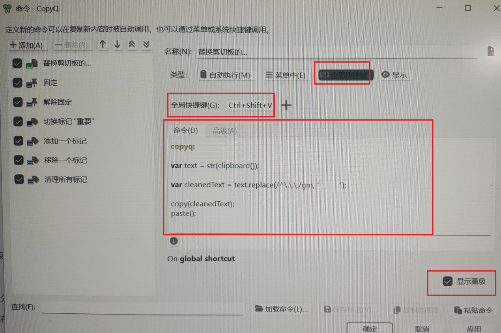

我下载的是绿色版:https://github.com/hluk/copyq  

- 文件-首选项-通用-关闭自动隐藏-关闭存储剪贴板

文件-命令-添加  

显示高级，添加命令为 ~~我这里替换...为几个空格。是因为我替换了从Python repl中复制过来的内容~~   

```shell
copyq:

var text = str(clipboard());

var cleanedText = text.replace(/^\.\.\./gm, "         ");

copy(cleanedText);
paste();
```

设置全局快捷键：我这里设置成ctrl+shift+v  

确认即可  


  
~~截图时copyq会自动隐藏，原因不明，所以用手机拍~~  

