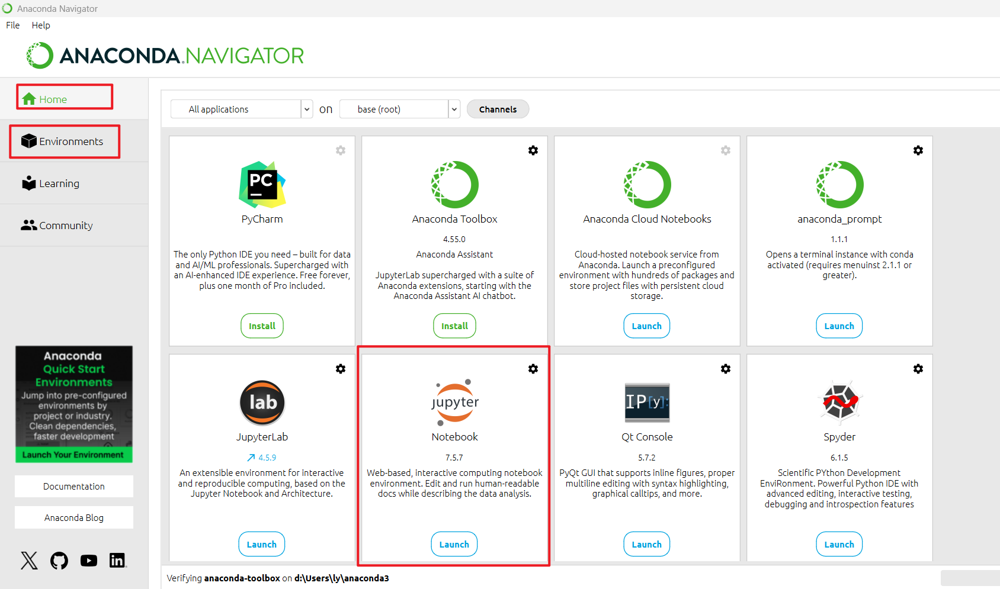
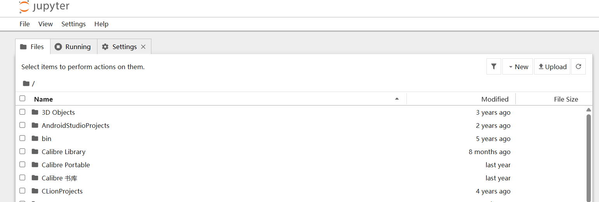
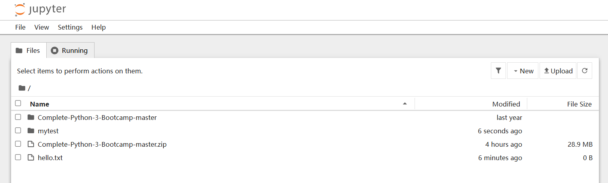
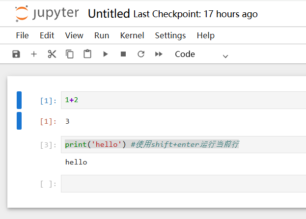
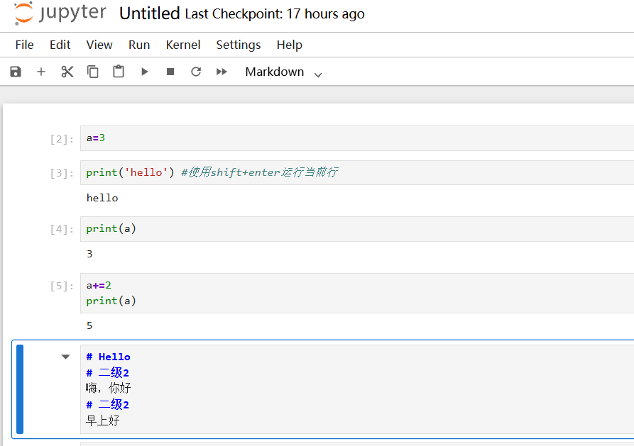
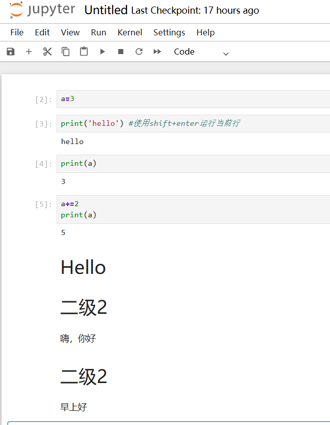

# 课程大纲

- 介绍
	- 概述
	- Python2与Python3
	- 如何学习本课程
- Python设置
	- 安装
	- 环境选择
	- 笔记系统
	- git/github
- 对象和数据结构基础
	- Numbers
	- Strings
	- Lists
	- Dictionaries
	- Tuples（元组）
	- Files
	- Sets（集合）
	- Booleans
- 比较运算符
	- 基本运算符
	- 链式比较运算符
- 语句
	- if，elif，else
	- for
	- while
	- range
	- List Comprehensions（列表推导式）
- 方法和函数
	- Methods
	- Functions
	- LambdaExpressions（lambda表达式）
	- NestedStatements（嵌套语句）
	- Scope（作用域）
- 第一个里程碑项目
	- Pyhon创建一个游戏
- 面向对象编程
	- 对象，类，方法，继承，特殊方法
- ErrosAndExceptionHandling（错误和异常处理）
	- Erros
	- Exceptions
	- try
	- except
	- finally
- 第二个里程碑项目
	- 创建更复杂的游戏
- Modules and Package（模块和包）
	- 创建模块
	- 安装模块
	- 总体上探索Pythone生态
- 内置函数
	- map
	- reduce
	- filter
	- zip
	- enumerate
	- all and any
	- complex（处理复数）
- Decorators in Python（装饰器，这个系列三部分）
- Python Generators（生成器）
	- Iteration vs Generation （迭代器、生成器）
	- Creating Generators （生成器）
- 所有知识整合到一个项目
- 高级额外内容（定期添加）----110集
	- 高级Python Modules
	- 高级Python Object ，高级数据结构

# Python 介绍

- 可读性、易用性
- 大量现有库、框架
- 解决开发时间（不是运行时间）
- 大量直接可用的==基础Python==和==基础模块==、外部库
	- 自动化简单任务（搜索文件、读写文件、自动发送电子文件）
	- 数据科学，机器学习
	- 创建网站（Django，Flask）

# 使用命令行

本节学习：  
- 查找当前目录
- 列出目录文件
- 修改目录
- 清空命令行

`pwd`,`ls`,`cd xxxx`,`clear`,`cd ..`  

# Python安装

- 用免费的Anaconda发行版，将==安装Python语言==以及一个易于使用的==开发环境==和==导航器启动工具==、其他库、其他工具 ~~包括Jupyter Notebook环境~~ ，简要运行JupyterNotebook ~~整个分析过程、代码和结果都会保存在同一个 .ipynb 文件中。Jupyter Notebook 就像一个“可以边写代码、边写文档、边看结果”的交互式实验本~~   
- 介绍一些在线免安装运行Python的网站

## 下载anaconda

- 文档 `https://www.anaconda.com/docs/main` 
- 下载链接 `https://www.anaconda.com/download` 

一些设置 ~~默认即可~~    


安装后启动 ~~可以发现这就是一个集成并管理各种第三方软件的一个工具，所以我猜Jupyter Notebook这个应该也是可以独立下载安装的并不一定要在anaconda才能安装~~   

  

比如这里还可以安装指定版本  


Enviroment 那里，也可以指定版本号 ~~但是base和anacona3这两个环境不允许修改，自己建的可以~~   


## Jupyter Notebook

/ˈdʒuːpɪtər/  

直接在菜单“Home”里面就能启动  

启动后，默认显示文件夹为`C:\Users\ly`  

  

## 启动anaconda时自动启动vscode并卡住

在Anaconda里，点开“File”--“References”，拉到最下面有VS Code path栏，把其中的路径改成完整的VS Code路径，==保存== ~~一定要记得保存~~ ，然后重启Anaconda就好了。


## 修改启动 jupyter时的默认目录

修改文件 `C:\Users\ly\.jupyter\jupyter_notebook_config.json`
~~新增notebook_dir那行~~  

```shell
{
  "NotebookApp": {
    "nbserver_extensions": {
      "jupyter_nbextensions_configurator": true
    },
    "notebook_dir": "D:\\Users\\ly\\Jupyter"
  }
}
```

我这里到 https://github.com/pierian-data/complete-python-3-bootcamp 下载了zip整份代码并压缩到了该目录  



~~其实整个视频课程应该是（可以）边做笔记边写代码的形式~~    


## jupyter简单使用

- File-New-Notebook 简单新建笔记
- 以单元格形式存在，每个单元格可以是 markdown或者raw或者code（代码）
- 添加后点击运行 ~~不论是markdown单元格或者raw或者code都行~~ 

  


## 一些在线的网站

- jupyter在线： https://jupyter.org/try  
- google colab https://colab.research.google.com/notebook
- https://replit.com/ 

# 运行Python代码

- 编辑器
	- TextEditors（通用文本编辑器、记事本）
		- SublimeText
		- Atom
	- 完整的IDE（集成开发环境）
		- PyCharm
		- Spyder
	- NotebookEnviroments
		- 笔记格式：ipynb，启动器JupyterNotebook


## 第一个Python脚本

```python
print('hello world')
```

这里可以保存为 myexample 或者 myexample.py (带不带后缀，都行)  

然后 `python3 myexample` 运行脚本即可 ~~Linux下~~   

## 配合 shebang（解释器声明）

~~Linux下~~  

使用shebang，意思是告诉系统 "这个文件请用 Python3 执行"

```shell
#!/usr/bin/python3
print('hello world')
```

然后赋予权限 `chmod +x hello`  

之后直接 `./myexample` 即可

## 使用解释器
### Linux中

```shell
ly@dba13:~$ python3
Python 3.13.5 (main, Jul 15 2026, 20:25:40) [GCC 14.2.0] on linux
Type "help", "copyright", "credits" or "license" for more information.
>>> print('hello')
hello
>>> quit()
```

### Jupyter



  

之后shift+enter运行  


## Python 和 JavaScript 一样是解释型脚本语言吗？

简单说：

**是的，Python 和 JavaScript 都属于解释型语言。**

但是更准确一点：

> Python 和 JavaScript 都不是传统意义上的纯解释执行，而是先转换成中间形式，再由虚拟机执行。

### Python 执行过程

你写：

hello.py

↓

Python解释器读取

↓

编译成字节码：  

hello.pyc  

类似：  

```shell
LOAD_CONST
CALL_FUNCTION
```

↓

Python虚拟机(PVM)执行

大概：  

```shell
Python代码
    |
    ↓
Python解释器
    |
    ↓
字节码
    |
    ↓
Python虚拟机执行
```

### JavaScript 执行过程

例如：

```JavaScript
console.log("hello")
```

浏览器：  

```shell
JS代码
 |
 ↓
V8引擎
 |
 ↓
字节码
 |
 ↓
机器码优化执行
```

Node.js：  

```shell
JavaScript
 |
 ↓
V8
 |
 ↓
执行
```

## Python的动态类型

Python 的**动态类型（Dynamic Typing）**，简单说就是：

> **变量本身没有固定类型，类型是在程序运行时，根据赋给它的值决定的。**

而 Java 是：

> **变量在编译时就必须声明类型，并且这个类型基本固定。**

### 1\. 看最直观的区别

#### Java

```Java
int a = 10;
```

这里：

-   `a` 是 `int` 类型    
-   编译器知道 `a` 只能存整数    

例如：

```Java
a = "hello";
```

编译直接报错： 

```shell
Type mismatch: cannot convert from String to int
```

因为：

> a 一开始声明为 int，就不能放字符串。

#### Python

```Python
a = 10
```

此时：  

```shell
a → int对象
```

然后：

```Python
a = "hello"
```

完全可以。

现在：  

```shell
a → str对象
```

再：

```Python
a = [1,2,3]
```

又变成：  

```shell
a → list对象
```

Python 允许：

```Python
a = 10
a = "hello"
a = [1,2,3]
a = {"name":"Tom"}
```

同一个变量，可以指向不同类型的对象。

### 2\. 本质区别：变量 vs 对象

这是理解动态类型的关键。

#### Java

更像：  

```shell
变量
 |
 |----固定类型
 |
int a
```

变量本身带类型。

例如：

```Java
String name = "Tom";
```

内存：  

```shell
name
 |
 ↓
String对象
```

name 永远只能指向 String。


#### Python

更像：  

```shell
变量名
 |
 ↓
对象
```

变量只是一个标签。

例如：

```Python
x = 100
```

内存：  

```shell
x
 |
 ↓
[100]
(int对象)
```

然后：

```Python
x = "hello"
```

变成：  

```shell
x
 |
 ↓
["hello"]
(str对象)
```

原来的整数对象如果没人引用，就被垃圾回收。

### 3\. 函数参数的区别

这个区别非常明显。

#### Java

```Java
public int add(int a,int b){
    return a+b;
}
```

调用：

```Java
add(1,2);
```

可以。

但是：

```Java
add("hello","world");
```

编译失败。

因为参数必须是 int。


#### Python

```Python
def add(a,b):
    return a+b
```

调用：

```Python
add(1,2)
```

结果： `3`  

但是：

```Python
add("hello","world")
```

结果： `helloworld`

因为字符串支持 `+`。

甚至：

```Python
add([1,2],[3,4])
```

结果：`[1,2,3,4]`  

Python 到运行时才判断：

"这两个东西能不能相加？"

### 4\. 那 Python 有没有类型？

有。

例如：

```Python
a = 10

print(type(a))
```

输出： `<class 'int'>`

Python 对象都有类型。

区别是：

- 类型属于对象，不属于变量。 ~~在 Python 中，变量不是一个固定类型的“盒子”，它只是一个引用名称；真正携带类型信息的是内存中的对象。~~ 
- java
```shell
┌──────────┐
│ a        │
│ int类型  │
│ 10       │
└──────────┘
```
- python  
```shell
        ┌─────────┐
a  ───> │ 10      │
        │ int类型 │
        └─────────┘
```
- Java 中，变量名和变量类型绑定；Python 中，变量名本身没有类型，它只是一个引用（reference/name），指向一个有类型的对象。这个名字之后可以重新指向另一个类型的对象。
- 例子
```shell
a = 10
b = a
a = 20
#此时a为20，b还是10（指向原来10那块内存）
```
### 5\. Python 后来也支持类型提示

现在 Python 可以写：

```Python
def add(a:int,b:int)->int:
    return a+b
```

看起来像 Java：

```Java
int add(int a,int b)
```

但是注意：

Python：

```Python
add("hello","world")
```

仍然可能运行。

因为：

```Python
a:int
```

只是提示。

不是强制。

## Python 和 Java 的关系


Java：  

```shell
.java
 |
javac编译
 |
.class字节码
 |
JVM运行
```

Python：  

```shell
.py
 |
Python解释器
 |
.pyc字节码
 |
Python VM运行
```

两者其实思想很接近：

都是：  

```shell
源代码
 ↓
中间代码
 ↓
虚拟机执行
```

区别：

Java：

-   编译步骤显式    
-   类型严格    
-   性能高    

Python：

-   编译隐藏    
-   动态类型 ~~比如 a =1 ; a= "hello"; 变量 a 没有类型，对象有类型。a 只是一个引用名字。~~     
	- 而且是强类型  ~~"10"+20 是会报错的~~ 
-   开发速度快

|         | Java | Python |
| ------- | ---- | ------ |
| 类型属于谁   | 变量   | 对象     |
| 什么时候确定  | 编译时  | 运行时    |
| 变量能否换类型 | 不能   | 可以     |
| 是否强类型   | 是    | 是      |
| 是否动态类型  | 否    | 是      |
| 灵活性     | 较低   | 较高     |
| 错误发现时间  | 早    | 晚      |

