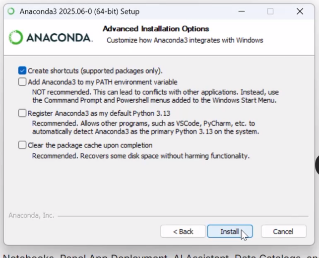
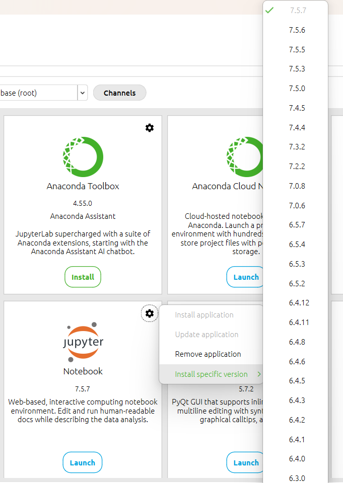
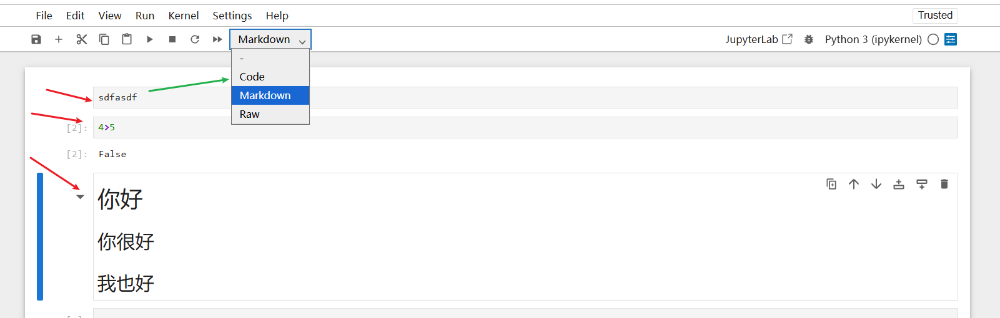

# 课程大纲

- 介绍
	- 概述
	- Python2与Python3
	- 如何学习本课程
- Python设置
	- 安装
	- 环境选择
	- 笔记系统
	- git/github
- 对象和数据结构基础
	- Numbers
	- Strings
	- Lists
	- Dictionaries
	- Tuples（元组）
	- Files
	- Sets（集合）
	- Booleans
- 比较运算符
	- 基本运算符
	- 链式比较运算符
- 语句
	- if，elif，else
	- for
	- while
	- range
	- List Comprehensions（列表推导式）
- 方法和函数
	- Methods
	- Functions
	- LambdaExpressions（lambda表达式）
	- NestedStatements（嵌套语句）
	- Scope（作用域）
- 第一个里程碑项目
	- Pyhon创建一个游戏
- 面向对象编程
	- 对象，类，方法，继承，特殊方法
- ErrosAndExceptionHandling（错误和异常处理）
	- Erros
	- Exceptions
	- try
	- except
	- finally
- 第二个里程碑项目
	- 创建更复杂的游戏
- Modules and Package（模块和包）
	- 创建模块
	- 安装模块
	- 总体上探索Pythone生态
- 内置函数
	- map
	- reduce
	- filter
	- zip
	- enumerate
	- all and any
	- complex（处理复数）
- Decorators in Python（装饰器，这个系列三部分）
- Python Generators（生成器）
	- Iteration vs Generation （迭代器、生成器）
	- Creating Generators （生成器）
- 所有知识整合到一个项目
- 高级额外内容（定期添加）----110集
	- 高级Python Modules
	- 高级Python Object ，高级数据结构

# Python 介绍

- 可读性、易用性
- 大量现有库、框架
- 解决开发时间（不是运行时间）
- 大量直接可用的==基础Python==和==基础模块==、外部库
	- 自动化简单任务（搜索文件、读写文件、自动发送电子文件）
	- 数据科学，机器学习
	- 创建网站（Django，Flask）

# 使用命令行

本节学习：  
- 查找当前目录
- 列出目录文件
- 修改目录
- 清空命令行

`pwd`,`ls`,`cd xxxx`,`clear`,`cd ..`  

# Python安装

- 用免费的Anaconda发行版，将==安装Python语言==以及一个易于使用的==开发环境==和==导航器启动工具==、其他库、其他工具 ~~包括Jupyter Notebook环境~~ ，简要运行JupyterNotebook ~~整个分析过程、代码和结果都会保存在同一个 .ipynb 文件中。Jupyter Notebook 就像一个“可以边写代码、边写文档、边看结果”的交互式实验本~~   
- 介绍一些在线免安装运行Python的网站

## 下载anaconda

- 文档 `https://www.anaconda.com/docs/main` 
- 下载链接 `https://www.anaconda.com/download` 

一些设置 ~~默认即可~~    



安装后启动 ~~可以发现这就是一个集成并管理各种第三方软件的一个工具，所以我猜Jupyter Notebook这个应该也是可以独立下载安装的并不一定要在anaconda才能安装~~   

  

比如这里还可以安装指定版本  



Enviroment 那里，也可以指定版本号 ~~但是base和anacona3这两个环境不允许修改，自己建的可以~~   


## Jupyter Notebook

/ˈdʒuːpɪtər/  

直接在菜单“Home”里面就能启动  

启动后，默认显示文件夹为`C:\Users\ly`  

  

## 启动anaconda时自动启动vscode并卡住

在Anaconda里，点开“File”--“References”，拉到最下面有VS Code path栏，把其中的路径改成完整的VS Code路径，==保存== ~~一定要记得保存~~ ，然后重启Anaconda就好了。


## 修改启动 jupyter时的默认目录

修改文件 `C:\Users\ly\.jupyter\jupyter_notebook_config.json`
~~新增notebook_dir那行~~  

```shell
{
  "NotebookApp": {
    "nbserver_extensions": {
      "jupyter_nbextensions_configurator": true
    },
    "notebook_dir": "D:\\Users\\ly\\Jupyter"
  }
}
```

我这里到 https://github.com/pierian-data/complete-python-3-bootcamp 下载了zip整份代码并压缩到了该目录  


~~其实整个视频课程应该是（可以）边做笔记边写代码的形式~~    


## jupyter简单使用

- File-New-Notebook 简单新建笔记
- 以单元格形式存在，每个单元格可以是 markdown或者raw或者code（代码）
- 添加后点击运行 ~~不论是markdown单元格或者raw或者code都行~~ 

  


## 一些在线的网站

- jupyter在线： https://jupyter.org/try  
- google colab https://colab.research.google.com/notebook
- https://replit.com/ 

