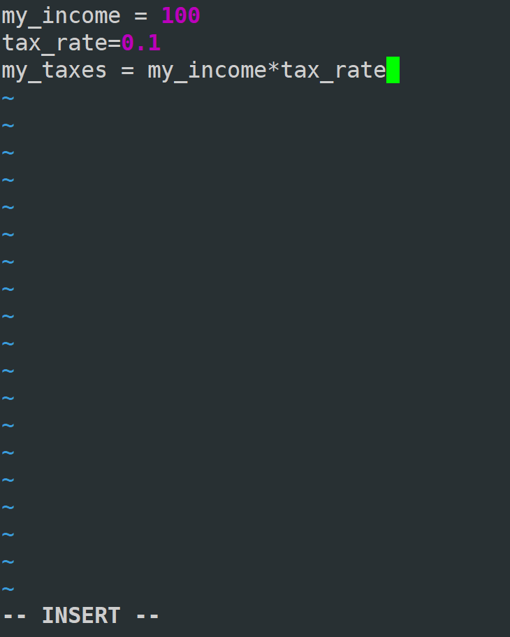

# 数据类型简介

| Name           | Type    | Description                                                           |
| :------------- | :------ | :-------------------------------------------------------------------- |
| Integers       | `int`   | Whole numbers, such as: `3` `300` `200`                               |
| Floating point | `float` | Numbers with a decimal point: `2.3` `4.6` `100.0`                     |
| Strings        | `str`   | Ordered sequence of characters: `"hello"` `'Sammy'` `"2000"` `"楽しい"`  |
| Lists          | `list`  | Ordered sequence of objects: `[10,"hello",200.3]`                     |
| Dictionaries   | `dict`  | Unordered Key:Value pairs: `{"mykey" : "value" , "name" : "Frankie"}` |
| Tuples         | `tup`   | Ordered immutable sequence of objects: `(10,"hello",200.3)`           |
| Sets           | `set`   | Unordered collection of unique objects: `{"a","b"}`                   |
| Booleans       | `bool`  | Logical value indicating **True** or **False**                        |
## 占用大小（ai）

| 数据类型    | 类型标识 (`Type`)   | 基础/典型占用字节 (`Bytes`)                | 内存占用与扩容机制说明                                                                                                              |
| :------ | :-------------- | :--------------------------------- | :----------------------------------------------------------------------------------------------------------------------- |
| **布尔型** | `bool`          | **28 字节**                          | `True` 和 `False` 是全局单例对象（继承自 `int`），固定占用 28 字节。  True or False                                                           |
| **整型**  | `int`           | **28 字节**                          | 基础 28 字节（存储 32 位以内的整数）。**任意精度**：数值超过 32 位（$2^{30}-1$）后，每增加 30 位数据递增 4 字节。  `3` `300` `200`                               |
| **浮点型** | `float`         | **24 字节**                          | **固定 24 字节**（包含 8 字节 IEEE 754 双精度浮点数及对象头）。超出范围返回 `inf` 或下溢为 `0.0`。  `2.3` `4.6` `100.0`                                  |
| **字符串** | `str`           | **48 字节**（空串）                      | 根据最复杂字符自动选择编码：<br>• ASCII / 纯英文：48 + 字符数×1 字节<br>• Unicode / 中文日文：74 + 字符数×2 字节<br> `"hello"` `'Sammy'` `"2000"` `"楽しい"` |
| **元组**  | `tup` (`tuple`) | **40 字节**（空元组）<br>（3 元素示例：64 字节）   | 计算公式约为 $40 + 8 \times n$ 字节（$n$ 为指针数）。只存储元素指针，元素本身内存另计。不可变。  `(10,"hello",200.3)`                                        |
| **列表**  | `list`          | **56 字节**（空列表）<br>（3 元素示例：88 字节）   | 计算公式约为 $56 + 8 \times n$ 字节。为保证追加效率会预分配容量（Over-allocation），仅存储元素指针。 `[10,"hello",200.3]`                                 |
| **集合**  | `set`           | **216 字节**（空集合）                    | 基于哈希表实现，初始即预分配包含 8 个槽位的哈希表，基础开销较大。 `{"a","b"}`                                                                           |
| **字典**  | `dict`          | **64 字节**（空字典）<br>（2 键值对示例：184 字节） | 基于紧凑哈希表实现，包含索引数组与键值对数组。仅计字典结构及指针占用，Key 和 Value 对象本身内存另计。 `{"mykey" : "value" , "name" : "Frankie"}`                      |

## 比较

### 基础数据类型

| 数据类型              | `==` 比较标准                | 顺序敏感？  | 独立定义时 `a is b`                                               |
| :---------------- | :----------------------- | :----- | :----------------------------------------------------------- |
| **整型 (`int`)**    | 比较数值大小是否完全相同             | 不适用    | **常为 `True`**（小整数区间 `-5` 到 `257` 会全局缓存地址；大整数在同一作用域下也有编译优化缓存） |
| **浮点型 (`float`)** | 比较数值大小（注意 IEEE 754 精度误差） | 不适用    | **可能为 `True`**（相同常量在同一代码块中会被编译优化指向同地址；不同代码块中为 `False`）       |
| **字符串 (`str`)**   | 按字符序列及其顺序依次比较            | **敏感** | **常为 `True`**（满足驻留机制 Interning 的短字符串或编译期常量会共享内存地址）           |

**Python 语言规范本身并没有强制要求必须指向同一地址**，这是解释器为了节省内存和提高效率所做的优化。

规则划分如下：

1. 整型（`int`）：为什么是“常为 True”？
   - **小整数缓存机制（确定为 `True`）**： CPython 解释器启动时，会默认把 `-5` 到 `256` 之间的整数提前创建好并常驻内存。    
	   - `a = 100; b = 100` `a is b` **必定为 `True`**。   
   - **大整数场景（可能为 `False`）**： 超出这个范围的大整数（如 `1000`），如果是在**不同的代码块/不同文件中**分别定义，内存地址会不同。    
	    - 解释器交互命令行中：`a = 1000; b = 1000` `a is b` 为 **`False`**。   
	    - 同一个 `.py` 文件中：编译器优化会将相同的常量合并，`a is b` 又会变成 **`True`**。  
2. 浮点型（`float`）：为什么是“可能为 True”？
   - **不同代码块（确定为 `False`）**： Python 没有为 `float` 建立全局缓存池。    
    - 命令行中运行 `a = 1.0; b = 1.0` `a is b` **必定为 `False`**。        
    - **同一代码块（优化为 `True`）**： 如果在同一个函数或同一个脚本文件里直接字面量赋值，编译器进行“常数折叠”优化，让它们复用同一个常量地址。   
    - 脚本中 `a = 1.0; b = 1.0` `a is b` 会变成 **`True`**。       
3. 字符串（`str`）：为什么是“常为 True”？
   - **字符串驻留机制（String Interning，大多为 `True`）**： 符合标准标识符命名规则（如纯字母、数字、下划线）且较短的字符串，Python 会自动将其驻留并复用内存。    
    - `a = "hello"; b = "hello"` `a is b` **必定为 `True`**。        
    - **动态/复杂字符串（确定为 `False`）**： 包含特殊符号（如空格、标点）或者是运行期动态拼出来的字符串，不会自动驻留。    
    - `a = "hello world!"; b = "hello world!"`（命令行下） `a is b` 为 **`False`**。        
4. 总结：在实际开发中，由于这些底层优化受解释器版本、代码运行环境（交互终端 vs 脚本文件）影响，**严禁在代码中依赖 `is` 来比较 `int`、`float` 或 `str` 的值**。判断数值或文本是否相等，务必只使用 `==`。

5. **`float` 的精度与特殊值陷阱**：    
    -   **精度误差**：直接用 `==` 比较两个经过浮点运算计算出的 `float` 可能由于二进制舍入导致非预期结果（例如 `0.1 + 0.2 == 0.3` 为 `False`）。工程中通常使用 `math.isclose()` 进行带容差的比较。        
    -   **`NaN`（非数）**：`float('nan') == float('nan')` 的结果为 **`False`**（IEEE 754 标准规定 NaN 不等于任何值，包括自身）。        
6. **跨数据类型的数值比较**：    
    -   Python 支持 `int` 与 `float` 进行 `==` 比较，数值相等即返回 `True`（如 `1 == 1.0` 结果为 `True`）。        
    -   但数值与字符串比较不会自动隐式转换，结果始终为 `False`（如 `1 == "1"` 结果为 `False`）。

### 数据结构

| 数据结构 | `==` 比较标准 | 顺序敏感？ | 独立定义时 `a is b` |
| :--- | :--- | :--- | :--- |
| **元组 (`tuple`)** | 按位置依次比较元素 | **敏感** | 可能为 `True`（不可变对象常驻/编译优化） |
| **列表 (`list`)** | 按位置依次比较元素 | **敏感** | **必为 `False`**（可变对象独立开辟内存） |
| **字典 (`dict`)** | 比较所有的 `Key: Value` 是否相同 | **不敏感** | **必为 `False`** |
| **集合 (`set`)** | 比较去重后的元素集合是否一致 | **不敏感** | **必为 `False`** |
# Python 交互式解释器(REPL)

也叫做Python REPL  ~~Read - Evaluate - Print - Loop；读取 - 执行 - 打印 - 循环~~ 

# 数字类型

```shell
#基础运算
y@dba13:~$ python3
Python 3.13.5 (main, Jul 15 2026, 20:25:40) [GCC 14.2.0] on linux
Type "help", "copyright", "credits" or "license" for more information.
>>> 2+1
3
>>> 2-1
1
>>> 2*2
4
>>> 3/2
1.5
>>> 7/4
1.75
>>> 7%4
3
>>> 50%5
0
>>> 23%2
1
>>> 20%2
0
>>> 2**3
8
>>> 2 + 10 * 10 +3
105
>>> (2+10)*(10+3)
156
>>> 7//3  #整除
2

```

# 变量

## 命名规则

- 名称不能以数字开头。
- 名称中不能包含空格，请使用下划线代替。
- 名称中不能包含以下任何符号：
  `:'",<>/?|\!@#%^&*~-+`

- 根据 PEP8 规范，名称应使用小写字母并加下划线。
- 避免使用 Python 内置关键字，例如 list 和 str
- 避免使用单个字符 l （小写字母 el）、 O （大写字母 oh）和 I （大写字母 eye），因为它们容易与 1 和 0 混淆。

## 其他说明

Python 使用动态类型 ，这意味着你可以将变量重新赋值给不同的数据类型。  

### 例子1

```shell
>>> my_dogs=2
>>> my_dogs=["sammy","frankie"]
>>> type(my_dogs)
<class 'list'>
>>> my_dogs="abc"
>>> type(my_dogs)
<class 'str'>
>>> my_dogs=1;type(my_dogs)
<class 'int'>
>>> my_dogs=1.0;type(my_dogs)
<class 'float'>
>>> my_dogs=false
Traceback (most recent call last):
  File "<python-input-7>", line 1, in <module>
    my_dogs=false
            ^^^^^
NameError: name 'false' is not defined. Did you mean: 'False'?
>>> my_dogs=False;type(my_dogs)
<class 'bool'>

```

### 例子2

```shell
>>> a=5
>>> a
5
>>> a=10
>>> a+a
20
>>> a=a+a
>>> a
20

```
### 例子3

不要拿关键字int当变量名，这里的int是内置函数，表示转换字符串为数字

```shell
>>> int = 4
>>> int
4
>>> int("123")
Traceback (most recent call last):
  File "<python-input-2>", line 1, in <module>
    int("123")
    ~~~^^^^^^^
TypeError: 'int' object is not callable

```

int是一个函数名  

```shell
>>> a="123"
>>> a
'123'
>>> int(a)
123

```
## ptpython 和 ipython

用来增强原生repl ~~会有高亮、自动补全等等~~ ，Jupyter就是内置的ipython  

### 虚拟环境下安装 ipython 

```shell
sudo apt install python3-pip
#创建虚拟环境安装
sudo apt install python3-venv
```

```shell
sudo apt update
sudo apt install python3-full python3-venv
#创建一个Python环境
mkdir ~/python-env

cd ~/python-env
python3 -m venv myenv
source myenv/bin/activate #激活
ls myenv
bin  include  lib  lib64  pyvenv.cfg

which python
which pip

#给虚拟环境安装ipython
python -m pip install ipython #找到这个 Python 自己带的 pip，然后运行它。
#给虚拟环境安装ptpython
python -m pip install ptpython #找到这个 Python 自己带的 pip，然后运行它。
(myenv) ly@dba13:~$ ptpython --version
3.0.32
(myenv) ly@dba13:~$ ipython --version
9.17.0

```

#### 虚拟环境进退

```shell
deactivate #退出虚拟环境
source ~/python-env/myenv/bin/activate #进入虚拟环境
```

### debian下直接安装

```shell
sudo apt install ipython3
ipython3 --version
8.35  #这里落后了很大的版本
```

## 多行输入

这个只有在jupyter里面才行，在传统的repl中不行，在ipython中可以用%edit实现多行输入  

```shell
(myenv) ly@dba13:~$ ipython
Python 3.13.5 (main, Jul 15 2026, 20:25:40) [GCC 14.2.0]
Type 'copyright', 'credits' or 'license' for more information
IPython 9.17.0 -- An enhanced Interactive Python. Type '?' for help.
Tip: You can find how to type a Unicode symbol by back-completing it, eg `\Ⅷ<tab>` will expand to `\ROMAN NUMERAL EIGHT`.

In [1]: %edit
IPython will make a temporary file named: /tmp/ipython_edit_yl61cokf/ipython_edit_z7l3kxva.py
```



保存并退出编辑器后，IPython 会把这几行代码作为一次输入执行  

```
Editing... done. Executing edited code...
Out[1]: 'my_income = 100\ntax_rate=0.1\nmy_taxes = my_income*tax_rate\n'

In [2]: my_taxes
Out[2]: 10.0

```

## 可以用分号代替

Python中换行符（newline）来表示一条语句结束。  

```shell
>>> a=1;b=2;print(a+b)
3
```

如果一条语句太长怎么办？

可以使用 \ 续行：

```shell shell
total = 1 + 2 + 3 + \
        4 + 5
```


也可以使用括号（推荐）：

``` shell
total = (
    1 + 2 + 3 +
    4 + 5
)
```