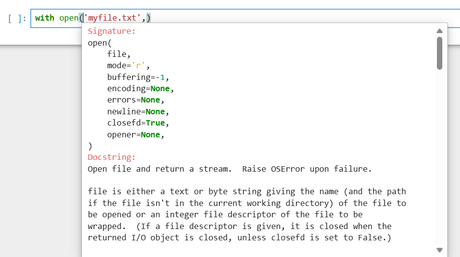
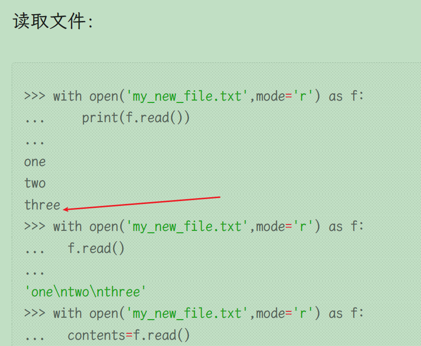

# 基本的文件输入输出

## 编辑并保存一个测试文件

在jupyter中输入并运行  

```shell
%%writefile myfile.txt
Hello this is a text file
this is the second line
this is the third line
```

得到文件  

  

注意，最后一行（第三行）最后还有一个换行符`\n`  

也就是说，在jupyter输入的文本，都会以一个换行符结束输入  

另一种情况，在linux下使用ipython命令行输入  

```shell
In [2]: %%writefile myfile_linux.txt
   ...: a
   ...: b
   ...: 
   ...: 
Overwriting myfile_linux.txt

```

在系统中查看，发现jupyter是没有空行的，而myfile_linux.txt则多了一个空行    

```shell
(myenv) ly@dba13:~$ cat myfile_linux.txt
a
b

(myenv) ly@dba13:~$ cat myfile.txt #这个是我保存的jupyter编辑的文件
Hello this is a text file
this is the second line
this is the third line
(myenv) ly@dba13:~$ 

```

  

所以如果实在linux跟着教程做，建议直接在linux中使用nano或者vim编辑即可，编辑后保持和视频一致  

```shell
#$表示换行符
ly@dba13:~$ cat -A  myfile.txt 
Hello this is a text file$
this is the second line$
this is the third line$
```

## 输入输出

```shell
#查看当前目录
>>> import os
>>> os.getcwd()
'/home/ly'
#pwd只有在ipython里才有用
>>> os.listdir()
['myfile.txt', '.Xauthority', '.python_history', '.config', '.bash_logout', '.viminfo', '.sudo_as_admin_successful', 'python-env', '.bash_history', '.bashrc', '.profile', '.ipython', '.local', '.cache']

>>> myfile=open('myfile.txt')
>>> type(myfile)
<class '_io.TextIOWrapper'>
>>> content=myfile.read() #一次性读取整个文件，所以如果文件非常大就会造成等待直到读取完毕
>>> type(content)
<class 'str'>
>>> content
'Hello this is a text file\nthis is the second line\nthis is the third line\n' 
>>> myfile.close()
```

注意这个  

```shell
>>> content
'Hello this is a text file\nthis is the second line\nthis is the third line\n'
```

视频教程中，third line 后面并没有`\n` ~~不是read函数输出的问题，是`%%writefile`时末尾没有自动添加换行符`\n`~~   


后面翻阅了其他资料，是因为这个课程出来的较早，前期使用的是 anaconda4.2的版本 ~~即Anaconda 4.2(2016年的版本，当时的版本号命名可能和现在不一样，4.2是很旧的版本)，现在(2026年8月)是Anaconda3~~ ，对应的python和ipython以及jupyter都是旧版本  

  
使用anaconda4.2测试后和视频保持一致 ~~这里c后面没有`\n`~~   


### 多次read

```shell
ly@dba13:~$ cat -A myfile.txt
Hello this is a text file$
this is the second line$
this is the third line$
```

seek()参数是字节，而read()参数是字符  

```shell
>>> myfile=open('myfile.txt')
>>> myfile.read()
'Hello this is a text file\nthis is the second line\nthis is the third line\n'
>>> myfile.read() #这是因为读取文件时内部有个光标，读取整个文件后光标在最后面（并没有重置）
''
>>> myfile.seek(0) #重置光标到第0个字节前（光标从0开始）
0
>>> myfile.read()
'Hello this is a text file\nthis is the second line\nthis is the third line\n'
>>> myfile.seek(3) #重置光标到第3个字节前（光标从0开始）
3
>>> myfile.read()
'lo this is a text file\nthis is the second line\nthis is the third line\n'
>>> myfile.read(2)
''
>>> myfile.seek(2)#重置光标到第2个字节前（光标从0开始）
2
>>> myfile.read(3) #读取三个字符（不是字节）
'llo'
>>> myfile.close()
```

### seek作用

| 场景           | 用不用 seek                |
| ------------ | ----------------------- |
| 读取普通 txt     | 很少(因为不同字符可能<br>占用不一样字节) |
| 重新读取文件       | 常用                      |
| 处理图片/视频/压缩文件 | 非常常用                    |
| 数据库存储        | 常用                      |
| 大文件随机读取      | 常用                      |
| 修改==固定格式==文件 | 常用                      |

### Linux中避免自动添加换行符

```shell
#对于vim
vim -b +"set noeol" hello.txt
#之后:wq保存关闭
#对于nano
nano -L hello.txt
#对于vim
vim hello.txt
#编辑过程中，ctr+c 弹出命令模式，然后:set noeol | wq

#或者
vim ~/.vimrc
set nofixeol
#需要重新登录/或者重启

```

### 分行读取到列表

```shell
ly@dba13:~$ cat myfile.txt 
Hello this is a text file$
this is the second line$
this is the third line

#python repl操作
>>> myfile=open('myfile.txt')
>>> contents=myfile.read()
>>> contents
'Hello this is a text file\nthis is the second line\nthis is the third line'
>>> myfile.seek(0)
0
>>> myfile.readlines() #原有\n的地方留在列表元素中
['Hello this is a text file\n', 'this is the second line\n', 'this is the third line']
>>> myfile.close()
```

## 从文件位置读取

```shell
#新建并编辑保存一个文件
ly@dba13:~/mydir$ cat -A  ~/mydir/hello 
hello$
hi$

#推荐使用with，代码块运行后文件会自动关闭
>>> with open('/home/ly/mydir/hello') as my_new_file:
     contents = my_new_file.read() #缩进代码中的任何代码都知道my_new_file这个变量
     
>>> contents
'hello\nhi\n'

```

# 读取和写入(位置参数和关键字参数)

光标放到左括号`(`之后，然后按shift+tab 即可查看函数使用方法  

  
现在回到普通的repl测试  

```shell
>>> with open('myfile.txt','r') as myfile:
              contents=myfile.read()
              
>>> with open(mode='r',file='myfile.txt') as myfile:
              contents=myfile.read()
              
>>> with open('r',file='myfile.txt') as myfile:
              contents=myfile.read()
              
Traceback (most recent call last):
  File "<python-input-2>", line 1, in <module>
    with open('r',file='myfile.txt') as myfile:
         ~~~~^^^^^^^^^^^^^^^^^^^^^^^
TypeError: argument for open() given by name ('file') and position (1)
>>> with open('myfile.txt',mode='r') as myfile:
              contents=myfile.read()
              
>>> contents
'Hello this is a text file\nthis is the second line\nthis is the third line'
>>> with open(file='myfile.txt','r') as myfile:
              contents=myfile.read()
              
  File "<python-input-5>", line 1
    with open(file='myfile.txt','r') as myfile:
                                   ^
SyntaxError: positional argument follows keyword argument


```

```shell
#写模式下读取（失败）
#mode='w'，覆盖写入；mode='a'，追加写入；mode='r'，读取文件
>>> with open('myfile.txt','w') as myfile: 
              contents=myfile.read()
              
Traceback (most recent call last):
  File "<python-input-6>", line 2, in <module>
    contents=myfile.read()
io.UnsupportedOperation: not readable
#失败之后，文件内容会被清空
```

重新编辑写入文件  

```shell
ly@dba13:~$ cat myfile.txt
hello1
hi2
```

## read函数的参数mode简介

| mode   | 名称               | 是否读取 | 是否写入 | 文件不存在 | 文件存在    |
| ------ | ---------------- | ---- | ---- | ----- | ------- |
| `'r'`  | read（默认）         | ✅    | ❌    | 报错    | 从开头读取   |
| `'w'`  | write            | ❌    | ✅    | 创建    | 清空原内容   |
| `'a'`  | append           | ❌    | ✅    | 创建    | 追加到末尾   |
| `'x'`  | exclusive create | ❌    | ✅    | 创建    | 报错      |
| `'r+'` | read/write       | ✅    | ✅    | 报错    | 从开头读写   |
| `'w+'` | write/read       | ✅    | ✅    | 创建    | 清空后读写   |
| `'a+'` | append/read      | ✅    | ✅    | 创建    | 末尾追加，可读 |

新增一个文件  

```shell
ly@dba13:~$ cat -A my_new_file.txt
one$
two$
threely
```

读取文件：  

```shell
>>> with open('my_new_file.txt',mode='r') as f:
...     print(f.read())
...     
one
two
three
>>> with open('my_new_file.txt',mode='r') as f:
...   f.read()
...   
'one\ntwo\nthree'
>>> with open('my_new_file.txt',mode='r') as f:
...   contents=f.read()
...   
>>> contents
'one\ntwo\nthree'

```

如果此时修改了my_new_file.txt为：  

```shell
ly@dba13:~$ cat my_new_file.txt 
one
two
three

```

```shell
#运行
>>> with open('my_new_file.txt',mode='r') as f:
...     print(f.read())
...     
one
two
three

>>> with open('my_new_file.txt',mode='r') as f:
...   f.read()
...   
'one\ntwo\nthree\n'
>>> with open('my_new_file.txt',mode='r') as f:
...   contents=f.read()
...   
>>> contents
'one\ntwo\nthree\n'

```

说明之前这里是没有空行的，否则应有一个空的行  

  


## 追加

```shell
>>> with open('my_new_file.txt',mode='a') as f:
...   f.write('four')
...   
4  #其实这个4就是添加了4个字符的意思
>>> with open('my_new_file.txt',mode='r') as f:
...   contents=f.read()
...   
>>> contents
'one\ntwo\nthree\nfour'

```

如上，在`one\ntwo\nthree\n`的基础上添加了`four` ~~没有换行符~~   

## 写入 w

w模式：文件不存在的话就会创建新文件

```shell
>>> with open('not_exist_idufiusf.txt',mode='w') as f:
...   f.write('haha_hello_你好')
...   
13
>>> with open('not_exist_idufiusf.txt',mode='r') as f:
...   contents=f.read()
...   
>>> contents
'haha_hello_你好'

```

# 至今为止的一些测试题

```shell
>>> 3+1.5+4
8.5
>>> type(3+1.5+4) #一旦表达式引入浮点数，结果一定是浮点数
<class 'float'>
>>> 4**2
16
>>> 4**0.5
2
>>> import math;math.sqrt(9)
3.0

```

## 字符串相关

```shell
>>> s='hello'
>>> s[2]
'l'
>>> s[-1:] #由-1位置向后遍历
'o'
>>> s[-1:0] #由-1位置向后遍历
''
>>> s[1:2]
'e'
>>> s[-1:0:-1] #这个不包括位置0
'olle'
>>> s[-1:-1:-1]
''
>>> s[::-1] #反向遍历
'olleh'

```

`s[-1:0]`相当于`s[4:0:1]`，也就是`start = 4,stop  = 0,step  = 1` ，所以不可能有元素，直接返回了空  

```shell
#使用两种方法创建包括三个0的列表
>>> [0,0,0]
[0, 0, 0]
>>> [0]*3
[0, 0, 0]
#修改hello为goodbye
>>> list3=[1,2,[3,4,'hello']]
>>> list3[2][2]='goodbye'
>>> list3
[1, 2, [3, 4, 'goodbye']]
#排序
>>> list4=[5,3,4,6,1]
>>> list4.sort() #原地操作；字符串的upper()和lower()不是原地操作
>>> list4
[1, 3, 4, 5, 6]

>>> list4=[5,3,4,6,1]
>>> sorted(list4) #sorted不会原地操作
[1, 3, 4, 5, 6]
>>> list4
[5, 3, 4, 6, 1]

```

## 字典

```shell
#获取hello
>>> d={'simple_key':'hello'}
>>> d['simple_key']
'hello'
>>> d={'k1':{'k2':'hello'}}
>>> d['k1']['k2']
'hello'
#获取hello
>>> d={'k1':[{'nest_key':['this is deep',['hello']]}]}
>>> d['k1'][0]['nest_key'][1][0]
'hello'
#获取hello
>>> d={'k1':[1,2,{'k2':['this is tricky',{'tough':[1,2,['hello']]}]}]}
>>> d['k1'][2]['k2'][1]['tough'][2][0]
'hello'

```

不能对字典进行排序，因为==普通字典==是映射，不是序列 ~~不过存折一种类似字典的对象，叫有序字典~~   


## 元组

```shell
#元组创建；元组元素顺序不可变；元组也不可变
>>> (1,3,'a')
(1, 3, 'a')

```

## 集合

```shell
>>> list5=[1,2,2,33,4,4,11,22,3,3,2]
>>> set(list5)
{1, 2, 33, 4, 3, 11, 22}

```

## 布尔

```shell
>>> 2>3
False
>>> 3<=2
False
>>> 3==2.0
False
>>> 3.0==3
True
>>> 4**0.5!=2
False
#较为复杂
>>> l_one=[1,2,[3,4]]
>>> l_two=[1,2,{'k1':4}]
>>> l_one[2][0]>=l_two[2]['k1']
False

```