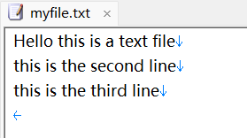
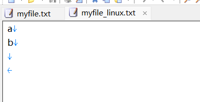
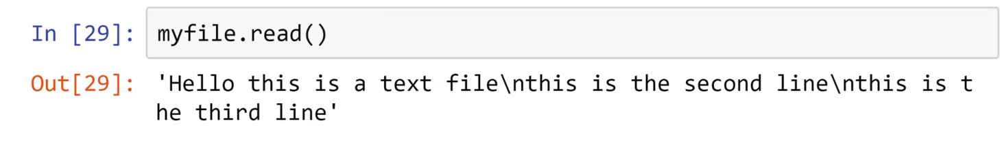
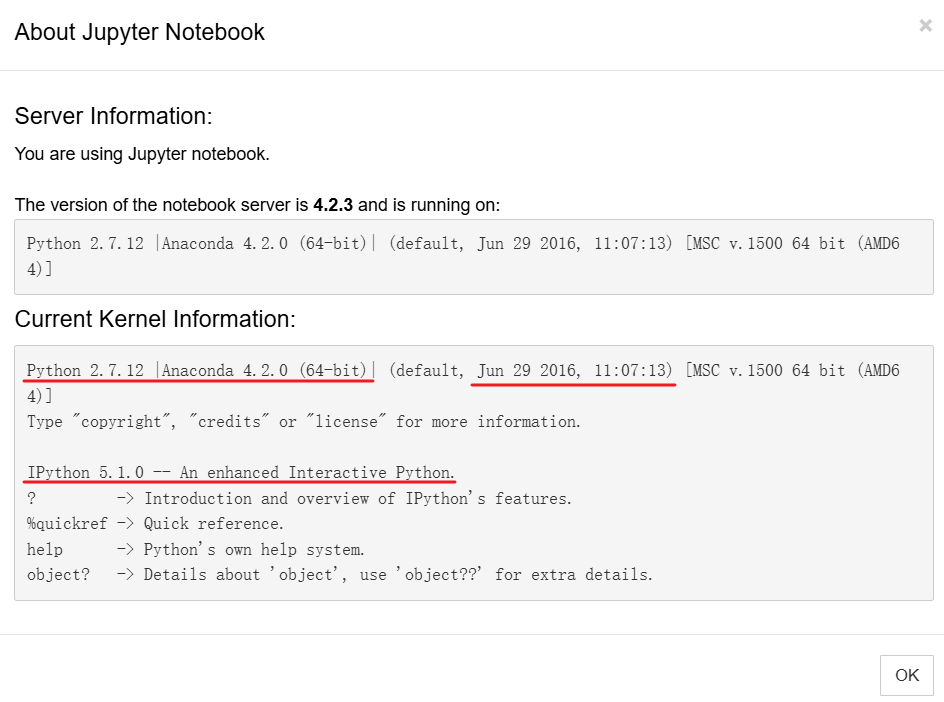
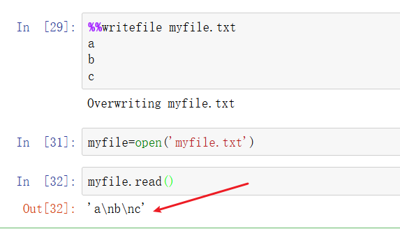

# 基本的文件输入输出

## 编辑并保存一个测试文件

在jupyter中输入并运行  

```shell
%%writefile myfile.txt
Hello this is a text file
this is the second line
this is the third line
```

得到文件  

  

注意，最后一行（第三行）最后还有一个换行符`\n`  

也就是说，在jupyter输入的文本，都会以一个换行符结束输入  

另一种情况，在linux下使用ipython命令行输入  

```shell
In [2]: %%writefile myfile_linux.txt
   ...: a
   ...: b
   ...: 
   ...: 
Overwriting myfile_linux.txt

```

在系统中查看，发现jupyter是没有空行的，而myfile_linux.txt则多了一个空行    

```shell
(myenv) ly@dba13:~$ cat myfile_linux.txt
a
b

(myenv) ly@dba13:~$ cat myfile.txt #这个是我保存的jupyter编辑的文件
Hello this is a text file
this is the second line
this is the third line
(myenv) ly@dba13:~$ 

```

  

所以如果实在linux跟着教程做，建议直接在linux中使用nano或者vim编辑即可，编辑后保持和视频一致  

```shell
#$表示换行符
ly@dba13:~$ cat -A  myfile.txt 
Hello this is a text file$
this is the second line$
this is the third line$
```

## 输入输出

```shell
#查看当前目录
>>> import os
>>> os.getcwd()
'/home/ly'
#pwd只有在ipython里才有用
>>> os.listdir()
['myfile.txt', '.Xauthority', '.python_history', '.config', '.bash_logout', '.viminfo', '.sudo_as_admin_successful', 'python-env', '.bash_history', '.bashrc', '.profile', '.ipython', '.local', '.cache']

>>> myfile=open('myfile.txt')
>>> type(myfile)
<class '_io.TextIOWrapper'>
>>> content=myfile.read() #一次性读取整个文件，所以如果文件非常大就会造成等待直到读取完毕
>>> type(content)
<class 'str'>
>>> content
'Hello this is a text file\nthis is the second line\nthis is the third line\n' 
```

注意这个  

```shell
>>> content
'Hello this is a text file\nthis is the second line\nthis is the third line\n'
```

视频教程中，third line 后面并没有`\n` ~~不是read函数输出的问题，是`%%writefile`时末尾没有自动添加换行符`\n`~~   



后面翻阅了其他资料，是因为这个课程出来的较早，前期使用的是 anaconda4.2的版本 ~~即Anaconda 4.2(2016年的版本，当时的版本号命名可能和现在不一样，4.2是很旧的版本)，现在(2026年8月)是Anaconda3~~ ，对应的python和ipython以及jupyter都是旧版本  

  
使用anaconda4.2测试后和视频保持一致 ~~这里c后面没有`\n`~~   



### 多次read

```shell
ly@dba13:~$ cat -A myfile.txt
Hello this is a text file$
this is the second line$
this is the third line$
```

seek()参数是字节，而read()参数是字符  

```shell
>>> myfile=open('myfile.txt')
>>> myfile.read()
'Hello this is a text file\nthis is the second line\nthis is the third line\n'
>>> myfile.read() #这是因为读取文件时内部有个光标，读取整个文件后光标在最后面（并没有重置）
''
>>> myfile.seek(0) #重置光标到第0个字节前（光标从0开始）
0
>>> myfile.read()
'Hello this is a text file\nthis is the second line\nthis is the third line\n'
>>> myfile.seek(3) #重置光标到第3个字节前（光标从0开始）
3
>>> myfile.read()
'lo this is a text file\nthis is the second line\nthis is the third line\n'
>>> myfile.read(2)
''
>>> myfile.seek(2)#重置光标到第2个字节前（光标从0开始）
2
>>> myfile.read(3) #读取三个字符（不是字节）
'llo'
```

### seek作用

| 场景           | 用不用 seek                |
| ------------ | ----------------------- |
| 读取普通 txt     | 很少(因为不同字符可能<br>占用不一样字节) |
| 重新读取文件       | 常用                      |
| 处理图片/视频/压缩文件 | 非常常用                    |
| 数据库存储        | 常用                      |
| 大文件随机读取      | 常用                      |
| 修改==固定格式==文件 | 常用                      |

### Linux中避免自动添加换行符

```shell
#对于vim
vim -b +"set noeol" hello.txt
#之后:wq保存关闭
#对于nano
nano -L hello.txt
#对于vim
vim hello.txt
#编辑过程中，ctr+c 弹出命令模式，然后:set noeol | wq

```

### 分行读取到列表

```shell
ly@dba13:~$ cat myfile.txt 
Hello this is a text file$
this is the second line$
this is the third line

#python repl操作
>>> myfile=open('myfile.txt')
>>> contents=myfile.read()
>>> contents
'Hello this is a text file\nthis is the second line\nthis is the third line'
>>> myfile.seek(0)
0
>>> myfile.readlines() #原有\n的地方留在列表元素中
['Hello this is a text file\n', 'this is the second line\n', 'this is the third line']
```

## 文件位置

```shell
#新建并编辑保存一个文件
ly@dba13:~/mydir$ cat -A  ~/mydir/hello 
hello$
hi$


```