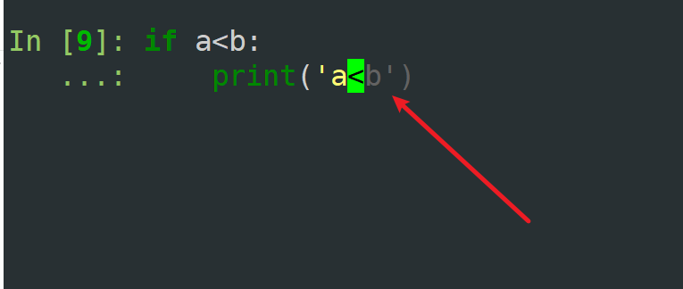

# if,elif,else

- 控制流：只在需要时才执行代码
- 靠缩进控制层级

```shell
if some_condition:
	# method1
	# method2
elif some_other_condition:
	#method3
	#method4
else:
	#method5
	#method6
#method7
```

- 所有处于if下的==*缩进*==层级 ~~method1,method2~~ 的代码，只有在条件 ~~some_condition~~ 为真时才会执行  
- method7永远都会执行，而其他的则依据条件而论

```shell
>>> a=3;b=4;
>>> a
3
>>> b
4
>>> if a<b:
...     print('a<b')
... elif a==5:
...     print('a=5')
... else:
...     print('other')
... print('hello world')
... 
a<b
hello world
>>> a=5;b=2;
>>> if a<b:
...     print('a<b')
... elif a==5:
...     print('a=5')
... else:
...     print('other')
... print('hello world')
... 
a=5
hello world
```

## 补充，一些快捷键：  

| 功能     | 快捷键              |
| ------ | ---------------- |
| 接受行内建议 | `Ctrl + →`       |
| 传统补全列表 | `Tab`            |
| 退缩进    | `Ctrl + U`（你的环境） |

  

这种情况按ctrl+ -> 就会补全行内建议  

## 例子

```shell
>>> if True:
...     print('its true!')
...     
its true!
>>> hungry = True 
>>> if hungry:
...     print('feed me!')
...     
feed me!
>>> hungry=False
>>> if hungry:
...     print('feed me!')
...  
#if-elif
>>> hungry = False
>>> if hungry:
...     print('feed me!')
... else:
...     print('im not hungry')
...     
im not hungry

```

## if-elif-else

```shell
>>> loc='bank'
>>> if loc=='auto shop':
...     print('cars are cool!')
... elif loc == 'bank':
...     print("money is cool!")
... elif loc=='store':
...     print("welcome to the store!")
... else:
...     print('i do not know much.')
...     
money is cool!

#另一个例子
>>> loc='game'
>>> if loc=='auto shop':
...     print('cars are cool!')
... elif loc == 'bank':
...     print("money is cool!")
... elif loc=='store':
...     print("welcome to the store!")
... else:
...     print('i do not know much.')
...     
i do not know much.

```

# for

- 对于可迭代 ~~iterable~~ 的东西
	- 遍历列表中的元素
	- 遍历字符串中的每个字符

> 
> print的定义：`print(*objects, sep=' ', end='\n' , file=None, flush=False)`   ~~表示print可以接收多个对象，打印时对象之间以sep(默认为空格)字符串隔开，end表示结尾(默认是换行符)~~
> 

```python
#注意##之后就没有任何字符了，没有空格也没有换行符
>>> print('a','b','c',sep='xx',end='##')
axxbxxc##
```

## 基本语法

```
```shell
>>> my_iterable=[1,2,3]
>>> for item_name in my_iterable:
...     print(item_name)
...     
1
2
3

```

## 其他例子

```shell
>>> mylist=[1,2,3,4,5,6,7,8,9,10]
>>> list=[]

>>> list
[]
#del 是 Python 的删除语句（delete statement），用于删除变量、对象里的元素等。
>>> del list
#这个是list真正的内置含义，是一个类，可以用来创建list
>>> list
<class 'list'>
>>> list('helo')
['h', 'e', 'l', 'o']


```

```shell
>>> mylist=[1,2,3,4,5,6,7,8,9,10]
>>> for num in mylist:
...     print(num,end=',')
...     
1,2,3,4,5,6,7,8,9,10,>>> for jelly  in mylist:
                     ...     print(jelly,end=',')
                     ...     
1,2,3,4,5,6,7,8,9,10,>>> None
>>> for num in mylist:
...     print('hello')
...     
hello
hello
hello
hello
hello
hello
hello
hello
hello
hello

```

### 和if结合

```shell
>>> for num in mylist:
...     # check for even
...     if num%2 == 0:
...         print(num)
...     else:
...         print(f'oll Number: {num}')
...         
oll Number: 1
2
oll Number: 3
4
oll Number: 5
6
oll Number: 7
8
oll Number: 9
10

```

### 常用场景

```shell
>>> mylist=[1,2,3,4,5,6,7,8,9,10]
>>> list_num=0
>>> for num in mylist:
...     list_num = list_num + num
... print(list_num)
... 
55
#Python中，缩进是相当重要的东西
#下面的print语句，和list_sum=list_num+num在同一个代码块运行
>>> list_num=0
>>> for num in mylist:
...     list_num = list_num + num
...     
...     print(list_num)
...     
1
3
6
10
15
21
28
36
45
55

#注意下面的缩进问题，p要么和上面的list_num的'l'对齐，要么和for num的'f'对齐。否则都会报错
>>> for num in mylist:
...     list_num = list_num + num
...     
...    print(list_num)
...    
  File "<python-input-45>", line 4
    print(list_num)
                   ^
IndentationError: unindent does not match any outer indentation level #取消缩进后，没有匹配到任何已有的外层缩进层级。
>>> for num in mylist:
...     list_num = list_num + num
...     
...      print(list_num)
...      
  File "<python-input-50>", line 4
    print(list_num)
IndentationError: unexpected indent #Python 本来不期待这里有缩进，但是你加了。
```

