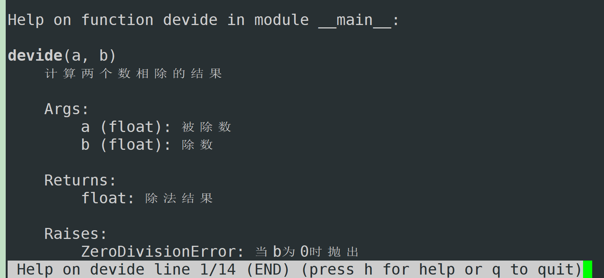
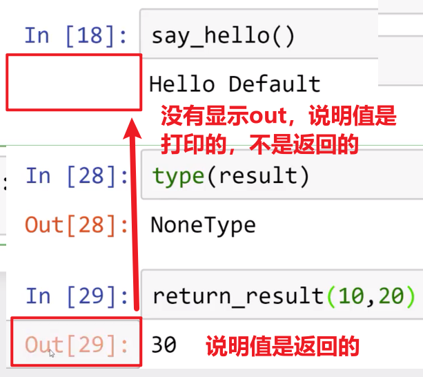

# 函数简介

- 再次运行一块代码时，不必再重新编写，而是使用一句话 ~~调用函数~~ 即可  
- 这里会把控制流、循环、逻辑等结合并练习

# def关键字

```
def (/dɛf/) 
```

```python
>>> def name_of_function():
...     """
...     Docstring explains function.
...     用来解释函数
...     这段代码不会被执行
...     """
...     print('Hello1')
...     '''
...     123124
...     '''
...     print("Hello2")
...     
>>> 
>>> name_of_function()
Hello1
Hello2
>>> name_of_function.__doc__
'\nDocstring explains function.\n用来解释函数\n这段代码不会被执行\n'
>>> print(name_of_function.__doc__) #注意下面，开头一个空行，结尾一个空行

Docstring explains function.
用来解释函数
这段代码不会被执行

```

- 创建函数需要def关键字，以及正确的缩进
- def告诉Python接下来是一个函数
- 函数名推荐用蛇形命名法，比如name_of_python
	- 类名推荐使用驼峰命名法
- ()括号里面可以表示参数
- 冒号表示接下来是一个缩进符

| 写法                              | 运行时保留？         | 影响运行效率？              |
| ------------------------------- | -------------- | -------------------- |
| `# xxx`                         | ❌              | ❌                    |
| 函数/类开头的 `"""xxx"""`             | ✅ 作为 `__doc__` | 几乎可以忽略(也就<br>是有很小部分) |
| 函数中间的 `"""xxx"""` / `'''xxx'''` | 通常不会保留为运行时对象   | 几乎没有                 |
## 初步认识doc文档

```bash
#初步认识doc文档

>>> def devide(a,b):
...     """计算两个数相除的结果
...     
...     Args:
...         a (float): 被除数
...         b (float): 除数
...         
...     Returns:
...         float: 除法结果
...         
...     Raises:
...         ZeroDivisionError: 当b为0时抛出    
...     """
...     return a/b
...     
>>> devide(3,4)
0.75
>>> help(devide)
```

help(devide) 的结果：



```
>>> print(devide.__doc__)
计算两个数相除的结果

Args:
    a (float): 被除数
    b (float): 除数
    
Returns:
    float: 除法结果
    
Raises:
    ZeroDivisionError: 当b为0时抛出    


```

```bash
>>> def add_function(num1,num2):
...     return num1+num2
...     
>>> add_function('1','2b')
'12b'

#非强制检查
>>> def add_function(num1:int,num2:int):
...     return num1+num2
...     
>>> add_function('1','2b')
'12b'
>>> result=add_function('1','2b')
>>> result
'12b'

```

# 函数基础

函数的主要用途，就是 ~~减少工作量地~~ 重复使用代码块  

```bash
>>> def say_hello():
...     print("hello")
...     print("are")
...     print("you")
...     
>>> say_hello
<function say_hello at 0x7f29ddebcd60>
>>> say_hello()
hello
are
you

#多次定义函数，将覆盖前面定义的
>>> def say_hello(name):
...     print("hello")
...     print("are")
...     print("you")
...     print(name)
...     
>>> say_hello()
Traceback (most recent call last):
  File "<python-input-31>", line 1, in <module>
    say_hello()
    ~~~~~~~~~^^
TypeError: say_hello() missing 1 required positional argument: 'name'
>>> say_hello(1)
hello
are
you
1
#Python中没有重载，通常用“默认参数”实现类似效果
#比如
>>> def myadd(a,b,c):
...     return a+b+c
...     
>>> myadd(1,3,3)
7
>>> def myadd(a,b,c=0):
...     return a+b+c
...     
>>> myadd(1,3)
4
>>> myadd(1,3,4)
8
#其实myadd只有一个
>>> myadd
<function myadd at 0x7f29ddebcd60>

```

## 默认值

```bash
>>> def say_hello(name):
...     print(f'hello {name}')
...     
>>> say_hello('lili')
hello lili
>>> say_hello()
Traceback (most recent call last):
  File "<python-input-41>", line 1, in <module>
    say_hello()
    ~~~~~~~~~^^
TypeError: say_hello() missing 1 required positional argument: 'name' #缺少一个必须的参数name
 #用等号指定默认值
>>> def say_hello(name='defa'):
...     print(f'hello {name}')
...     
>>> say_hello()
hello defa
>>> say_hello('xiaoming')
hello xiaoming
```

## return

```bash
#使用return后才能把结果赋值给变量
>>> def add_num(num1,num2):
...     return num1+num2
...     
>>> result=add_num(10,20)
>>> def say_hello(name='defa'):
...     print(f'hello {name}')
...   
>>> heihei=say_hello()
hello defa
>>> heihei
>>> type(heihei) #函数如果没有返回值，默认返回None(NoneType类型)
<class 'NoneType'>
>>> type(None)
<class 'NoneType'>

```

say_hello

jupyter中的特殊含义：  

  

```bash

In [2]: def print_result(a,b):
   ...:     print(a+b)
   ...:

In [3]: def return_result(a,b):
   ...:     return a+b
   ...:

In [4]: result=print_result(10,20)
30

In [5]: result

In [6]: type(result)
Out[6]: NoneType

In [7]: return_result(10,20)
Out[7]: 30

In [8]: result=return_result(10,20)

In [9]: result
Out[9]: 30

In [10]: type(result)
Out[10]: int
```

## 同时有打印结果和输出

```bash
In [11]: def myfunc(a,b):
    ...:     print(a+b)
    ...:     return a+b
    ...:

In [12]: result=myfunc(10,20)
30

In [13]: myfunc(10,20)
30
Out[13]: 30

In [14]: abcd=123

In [15]: abcd
Out[15]: 123

```

如上，`abcd=123`之类的`变量=value`不会有输出，只有`函数执行`或者`变量`才有可能有输出 ~~即 out\[x\]:xx~~ 

### 数据类型

Python是非静态数据类型，即动态数据类型，不需要提前制定类型  

```bash
In [16]: def sum_numbers(num1,num2):
    ...:     return num1+num2
    ...:

In [17]: sum_numbers(10,20)
Out[17]: 30

In [18]: sum_numbers('10',20)
---------------------------------------------------------------------------
TypeError                                 Traceback (most recent call last)
Cell In[18], line 1
----> 1 sum_numbers('10',20)

Cell In[16], line 2, in sum_numbers(num1, num2)
      1 def sum_numbers(num1,num2):
----> 2     return num1+num2

TypeError: can only concatenate str (not "int") to str

In [19]: sum_numbers('10','20')
Out[19]: '1020'
```