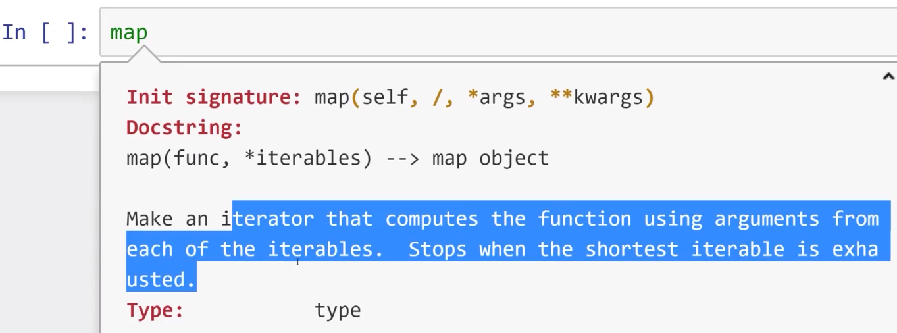

- lambda表达式
	- 一次性使用的函数，甚至不需要真正命名
- Python内置的Map函数
- Python内置的Filter函数

  

先不用管`Init signature: map(self,/,*args,**kwargs)`，这个跟类有关，尚未教学  

map接收一个函数，还有一个或多个可迭代对象  

# 关于map的解释(AI)

`map()` 设计：

```python
map(square, my_nums)
```

输出：

```python
<map at 0x7127a509afb0>
```

不是地址，而是 **map对象的默认字符串表示**。

它类似于：

```python
<对象类型 at 内存地址>
```

比如：

```python
>>> a = [1,2,3]
>>> a
[1, 2, 3]

>>> iter(a)
<list_iterator object at 0x123456>
```

迭代器也是这样显示的。

---

## 1. map返回的不是列表，而是一个迭代器（iterator）

Python 3 中：

```python
map(function, iterable)
```

返回：

```text
map对象
```

它保存：

1. 要执行的函数
2. 要处理的数据
3. 当前处理到哪里

它不会立即计算所有结果。

例如：

```python
def square(num):
    print("计算", num)
    return num**2


my_nums = [1,2,3,4,5]

result = map(square, my_nums)

print(result)
```

输出：

```
<map object at 0x...>
```

注意：

没有打印：

```
计算 1
计算 2
计算 3
...
```

因为还没有真正执行。

---

## 2. 什么时候才执行？

当你取里面的数据时：

例如：

```python
for item in map(square, my_nums):
    print(item)
```

这时候才开始：

第一次：

```
square(1)
```

得到：

```
1
```

第二次：

```
square(2)
```

得到：

```
4
```

所以输出：

```
1
4
9
16
25
```

---

## 3. list()做了什么？

这里：

```python
list(map(square,my_nums))
```

实际上分两步：

### 第一步：

创建map对象：

```python
m = map(square,my_nums)
```

相当于：

```
待计算：
square(1)
square(2)
square(3)
square(4)
square(5)
```

---

### 第二步：

list遍历它：

```python
list(m)
```

于是触发计算：

```
square(1) -> 1
square(2) -> 4
square(3) -> 9
square(4) -> 16
square(5) -> 25
```

最后生成：

```python
[1,4,9,16,25]
```

---

## 4. 为什么 Python 要这样设计？

主要是为了**节省内存**。

假设：

```python
nums = range(100000000)
```

如果：

```python
list(map(square, nums))
```

它会马上创建一个包含一亿个结果的列表。

内存压力很大。

而：

```python
m = map(square, nums)
```

只保存：

```
当前数字
+
计算规则
```

需要一个才算一个。

这种叫：

> 惰性计算（lazy evaluation）

---

## 5. 和 Java/C++ 对比

你熟悉 Java，可以类比：

Java Stream：

```java
list.stream()
    .map(x -> x*x)
```

不会立即计算。

必须：

```java
.collect(Collectors.toList())
```

才真正执行。

Python：

```python
map(square, nums)
```

≈ Java:

```java
stream.map(...)
```

---

## 6. Python 2 和 Python 3 的区别

Python 2：

```python
map(square,[1,2,3])
```

直接返回：

```python
[1,4,9]
```

Python 3：

```python
map(square,[1,2,3])
```

返回：

```python
map object
```

需要：

```python
list(...)
```

转换。

---

## 7. 你可以把 map 理解成：

```python
map(函数, 数据)
```

等价于：

```python
for x in 数据:
    函数(x)
```

你的例子：

```python
map(square,[1,2,3,4,5])
```

等价于：

```python
for x in [1,2,3,4,5]:
    square(x)
```

只是 `map` 把这个过程封装成了一个可迭代对象。

所以：

* `map()` → 生产一个「计算流水线」
* `for` → 从流水线取结果
* `list()` → 一次性把流水线全部取出来，变成列表

这也是为什么 Python 里经常把 `map()` 和 `filter()`、生成器（generator）放在一起学习。你前面问过 `yield`，它们背后的思想是同一类：**延迟产生数据，而不是提前全部生成。**

# map

> map：遍历可迭代对象，并返回和每一项有关的表达式

```python
In [4]: def square(num):
   ...:     return num**2
   ...:

In [5]: my_nums=[1,2,3,4,5]

#注意，这里返回的是一个可迭代对象
In [6]: map(square,my_nums)
Out[6]: <map at 0x7127a509afb0>

#拿来迭代
In [7]: for item in map(square,my_nums):
   ...:     print(item)
   ...:
1
4
9
16
25

In [8]: list(map(square,my_nums))
Out[8]: [1, 4, 9, 16, 25]

```

```python
In [10]: def splicer(mystring):
    ...:     if len(mystring)%2==0:
    ...:         return 'EVEN'
    ...:     else:
    ...:         return mystring[0]
    ...:

In [11]: names=['Andy','Eve','Sally']

In [12]: list(map(splicer,names))
Out[12]: ['EVEN', 'E', 'S']
```


# filter 

> filter：遍历可迭代对象，并返回和每一项有关的**布尔**表达式，只筛选出True的项

```python
In [13]: def check_even(num):
    ...:     return num%2==0
    ...:

In [14]: mynums=[1,2,3,4,5,6]

In [15]: a=filter(check_even,mynums)

In [16]: a
Out[16]: <filter at 0x7127a4f4d540>

#用法和map一样
In [17]: list(a)
Out[17]: [2, 4, 6]
```
