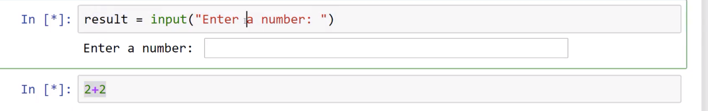
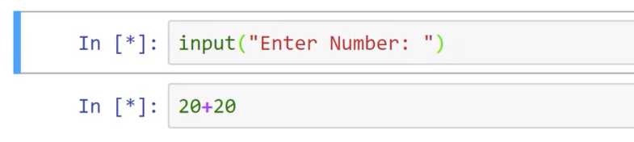

# 创建一个交互式的井字棋游戏

  
## 信息显示

```python
In [1]: def display(row1,row2,row3):
   ...:     print(row1)
   ...:     print(row2)
   ...:     print(row3)
   ...:
   
In [5]: row1=[' ',' ',' ']

In [6]: row2=[' ',' ',' ']

In [7]: row3=[' ',' ',' ']

In [8]: display(row1,row2,row3)
[' ', ' ', ' ']
[' ', ' ', ' ']
[' ', ' ', ' ']

In [10]: row2[1]='x'

In [11]: display(row1,row2,row3)
[' ', ' ', ' ']
[' ', 'x', ' ']
[' ', ' ', ' ']
```

## 接收用户输入

```python
In [12]: input("Please enter a value:")
Please enter a value:123
Out[12]: '123'

In [13]: result = input("Please enter a value:")
Please enter a value:r45g

In [14]: result
Out[14]: 'r45g'

#无论输入什么，input函数返回的都是字符串
In [16]: type(result)
Out[16]: str

In [18]: result=input("enter value:")
enter value:12

#如果需要特定的数据类型，可能需要手动转换
In [19]: result_int=int(result)

In [20]: type(result_int)
Out[20]: int

#事后必须转换
In [21]: position_index=input("choose an index position:")
choose an index position:1

In [22]: row1[0]=2

In [23]: row1[position_index]=2
---------------------------------------------------------------------------
TypeError                                 Traceback (most recent call last)
Cell In[23], line 1
----> 1 row1[position_index]=2

TypeError: list indices must be integers or slices, not str

In [24]: row1[int(position_index)]=2
```

gui中
1. 如果在Enter a number：这行出现并等待用户输入后没有输入而是继续编辑下一行`2+2`则改行不会马上给出结果，因为在等待上一行用户输入
   
   
   
2. 如果Enter a number：这行出现并等待用户输入后，又按了一次shift+enter（即两次），那么会卡住，唯一的解决办法是点击Kernel-restartKernel  
   
   

## 验证用户输入

> isdigit 函数：判断一个字符串是否全部由数字字符组成（所以-1之类的负数并不是，带小数点的也不是）

```python
In [39]: '-1'.isdigit()
Out[39]: False

In [40]: '-12'.isdigit()
Out[40]: False

In [41]: '12'.isdigit()
Out[41]: True

In [42]: '0'.isdigit()
Out[42]: True

In [44]: '012'.isdigit()
Out[44]: True

In [45]: 'a012'.isdigit()
Out[45]: False

In [46]: int('012')
Out[46]: 12

In [47]: '12.3'.isdigit()
Out[47]: False

```

> range：一个按照规则生成整数序列的对象，是一个可迭代对象。（不是list）

```python
In [2]: 10 in range(0,11)
Out[2]: True

In [3]: 11 in range(0,11)
Out[3]: False

In [4]: type(range(0,11))
Out[4]: range
```


```python
In [7]: def user_choice():
   ...:     choice = 'WRONG'
   ...:     acceptable_range=range(0,10)
   ...:     within_range=False
   ...:     #两个条件要检查
   ...:     #DIGIT OR WITHIN_RANGE
   ...:     while choice.isdigit() == False or within_range==False:
   ...:         choice=input("Please enter a number (0-10):")
   ...:         if choice.isdigit() == False:
   ...:             print("Sorry that is not a digit!")
   ...:         if choice.isdigit() == True:
   ...:             if int(choice) in acceptable_range:
   ...:                 within_range=True
   ...:             else:
   ...:                 print("Sorry,you are out of acceptable range!(0,10)")
   ...:                 within_range=False
   ...:     return int(choice)
```

## 实战

> 这里显示不是九宫格，已经简化了，改为只有一行（三个格子）  

> 显示格子

```python
In [2]: game_list=[0,1,2]

In [3]: def display_game(game_list):
   ...:     print("Here is the current list: ")
   ...:     print(game_list)
   ...:

In [4]: display_game(game_list)
Here is the current list:
[0, 1, 2]
```

> 验证输入  

```python
In [6]: def position_choice():
   ...:     choice="wrong"
   ...:     while choice not in ['0','1','2']:
   ...:         choice=input("Pick a position(0,1,2):")
   ...:         if choice  not in ['0','1','2']:
   ...:             print("Sorry,invalid choice!")
   ...:     return int(choice)
   ...:

In [7]: position_choice()
Pick a position(0,1,2):3
Sorry,invalid choice!
Pick a position(0,1,2):n
Sorry,invalid choice!
Pick a position(0,1,2):1
Out[7]: 1
```

> 提示要修改的内容，并修改格子

```python
In [8]: def replacement_choice(game_list,postion):
   ...:     user_placement=input("Type a string to place at postion: " )
   ...:     game_list[postion]=user_placement
   ...:     return game_list
   ...:

In [9]: replacement_choice(game_list,1)
Type a string to place at postion: test
Out[9]: [0, 'test', 2]
```

> 游戏总开关（选择）

```python
In [12]: def gameon_choice():
    ...:     choice="wrong"
    ...:     while choice not in ['Y','N']:
    ...:         choice=input("Keep playing?(Y or N)")
    ...:         if choice  not in ['Y','N']:
    ...:             print("Sorry,I dont understand,please choose Y or N!")
    ...:     if choice == 'Y':
    ...:         return True
    ...:     else:
    ...:         return False
    ...:
```

> 组合

```python
In [19]: while game_on:
    ...:     display_game(game_list)
    ...:     position=position_choice()
    ...:     game_list=replacement_choice(game_list,position)
    ...:     display_game(game_list)
    ...:     game_on=gameon_choice()
    ...:
Here is the current list:
[0, 1, 2]
Pick a position(0,1,2):r
Sorry,invalid choice!
Pick a position(0,1,2):1
Type a string to place at postion: my choice
Here is the current list:
[0, 'my choice', 2]
Keep playing?(Y or N)l
Sorry,I dont understand,please choose Y or N!
Keep playing?(Y or N)Y
Here is the current list:
[0, 'my choice', 2]
Pick a position(0,1,2):0
Type a string to place at postion: test
Here is the current list:
['test', 'my choice', 2]
Keep playing?(Y or N)N
```

## 总结

- 向用户显示信息
- 接收用户输入
- 验证这些信息
- 更新用户实际看到的内容

