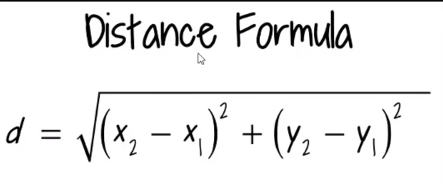
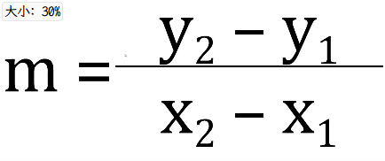

# 面向对象编程作业

两点间的距离  



两点间的斜率  

  

```python
In [1]: class Line:
   ...:     def __init__(self,coor1,coor2):
   ...:         self.coor1=coor1
   ...:         self.coor2=coor2
   ...:

In [2]: class Line:
   ...:     def __init__(self,coor1,coor2):
   ...:         self.x1,self.y1=coor1
   ...:         self.x2,self.y2=coor2
   ...:     def distance(self):
   ...:         return ((self.x2-self.x1)**2+(self.y2-self.y1)**2)**0.5
   ...:     def slope(self):
   ...:         return (self.y2-self.y1)/(self.x2-self.x1)
   ...:

In [3]: c1=(3,2)

In [4]: c2=(8,10)

In [5]: myline=Line(c1,c2)

In [6]: myline.distance()
Out[6]: 9.433981132056603

In [7]: myline.slope()
Out[7]: 1.6
```

# 面向对象编程挑战题

```python
In [25]: class Account:
    ...:     def __init__(self,owner,balance):
    ...:         self.owner=owner
    ...:         self.balance=balance
    ...:     def deposit(self,money):
    ...:         self.balance+=money
    ...:         print('Deposit Accepted')
    ...:     def withdraw(self,money):
    ...:         if(money <= self.balance):
    ...:             self.balance-=money
    ...:             print('Withdrawal Accpted')
    ...:         else:
    ...:             print(f'不好意思可用余额只有{self.balance}')
    ...:     def __str__(self):
    ...:         return (f'Account owner: {self.owner}\n') + (f'Account balance: ${se
       ⋮ lf.balance}')
    ...:
```

```python
In [26]: acct1=Account('Jose',100)

In [27]: print(acct1)
Account owner: Jose
Account balance: $100

In [28]: acct1.owner
Out[28]: 'Jose'

In [29]: acct1.deposit(50)
Deposit Accepted

In [30]: acct1.withdraw(75)
Withdrawal Accpted

In [31]: acct1.withdraw(500)
不好意思可用余额只有75

```