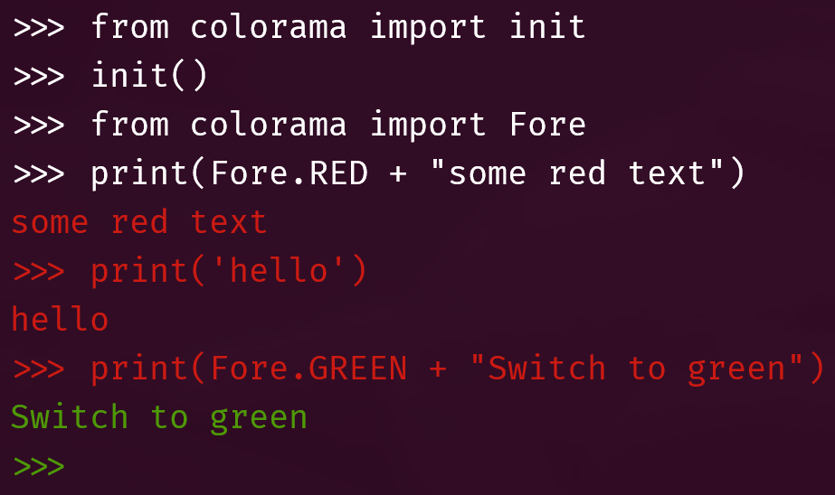
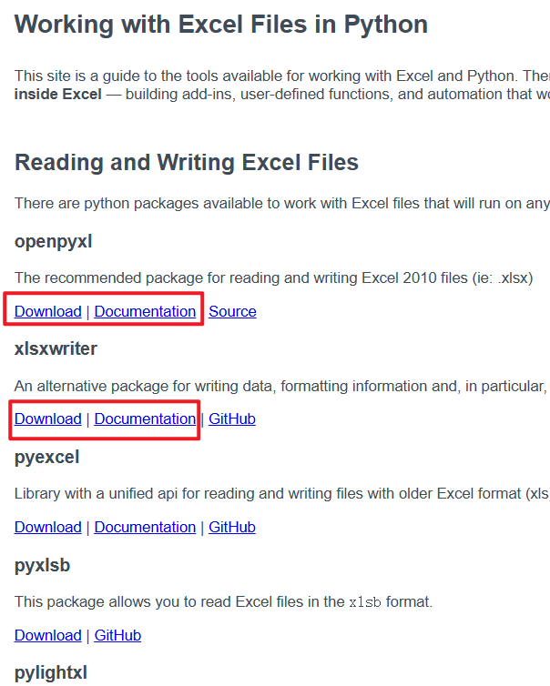
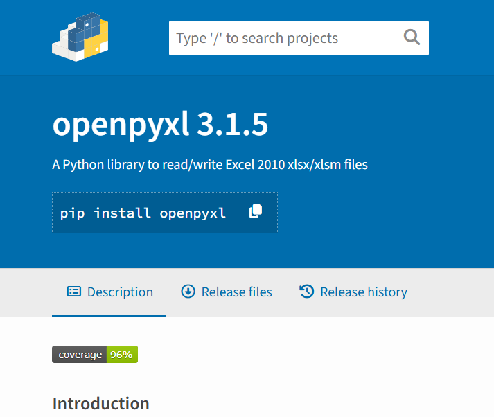
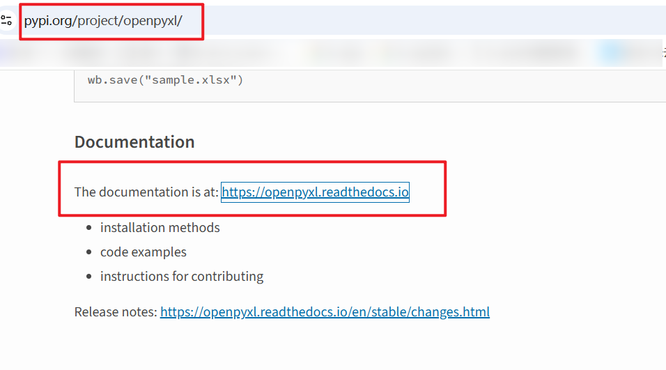

# Pip安装与PyPi

> pypi是一个开源第三方Python包的仓库，相当于 Ruby中的RubyGems、PHP的package，Perl的CPAN，以及**Nodejs的NPM**。

> 目前只用Python自带的两个库：Python的**标准库或内置库** ~~比如math数学库~~ ，也称为**包**

```bash
Python
│
├── 内置功能（Built-in）
│   ├── print()
│   ├── len()
│   ├── list
│   ├── dict
│   ├── int
│   └── ...
│
└── 标准库（Standard Library）
    ├── os
    ├── sys
    ├── math
    ├── datetime
    ├── json
    ├── re
    └── ...
```

> 可以使用命令行中的pip install ，从PyPI仓库，在命令行，来下载并安装其他的外部包

> 下载requests包，允许你从在线网站请求信息

```bash
#Ubuntu24.04不允许直接下载，需要切换到虚拟环境中安装
╭─ ~
╰─❯ pip install requests
error: externally-managed-environment

× This environment is externally managed
╰─> To install Python packages system-wide, try apt install
    python3-xyz, where xyz is the package you are trying to
    install.

    If you wish to install a non-Debian-packaged Python package,
    create a virtual environment using python3 -m venv path/to/venv.
    Then use path/to/venv/bin/python and path/to/venv/bin/pip. Make
    sure you have python3-full installed.

    If you wish to install a non-Debian packaged Python application,
    it may be easiest to use pipx install xyz, which will manage a
    virtual environment for you. Make sure you have pipx installed.

    See /usr/share/doc/python3.12/README.venv for more information.

note: If you believe this is a mistake, please contact your Python installation or OS distribution provider. You can override this, at the risk of breaking your Python installation or OS, by passing --break-system-packages.
hint: See PEP 668 for the detailed specification.
```

```bash
╭─ ~
╰─❯ source .venv/bin/activate 

#信息少是因为我前面安装过了
╭─ ~                                                   Py ly
╰─❯ pip install requests
Requirement already satisfied: requests in ./.venv/lib/python3.12/site-packages (2.34.2)
Requirement already satisfied: charset_normalizer<4,>=2 in ./.venv/lib/python3.12/site-packages (from requests) (3.5.1)
Requirement already satisfied: idna<4,>=2.5 in ./.venv/lib/python3.12/site-packages (from requests) (3.19)
Requirement already satisfied: urllib3<3,>=1.26 in ./.venv/lib/python3.12/site-packages (from requests) (2.8.0)
Requirement already satisfied: certifi>=2023.5.7 in ./.venv/lib/python3.12/site-packages (from requests) (2026.7.22)
```

> colorama，可以让你在命令提示符或终端中输出带颜色的文本

```bash
╭─ ~                                                             Py ly
╰─❯ pip install colorama
Collecting colorama
  Downloading colorama-0.4.6-py2.py3-none-any.whl.metadata (17 kB)
Downloading colorama-0.4.6-py2.py3-none-any.whl (25 kB)
Installing collected packages: colorama
Successfully installed colorama-0.4.6
```

```python
>>> from colorama import init
>>> init()
>>> from colorama import Fore
>>> print(Fore.RED + "some red text")
some red text
>>> print('hello')
hello
>>> print(Fore.GREEN + "Switch to green")
Switch to green
>>>

```

  

## google中搜索

- 关键字 **python package for** `excel`  
  
- 然后查看文档、或者下载链接即可
    
- 比如我点击了 openpyxl 
  会跳转到  https://pypi.org/project/openpyxl/    
   
- 往下滑（文档链接）
   
- 安装 ~~在bash中`pip install openpyxl`~~ 

```python
╭─ ~                                                                        8s Py ly
╰─❯ python
Python 3.12.3 (main, Aug 31 2026, 10:18:26) [GCC 13.3.0] on linux
Type "help", "copyright", "credits" or "license" for more information.
>>> import abc1
Traceback (most recent call last):
  File "<stdin>", line 1, in <module>
ModuleNotFoundError: No module named 'abc1'
#成功导入
>>> import openpyxl
>>>
```