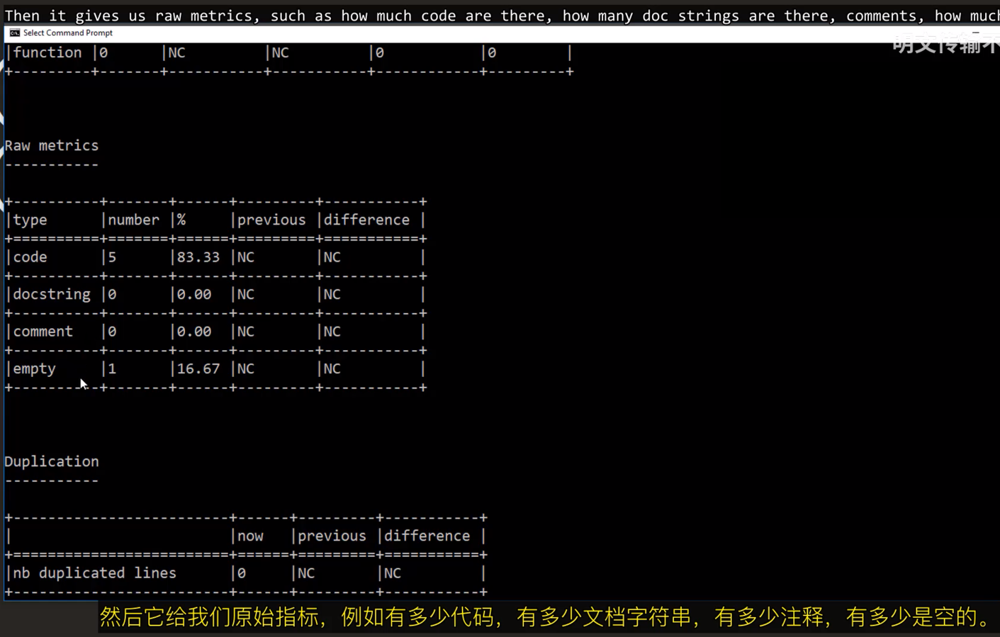

测试工具：
- pylint：报告代码中的问题
- unittest：单元测试库 ~~Python内置库~~ 

# pylint

> 虚拟环境中安装pylint ~~Ubuntu24.04 ~~
> 或者windows命令行中直接运行命令即可

```bash
╭─ ~/python_test                                            Py ly
╰─❯ cat simple.py
a = 1
b = 2
print(a)
print(B)

╭─ ~/python_test                              Py ly
╰─❯ pylint simple.py
#这里和视频不一样，视频中有一堆打分
************* Module simple

#C 开头：Convention（代码规范 / 惯例）
#缺少模块文档字符串
simple.py:1:0: C0114: Missing module docstring (missing-module-docstring)
#常量名 "a" 不符合 UPPER_CASE（全大写）命名规范。
simple.py:1:0: C0103: Constant name "a" doesn't conform to UPPER_CASE naming style (invalid-name)
#常量名 "b" 不符合 UPPER_CASE（全大写）命名规范。
simple.py:2:0: C0103: Constant name "b" doesn't conform to UPPER_CASE naming style (invalid-name)

#E 开头：Error（错误）
#未定义的变量 'B'
simple.py:4:6: E0602: Undefined variable 'B' (undefined-variable)

-----------------------------------
Your code has been rated at 0.00/10
```

视频中有更多提示：  



> 修改代码以增加评分

 ```bash
 ╭─ ~/python_test                           1m 39s Py ly
╰─❯ cat simple.py
'''
A Veary Simple Script
'''

def myfunc():
        '''
        A simple function
        '''
        first = 1
        second = 2
        print(first)
        print(second)

myfunc()

╭─ ~/python_test                                        Py ly
╰─❯ python simple.py
1
2

╭─ ~/python_test                                 Py ly
╰─❯ pylint simple.py
************* Module simple
#缩进错误。代码中发现了 1 个空格的缩进，但 Pylint 预期应该是 4 个空格。
simple.py:6:0: W0311: Bad indentation. Found 1 spaces, expected 4 (bad-indentation)
simple.py:9:0: W0311: Bad indentation. Found 1 spaces, expected 4 (bad-indentation)
simple.py:10:0: W0311: Bad indentation. Found 1 spaces, expected 4 (bad-indentation)
simple.py:11:0: W0311: Bad indentation. Found 1 spaces, expected 4 (bad-indentation)
simple.py:12:0: W0311: Bad indentation. Found 1 spaces, expected 4 (bad-indentation)

------------------------------------------------------------------
Your code has been rated at 1.67/10 (previous run: 0.00/10, +1.67)
 ```

> 把所有的制表符删除并改为空格

```bash
╭─ ~/python_test                                  Py ly
╰─❯ pylint simple.py

-------------------------------------------------------------------
Your code has been rated at 10.00/10 (previous run: 1.67/10, +8.33)
```

# 单元测试

> 单元测试允许你编写自己的测试程序，其目的是向你的程序发送特定数据集，分析返回结果，然后查看是否确实得到了预期结果

本章两个脚本
1. 将文本大写的简单脚本
2. 为此编写的实际测试脚本

```bash
╭─ ~/python_test/mydir4                                                        Py ly
╰─❯ cat cap.py
def cap_text(text):
        '''
        输入一个字符串
        将该字符串首字符大写并输出
        '''
        return text.capitalize()

╭─ ~/python_test/mydir4                                                        Py ly
╰─❯ cat test_cap.py
import unittest
import cap

#这是继承了那个类
class TestCap(unittest.TestCase):
        def test_one_word(self):
                text = 'python'
                result = cap.cap_text(text)
                self.assertEqual(result,'Python')
        def test_muliple_words(self):
                text='monty python'
                result = cap.cap_text(text)
                self.assertEqual(result,'Monty Python')

#这里仅仅避免别人import了这个测试类
if __name__ == '__main__':
        unittest.main()
        
        
#有一个test出错了不符合预期
╭─ ~/python_test/mydir4                                               Py ly
╰─❯ python test_cap.py
F.
======================================================================
FAIL: test_muliple_words (__main__.TestCap.test_muliple_words)
----------------------------------------------------------------------
Traceback (most recent call last):
  File "/home/ly/python_test/mydir4/test_cap.py", line 13, in test_muliple_words
    self.assertEqual(result,'Monty Python')
AssertionError: 'Monty python' != 'Monty Python'
- Monty python
?       ^
+ Monty Python
?       ^


----------------------------------------------------------------------
Ran 2 tests in 0.002s

FAILED (failures=1)
```

> 修改后再运行

```python
╭─ ~/python_test/mydir4                                                    15s Py ly
╰─❯ cat cap.py
def cap_text(text):
        '''
        输入一个字符串
        将该字符串首字符大写并输出
        '''
        #return text.capitalize()
        return text.title()

╭─ ~/python_test/mydir4                                                        Py ly
╰─❯ python test_cap.py
..
----------------------------------------------------------------------
Ran 2 tests in 0.001s

OK
```