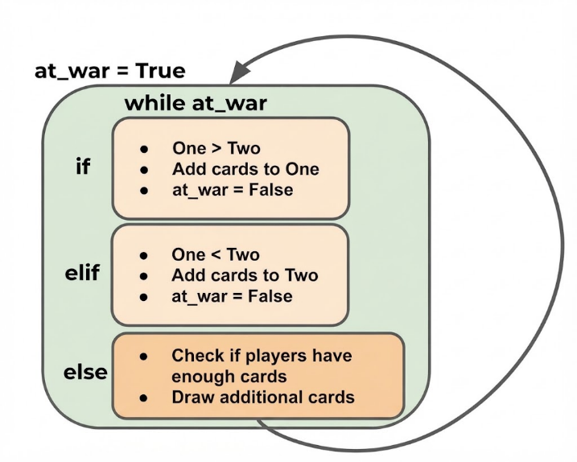

# 里程碑（练习面向对象编程）

> 如果使用vscode进行编写单独的.py文件并直接运行，需要安装python插件。不过我的.py文件是放在ubuntu24.04中，可以通过vscode远程连接上并运行的，不在本地win11中

## 游戏规则介绍

### 1. War（战争）纸牌游戏是什么？

War 是一个非常简单的两人纸牌游戏。

特点：

* 使用标准 **52 张扑克牌**
* 两个玩家各拿 26 张
* 不看牌
* 每轮同时翻开顶部一张牌
* 点数大的玩家赢走两张牌
* 一直玩到某个人拿走全部牌

规则类似：

```
玩家A翻牌：K
玩家B翻牌：8

K > 8

A获得两张牌
```

牌面大小：

```
A > K > Q > J > 10 > 9 > ... > 2
```

花色：

```
♠ ♥ ♦ ♣
```

不参与比较。

---

### 2. 什么叫 War（战争）？

特殊情况：

两个玩家翻出的牌一样：

例如：

```
A: 7♠
B: 7♥
```

发生 War。

双方继续下注：

例如：

```
放3张暗牌
再翻1张明牌
```

比如：

```
A:
暗 暗 暗 K

B:
暗 暗 暗 10
```

K > 10

A 赢走桌面所有牌。

## 设计

```bash
WarCardGame
│
├── Card #卡牌
│
├── Deck #Card的组合
│
├── Player #玩家
│
└── Game #游戏运行
```

## Card类

```python

In [1]: values={'Two':2, 'Three':3, 'Four':4, 'Five':5, 'Six':6, 'Seven':7, 'Eight':8, 'Nine':9, 'Ten':10, 'Jack':11,'Queen':12, 'King':13, 'Ace':14}

In [10]: suits = ('Hearts', 'Diamonds', 'Spades', 'Clubs') #花色

In [11]: ranks = ('Two', 'Three', 'Four', 'Five', 'Six', 'Seven', 'Eight', 'Nine', 'Ten', 'Jack', 'Queen', 'King', 'Ace')

In [12]: values['King']
Out[12]: 13

In [17]: class Card:
    ...:     def __init__(self,suit,rank):
    ...:         self.suit=suit
    ...:         self.rank=rank
    ...:         self.value=values[rank]
    ...:     def __str__(self):
    ...:         return f'{self.rank} of {self.suit}'
    ...:

In [18]: two_hearts=Card("Hearts","Two")

In [19]: two_hearts.rank
Out[19]: 'Two'

In [20]: two_hearts.suit
Out[20]: 'Hearts'

In [21]: two_hearts.value
Out[21]: 2

In [22]: three_of_clubs=Card("Clubs",'Three')

In [23]: print(three_of_clubs)
Three of Clubs

In [24]: print(two_hearts)
Two of Hearts

In [25]: two_hearts.value < three_of_clubs.value
Out[25]: True
```

## Deck

- 一副新牌
- 能洗牌（牌的顺序随机）
- 能取牌

> 创建一副新牌

```python
In [47]: class Deck:
    ...:     def __init__(self):
    ...:         self.all_cards=[]
    ...:         for suit in suits:
    ...:             for rank in ranks:
    ...:                 created_card=Card(suit,rank)
    ...:                 self.all_cards.append(created_card)
    ...:

In [48]: new_deck=Deck()

In [49]: new_deck.all_cards
Out[49]:
[<__main__.Card at 0x718fb10d8410>,
 <__main__.Card at 0x718fb10d8aa0>,
 <__main__.Card at 0x718fb0c1c1a0>,
 <__main__.Card at 0x718fb0c1ef60>,
 <__main__.Card at 0x718fb0c1fb60>,
 <__main__.Card at 0x718fb0c1dbe0>,
 <__main__.Card at 0x718fb0c1f4a0>,
 <__main__.Card at 0x718fb0c1dc10>,
 <__main__.Card at 0x718fb0c1cd40>,
 <__main__.Card at 0x718fb0c1cec0>,
 <__main__.Card at 0x718fb0c1f260>,
 <__main__.Card at 0x718fb0c1d610>,
 <__main__.Card at 0x718fb0c1f530>,
 <__main__.Card at 0x718fb0c1c380>,
 <__main__.Card at 0x718fb0c1eff0>,
 <__main__.Card at 0x718fb0c1dee0>,
 <__main__.Card at 0x718fb0c1dd90>,
 <__main__.Card at 0x718fb0c1e540>,
 <__main__.Card at 0x718fb0c1e000>,
 <__main__.Card at 0x718fb0c1e480>,
 <__main__.Card at 0x718fb0c1c3e0>,
 <__main__.Card at 0x718fb0c1e060>,
 <__main__.Card at 0x718fb0c1dd00>,
 <__main__.Card at 0x718fb0c1df10>,
 <__main__.Card at 0x718fb0c1e630>,
 <__main__.Card at 0x718fb0c1ddc0>,
 <__main__.Card at 0x718fb0c1dbb0>,
 <__main__.Card at 0x718fb0c1df70>,
 <__main__.Card at 0x718fb0c1e030>,
 <__main__.Card at 0x718fb0c1d4f0>,
 <__main__.Card at 0x718fb0c1ddf0>,
 <__main__.Card at 0x718fb0c1deb0>,
 <__main__.Card at 0x718fb0c1d730>,
 <__main__.Card at 0x718fb0c1e120>,
 <__main__.Card at 0x718fb0c1de80>,
 <__main__.Card at 0x718fb0c1e690>,
 <__main__.Card at 0x718fb0c1e750>,
 <__main__.Card at 0x718fb0c1e900>,
 <__main__.Card at 0x718fb0c1e0c0>,
 <__main__.Card at 0x718fb0c1e840>,
 <__main__.Card at 0x718fb0c1e7e0>,
 <__main__.Card at 0x718fb0c1daf0>,
 <__main__.Card at 0x718fb0c1eb10>,
 <__main__.Card at 0x718fb0c1e780>,
 <__main__.Card at 0x718fb0c1ea20>,
 <__main__.Card at 0x718fb0c1ea50>,
 <__main__.Card at 0x718fb0c1c9b0>,
 <__main__.Card at 0x718fb0c1f380>,
 <__main__.Card at 0x718fb0c1d940>,
 <__main__.Card at 0x718fb0c1c530>,
 <__main__.Card at 0x718fb0c1fe90>,
 <__main__.Card at 0x718fb0c1fdd0>]
 
 In [50]: new_deck.all_cards[0]
Out[50]: <__main__.Card at 0x718fb10d8410>

In [51]: print(new_deck.all_cards[0])
Two of Hearts

In [52]: mylist=[1,2,3]

In [53]: mylist[-1]
Out[53]: 3

In [54]: mylist[-2]
Out[54]: 2

In [55]: mylist[-4]
---------------------------------------------------------------------------
IndexError                                Traceback (most recent call last)
Cell In[55], line 1
----> 1 mylist[-4]

IndexError: list index out of range

In [56]: mylist[3]
---------------------------------------------------------------------------
IndexError                                Traceback (most recent call last)
Cell In[56], line 1
----> 1 mylist[3]

IndexError: list index out of range

In [57]: print(new_deck.all_cards[-1]) #最后一张牌
Ace of Clubs

In [58]: for card_object in new_deck.all_cards:
    ...:     print(card_object)
    ...:
Two of Hearts
Three of Hearts
Four of Hearts
Five of Hearts
Six of Hearts
Seven of Hearts
Eight of Hearts
Nine of Hearts
Ten of Hearts
Jack of Hearts
Queen of Hearts
King of Hearts
Ace of Hearts
Two of Diamonds
Three of Diamonds
Four of Diamonds
Five of Diamonds
Six of Diamonds
Seven of Diamonds
Eight of Diamonds
Nine of Diamonds
Ten of Diamonds
Jack of Diamonds
Queen of Diamonds
King of Diamonds
Ace of Diamonds
Two of Spades
Three of Spades
Four of Spades
Five of Spades
Six of Spades
Seven of Spades
Eight of Spades
Nine of Spades
Ten of Spades
Jack of Spades
Queen of Spades
King of Spades
Ace of Spades
Two of Clubs
Three of Clubs
Four of Clubs
Five of Clubs
Six of Clubs
Seven of Clubs
Eight of Clubs
Nine of Clubs
Ten of Clubs
Jack of Clubs
Queen of Clubs
King of Clubs
Ace of Clubs
```

> 打乱顺序

```python
In [62]: import random

In [63]: mylist=[1,2,3]

In [64]: random.shuffle(mylist)

In [65]: mylist
Out[65]: [3, 1, 2]

In [69]: class Deck:
    ...:     def __init__(self):
    ...:         self.all_cards=[]
    ...:         for suit in suits:
    ...:             for rank in ranks:
    ...:                 created_card=Card(suit,rank)
    ...:                 self.all_cards.append(created_card)
    ...:     def shuffle(self):
    ...:         random.shuffle(self.all_cards)
    ...:     def deal_one(self):
    ...:         #Python 的 list.pop() 默认弹出最后一个元素。
    ...:         return self.all_cards.pop()
    ...:
    ...:

In [70]: new_deck=Deck()

In [71]: new_deck.shuffle()

In [72]: mylist
Out[72]: [3, 1, 2]

In [73]: mylist.pop()
Out[73]: 2

In [74]: mylist
Out[74]: [3, 1]

In [75]: mycard=new_deck.deal_one()

In [89]: for card_object in new_deck.all_cards:
    ...:     print(card_object)
    ...:
Ten of Diamonds
Seven of Clubs
Ace of Spades
Queen of Diamonds
Nine of Hearts
Ten of Clubs
Queen of Clubs
Two of Clubs
Jack of Diamonds
Ace of Hearts
Nine of Clubs
Queen of Hearts
Seven of Spades
Seven of Diamonds
Jack of Clubs
Four of Spades
Jack of Spades
Eight of Clubs
King of Clubs
Two of Diamonds
Six of Hearts
Ten of Hearts
Five of Clubs
Ace of Clubs
Six of Diamonds
Four of Clubs
King of Diamonds
Three of Spades
Six of Clubs
Nine of Spades
Two of Hearts
Five of Spades
Five of Diamonds
Three of Hearts
King of Hearts
Queen of Spades
Jack of Hearts
Seven of Hearts
Three of Diamonds
Six of Spades
Eight of Spades
Four of Diamonds
Four of Hearts
Three of Clubs
King of Spades
Eight of Hearts
Eight of Diamonds
Ten of Spades
Nine of Diamonds
Five of Hearts
Two of Spades

In [90]: print(mycard)
Ace of Diamonds

In [91]: mycard=new_deck.deal_one()

In [92]: print(mycard)
Two of Spades

#已经弹出了两张牌
In [93]: print(len(new_deck.all_cards))
50


```

## Player

- 保持当前玩家持有牌的列表
- 能添加或移除卡牌
- 将有顶部和底部的卡牌转换为Python列表
    - 出牌从顶部 ~~pop(0)，移除指定索引的元素~~ 
    - 收牌则是收到底部 ~~append(value)，添加到列表末端。append只能添加单个元素，如果append一个列表，那么整个列表会被当做一个元素~~ 
    - 顶部和底部，对应的是列表的左侧和右侧  `[(顶部)1,2,3,4,(底部)5]`
    - 收多张牌  ~~extend(new_list)~~ 
```python
>>> mylist=[1,2,3,4,5]
>>> mylist.extend(6)
Traceback (most recent call last):
  File "<stdin>", line 1, in <module>
TypeError: 'int' object is not iterable
>>> mylist.extend([6,7,8])
>>> mylist
[1, 2, 3, 4, 5, 6, 7, 8]
```

> 可以添加卡牌、移除卡牌

```python

In [101]: class Player:
     ...:     def __init__(self,name):
     ...:         self.name=name
     ...:         self.all_cards=[]
     ...:     def remove_one(self):
     ...:         return self.all_cards.pop(0)
     ...:     def add_cards(self,new_cards):
     ...:         if type(new_cards)==type([]):
     ...:             #添加多张
     ...:             self.all_cards.extend(new_cards)
     ...:         else:
     ...:             #添加单张
     ...:             self.all_cards.append(new_cards)
     ...:     def __str__(self):
     ...:         return f'Player {self.name} has {len(self.all_cards)} cards.'
     ...:

In [102]: new_player=Player("Jose")

In [103]: print(new_player)
Player Jose has 0 cards.

In [105]: print(mycard)
Two of Spades

In [106]: new_player.add_cards(mycard)

In [107]: print(new_player)
Player Jose has 1 cards.

#测试添加列表（多长卡牌）是否成功
In [108]: new_player.add_cards([mycard,mycard,mycard])

In [109]: print(new_player)
Player Jose has 4 cards.

In [110]: new_player.remove_one()
Out[110]: <__main__.Card at 0x718fb0c207a0>

In [111]: print(new_player)
Player Jose has 3 cards.
```

## 游戏逻辑（第一部分）

> 接下来要继续完善游戏逻辑
> 1 -> 可视化部分
> 2,3 ->实际编写代码


> 正常来说我们应该是围绕即将实现的逻辑然后再来规划类的设计，在现实场景中，你往往会同时考虑应用程序的逻辑和类结构设计

- 玩家一和玩家一
- 一副新牌-->洗牌-->分牌（一人一半）

- （开始游戏）先检查是否有人输掉（while循环）
- 每位玩家抽出一张
    - 如果不是平局-->赢的人把牌放入排底
    - 如果平局，额外抽出5张牌 ~~游戏规定的~~ 
        - 如果发生战争时抽不出5张牌，就算输
        - 要判断是否又平局
        - 平局如果结束，赢的人收回所有的牌

## 游戏逻辑（第二部分）

> 1. 游戏初始化
> 2. 循环（游戏）

```python
>>> for x in range(1,3):
...     print(x)
...
1
2
#相当于range(0,3)
>>> for x in range(3):
...     print(x)
...
0
1
2
```

> 初始化

```python
In [113]: player_one=Player("One")

In [114]: player_two=Player("Two")

In [115]: new_deck=Deck()

In [116]: new_deck.shuffle()

In [117]: for x in range(26):
     ...:     #每次循环处理两张牌
     ...:     player_one.add_cards(new_deck.deal_one())
     ...:     player_two.add_cards(new_deck.deal_one())
     ...:
```

## 游戏逻辑（第三部分）

> 假设默认at_war=true

  

```python
In [130]: game_on=True
     ...: num_of_draw=5
     ...: while game_on:
     ...:     round_num+=1
     ...:     print(f"Round {round_num}")
     ...:     if len(player_one.all_cards) == 0:
     ...:         print('Player One , out of cards! Player Two Wins!')
     ...:         game_on=False
     ...:         break
     ...:     if len(player_two.all_cards) == 0:
     ...:         print('Player Two , out of cards! Player One Wins!')
     ...:         game_on=False
     ...:         break
     ...:     #新的一轮
     ...:     #正在使用的牌
     ...:     player_one_cards=[]
     ...:     player_one_cards.append(player_one.remove_one())
     ...:
     ...:     player_two_cards=[]
     ...:     player_two_cards.append(player_two.remove_one())
     ...:
     ...:     at_war=True
     ...:     while at_war:
     ...:         if player_one_cards[-1].value > player_two_cards[-1].value:
     ...:             player_one.add_cards(player_one_cards)
     ...:             player_one.add_cards(player_two_cards)
     ...:             at_war=False
     ...:         elif player_one_cards[-1].value < player_two_cards[-1].value:
     ...:             player_two.add_cards(player_one_cards)
     ...:             player_two.add_cards(player_two_cards)
     ...:             at_war=False
     ...:         else:
     ...:             #发生战争
     ...:             print('War!')
     ...:             if len(player_one.all_cards) < num_of_draw:
     ...:                 print(f'Player One unable to declare war,remaining {len(player_one.all_cards)}')
     ...:                 print(f'Player Two Wins!,remaining {len(player_two.all_cards)}')
     ...:                 game_on = False
     ...:                 break
     ...:             elif len(player_two.all_cards) < num_of_draw:
     ...:                 print(f'Player Two unable to declare war,remaining {len(player_two.all_cards)}')
     ...:                 print(f'Player One Wins!,remaining {len(player_one.all_cards)}')
     ...:                 game_on = False
     ...:                 break
     ...:             else:
     ...:                 for num in range(num_of_draw):
     ...:                     player_one_cards.append(player_one.remove_one())
     ...:                     player_two_cards.append(player_two.remove_one())
```