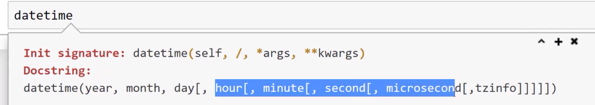

# Datetime

# 基本使用

```python
In [2]: import datetime

#24小时制
In [3]:  #time(小时[,分钟[,秒[,毫秒[,时区]]]])

In [4]: mytime=datetime.time()

In [6]: mytime
Out[6]: datetime.time(0, 0)

In [7]: mytime=datetime.time(2,20)

In [8]: mytime
Out[8]: datetime.time(2, 20)

In [9]: print(mytime)
02:20:00

In [10]: mytime=datetime.time(14,20)

In [11]: print(mytime)
14:20:00

In [16]: mytime.minute
Out[16]: 20

In [17]: mytime.hour
Out[17]: 14

In [19]: mytime=datetime.time(13,20,1,20)

In [20]: print(mytime)
13:20:01.000020

#datetime#只包含时间，不包含日期
In [21]: type(mytime)
Out[21]: datetime.time

In [22]: datetime.date.today()
Out[22]: datetime.date(2026, 9, 26)

In [23]: today=datetime.date.today()

In [24]: print(today)
2026-09-26

In [25]: today.day
Out[25]: 26
```

> C time格式

```python
#星期几，月份，日期，（也可以有时间，因为这里只有日期信息所以没有时间），年份
In [26]: today.ctime()
Out[26]: 'Sat Sep 26 00:00:00 2026'
```

> 同时拥有时间、日期 ~~上面是`datetime.date`和`datetime.time`，现在是datetime.datetime~~ 

  
```python

In [30]: from datetime import datetime

In [31]: datetime(2021,10,3,14,20,1)
Out[31]: datetime.datetime(2021, 10, 3, 14, 20, 1)

In [32]: mydatetime = datetime(2021,10,3,14,20,1)

In [33]: print(mydatetime)
2021-10-03 14:20:01

In [34]: mydatetime.replace(year=2020)
Out[34]: datetime.datetime(2020, 10, 3, 14, 20, 1)

In [35]: mydatetime=mydatetime.replace(year=2020)

In [36]: print(mydatetime)
2020-10-03 14:20:01
```

```python
#DATE
In [41]: from datetime import date

In [42]: date1=date(2021,11,3)

In [43]: date2=date(2020,11,3)

In [47]: type(result)
Out[47]: datetime.timedelta

In [48]: result.days
Out[48]: 365

In [53]: datetime1=datetime(2021,11,3,22,0)

In [54]: datetime2=datetime(2020,11,3,12,0)

#相差365天和10个小时
In [55]: datetime1-datetime2
Out[55]: datetime.timedelta(days=365, seconds=36000)

In [56]: 36000/60/60
Out[56]: 10.0


In [57]: mydiff=datetime1-datetime2

In [58]: mydiff.seconds
Out[58]: 36000

In [59]: mydiff.days
Out[59]: 365

#包含所有差距的总秒数
In [61]: mydiff.total_seconds()
Out[61]: 31572000.0
```