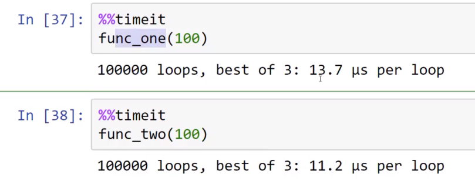

本节介绍三种方法计时（用来测量代码效率）

1. 简单地记录调用函数之前和之后经过的时间
2. 使用timeit模块
3. 特殊的`%%timeit`魔术函数（jupyter特有）

```python
In [2]: def func_one(n):
   ...:     return [str(num) for num in range(n)]
   ...:

In [3]: func_one(10)
Out[3]: ['0', '1', '2', '3', '4', '5', '6', '7', '8', '9']

#map(函数f,列表)  
#使用函数映射列表中每一个元素
#map返回的是一个迭代器，接收一个函数，和一个可迭代对象
In [4]: def func_two(n):
   ...:     return list(map(str,range(n)))
   ...:

In [5]: func_two(10)
Out[5]: ['0', '1', '2', '3', '4', '5', '6', '7', '8', '9']
```

# 方法1: time

> python内置的

```python
In [21]: import time

In [29]: start_time=time.time() ;result=func_one(10000000);end_time=time.time();elaps
       ⋮ ed_time=end_time-start_time;print(elapsed_time)
3.6771059036254883

In [30]: start_time=time.time() ;result=func_two(10000000);end_time=time.time();elaps
       ⋮ ed_time=end_time-start_time;print(elapsed_time)
5.912401437759399

```

# 方法2：timeit

> 专门为代码计时设计的

```python
In [34]: import timeit

#执行（要计时）的语句
In [35]: stmt='''
    ...: func_one(100)
    ...: '''

#执行之前的操作（这里是函数定义）
In [36]: setup='''
    ...: def func_one(n):
    ...:     return [str(num) for num in range(n)]
    ...: '''

In [37]: timeit.timeit(stmt,setup,number=100000)
Out[37]: 2.279343502013944

#第二个函数的处理
In [45]: setup2='''
    ...: def func_two(n):
    ...: return list(map(str,range(n)))
    ...: '''

In [46]: stmt2='''
    ...: func_two(100)
    ...: '''

In [47]: timeit.timeit(stmt,setup,number=100000)
Out[47]: 1.9381343869899865

```

# 方法3：jupyter中

  


