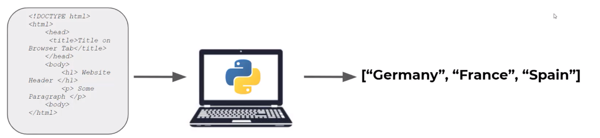

> 网络爬虫，涉及自动化从网站收集数据的技术

> 使用Python和Python库来执行网络爬虫任务，例如从网站下载图像或信息

> 前端包括HTML，CSS，JavaScript

在浏览器搜索网址，其实服务器返回的是HTML超文本标记。浏览器能够读取和理解，以便显示对人类阅读友好的内容  

> 我们要做的是，能够读取服务器发送给我们的这些HTML、CSS、JavaScript代码，然后我们将使用一个Python网络爬虫程序直接抓取我们想要的内容

  

> 应该了解的东西：
> 1. 网络爬虫的规则 ~~如果过多的爬取那么ip可能会被封锁；最好有许可~~ 
> 2. 网络爬虫的局限性 ~~每个网站是独特的，所以每个网络爬虫脚本也是独特的~~ 
> 3. HTML 和 CSS 基础

> 课程目标：能够概括使用Python执行网络爬虫的技能，以便您能够掌握通用思路

# 网站的主要前端组件

***HTML + CSS + JS***  

 
- HTML：用于创建网站的基本结构和内容
- CSS：用于网页的设计和样式
- JAVASCRIPT：用于网页的交互元素

对于有效的基础网络爬取，我们只需要对HTML和CSS有基本的理解  

接下来会以编程方式查看这些HTML和CSS元素，然后从网站提取信息  

```html
<!DOCTYPE html>
<html>
    <head>
        <title>Title on Browser Tab</title>
    </head>
    <body>
        <h1> Website Header </h1>
        <p> Some Paragraph </p>
    <body>
</html>
```

> 另一个例子  

> 在CSS方面，我们基本上只需要了解id ~~给某个特定元素添加样式~~ 和类 ~~给多个元素添加相同样式~~ 

```html
<!DOCTYPE html>
<html>
    <head>
        <link rel="stylesheet" href="styles.css">
        <title>Some Title</title>
    </head>
    <body>
        <p id='para2'> Some Text </p>
    <body>
</html>
```

```css
/*style.css*/
#para2 {
    color: red;
}

```

```html
<!DOCTYPE html>
<html>
    <head>
        <link rel="stylesheet" href="styles.css">
        <title>Some Title</title>
    </head>
    <body>
        <p class='cool'> Some Text </p>
    <body>
</html>
```

```css
/*style.css*/
.cool {
    color: red;
    font-family: verdana;
}

```

```css
p{
    color: red;
    font-family: courier;
    font-size: 160%;
}
.someclass{
    color: green;
    font-family: verdana;
    font-size: 300%;
}
#someid{
    color: blue;
}
```

***HTML文件将包括信息，CSS文件包含样式信息，然后我们可以使用HTML和CSS标签来定位页面上的特定信息，而使用Python进行网络爬取的整个理念是，您将把Python指向一个特定的CSS标签或HTML元素，然后基于此抓取信息***

要使用Python进行网络爬取，可以使用***BeautifulSoup和requests库***，这些是基础Python之外的外部库，需要在命令行使用conda或者pip安装

```bash
pip install requests
pip install lxml #与beautiful soup库一起使用
pip install bs4 #beautiful soup4
```