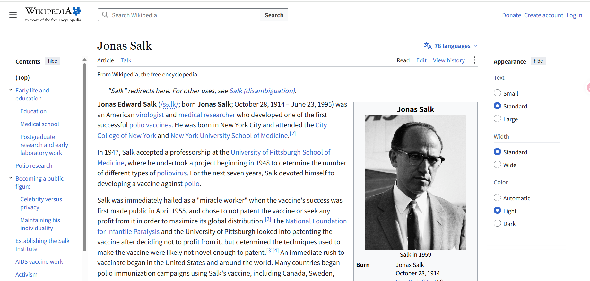
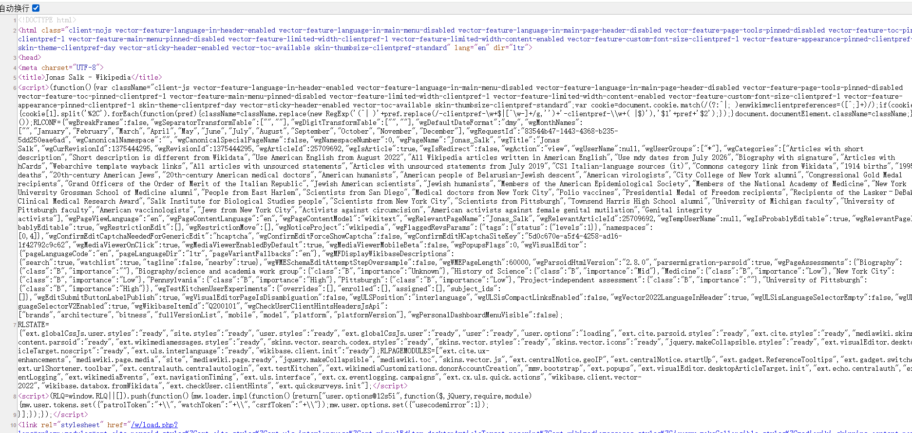
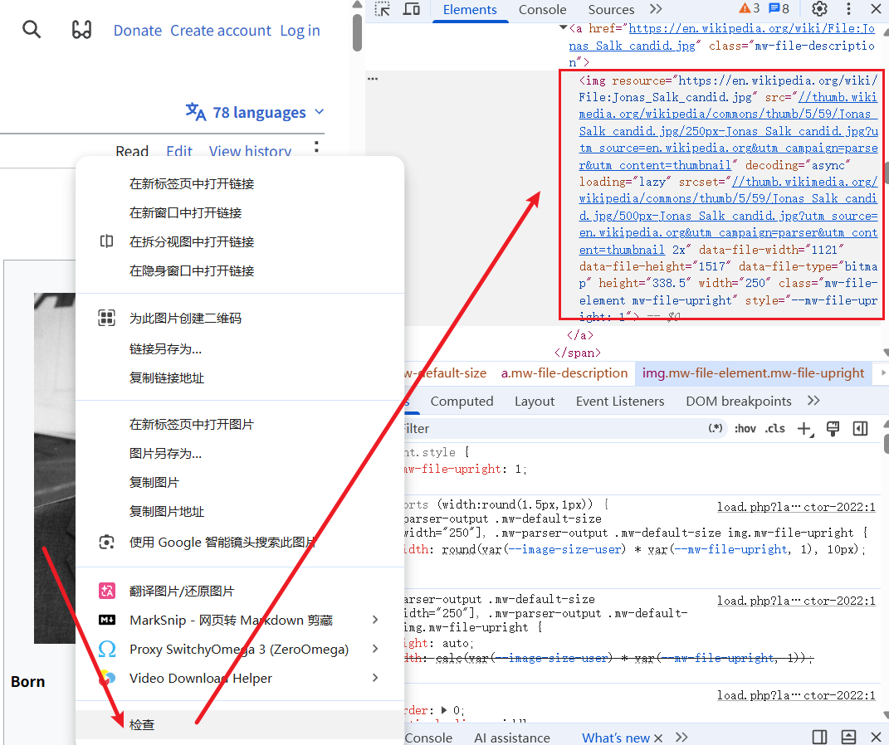

接下来要做的是在命令行安装必要的库，然后学习如何检查元素和查看网页源代码  

```bash
#Ubuntu24.04，必须得进虚拟环境才能安装
source ~/.venv/bin/activate

╭─ ~/python_test/mydir124 main                      Py ly
╰─❯ pip install requests

╭─ ~/python_test/mydir124 main                                 4s Py ly
╰─❯ pip install lxml #这个库之后才会被Beatiful soup库用来解析requests返回的内容

╭─ ~/python_test/mydir124 main                                             11s Py ly
╰─❯ pip install bs4

```

> 没报错就是可以正常使用了

```python
In [2]: import requests

In [3]: import bs4 

```

这里介绍的是 https://en.wikipedia.org/wiki/Jonas_Salk 这个网站

  
空白处右键查看源代码，进入 view-source:https://en.wikipedia.org/wiki/Jonas_Salk  

  
如果要下载这张图，***右键-检查-查看高亮部分***  

  

