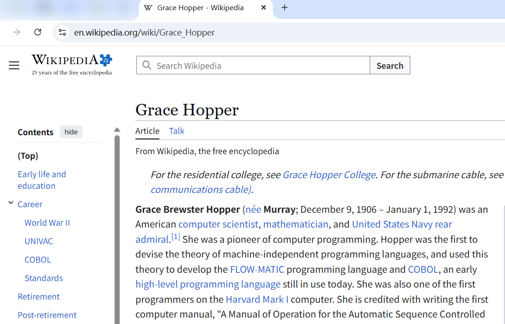
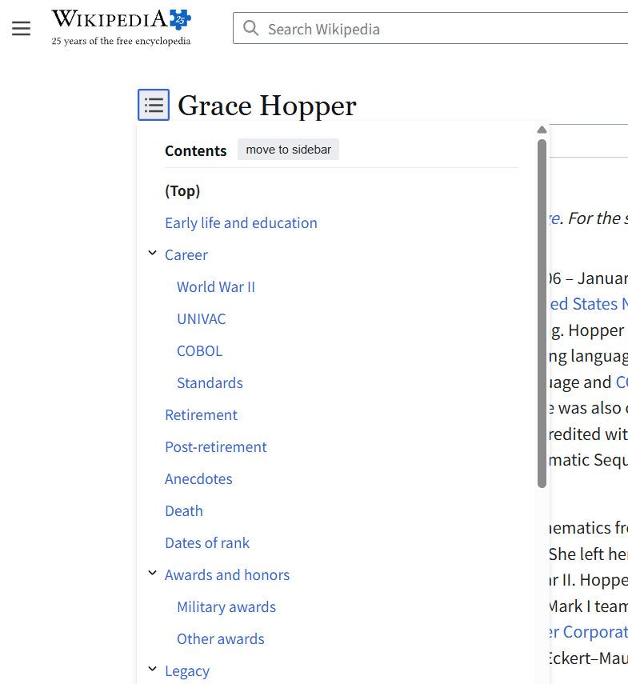
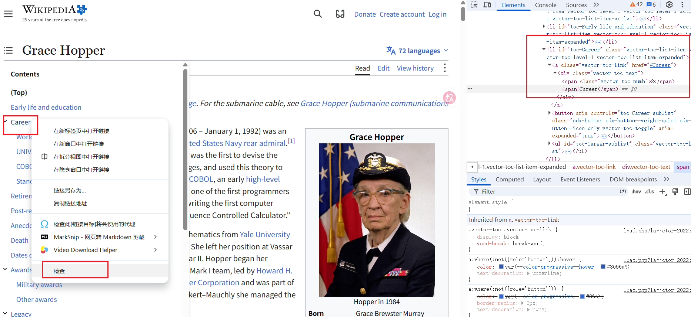

# 获取标题

这里使用 https://example.com/ 作为练习


> 展示从任意网站获取任意标题

> 本节内容均来自 `Complete-Python-3-Bootcamp/13-Web-Scraping
/00-Guide-to-Web-Scraping.ipynb`《网页爬取指南》（配套的github库路径）

> 获取实际的html

```python
In [10]: import requests

In [11]: result=requests.get("https://example.com/")

In [12]: type(result)
Out[12]: requests.models.Response

In [13]: result.text
Out[13]: '<!doctype html><html lang="en"><head><title>Example Domain</title><link rel="icon" href="data:,"><meta name="viewport" content="width=device-width, initial-scale=1"><style>body{background:#eee;width:60vw;margin:15vh auto;font-family:system-ui,sans-serif}h1{font-size:1.5em}div{opacity:0.8}a:link,a:visited{color:#348}</style></head><body><div><h1>Example Domain</h1><p>This domain is for use in documentation examples without needing permission. Avoid use in operations.</p><p><a href="https://iana.org/domains/example">Learn more</a></p></div></body></html>\n'
```

> bs4，能轻松的根据id，class，html标签来提取信息

> soup，名字由来：做汤时会把各种食材放进去，而BeautifulSoup就把HTML文档看作一锅大汤，可以从中捞出想要的“食材”

```python
In [14]: import bs4

In [18]: soup=bs4.BeautifulSoup(result.text,"lxml")

In [23]: print(soup)
<!DOCTYPE html>
<html lang="en"><head><title>Example Domain</title><link href="data:," rel="icon"/><meta content="width=device-width, initial-scale=1" name="viewport"/><style>body{background:#eee;width:60vw;margin:15vh auto;font-family:system-ui,sans-serif}h1{font-size:1.5em}div{opacity:0.8}a:link,a:visited{color:#348}</style></head><body><div><h1>Example Domain</h1><p>This domain is for use in documentation examples without needing permission. Avoid use in operations.</p><p><a href="https://iana.org/domains/example">Learn more</a></p></div></body></html>

#格式化
In [24]: print(soup.prettify())
<!DOCTYPE html>
<html lang="en">
 <head>
  <title>
   Example Domain
  </title>
  <link href="data:," rel="icon"/>
  <meta content="width=device-width, initial-scale=1" name="viewport"/>
  <style>
   body{background:#eee;width:60vw;margin:15vh auto;font-family:system-ui,sans-serif}h1{font-size:1.5em}div{opacity:0.8}a:link,a:visited{color:#348}
  </style>
 </head>
 <body>
  <div>
   <h1>
    Example Domain
   </h1>
   <p>
    This domain is for use in documentation examples without needing permission. Avoid use in operations.
   </p>
   <p>
    <a href="https://iana.org/domains/example">
     Learn more
    </a>
   </p>
  </div>
 </body>
</html>
```

> 提取(选择)html元素

```python
In [25]: soup.select('title')
#默认返回的是一个列表
Out[25]: [<title>Example Domain</title>]

In [26]: soup.select('p')
Out[26]:
[<p>This domain is for use in documentation examples without needing permission. Avoid use in operations.</p>,
 <p><a href="https://iana.org/domains/example">Learn more</a></p>]
```

> 提取元素内容

```python
In [28]: soup.select('title')[0].getText()
Out[28]: 'Example Domain'


In [29]: site_paragraphs=soup.select('p')

In [30]: site_paragraphs
Out[30]:
[<p>This domain is for use in documentation examples without needing permission. Avoid use in operations.</p>,
 <p><a href="https://iana.org/domains/example">Learn more</a></p>]

In [31]: site_paragraphs[0]
Out[31]: <p>This domain is for use in documentation examples without needing permission. Avoid use in operations.</p>

#列表元素并非字符串，而是一个Beautiful Soup对象
In [32]: type(site_paragraphs[0])
Out[32]: bs4.element.Tag

In [33]: site_paragraphs[0].getText()
Out[33]: 'This domain is for use in documentation examples without needing permission. Avoid use in operations.'
```

> 1. 调用`requests.get('url')`得到Response 对象
> 2. `result.text` 得到html网页（字符串）
> 3. `bs4.BeautifulSoup(result.text,"lxml")`转为BeautifulSoup对象
> 4. `soup.select('title')` 获取元素(可能有多个，所以是列表) ~~需要理解HTML标签，以及CSS选择器~~ 
> 5. `site_paragraphs[0].getText()` 获取元素内容

# select参数-字符串语法

> 和CSS选择器一模一样

| 语法                           | 匹配结果                                            |
| :--------------------------- | :---------------------------------------------- |
| `soup.select('div')`         | 所有标签为 'div' 的元素                                 |
| `soup.select('#some_id')`    | 包含 `id='some_id'` 的元素                           |
| `soup.select('.some_class')` | 包含 `class='some_class'` 的元素                     |
| `soup.select('div span')`    | `div` 元素内部的任意名为 `span` 的元素                      |
| `soup.select('div > span')`  | **直接**位于 `div` 元素内部的任意名为 `span` 的元素（中间没有任何其他层级） |

# 获取类元素

> 抓取网页中某个类所关联的所有元素

> 本篇示例网址为 https://en.wikipedia.org/wiki/Grace_Hopper 

  

要抓取的是这里，目录中所有资料  

  


现在确定了要抓取的内容，右键-检查  

  
~~注意，这里的网页结构（当前是20260927，已经和视频内容大不相同了），这里我以我实际的为主进行练习学习~~  

> 由于抓取的是维基百科的页面，所以需要走代理

```bash
╭─ ~                                                               Py ly
╰─❯ proxychains ipython
ProxyChains-3.1 (http://proxychains.sf.net)
Python 3.12.3 (main, Aug 31 2026, 10:18:26) [GCC 13.3.0]
Type 'copyright', 'credits' or 'license' for more information
IPython 9.17.1 -- An enhanced Interactive Python. Type '?' for help.
Tip: Use the IPython.lib.demo.Demo class to load any Python script as an interactive demo.

```

```python
In [2]: import requests

In [3]: import bs4

In [5]: res=requests.get('https://en.wikipedia.org/wiki/Grace_Hopper')
|D-chain|-<>-127.0.0.1:12345-<><>-103.102.166.224:443-<><>-OK

In [6]: soup=bs4.BeautifulSoup(res.text,'lxml')

In [7]: soup
Out[7]:
<html><body>Please set a user-agent and respect our robot policy https://w.wiki/4wJS. See also https://phabricator.wikimedia.org/T400119.
</body></html>

#这里触发了维基的反爬虫，简单处理一下，不是这节的重点
headers = {
    "User-Agent": "my-learning-script/1.0 hello@163.com"
}

In [16]: res = requests.get('https://en.wikipedia.org/wiki/Grace_Hopper', headers=headers)

In [17]: soup=bs4.BeautifulSoup(res.text,'lxml')

#这里我还print(soup)检查内容是否真正爬取到，太长我就没有粘贴进来
#span:nth-of-type(2)：在某个父元素里面，找到所有 同类型的 span 子元素，选择其中第 2 个
In [24]: soup.select('.vector-toc-text span:nth-of-type(2)')
Out[24]:
[<span>Early life and education</span>,
 <span>Career</span>,
 <span>World War II</span>,
 <span>UNIVAC</span>,
 <span>COBOL</span>,
 <span>Standards</span>,
 <span>Retirement</span>,
 <span>Post-retirement</span>,
 <span>Anecdotes</span>,
 <span>Death</span>,
 <span>Dates of rank</span>,
 <span>Awards and honors</span>,
 <span>Military awards</span>,
 <span>Other awards</span>,
 <span>Legacy</span>,
 <span>Places</span>,
 <span>Programs</span>,
 <span>In popular culture</span>,
 <span>Grace Hopper Celebration of Women in Computing</span>,
 <span>See also</span>,
 <span>Notes</span>,
 <span>References</span>,
 <span>Obituary notices</span>,
 <span>Further reading</span>,
 <span>External links</span>]

In [25]: type(soup.select('.vector-toc-text span:nth-of-type(2)')[0])
Out[25]: bs4.element.Tag

In [26]: first_item=soup.select('.vector-toc-text span:nth-of-type(2)')[0]

In [27]: first_item.getText()
Out[27]: 'Early life and education'


In [29]: first_item.text
Out[29]: 'Early life and education'

In [30]: for item in soup.select('.vector-toc-text span:nth-of-type(2)'):
    ...:     print(item.getText())
    ...:
Early life and education
Career
World War II
UNIVAC
COBOL
Standards
Retirement
Post-retirement
Anecdotes
Death
Dates of rank
Awards and honors
Military awards
Other awards
Legacy
Places
Programs
In popular culture
Grace Hopper Celebration of Women in Computing
See also
Notes
References
Obituary notices
Further reading
External links
```


