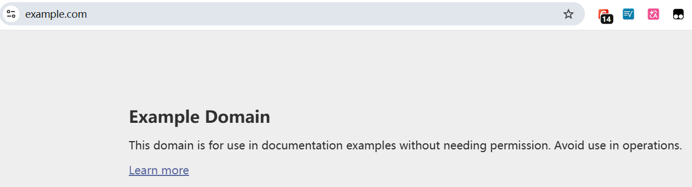

这里使用 https://example.com/ 作为练习




> 展示从任意网站获取任意标题

> 本节内容均来自 `Complete-Python-3-Bootcamp/13-Web-Scraping
/00-Guide-to-Web-Scraping.ipynb`《网页爬取指南》（配套的github库路径）

> 获取实际的html

```python
In [10]: import requests

In [11]: result=requests.get("https://example.com/")

In [12]: type(result)
Out[12]: requests.models.Response

In [13]: result.text
Out[13]: '<!doctype html><html lang="en"><head><title>Example Domain</title><link rel="icon" href="data:,"><meta name="viewport" content="width=device-width, initial-scale=1"><style>body{background:#eee;width:60vw;margin:15vh auto;font-family:system-ui,sans-serif}h1{font-size:1.5em}div{opacity:0.8}a:link,a:visited{color:#348}</style></head><body><div><h1>Example Domain</h1><p>This domain is for use in documentation examples without needing permission. Avoid use in operations.</p><p><a href="https://iana.org/domains/example">Learn more</a></p></div></body></html>\n'
```

> bs4，能轻松的根据id，class，html标签来提取信息

> soup，名字由来：做汤时会把各种食材放进去，而BeautifulSoup就把HTML文档看作一锅大汤，可以从中捞出想要的“食材”

```python
In [14]: import bs4

In [18]: soup=bs4.BeautifulSoup(result.text,"lxml")

In [23]: print(soup)
<!DOCTYPE html>
<html lang="en"><head><title>Example Domain</title><link href="data:," rel="icon"/><meta content="width=device-width, initial-scale=1" name="viewport"/><style>body{background:#eee;width:60vw;margin:15vh auto;font-family:system-ui,sans-serif}h1{font-size:1.5em}div{opacity:0.8}a:link,a:visited{color:#348}</style></head><body><div><h1>Example Domain</h1><p>This domain is for use in documentation examples without needing permission. Avoid use in operations.</p><p><a href="https://iana.org/domains/example">Learn more</a></p></div></body></html>

#格式化
In [24]: print(soup.prettify())
<!DOCTYPE html>
<html lang="en">
 <head>
  <title>
   Example Domain
  </title>
  <link href="data:," rel="icon"/>
  <meta content="width=device-width, initial-scale=1" name="viewport"/>
  <style>
   body{background:#eee;width:60vw;margin:15vh auto;font-family:system-ui,sans-serif}h1{font-size:1.5em}div{opacity:0.8}a:link,a:visited{color:#348}
  </style>
 </head>
 <body>
  <div>
   <h1>
    Example Domain
   </h1>
   <p>
    This domain is for use in documentation examples without needing permission. Avoid use in operations.
   </p>
   <p>
    <a href="https://iana.org/domains/example">
     Learn more
    </a>
   </p>
  </div>
 </body>
</html>
```

> 提取(选择)html元素

```python
In [25]: soup.select('title')
#默认返回的是一个列表
Out[25]: [<title>Example Domain</title>]

In [26]: soup.select('p')
Out[26]:
[<p>This domain is for use in documentation examples without needing permission. Avoid use in operations.</p>,
 <p><a href="https://iana.org/domains/example">Learn more</a></p>]
```

> 提取元素内容

```python
In [28]: soup.select('title')[0].getText()
Out[28]: 'Example Domain'


In [29]: site_paragraphs=soup.select('p')

In [30]: site_paragraphs
Out[30]:
[<p>This domain is for use in documentation examples without needing permission. Avoid use in operations.</p>,
 <p><a href="https://iana.org/domains/example">Learn more</a></p>]

In [31]: site_paragraphs[0]
Out[31]: <p>This domain is for use in documentation examples without needing permission. Avoid use in operations.</p>

#列表元素并非字符串，而是一个Beautiful Soup对象
In [32]: type(site_paragraphs[0])
Out[32]: bs4.element.Tag

In [33]: site_paragraphs[0].getText()
Out[33]: 'This domain is for use in documentation examples without needing permission. Avoid use in operations.'
```

> 1. 调用`requests.get('url')`得到Response 对象
> 2. `result.text` 得到html网页（字符串）
> 3. `bs4.BeautifulSoup(result.text,"lxml")`转为BeautifulSoup对象
> 4. `soup.select('title')` 获取元素(可能有多个，所以是列表) ~~需要理解HTML标签，以及CSS选择器~~ 
> 5. `site_paragraphs[0].getText()` 获取元素内容


