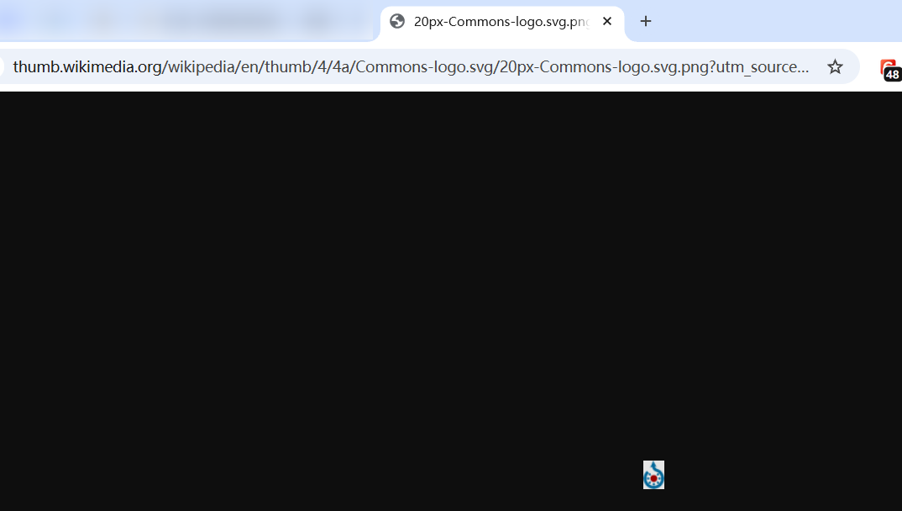
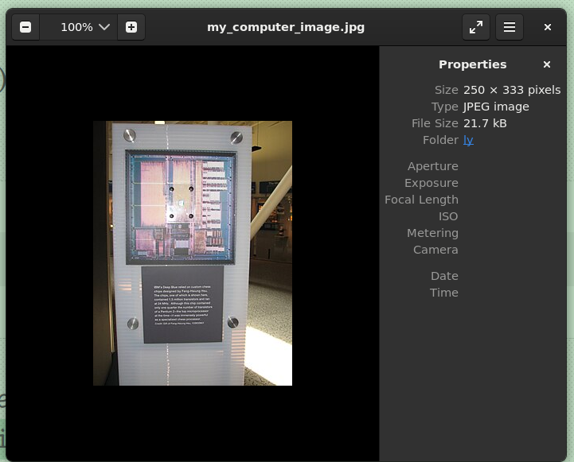

- BeautifulSoup可以扫描网页，找到专门的HTML图片标签，这些标签本质上表明了图片URL的链接位置，然后bs能抓取这些URL列表，相当于获取网页上所有图片。之后下载并保存到电脑上

```python
In [2]: import requests

In [3]: import bs4

In [4]: headers = {
   ...:     "User-Agent": "my-learning-script/1.0 hello@163.com"
   ...: }
   
In [6]: res=requests.get('https://en.wikipedia.org/wiki/Deep_Blue_(chess_computer)',headers=headers)
      
In [7]: soup=bs4.BeautifulSoup(res.text,'lxml')

#查看soup会有完整的HTML文档
In [10]: soup.select('img')
Out[10]: [........]#这里输出了二三十个，我用省略号表示了

In [11]: soup.select('img')[0]
Out[11]: 

In [13]: soup.select('img')[10]
Out[13]: 
```

> 我们关注的是img元素中的src属性，把其中的`//thumb.wikimedia.org/wikipedia/en/thumb/4/4a/Commons-logo.svg/20px-Commons-logo.svg.png?utm_source=en.wikipedia.org&amp;utm_campaign=parser&amp;utm_content=thumbnail` 直接粘贴到浏览器并回车就可以看到图片

  

```python
#这里和视频一样，为了获取图片（多张，我这缩短到了2张。使用的选择器不一样（因为维基百科网站更新了））
In [32]: soup.select('figure img')
Out[32]:
[,
 ]
 
In [33]: computer=soup.select('figure img')[1]

In [34]: computer
Out[34]: 

```

> 像查字典一样获取标签任何部分

```python
In [35]: type(computer)
Out[35]: bs4.element.Tag

In [36]: computer['class']
Out[36]: ['mw-file-element']

In [37]: computer['src']
Out[37]: '//thumb.wikimedia.org/wikipedia/commons/thumb/8/83/One_of_Deep_Blue%27s_processors_%282586060990%29.jpg/250px-One_of_Deep_Blue%27s_processors_%282586060990%29.jpg?utm_source=en.wikipedia.org&utm_campaign=parser&utm_content=thumbnail'
```

> 获取图片

```python
In [44]: image_link=requests.get('https://thumb.wikimedia.org/wikipedia/commons/thumb/8/83/One_of_Deep_Blue%27s_processors_%282586060990%29.jpg/250px-One_of_Deep_Blue%27s_processors_%282586060990%29.jpg?utm_source=en.wikipedia.org&utm_campaign=parser&utm_content=thumbnail',headers=headers)
|D-chain|-<>-127.0.0.1:12983-<><>-103.102.166.224:443-<><>-OK

In [45]: image_link.content
Out[45]: b'\xff\xd8\xff\xdb\x00C\x00\x04\x03\x03\x04\x03\x03\x04\x04\x03\x04\x05\x04\x04\x05\x06\n\x07\x06\x06\x06\x06\r\t\n\x08\n\x0f\r\x10\x10\x0f\r\x0f\x0e\x11\x13\x18\x14\x11\x12\x17\x12\x0e\x0f\x15\x1c\x15\x17\x19\x19\x1b\x1b\x1b\x10\x14\x1d\x1f\x1d\x1a\x1f\x18\x1a\x1b\x1a\xff\xdb\x00C\x01\x04\x05\x05\x06\x05\x06\x0c\x07\x07\x0c\x1a\x11\x0f\x11\x1a\x1a\x1a\x1a\x1a\x1a\x1a\x1a\x1a\x1a\x1a\x1a\x1a\x1a\x1a\x1a\x1a\x1a\x1a\x1a\x1a\x1a\x1a\x1a\x1a\ （我没粘贴全）

In [46]: f=open('my_computer_image.jpg','wb')

In [47]: f.write(image_link.content)
Out[47]: 21734

In [48]: f.close()

In [60]: res=requests.get('https://en.wikipedia.org/wiki/Deep_Blue_(chess_computer)',headers=headers)

In [61]: type(res.content)
Out[61]: bytes

In [62]: type(res.text)
Out[62]: str

```

> 查看图片

```bash
sudo apt install eog
eog  my_computer_image.jpg
```

  


实际上网络传输的是字节：

`res.content`

结果：

```
b'<h1>Hello \xe4\xb8\x96\xe7\x95\x8c</h1>'
```

类型：

```
type(res.content)
```

输出：

```
bytes
```

而：

```
res.text
```

requests 会根据编码把 bytes 转成字符串：

```
'<h1>Hello 世界</h1>'
```