> 使用pillow库

```bash
╭─ ~                                                             19s Py ly
╰─❯ pip install pillow

```

如果处理大图像时出现下面情况：  

```text
IOPub data rate exceeded.
The notebook server will temporarily stop sending output
to the client in order to avoid crashing it.
To change this limit, set the config variable
```

可以在启动jupyter时使用 `jupyter notebook --NotebookApp.iopub_data_rate_limit=1.0e10   `  

> 确保当前目录有这些文件

```python
In [2]: import os

In [3]: os.getcwd()
Out[3]: '/home/ly/python_test/mydir135'

In [5]: os.listdir()
Out[5]:
['blue_color.png',
 'bak',
 'red_color.jpg',
 'mask.png',
 'purple.png',
 'example.jpg',
 'word_matrix.png',
 'pencils.jpg']
```

```python
In [7]: from PIL import Image

In [8]: mac=Image.open('example.jpg')

#这是一个来自PIL的专用JPEG图像文件
In [9]: type(mac)
Out[9]: PIL.JpegImagePlugin.JpegImageFile
```

> mac.show() 是 Pillow（PIL）库中 Image 对象的临时查看方法，作用是：调用系统默认的图片查看器，把当前图片显示出来。

```python
In [12]: mac.show()
```

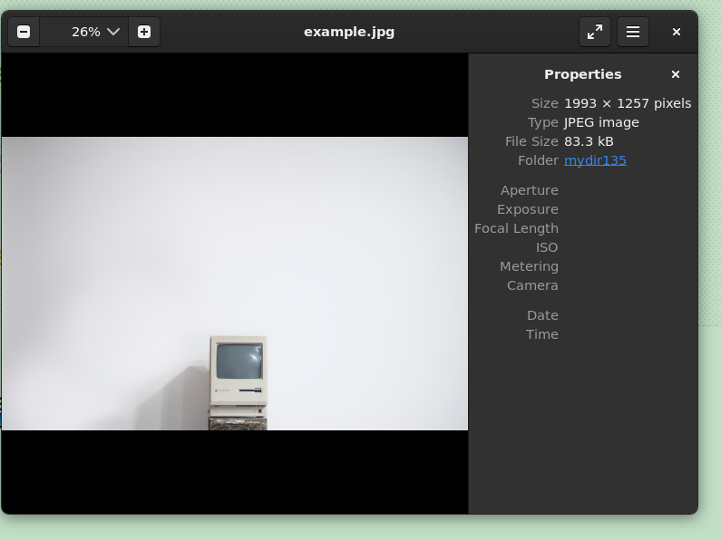  

```python
#宽度和高度(像素单位)
In [13]: mac.size
Out[13]: (1993, 1257)

#文件名
In [14]: mac.filename
Out[14]: 'example.jpg'

#符合的JPEG国际标准
In [16]: mac.format_description
Out[16]: 'JPEG (ISO 10918)'

```

> 形成一个图像需要 起始x，y。以及宽度w和高度h

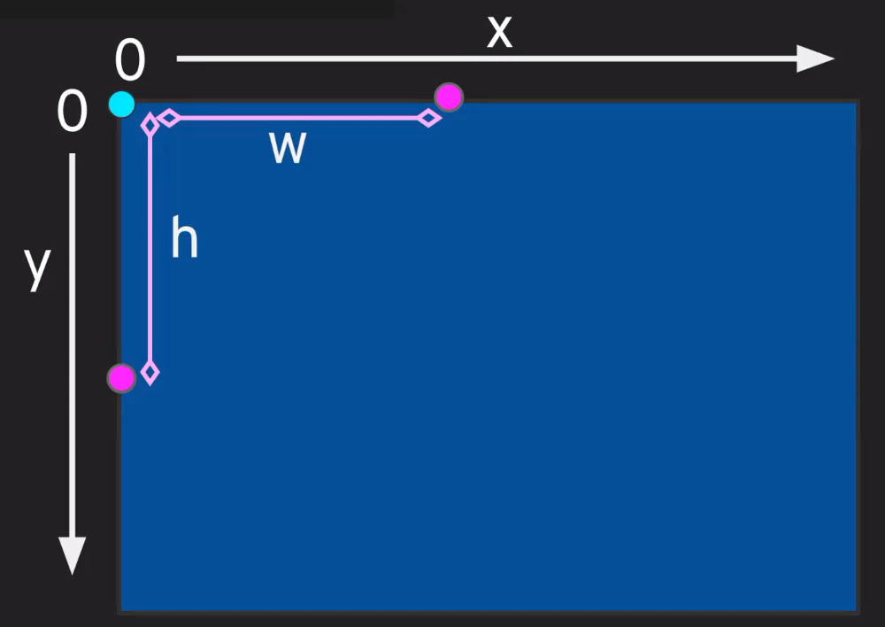  
```python
#这里并没有原地操作，结果为图2
In [21]: mac.crop((0,0,100,100)).show()

#还是原图，结果为图1
In [22]: mac.show()
```

图2：  

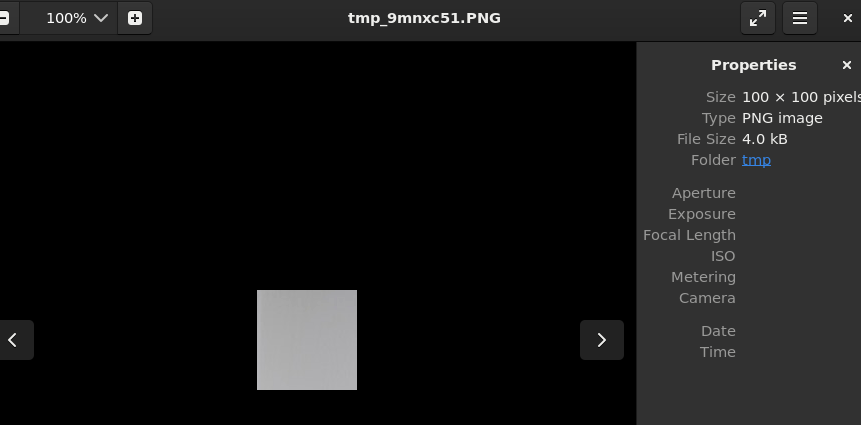  

图1：  

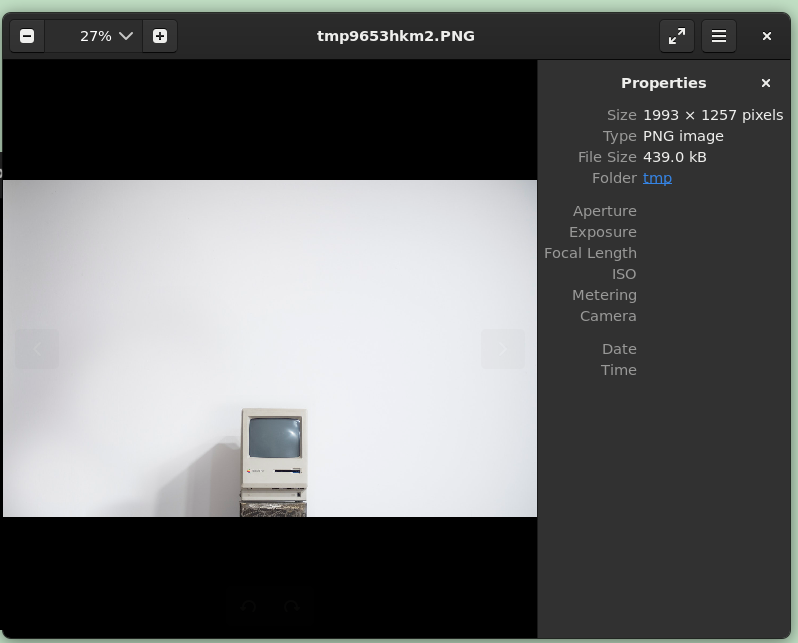  

> 铅笔

```python
In [23]: pencils=Image.open('pencils.jpg')

In [25]: pencils.show()
```

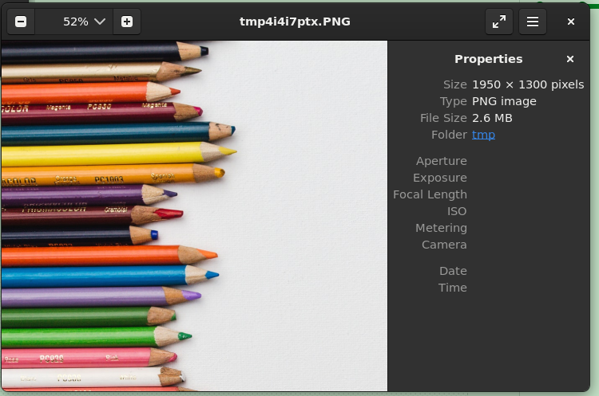  

> 抓取三只铅笔

> 裁剪参数：(左上角x坐标, 左上角y坐标, 右下角x坐标, 右下角y坐标) 


```python
In [26]: pencils.size
Out[26]: (1950, 1300)

In [27]: #取顶部大约3根铅笔
    ...: x=0
    ...: y=0
    ...: w=1950/3 #宽度大约30%
    ...: h=1300/10 #高度大约10%
    ...:

In [28]: pencils.crop((x,y,w,h))
Out[28]: <PIL.Image.Image image mode=RGB size=650x130>

In [29]: pencils.crop((x,y,w,h)).show()
```

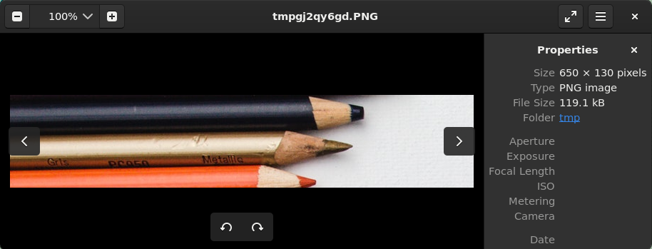  

> 取底部几根铅笔

```python
In [30]: #取底部大约4根铅笔
    ...: x=0
    ...: y=1100
    ...: w=1950/3 #宽度大约30%
    ...: h=1300 #高度大约10%

In [31]: pencils.crop((x,y,w,h)).show()
```

```shell
(0,0) ---------------- (1950,0)
  |
  |
  |
(0,1100)
  +----------------
  |                |
  |   裁剪区域     |
  |                |
(0,1300)------(650,1300)

```

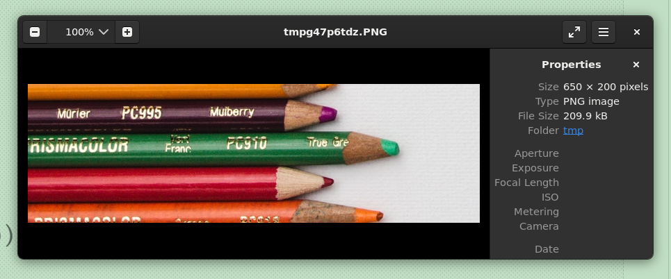  
> 裁剪计算机

```python
In [34]: halfway=1993/2

In [35]: x=halfway-200

In [36]: w=halfway+200

In [37]: y=800

In [38]: h=1257

#(x,y)是左上角的点，(w,h)是右下角的点
In [39]: mac.crop((x,y,w,h))
Out[39]: <PIL.Image.Image image mode=RGB size=400x457>

In [40]: mac.crop((x,y,w,h)).show()
```

> 把裁剪后的图片粘贴到原图片

```python
In [41]: computer=mac.crop((x,y,w,h))

#原地(针对对象)操作，但并没有对硬盘上源文件实际操作
#只发生在内存中
In [43]: mac.paste(im=computer,box=(0,0)) 

In [45]: mac.show()
```

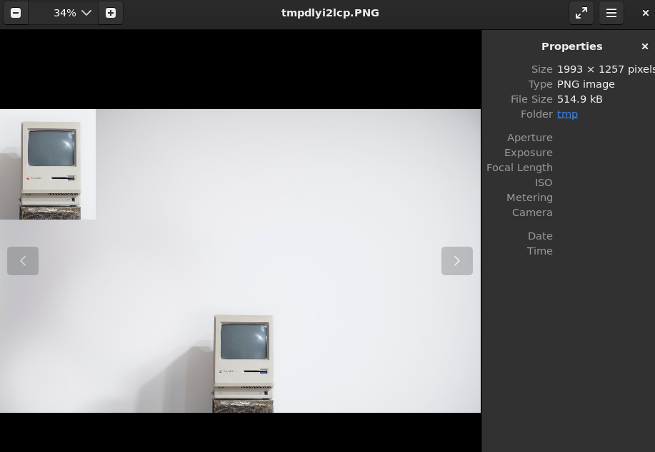  

```python
#Pillow 中很多图片操作方法默认都是：
#返回一个新的 Image 对象，而不是修改原对象（非原地操作）。
#非原地操作
In [49]: mac.resize((3000,500)).show()
```

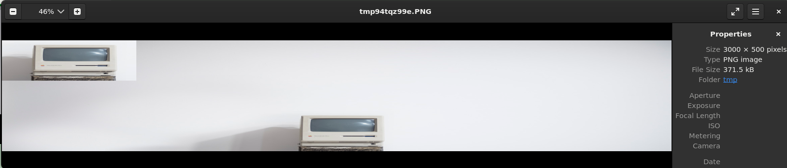  
> 旋转90度

```python
#非原地操作
In [50]: mac.rotate(90).show()
```

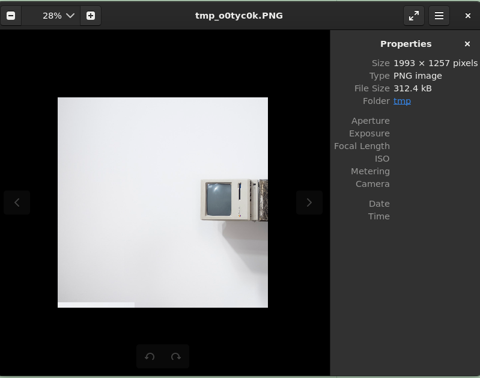

> 透明度

```python
In [66]: #透明度

In [67]: #透明度
    ...: red=Image.open('red_color.jpg')
    ...: red.show()
    ...:
    ...:

In [68]: blue=Image.open('blue_color.png')

In [69]: blue.show()

In [81]: blue.putalpha(0)

#这里没效果
In [82]: blue.show()

#因为这个是调色板模式（要先转成RGBA）
In [79]: blue.mode
Out[79]: 'PA'

#convert 非原地操作
In [83]: blue = blue.convert('RGBA') 

#设置过透明度了所以这里是透明
In [84]: blue.show()
```

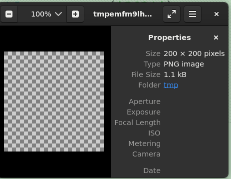  

```python
#半透明
In [109]: blue.putalpha(128)

In [110]: blue.show()

#全透明
In [111]: blue.putalpha(255)

In [112]: blue.show()
```

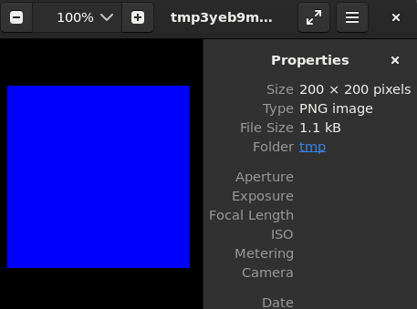  

> 显示一张透明蓝色和透明红色

```python

In [119]: blue=Image.open('blue_color.png')

In [120]: red=Image.open('red_color.jpg')
 
#注意，这里blue不设置透明，即没有透明度
#或者即使在这里设置了透明度，保存时convert('RGB')也行
In [121]: blue=blue.convert('RGB')

In [122]: blue.show()
 
In [124]: red.putalpha(128)

In [125]: red=red.convert('RGBA')

In [126]: red.show()


```

> 使用粘贴混合颜色（paste本质上会隐藏下面的图片，但是由于上面的图片具有透明度，所以可以混合）

```python
#把 red 图片放到 blue 图片左上角，并使用 red 自己的透明信息作为遮罩，让透明部分保留 blue，非透明部分显示 red。
In [134]: blue.paste(im=red,box=(0,0),mask=red)

In [135]: blue.show()
```

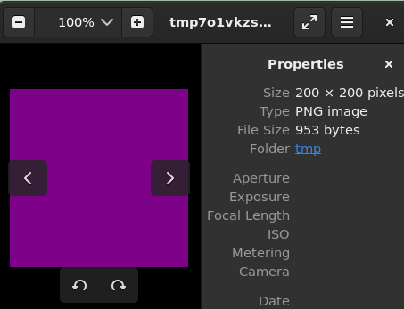

> 保存图片

```python
In [149]: blue.save("ly-purple.png")

In [150]: purple=Image.open("ly-purple.png")

In [151]: purple.show()
```

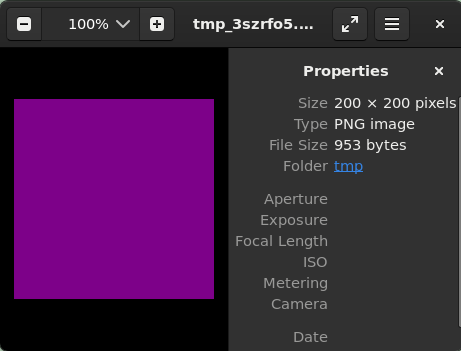


# 附：解释mask


> `blue` 没有透明部分，并不是说「所有区域都被透明的红色盖上去」。

实际发生的是：

**红色图片根据自己的 Alpha 通道，与蓝色背景进行混合，生成新的颜色。**

---

我们看你的代码：

```python
blue = Image.open('blue_color.png')
blue = blue.convert('RGB')
```

此时：

```python
blue.mode
```

是：

```
RGB
```

也就是：

```
R G B
```

没有 Alpha。

例如：

```
蓝色像素：

(0,0,255)
```

---

然后：

```python
red = Image.open('red_color.jpg')
red.putalpha(128)
red = red.convert('RGBA')
```

现在 red：

```
R G B A
```

例如：

```
红色像素：

(255,0,0,128)
```

含义：

```
红色
透明度50%
```

---

然后：

```python
blue.paste(im=red, box=(0,0), mask=red)
```

拆开：

## 1. im=red

表示：

我要贴的是：

```
红色图片
```

---

## 2. box=(0,0)

表示：

红色图片从左上角开始贴：

```
blue:

+----------------+
|                |
|                |
|                |
+----------------+

贴到：

+----------------+
| red            |
|                |
|                |
+----------------+
```

---

## 3. mask=red（关键）

这里告诉 Pillow：

> 不要简单覆盖，用 red 的透明度决定覆盖程度。

也就是：

公式类似：

```
最终颜色 =
红色 × Alpha
+
蓝色 × (1-Alpha)
```

你的 Alpha：

```
128 / 255 ≈ 0.5
```

所以：

红：

```
(255,0,0) × 0.5
```

蓝：

```
(0,0,255) × 0.5
```

结果：

```
(127,0,127)
```

也就是紫色。

---

## 所以你的问题：

> blue没有透明部分，是不是所有区域都被透明的红色盖上去？

更准确：

不是「透明红覆盖」。

而是：

**blue 作为不透明背景，红色作为半透明前景，两者发生 Alpha 混合。**

结果：

```
原来：

BBBBBBBB

红色半透明覆盖：

RRRRRRRR (alpha=50%)

得到：

PPPPPPPP
```

---

## 如果 red 的 alpha 是 0：

```python
red.putalpha(0)
```

那么：

```
红色 × 0
+
蓝色 × 1
```

结果：

还是蓝色。

---

## 如果 red 的 alpha 是 255：

```python
red.putalpha(255)
```

那么：

```
红色 × 1
+
蓝色 × 0
```

结果：

完全红色。

---

所以 Alpha 的本质：

| Alpha | 效果               |
| ----- | ---------------- |
| 0     | 完全看不到红色，只看到 blue |
| 128   | 红蓝混合，紫色          |
| 255   | 完全覆盖成红色          |

你的这个例子其实就是 Pillow 里最经典的**前景图 + 背景图 Alpha 合成**。
