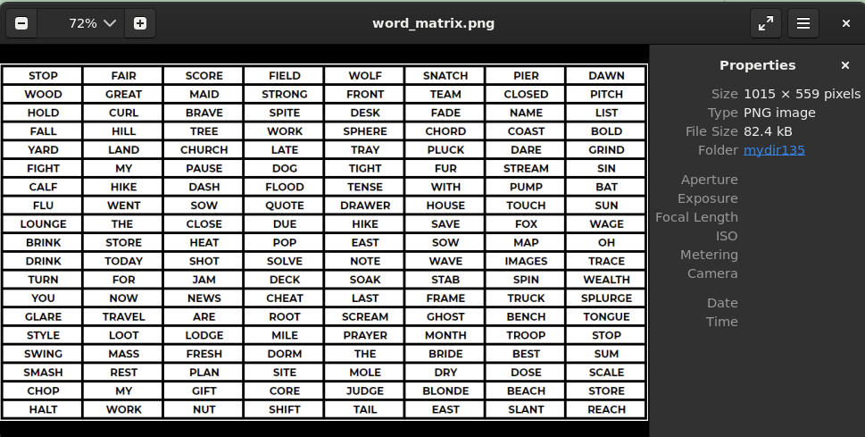
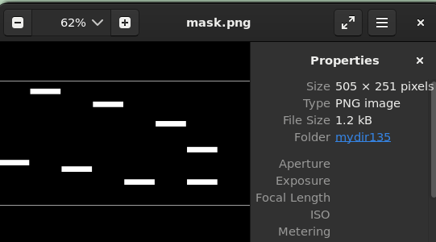
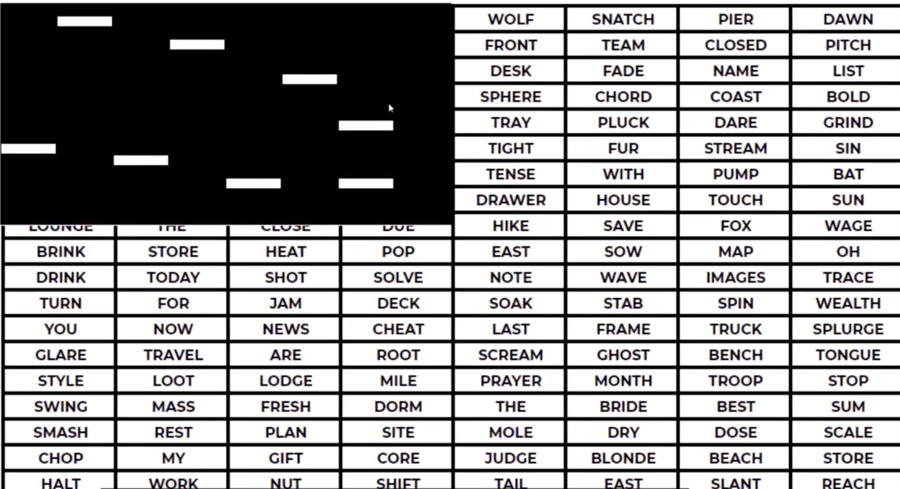
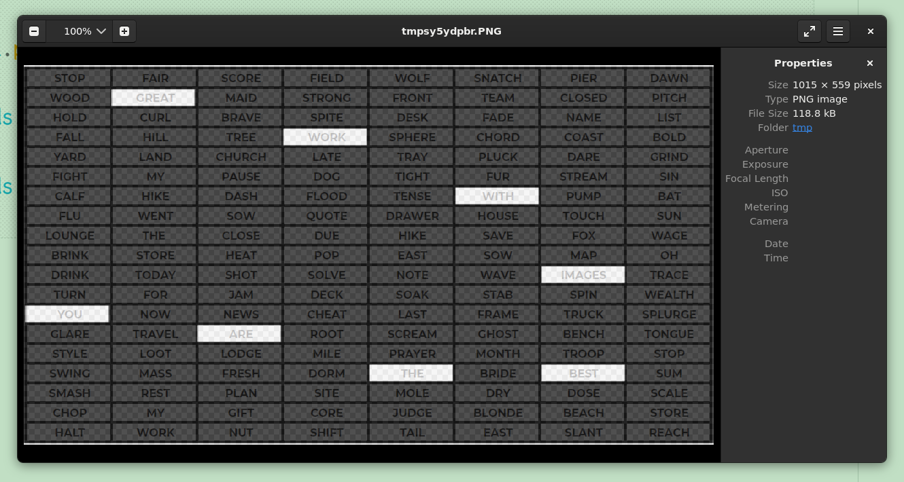

结合两张图片  

  
  

```python
In [1]: from PIL import Image

In [2]: words=Image.open('word_matrix.png')

In [3]: mask=Image.open('mask.png')

In [4]: words.mode
Out[4]: 'RGBA'

In [5]: mask.mode
Out[5]: 'RGBA'

In [6]: words.size
Out[6]: (1015, 559)

#尺寸不同
In [7]: mask.size
Out[7]: (505, 251)
```

> 直接paste的结果

  
> 1. 放大mask
> 2. 给mask添加透明度

```python
In [8]: mask=mask.resize((1015,559))

In [9]: mask.size
Out[9]: (1015, 559)


In [10]: mask.putalpha(200)

In [11]: words.paste(mask,(0,0),mask)

In [12]: words.show()
```

