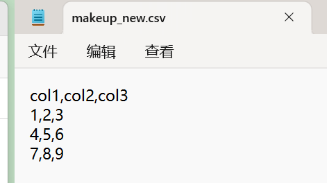

***处理PDF和电子表格***  

# CSV

CSV 代表**逗号分隔变量**（comma separated variables），它是电子表格程序中非常常见的输出格式。   

示例：   

姓名，工时，费率（Name, Hours, Rate）   

David, 20, 15   

Claire, 40, 20

> 用记事本打开，而不是Excel关联打开，就能看到所有的逗号 ~~也可以用制表符、横杠、或其他标点符号~~ 分隔了

  


请注意，虽然可以将 Excel 文件和 Google 电子表格导出为 .csv 文件，但它仅导出信息（文本/数据本身）。   
- 像公式、图片和宏（macros）等内容是无法保存在 .csv 文件中的。 
- 简单来说，.csv 文件仅包含来自电子表格的原始数据 ~~纯文本~~ 。   

> 本讲中利用Python内置的CSV模块，将允许我们**从.csv中获取列、行、值**，以及**将信息写入 .csv文件**

有几种选择：  

- pandas，完整的数据分析库
- Openpyxl ~~有很多excel特定的功能，支持Excel格式~~ 

```python
In [6]: #打开文件
   ...: #避免Unicode解码错误
   ...: data=open('example.csv',encoding='utf-8')
   ...: #调用csv.reader
   ...: csv_data=csv.reader(data)
   ...: #重新格式化为一个Python对象，通常是一个列表的列表
   ...: data_lines=list(csv_data)
   
In [7]: csv_data
Out[7]: <_csv.reader at 0x7c735fb8f990>

In [8]: data_lines
#通常第一行是列名
Out[8]:
[['id', 'first_name', 'last_name', 'email', 'gender', 'ip_address', 'city'],
 ['1',
  'Joseph',
  'Zaniolini',
  'jzaniolini0@simplemachines.org',
  'Male',
  '163.168.68.132',
  'Pedro Leopoldo'],
 ['2',
  'Freida',
  'Drillingcourt',
  'fdrillingcourt1@umich.edu',
  'Female',
  '97.212.102.79',
  'Buri'],
 ['3',
  'Nanni',
  'Herity',
  'nherity2@statcounter.com',
  'Female',
  '145.151.178.98',
  'Claver'],
 ['4',
  'Orazio',
  'Frayling',
  'ofrayling3@economist.com',
  'Male',
  '25.199.143.143',
  'Kungur'],
 ['5',
  'Julianne',
  'Murrison',
  'jmurrison4@cbslocal.com',
  'Female',
  '10.186.243.144',
  'Sainte-Luce-sur-Loire'],
 ['6',
  'Lucy',
  'Gamet',
  'lgamet5@list-manage.com',
  'Female',
  '10.151.93.36',
  'Pak Phli'],
 ['7',
  'Dyana',
  'Howatt',
  'dhowatt6@amazon.com',
  'Female',
  '224.169.61.29',
  'Palmares'],
 ['8',
  'Kassey',
  'Herion',
  'kherion7@amazon.com',
  'Female',
  '245.51.154.79',
  'Zákynthos'],
  #... #省略了
  ]
  
In [9]: len(data_lines)
Out[9]: 1001

#打印data_lines[0]到data_lines[4]
In [10]: for line in data_lines[:5]:
    ...:     print(line)
    ...:
['id', 'first_name', 'last_name', 'email', 'gender', 'ip_address', 'city']
['1', 'Joseph', 'Zaniolini', 'jzaniolini0@simplemachines.org', 'Male', '163.168.68.132', 'Pedro Leopoldo']
['2', 'Freida', 'Drillingcourt', 'fdrillingcourt1@umich.edu', 'Female', '97.212.102.79', 'Buri']
['3', 'Nanni', 'Herity', 'nherity2@statcounter.com', 'Female', '145.151.178.98', 'Claver']
['4', 'Orazio', 'Frayling', 'ofrayling3@economist.com', 'Male', '25.199.143.143', 'Kungur']

In [11]: data_lines[10]
Out[11]:
['10',
 'Hyatt',
 'Gasquoine',
 'hgasquoine9@google.ru',
 'Male',
 '221.155.106.39',
 'Złoty Stok']

In [12]: data_lines[10][3]
Out[12]: 'hgasquoine9@google.ru'

```

> 获取所有电子邮件

```python
In [13]: all_emails=[]

In [14]: for line in data_lines[1:15]:
    ...:     all_emails.append(line[3])
    ...:

In [15]: all_emails
Out[15]:
['jzaniolini0@simplemachines.org',
 'fdrillingcourt1@umich.edu',
 'nherity2@statcounter.com',
 'ofrayling3@economist.com',
 'jmurrison4@cbslocal.com',
 'lgamet5@list-manage.com',
 'dhowatt6@amazon.com',
 'kherion7@amazon.com',
 'chedworth8@china.com.cn',
 'hgasquoine9@google.ru',
 'ftarra@shareasale.com',
 'abathb@umn.edu',
 'lchastangc@goo.gl',
 'cceried@yale.edu']
 
```

> 获取全名

```python
 In [16]: full_names=[]

In [17]: for line in data_lines[1:]:
    ...:     full_names.append(line[1]+' '+line[2])
    ...:

In [18]: len(full_names)
Out[18]: 1000

In [19]: full_names
Out[19]:
['Joseph Zaniolini',
 'Freida Drillingcourt',
 'Nanni Herity',
 'Orazio Frayling',
 'Julianne Murrison',
 'Lucy Gamet',
 #...省略
 ]
```

> 信息写入csv

```python
#创建/打开一个 CSV 文件，清空它，然后准备写入数据，并把这个文件连接保存到变量 file_to_output 里。
#newline：不要让 Python 自动替你处理换行符，保持写入内容里的换行规则原样。
In [21]: file_to_output=open('to_save_file.csv',mode='w',newline='')


In [22]: csv_writer=csv.writer(file_to_output,delimiter=',')

In [23]: csv_writer.writerow(['a','b','c'])
Out[23]: 7

In [24]: csv_writer.writerows([['1a','2b','3c'],['4','5','6'],['9','10','11']])

In [25]: file_to_output.close()

#追加
In [26]: f=open('to_save_file.csv',mode='a',newline='')

In [28]: csv_writer=csv.writer(f)

In [29]: csv_writer.writerow(['x','y','x'])
Out[29]: 7

In [30]: f.close()
```

> 查看

```bash
╭─ ~/python_test/mydir140 main ?3
╰─❯ cat to_save_file.csv
a,b,c
1a,2b,3c
4,5,6
9,10,11

╭─ ~/python_test/mydir140 main ?3
╰─❯ cat to_save_file.csv
a,b,c
1a,2b,3c
4,5,6
9,10,11
x,y,x
```