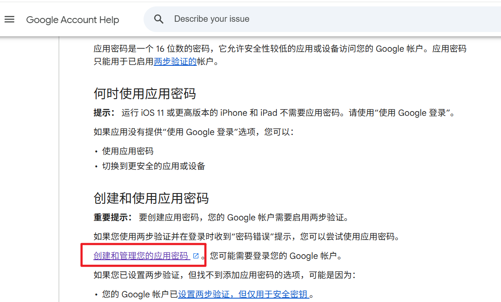
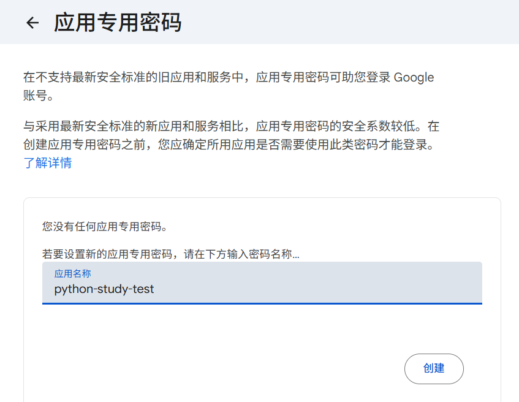
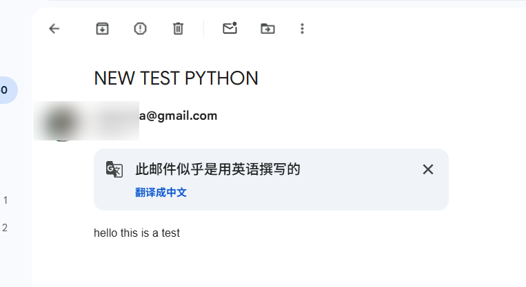

> 探索如何使用Python发送电子邮件，以及检查收件箱中收到的信息

- 发送电子邮件：连接电子邮件服务器，确认该连接，设置通信协议，登录实际电子邮件账户，发送信息  
- Python中自带SMTP lib库函数简化这些过程

> 本节使用gmail


每个主要电子邮件提供商都有自己的 SMTP（简单邮件传输协议）服务器。

| 服务提供商 | SMTP 服务器域名 |
| :--- | :--- |
| Gmail（需要应用专用密码） | smtp.gmail.com |
| Yahoo 邮箱 | smtp.mail.yahoo.com |
| Outlook.com / Hotmail.com | smtp-mail.outlook.com |
| AT&T | smpt.mail.att.net（使用端口 465） |
| Verizon | smtp.verizon.net（使用端口 465） |
| Comcast | smtp.comcast.net |

```python
#proxychains ipython  得走代理

In [4]: import smtplib

In [5]: smtp_object=smtplib.SMTP('smtp.gmail.com',587) #或者465，或者不传入任何端口号

#向服务器打招呼并建立连接
In [4]: smtp_object.ehlo()
Out[4]:
(250,
 b'smtp.gmail.com at your service, [23.11.323.204]\nSIZE 35882577\n8BITMIME\nSTARTTLS\nENHANCEDSTATUSCODES\nPIPELINING\nCHUNKING\nSMTPUTF8')
 
 #启动加密
 In [5]: smtp_object.starttls()
Out[5]: (220, b'2.0.0 Ready to start TLS')

#1. 使用input函数获取密码
In [6]: password=input('What is your password:')
What is your password:ksjdfkjdf

#2. 或者加密输入
In [7]: import getpass

In [8]: password=getpass.getpass("Password please:")
Password please:

In [9]: print(password)
kkdfjkdf


```

> 至此，针对Gmail用户的话，我们需要生成一个应用密码，而不是我们正常的电子邮件密码

- 访问 https://support.google.com/accounts/answer/185833?hl=en/ 
    
- 输入名字  
  
  
- 点击创建后会显示一个字符串，把它拷贝下来即可

```python
#依次输入邮箱密码即可
#如果提示要先连接，是因为前面的连接距今太久了断开了，需要重新再执行前面的代码
In [26]: email=getpass.getpass("Email:")
    ...: password=getpass.getpass("Password please:")
    ...: smtp_object.login(email,password)
Email:
Password please:
Out[26]: (235, b'2.7.0 Accepted')
```

> 发送

```python
In [28]: from_address=email
    ...: to_address='xxxx@gmail.com'
    ...: subject=input('enter the subject line:')
    ...: message=input('enter the body message:')
    ...: msg='Subject: ' + subject + '\n' +message
    ...: smtp_object.sendmail(from_address,to_address,msg)
enter the subject line:NEW TEST PYTHON
enter the body message:hello this is a test
Out[28]: {}

In [29]: smtp_object.quit()
Out[29]:
(221,
 b'2.0.0 closing connection 98e67ess1d1-3a0sdfasf43sm7553469a91.0 - gsmtp')
```

> 接收到了邮件

