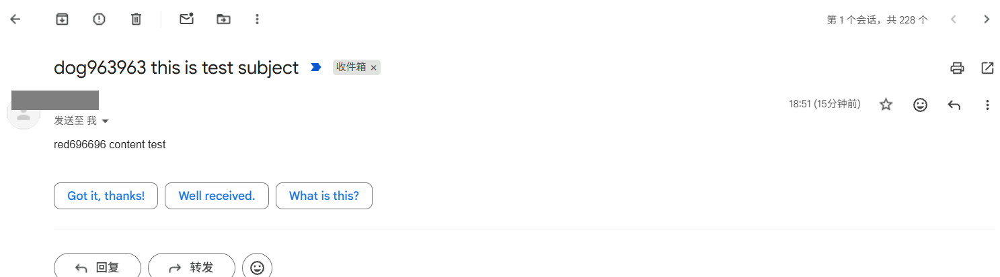

> 接收：指的是能够使用Python来查看收件箱

> 使用Python内置的IMAP库 ~~imaplib，使用特殊的语法搜索收件箱~~ 和电子邮件库 ~~email~~ 


| 关键字 (Keyword) | 定义 (Definition) |
| :--- | :--- |
| `'ALL'` | 返回邮件文件夹中的所有邮件。通常 `imaplib` 会有大小限制，若要修改限制，可以使用 `imaplib._MAXLINE = 100`（其中 100 为您希望设置的限制值）。 |
| `'BEFORE date'` | 返回指定日期之前的全部邮件。日期格式必须为 `01-Nov-2000`。 |
| `'ON date'` | 返回指定日期当天的全部邮件。日期格式必须为 `01-Nov-2000`。 |
| `'SINCE date'` | 返回指定日期之后的全部邮件。日期格式必须为 `01-Nov-2000`。 |
| `'FROM some_string'` | 返回发件人中包含该字符串的所有邮件。字符串可以是具体邮箱（例如 `'FROM user@example.com'`），也可以是可能出现在邮件中的普通字符串（例如 `"FROM example"`）。 |
| `'TO some_string'` | 返回发送给该字符串所指邮箱的所有邮件。字符串可以是具体邮箱（例如 `'FROM user@example.com'`），也可以是可能出现在邮件中的普通字符串（例如 `"FROM example"`）。 |
| `'CC some_string'` 和/或 `'BCC some_string'` | 返回邮件文件夹中的对应邮件。通常 `imaplib` 会有大小限制，若要修改限制，可以使用 `imaplib._MAXLINE = 100`（其中 100 为您希望设置的限制值）。 |
| `'SUBJECT string'`, `'BODY string'`, `'TEXT "string with spaces"'` | 返回主题包含该字符串或正文中包含该字符串的所有邮件。如果要搜索的字符串中包含空格，请用双引号将其括起来。 |
| `'SEEN'`, `'UNSEEN'` | 返回已读或未读的所有邮件（也称为 read 或 unread）。 |
| `'ANSWERED'`, `'UNANSWERED'` | 返回已回复或未回复的所有邮件。 |
| `'DELETED'`, `'UNDELETED'` | 返回已删除或未删除的所有邮件。 |

我用另一个的电子邮箱给要搜索的账号邮箱发送了一份邮件，目前收件箱已经收到  



```python
In [2]: import imaplib

In [3]: M=imaplib.IMAP4_SSL('imap.gmail.com')
|D-chain|-<>-127.0.0.1:12983-<><>-142.251.188.109:993-<><>-OK

In [8]: import getpass

In [9]: email=getpass.getpass("Email:")
   ...: password=getpass.getpass("Password please:")
Email:
Password please:

In [11]: M.login(email,password)
Out[11]: ('OK', [b'xxxxxx@gmail.com authenticated (Success)'])

#这里显示的是可以查看的所有内容（属性）
In [12]: M.list()
Out[12]:
('OK',
 [b'(\\HasNoChildren) "/" "INBOX"',#收件箱
  b'(\\HasNoChildren) "/" "Sent"',
  b'(\\HasNoChildren) "/" "Trash"',#垃圾邮件
  b'(\\HasChildren \\Noselect) "/" "[Gmail]"',
  b'(\\HasNoChildren \\Junk) "/" "[Gmail]/&V4NXPpCuTvY-"',
  b'(\\HasNoChildren \\Trash) "/" "[Gmail]/&XfJSIJZkkK5O9g-"',
  b'(\\Flagged \\HasNoChildren) "/" "[Gmail]/&XfJSoGYfaAc-"',
  b'(\\HasNoChildren \\Sent) "/" "[Gmail]/&XfJT0ZCuTvY-"',
  b'(\\All \\HasNoChildren) "/" "[Gmail]/&YkBnCZCuTvY-"',
  b'(\\Drafts \\HasNoChildren) "/" "[Gmail]/&g0l6Pw-"',
  b'(\\HasNoChildren \\Important) "/" "[Gmail]/&kc2JgQ-"'])
```

```python
#选择收件箱进行搜索
In [13]: M.select('inbox')
Out[13]: ('OK', [b'610'])

#这个SUBJECT搜索必须是完整的字符而不是部分，否则搜不到
In [53]: typ,data=M.search(None,'SUBJECT "dog963963"')

In [54]: typ
Out[54]: 'OK'

In [55]: data
Out[55]: [b'610']

In [56]: email_id=data[0]

# 从IMAP服务器获取完整邮件
# RFC822 = 整封邮件原始内容
In [57]: result,email_data=M.fetch(email_id,'RFC822')

In [58]: email_data
Out[58]:
[(b'610 (RFC822 {7001}',
  b'Delivered-To:
  #这里面有很多隐私相关的内容，我不显示出来了
#其实就是下面这样
#[
#    (
#      邮件信息,
#      邮件原始内容
#    )
#]
  
# email_data是一个列表
# [0][1]取出真正的邮件bytes数据
In [59]: raw_email=email_data[0][1]

# bytes -> str
In [60]: raw_email_string=raw_email.decode('utf-8')


#也可以不使用这个email库自己去解码
In [61]: import email

# 使用Python邮件解析库
# 把字符串解析成Message对象
In [62]: email_message=email.message_from_string(raw_email_string)

#莫名其妙的字符
In [63]: raw_email_string
Out[63]: 'Delivered-To: xxxx@gmail.com\r\nReceived: by 2002:aewer:61cc:0:b0:486:e70a:7c75 with SMTP id q12csp2234347wrv;\r\n        Mon, 28 Sep 2026 03:51:35 -0700 (PDT)\r\nX-Received: by 2002:a05:6ssz:1256:b0:wss:6568:3039 with SMTP id 2adb3069b0e04-5b8df0d9719mr4082555e87.60.1790592694852;\r\n        Mon, 28 Sep 2026 03:51:34 -0700 (PDT)\r\nARC-Seal: i=2; a=rsa-sha256; t=1790592694; cv=pass;\r\n        d=google.com; s=arc-20260327;\r\n        b=Pae5XIR//wBacjoC3jadsssskBjKcc+bkCkTxxxc\r\n         1T3J502Q520PR5xssXdmeln9IsssssDRtXC+aCd2okXFGItITs\r\n         4/n8X7z8rt3LCXKf2TJ/3VwC891

#解析后的对象
In [64]: email_message
Out[64]: <email.message.Message at 0x79444073e240>

# 遍历邮件所有部分
# 因为邮件可能包含：
# 正文、HTML、附件等
In [65]: for part in email_message.walk():
    ...:     #找纯文本正文
    ...:     if part.get_content_type() == 'text/plain':
    ...:         #获取正文
    ...:         #decode=True自动解码base64等编码
    ...:         body = part.get_payload(decode=True)
    ...:         # bytes -> str
    ...:         print(body.decode('utf-8'))
    ...:
red696696 content test
```