> 介绍PythonGUI（图形用户界面），将使用IPy widgets来实现  ~~将完全在Jupyter中完成这些，纯Python命令行或者Ipython命令行中无效~~ 

```bash
pip install ipywidgets
```

> ipywidgets.IntSlider() 主要用于 Jupyter 环境，在普通 IPython 命令行里不会显示真正的滑块。原因是 ipywidgets 是一个前端交互组件库，它需要一个支持显示 widget 的前端。

- 我们可以使用 **Jupyter** 构建简单的图形用户界面（GUI）！   
- 让我们探索如何构建这些交互式元素。   
- 请将课程 Notebooks 放在手边，里面有许多供你参考的代码和信息！

将探索如何构建交互式元素，包括按钮、滑块，可直接在笔记中创建供他人使用

# interact功能

```python
from ipywidgets import interact,interactive,fixed
import ipywidgets as widgets

def func(x):
    return x
    
def ly_func(x):
    return 2*x
    
interact(ly_func,x=10)
```

  

如上 func输入14--->输出14；ly_func输入15输出30

`interact(func,x=True)`

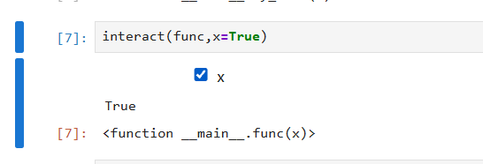

> 加上分号，就可以不看到output的输出

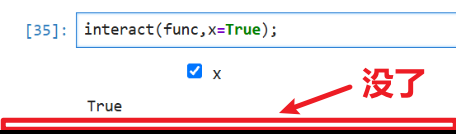

`interact(func,x='Hello')`

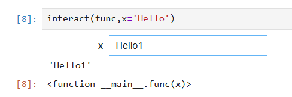

## 复习装饰器

> 装饰器 = 接收一个函数，把它包装后返回一个新函数。

普通装饰器

```python
@decorator
def f():
    pass
```

等价：

```python
f = decorator(f)
```

带参数装饰器  

```python
@decorator(a=1)
def f():
    pass
```

等价：

```python
f = decorator(a=1)(f)
```

多了一层。

你的：

```python
@interact(x=True,y=1.0)
def g(x,y):
```

就是：

第一步：

```python
interact(x=True,y=1.0)
```

生成一个装饰器。

第二步：

这个装饰器接收：

```python
g
```

第三步：

返回新的 `g`。

## 自己写一个interact

```python
In [7]: def interact(x, y):
   ...:
   ...:     def decorator(func):
   ...:
   ...:         # 第一次运行
   ...:         print(func(x, y))
   ...:
   ...:         return func
   ...:
   ...:     return decorator
   ...:

In [8]: @interact(x=True, y=1.0)
   ...: def g(x,y):
   ...:     return (x,y)
   ...:
(True, 1.0)
```

如果是 

```python
In [8]: @interact(x=True, y=fixed(1.0))
   ...: def g(x,y):
   ...:     return (x,y)
   ...:
```

我猜大概率y就会是一个fixed对象而内部发现他是fixed对象就不允许他修改值了  

## interact继续学习

```python
@interact(x=True,y=fixed(1.0))
def g(x,y):
    return (x,y)
```

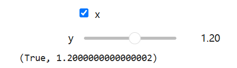

```python
@interact(x=True,y=fixed(1.0))
def g(x,y):
    return (x,y)
```


```python
def func(x):
    return x
interact(func,x=fixed('hello'))

'hello'
<function __main__.func(x)>
```

> 最小值与最大值

```python
interact(func,x=10)
```

> 最小值-10，最大值30

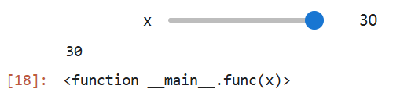

> 手动指定一些值

```python
interact(func,x=widgets.IntSlider(min=-100,max=100,stop=1,value=0))
```

> 简化

```python
interact(func,x=(-100,100,1))
```

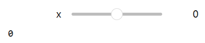

> 浮点型

```python
interact(func,x=(-10.0,10.0,.1))
```

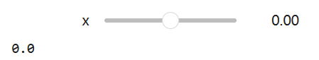

> 使用装饰器注解

```python
@interact(x=(0.0,20.0,0.5))
def h(x=5.0):
    return x
```

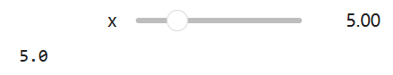  

```python
#输入框
interact(func,x='hello')
```

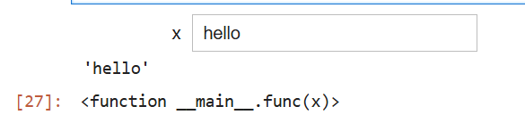  

```python
#下拉框
interact(func,x=['hello','opt2','opt3'])
```

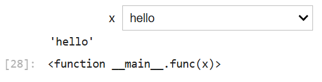  

```python
#字典形式
interact(func,x={'one':10,'two':20})
```

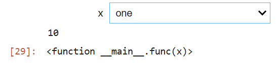  

```python
from IPython.display import display
def f(a,b):
    display(a+b)
    return a+b

w=interactive(f,a=10,b=20)

type(w)
ipywidgets.widgets.interaction.interactive


```


```python

w.children
(IntSlider(value=10, description='a', max=30, min=-10),
 IntSlider(value=20, description='b', max=60, min=-20),
 Output(outputs=({'output_type': 'display_data', 'data': {'text/plain': '30'}, 'metadata': {}},)))
```

```python
display(w)
```

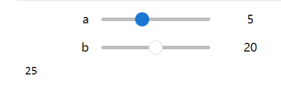

## 总结

你讲能够创建接收某种输入并返回某种输出的函数，如果你想让用户拥有某种界面来更改可能的输入并查看输出，可以使用interact函数或interact装饰器。还可以在interact调用中指定实际的控件(intslider)，他们的简写形式，比如滑块的元组、下拉菜单的列表、键值对关联下拉菜单的字典。如何使用interactive功能将其保存到变量中，以便稍后显示该变量

