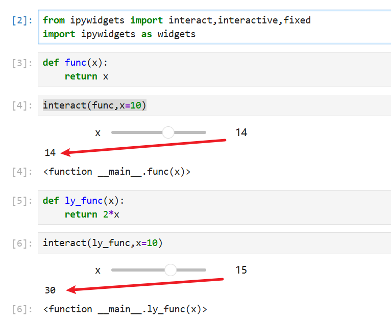

> 介绍PythonGUI（图形用户界面），将使用IPy widgets来实现  ~~将完全在Jupyter中完成这些，纯Python命令行或者Ipython命令行中无效~~ 

```bash
pip install ipywidgets
```

> ipywidgets.IntSlider() 主要用于 Jupyter 环境，在普通 IPython 命令行里不会显示真正的滑块。原因是 ipywidgets 是一个前端交互组件库，它需要一个支持显示 widget 的前端。

- 我们可以使用 **Jupyter** 构建简单的图形用户界面（GUI）！   
- 让我们探索如何构建这些交互式元素。   
- 请将课程 Notebooks 放在手边，里面有许多供你参考的代码和信息！

将探索如何构建交互式元素，包括按钮、滑块，可直接在笔记中创建供他人使用

# interact功能

```python
from ipywidgets import interact,interactive,fixed
import ipywidgets as widgets

def func(x):
    return x
    
def ly_func(x):
    return 2*x
    
interact(ly_func,x=10)
```

  

~~暂时跳过，后续需要再回头补上这部分的内容~~  

