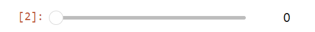
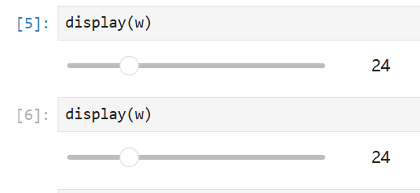
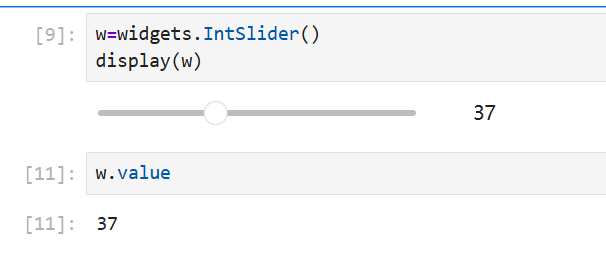
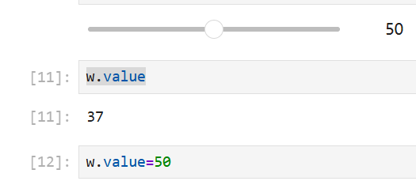
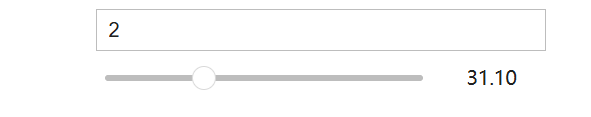
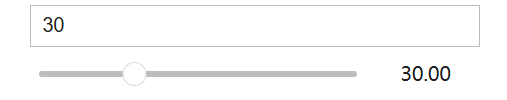
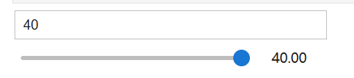

> 默认最小0，最大100，初始0

```python
import ipywidgets as widgets
widgets.IntSlider()
```

  

```python
#先保存，稍后再显示
w=widgets.IntSlider()
from IPython.display import display
display(w)
```

  

> 如果多次display(w)那么他们就会是同步的

  

> `w.close()`也会同时关闭上面两个

```python
w=widgets.IntSlider()
display(w)

w.value #重新运行才会自动更新
```



```python
w.value=50
#运行后上面界面的滑块也滑动到了50
```

  

```python
w.keys
['_dom_classes',
 '_model_module',
 '_model_module_version',
 '_model_name',
 '_view_count',
 '_view_module',
 '_view_module_version',
 '_view_name',
 'behavior',
 'continuous_update',
 'description',
 'description_allow_html',
 'disabled',
 'layout',
 'max',
 'min',
 'orientation',
 'readout',
 'readout_format',
 'step',
 'style',
 'tabbable',
 'tooltip',
 'value']

w.max=2000 #上面的控件也会改变


```

> 默认情况下两个组件毫不关联

```python
a=widgets.FloatText()
b=widgets.FloatSlider()
display(a,b)
```

 

```python
a=widgets.FloatText()
b=widgets.FloatSlider()
display(a,b)
mylink=widgets.jslink((a,'value'),(b,'value'))
```




> 把a的value链接到b的max

```python
a=widgets.FloatText(20)
b=widgets.FloatSlider()
display(a,b)
mylink=widgets.jslink((a,'value'),(b,'max'))
```



```python
#取消链接
mylink.unlink()
```


