```python
import ipywidgets as widgets

# Show all available widgets!
for item in widgets.Widget.widget_types.items():
    print(item[0][2][:-5])
#=========out=================


import ipywidgets as widgets

# Show all available widgets!
for item in widgets.Widget.widget_types.items():
    print(item[0][2][:-5])
Layout
Accordion
Audio
BoundedFloatText
BoundedIntText
Box
Button
ButtonStyle
Checkbox
CheckboxStyle
ColorPicker
ColorsInput
Combobox
ControllerAxis
ControllerButton
Controller
DOMWidget
DatePicker
Datetime
DescriptionStyle
DirectionalLink
Dropdown
FileUpload
FloatLogSlider
FloatProgress
FloatRangeSlider
FloatSlider
FloatText
FloatsInput
GridBox
HBox
HTMLMath
HTMLMathStyle
HTML
HTMLStyle
Image
IntProgress
IntRangeSlider
IntSlider
IntText
IntsInput
Label
LabelStyle
Link
NaiveDatetime
Password
Play
ProgressStyle
RadioButtons
Select
SelectMultiple
SelectionRangeSlider
SelectionSlider
SliderStyle
Stack
Tab
TagsInput
Text
TextStyle
Textarea
Time
ToggleButton
ToggleButtonStyle
ToggleButtons
ToggleButtonsStyle
VBox
Valid
Video
Output

```

```python
widgets.IntSlider(
    value=7,
    min=0,
    max=10,
    step=1,
    description='Test:',
    disabled=False,
    continuous_update=False,
    orientation='horizontal',
    readout=True,
    readout_format='d'
)
```

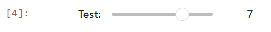  

```python
widgets.FloatSlider(
    value=7.5,
    min=0,
    max=10.0,
    step=0.1,
    description='Test:',
    disabled=False,
    continuous_update=False,
    orientation='horizontal',
    readout=True,
    readout_format='.1f'
)
```

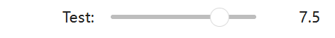  

```python
#垂直显示
widgets.FloatSlider(
    value=7.5,
    min=0,
    max=10.0,
    step=0.1,
    description='Test:',
    disabled=False,
    continuous_update=False,
    orientation='vertical',
    readout=True,
    readout_format='.1f'
)
```

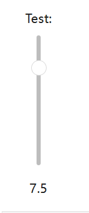  

```python
#范围滑块
widgets.IntRangeSlider(
    value=[5,7],
    min=0,
    max=10,
    step=1,
    description='Test:',
    disabled=False,
    continuous_update=False,
    orientation='horizontal',
    readout=True,
    readout_format='d'
)
```


```python
widgets.IntProgress(
    value=7,
    min=0,
    max=10,
    step=1,
    description='Loading:',
    bar_style='',#'success','info','warning','danger' or ''
    orientation='horizontal'
)
```

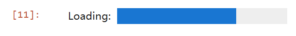  

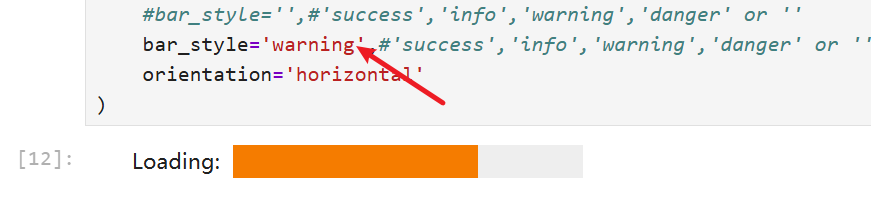  

```python
widgets.FloatProgress(
    value=7.5,
    min=0,
    max=10.0,
    step=0.1,
    description='Loading:',
    bar_style='info',
    orientation='horizontal'
)
```

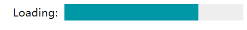  

```python
#有界整数
widgets.BoundedIntText(
    value=7,
    min=0,
    max=10,
    step=1,
    description='Text:',
    disabled=False
)
```

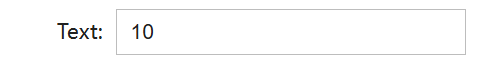  

```python
#有界浮点数
widgets.BoundedFloatText(
    value=7.5,
    min=0,
    max=10.0,
    step=0.1,
    description='Text:',
    disabled=False
)
```

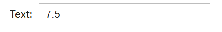  

```python
#普通整数
widgets.IntText(
    value=7,
    description='Any:',
    disabled=False
)

```

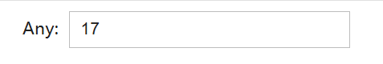  

```python
#普通浮点数
widgets.FloatText(
    value=7.5,
    description='Any:',
    disabled=False
)
```

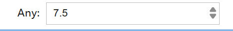  

```python
#布尔组件
widgets.ToggleButton(
    value=False,
    description='Click me',
    disabled=False,
    button_style='', # 'success', 'info', 'warning', 'danger' or ''
    tooltip='Description',
    icon='check'
)
```

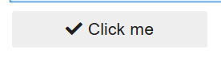  

```python
widgets.ToggleButton(
    value=False,
    description='Click me',
    disabled=False,
    button_style='success', # 'success', 'info', 'warning', 'danger' or ''
    tooltip='Description',
    icon='check'
)
```

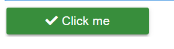  

```python
#勾选框
widgets.Checkbox(
    value=False,
    description='Check me',
    disabled=False
)
```

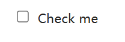  

```python
#无法交互，只显示是否有效
widgets.Valid(
    value=False,
    description='Valid!',
)
```

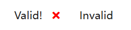  

```python
#指定数值选择
widgets.Dropdown(
    options=['1', '2', '3'],
    value='2',
    description='Number:',
    disabled=False,
)
```

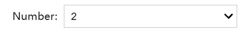  

```python
#带值的下拉
widgets.Dropdown(
    options={'One': 1, 'Two': 2, 'Three': 3},
    value=2,
    description='Number:',
)
```

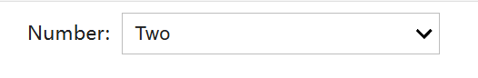  

```python
widgets.RadioButtons(
    options=['pepperoni', 'pineapple', 'anchovies'],
    # value='pineapple',
    description='Pizza topping:',
    disabled=False
)
```

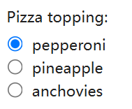  

```python
widgets.Select(
    options=['Linux', 'Windows', 'OSX'],
    value='OSX',
    # rows=10,
    description='OS:',
    disabled=False
)

```

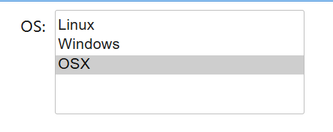

```python
#移动时有不同的选项
widgets.SelectionSlider(
    options=['scrambled', 'sunny side up', 'poached', 'over easy'],
    value='sunny side up',
    description='I like my eggs ...',
    disabled=False,
    continuous_update=False,
    orientation='horizontal',
    readout=True
)
```

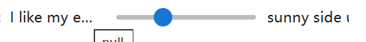

```python
#切换按钮
widgets.ToggleButtons(
    options=['Slow', 'Regular', 'Fast'],
    description='Speed:',
    disabled=False,
    button_style='', # 'success', 'info', 'warning', 'danger' or ''
    tooltips=['Description of slow', 'Description of regular', 'Description of fast'],
    # icons=['check'] * 3
)
```

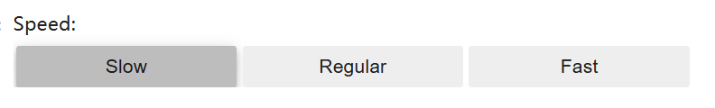  

```python
#多选
widgets.SelectMultiple(
    options=['Apples', 'Oranges', 'Pears'],
    value=['Oranges'],
    # rows=10,
    description='Fruits',
    disabled=False
)
```

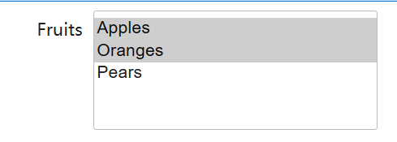  

```python
#字符串文本
widgets.Text(
    value='Hello World',
    placeholder='Type something',
    description='String:',
    disabled=False
)
```

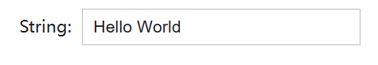  

```python
#多行文本
widgets.Textarea(
    value='Hello World',
    placeholder='Type something',
    description='String:',
    disabled=False
)
```

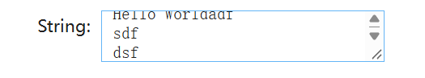  

```python
#标签
widgets.HBox([widgets.Label(value="The $m$ in $E=mc^2$:"), widgets.FloatSlider()])

```

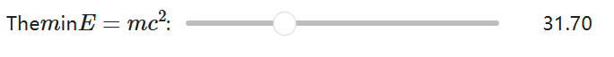  

```python
widgets.HTML(
    value="Hello <b>World</b>",
    placeholder='Some HTML',
    description='Some HTML',
)
```


```python
#HTML Math
widgets.HTMLMath(
    value=r"Some math and <i>HTML</i>: \(x^2\) and $$\frac{x+1}{x-1}$$",
    placeholder='Some HTML',
    description='Some HTML',
)

```

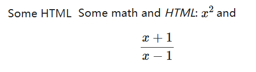  

```python
#图片
file = open("images/WidgetArch.png", "rb")
image = file.read()
widgets.Image(
    value=image,
    format='png',
    width=300,
    height=400,
)
```

```python
#按钮
widgets.Button(
    description='Click me',
    disabled=False,
    button_style='', # 'success', 'info', 'warning', 'danger' or ''
    tooltip='Click me',
    icon='check'
)
```