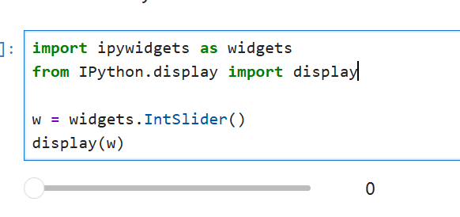
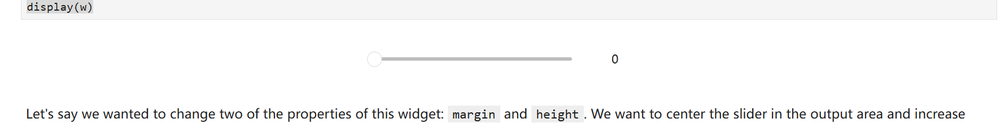
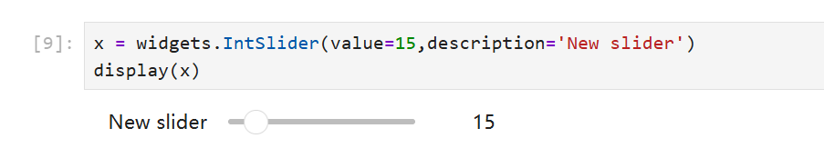
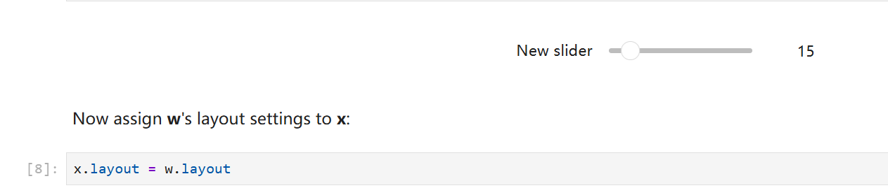
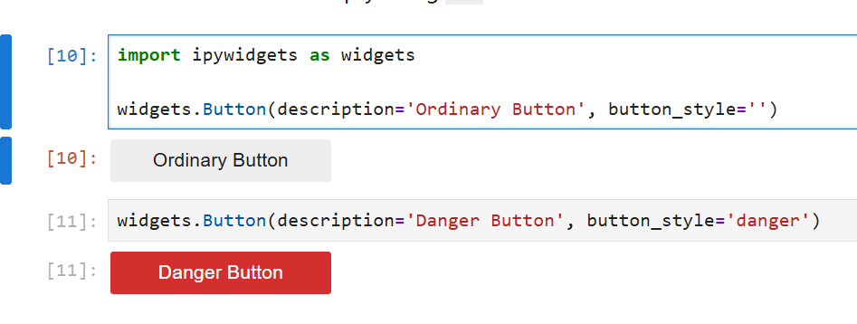
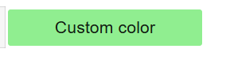
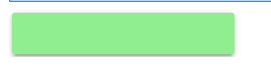
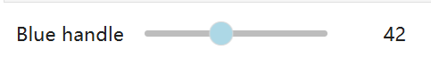

> 接下来会假设你对HTML或者CSS中一些了解

```python
#显示一个普通滑块
import ipywidgets as widgets
from IPython.display import display

w = widgets.IntSlider()
display(w)
```



```python
w.layout.margin = 'auto'
w.layout.height = '75px'
```

  
```python
#新滑块
x = widgets.IntSlider(value=15,description='New slider')
display(x)
```



```python
#让x滑块与w的滑块布局一致
x.layout = w.layout
```



预设样式，包括Bootstrap，包括primary,success,info,warning,danger等  

```python
import ipywidgets as widgets

widgets.Button(description='Ordinary Button', button_style='')
```

```python
widgets.Button(description='Danger Button', button_style='danger')
```



# style 

```python
b1 = widgets.Button(description='Custom color')
b1.style.button_color = 'lightgreen'
b1
```

  

```python
b1.style.keys

['_model_module',
 '_model_module_version',
 '_model_name',
 '_view_count',
 '_view_module',
 '_view_module_version',
 '_view_name',
 'button_color',
 'font_family',
 'font_size',
 'font_style',
 'font_variant',
 'font_weight',
 'text_color',
 'text_decoration']
```

```python
#使用其他组件的样式
b2 = widgets.Button()
b2.style = b1.style
b2
```



```python
s1 = widgets.IntSlider(description='Blue handle')
s1.style.handle_color = 'lightblue'
s1
```

  

