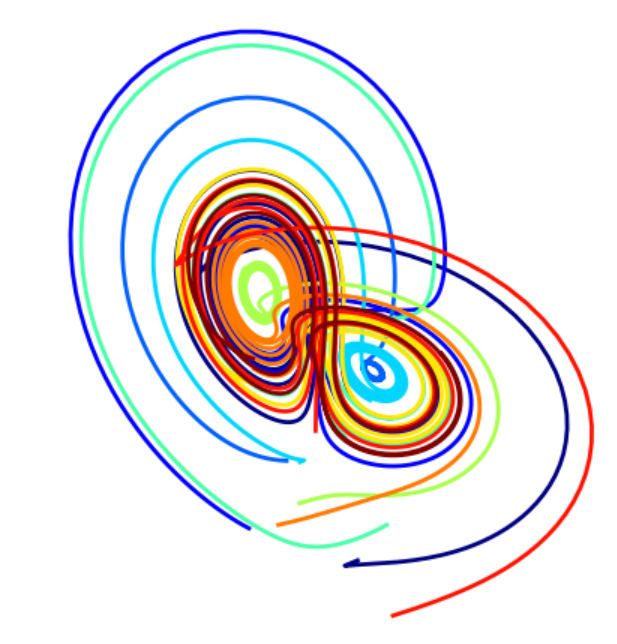
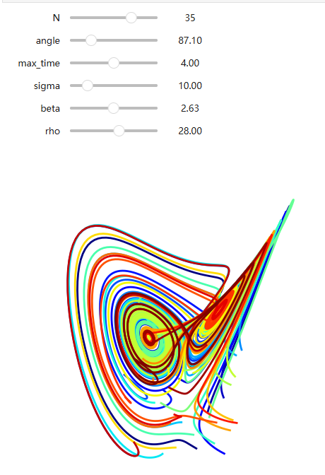
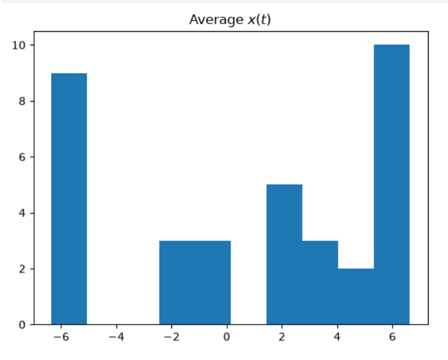
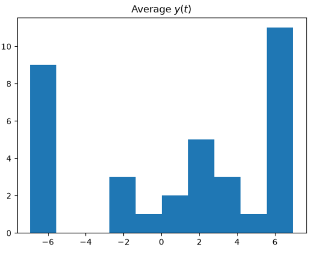

> 需要额外安装几个库：NumPy，Matplotlib和SciPy

> 将部件（控件）与外部库连接起来 ~~本章都是一些比较高级的数学、科学相关的东西，仅作为例子展示（尤其是下面通过gui修改某些参数时图像发生变化，了解python gui库在这方面很有用即可）~~ 

```bash
pip install NumPy
pip install Matplotlib
pit install SciPy
#=====或者====
conda install NumPy
conda install Matplotlib
conda install SciPy
```

```python
from ipywidgets import interact, interactive
from IPython.display import clear_output, display, HTML

import numpy as np
from scipy import integrate

from matplotlib import pyplot as plt
from mpl_toolkits.mplot3d import Axes3D
from matplotlib.colors import cnames
from matplotlib import animation
```

```python
def solve_lorenz(N=10, angle=0.0, max_time=4.0, sigma=10.0, beta=8./3, rho=28.0):

    fig = plt.figure();
    ax = fig.add_axes([0, 0, 1, 1], projection='3d');
    ax.axis('off')

    # prepare the axes limits
    ax.set_xlim((-25, 25))
    ax.set_ylim((-35, 35))
    ax.set_zlim((5, 55))
    
    def lorenz_deriv(x_y_z, t0, sigma=sigma, beta=beta, rho=rho):
        """Compute the time-derivative of a Lorenz system."""
        x, y, z = x_y_z
        return [sigma * (y - x), x * (rho - z) - y, x * y - beta * z]

    # Choose random starting points, uniformly distributed from -15 to 15
    np.random.seed(1)
    x0 = -15 + 30 * np.random.random((N, 3))

    # Solve for the trajectories
    t = np.linspace(0, max_time, int(250*max_time))
    x_t = np.asarray([integrate.odeint(lorenz_deriv, x0i, t)
                      for x0i in x0])
    
    # choose a different color for each trajectory
    colors = plt.cm.jet(np.linspace(0, 1, N));

    for i in range(N):
        x, y, z = x_t[i,:,:].T
        lines = ax.plot(x, y, z, '-', c=colors[i])
        _ = plt.setp(lines, linewidth=2);

    ax.view_init(30, angle)
    _ = plt.show();

    return t, x_t
```

```python
t, x_t = solve_lorenz(angle=0, N=10)
```

  

> 修改一些参数时，图像会变化

```python
w = interactive(solve_lorenz, angle=(0.,360.), N=(0,50), sigma=(0.0,50.0), rho=(0.0,50.0))
display(w);
```




> 直方图

```python
t, x_t = w.result
w.kwargs
xyz_avg = x_t.mean(axis=1)
xyz_avg.shape
(35, 3)

plt.hist(xyz_avg[:,0])
plt.title('Average $x(t)$');

```

  

```python
plt.hist(xyz_avg[:,1])
plt.title('Average $y(t)$');
```

