# 环境
- 使用视频作者给出的示例，```https://github.com/CoreyMSchafer/code_snippets/tree/master/Regular-Expressions```  
- 使用sublimeText打开的文件，ctrl+f时要确认勾选正则及区分大小写  
  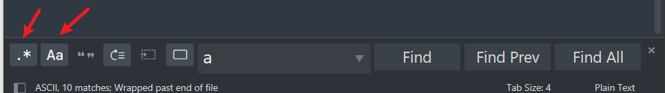  
#  simple.txt-基础操作
## 直接搜索  
  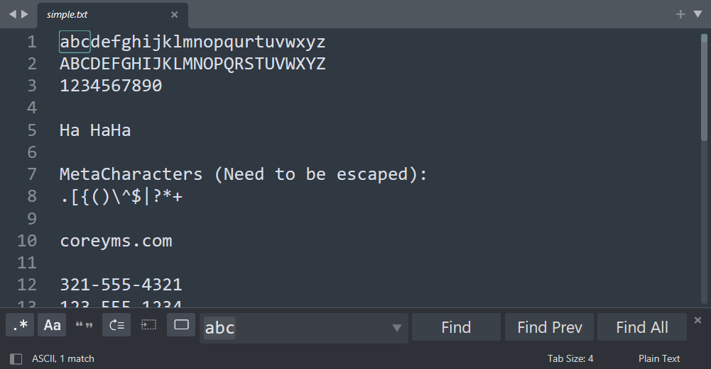  
  ## 任意字符  
  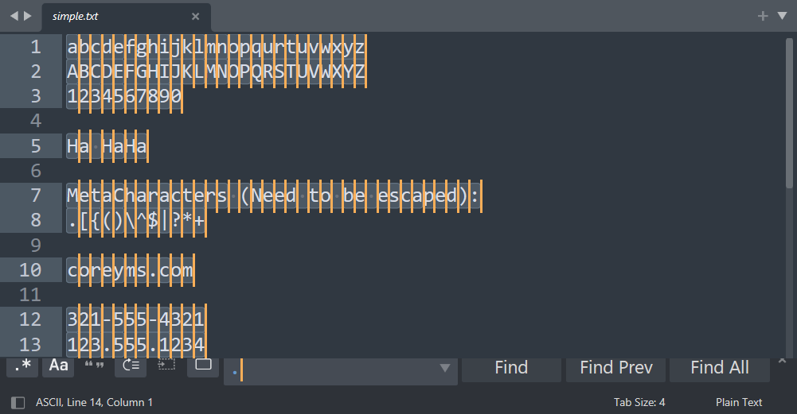  
  这里默认不会显示所有，点击findAll才会出来  
## 有些字符需要加反斜杠转义，比如 . （点）以及 \ （斜杠本身）  
  > /////，从左到右，和书写方向一致的叫做(正)斜杠。  
  > 反之，叫做反斜杠 \ 
  
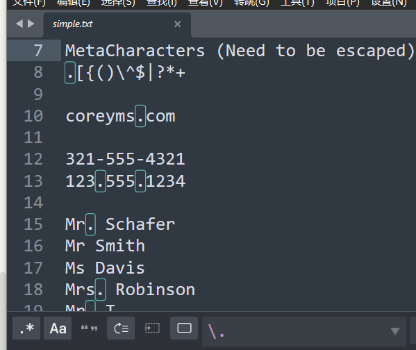  
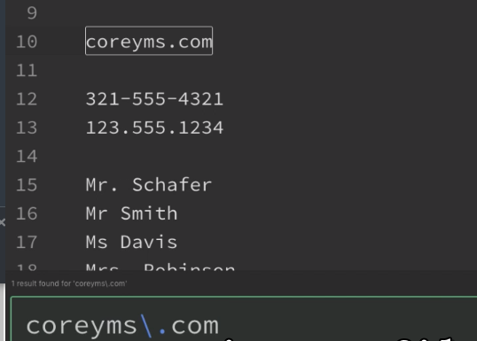  
## 一些元字符  
```shell
.       - Any Character Except New Line 除了换行符的任意字符
\d      - Digit (0-9) 数字
\D      - Not a Digit (0-9) 非数字
\w      - Word Character (a-z, A-Z, 0-9, _) 单词字符，大小写字母+数字+下划线
\W      - Not a Word Character 非单词字符
\s      - Whitespace (space, tab, newline) 空白字符，空格+tab+换行符
\S      - Not Whitespace (space, tab, newline) 非空白字符

\b      - Word Boundary 边界字符-单词边界
\B      - Not a Word Boundary 非单词边界(没有单词边界)
^       - Beginning of a String
$       - End of a String

[]      - Matches Characters in brackets
[^ ]    - Matches Characters NOT in brackets
|       - Either Or
( )     - Group

Quantifiers:
*       - 0 or More
+       - 1 or More
?       - 0 or One
{3}     - Exact Number
{3,4}   - Range of Numbers (Minimum, Maximum)


#### Sample Regexs ####

[a-zA-Z0-9_.+-]+@[a-zA-Z0-9-]+\.[a-zA-Z0-9-.]+
```
### 边界字符
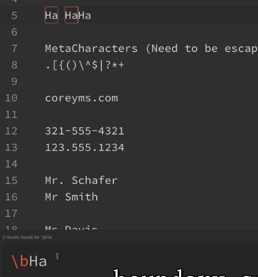  
### 非边界字符
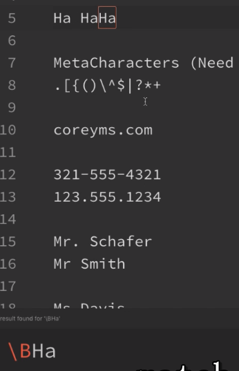  
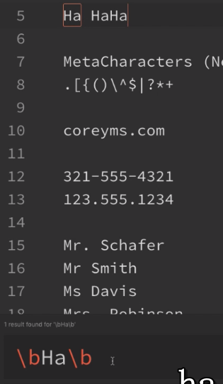  

# 事例
## 数字
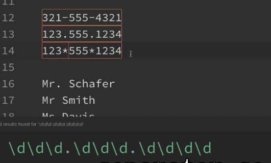  
## 方括号，或者
  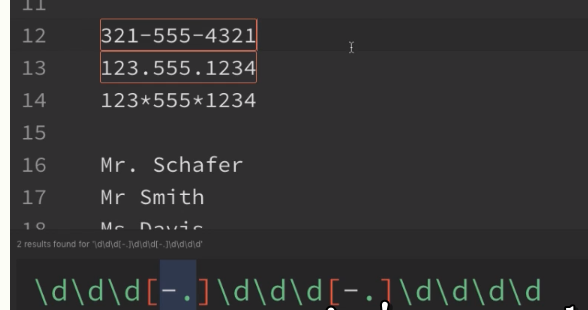  
  > 破折号是有特殊意义的（表示范围），比如1-9，a-z，但是处于方括号中的开头或者结尾，就是普通的破折号
  
  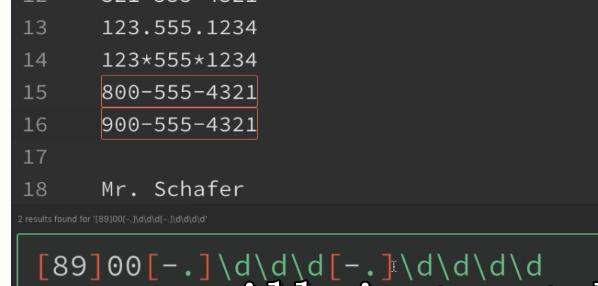
## 范围  
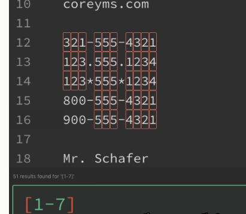  

任意的小写字母或者大写字母  
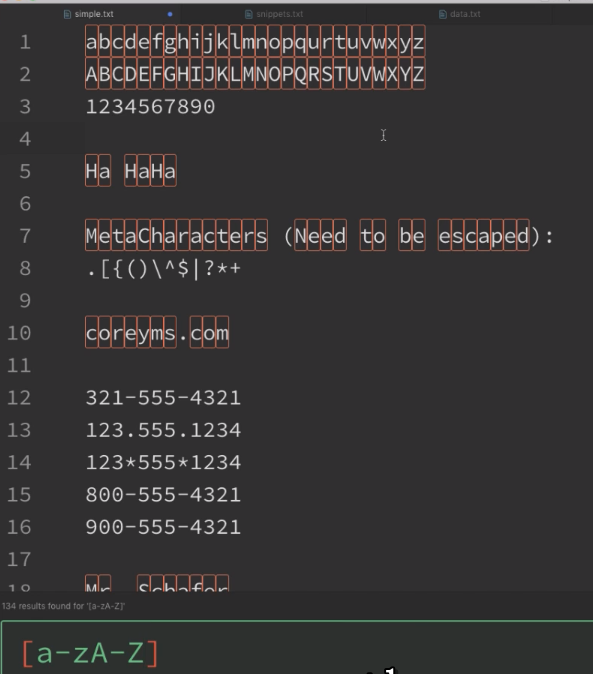  

## 尖叫符号表示非，排除，否定
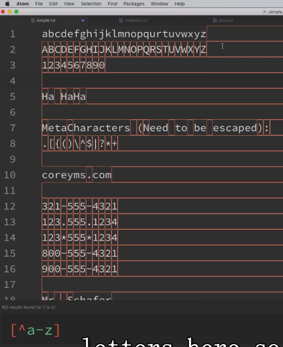  
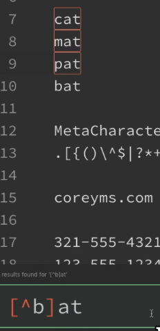  

## 匹配多次(大括号，数字)
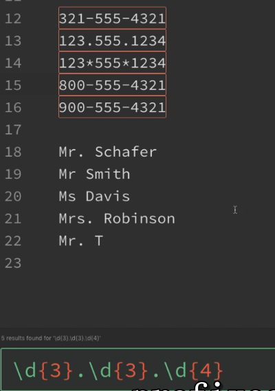  

## (|)组 或者关系，?出现或不出现 ，* 出现几次都行
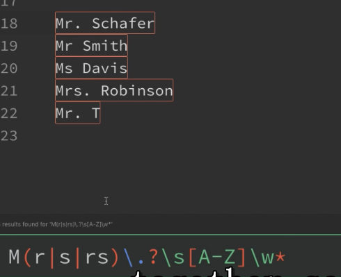  

# 综合事例  
## 邮箱1
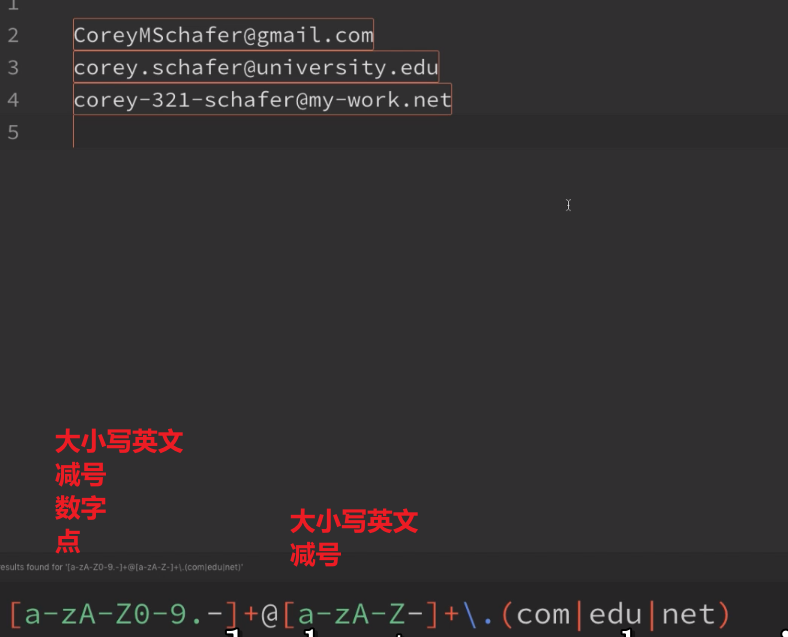  
## 邮箱2
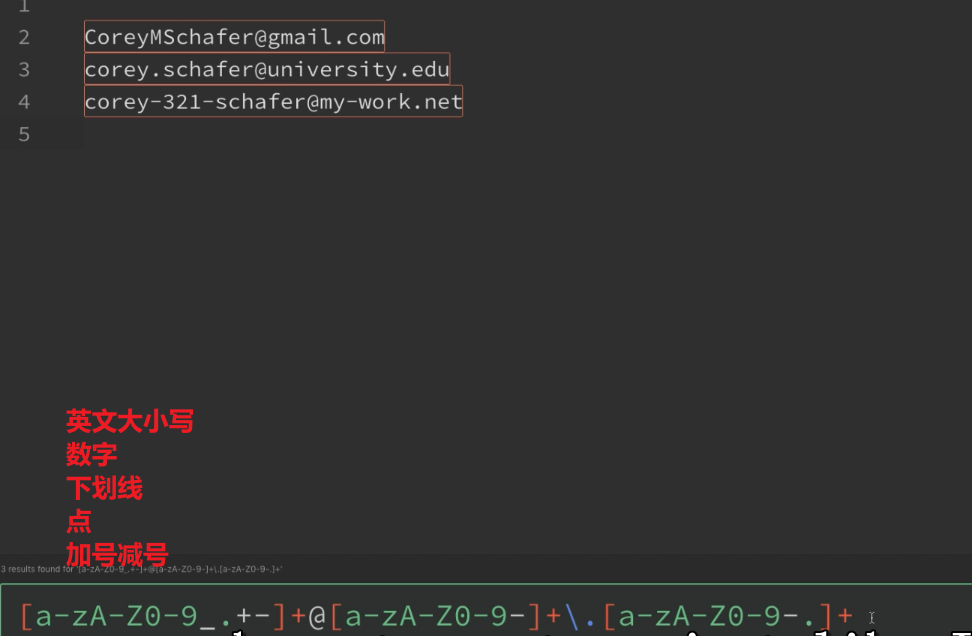 

## URL
  
### 匹配
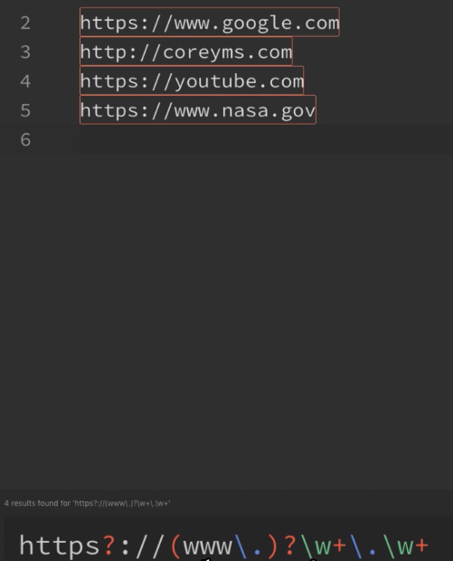  

### 分组并且反向引用
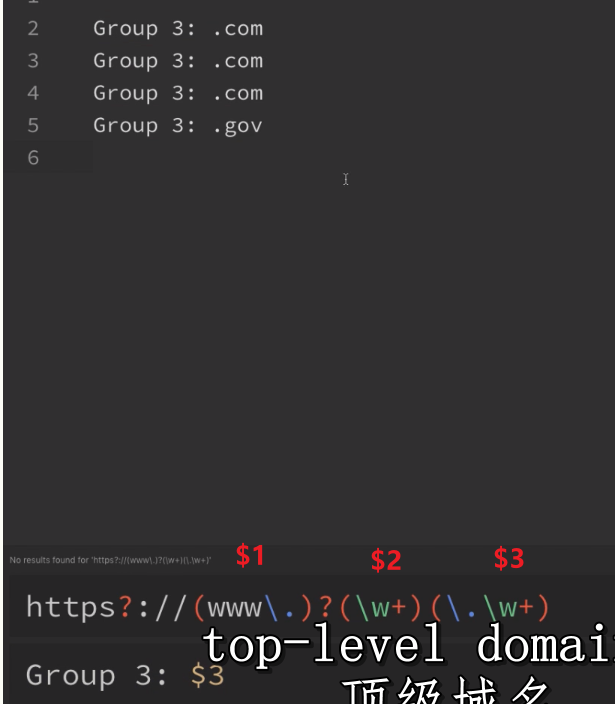  

这里有个没展示，$0 表示匹配的内容，这里指的是从```http```一直到结束