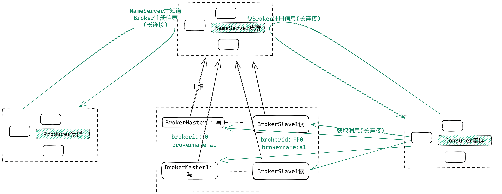

>  学习来源 https://www.bilibili.com/video/BV1L4411y7mn（添加小部分笔记）感谢作者!

# 基本操作

## 下载

https://rocketmq.apache.org/download/ 选择Binary下载即可，放到Linux主机中

## 前提java运行环境

```shell
yum search java | grep jdk
yum install -y java-1.8.0-openjdk-devel.x86_64
# java -version 正常
# javac -version 正常
```

## 启动

```shell
#nameserver启动
nohup sh bin/mqnamesrv &
#nameserver日志查看
tail -f ~/logs/rocketmqlogs/namesrv.log
#输出
2023-04-06 00:08:34 INFO main - tls.client.certPath = null
2023-04-06 00:08:34 INFO main - tls.client.authServer = false
2023-04-06 00:08:34 INFO main - tls.client.trustCertPath = null
2023-04-06 00:08:35 INFO main - Using OpenSSL provider
2023-04-06 00:08:35 INFO main - SSLContext created for server
2023-04-06 00:08:36 INFO NettyEventExecutor - NettyEventExecutor service started
2023-04-06 00:08:36 INFO main - The Name Server boot success. serializeType=JSON
2023-04-06 00:08:36 INFO FileWatchService - FileWatchService service started
2023-04-06 00:09:35 INFO NSScheduledThread1 - --------------------------------------------------------
2023-04-06 00:09:35 INFO NSScheduledThread1 - configTable SIZE: 0
```

```shell
#broker启动
nohup sh bin/mqbroker -n localhost:9876 &
#查看broker日志
tail -f ~/logs/rocketmqlogs/broker.log
#日志如下
tail: 无法打开"/root/logs/rocketmqlogs/broker.log" 读取数据: 没有那个文件或目录
tail: 没有剩余文件
👇
#jps查看
2465 Jps
2430 NamesrvStartup
#说明没有启动成功,因为默认配置的虚拟机内存较大
vim bin/runbroker.sh  以及 vim runserver.sh
#修改 
JAVA_OPT="${JAVA_OPT} -server -Xms8g -Xmx8g -Xmn4g"
#修改为
JAVA_OPT="${JAVA_OPT} -server -Xms256m -Xmx256m -Xmn128m -XX:MetaspaceSize=128m -XX:MaxMetaspaceSize=320m"
```

```shell
#修改完毕后启动
#先关闭namesrv后
#按上述启动namesrv以及broker
sh bin/mqshutdown namesrv
# jsp命令查看进程
2612 Jps
2551 BrokerStartup
2524 NamesrvStartup
```

## 测试

同一台机器上，两个cmd窗口

### 发送端

```shell
#配置namesrv为环境变量
export NAMESRV_ADDR=localhost:9876
#运行程序（发送消息）
sh bin/tools.sh org.apache.rocketmq.example.quickstart.Producer
#结果
SendResult [sendStatus=SEND_OK, msgId=C0A801640B012503DBD319DEF7D203E1, offsetMsgId=C0A8010300002A9F0000000000057878, messageQueue=MessageQueue [topic=TopicTest, brokerName=rheCentos700, queueId=3], queueOffset=498]
SendResult [sendStatus=SEND_OK, msgId=C0A801640B012503DBD319DEF7D803E2, offsetMsgId=C0A8010300002A9F000000000005792C, messageQueue=MessageQueue [topic=TopicTest, brokerName=rheCentos700, queueId=0], queueOffset=498]
SendResult [sendStatus=SEND_OK, msgId=C0A801640B012503DBD319DEF7DB03E3, offsetMsgId=C0A8010300002A9F00000000000579E0, messageQueue=MessageQueue [topic=TopicTest, brokerName=rheCentos700, queueId=1], queueOffset=498]  
```

### 接收端

```shell
#配置namesrv为环境变量
export NAMESRV_ADDR=localhost:9876
#运行程序（发送消息）
sh bin/tools.sh org.apache.rocketmq.example.quickstart.Consumer
#结果
ConsumeMessageThread_5 Receive New Messages: [MessageExt [queueId=0, storeSize=180, queueOffset=499, sysFlag=0, bornTimestamp=1680712442864, bornHost=/192.168.1.3:45716, storeTimestamp=1680712442878, storeHost=/192.168.1.3:10911, msgId=C0A8010300002A9F0000000000057BFC, commitLogOffset=359420, bodyCRC=1359908749, reconsumeTimes=0, preparedTransactionOffset=0, toString()=Message{topic='TopicTest', flag=0, properties={MIN_OFFSET=0, MAX_OFFSET=500, CONSUME_START_TIME=1680712442881, UNIQ_KEY=C0A801640B012503DBD319DEF7F003E6, WAIT=true, TAGS=TagA}, body=[72, 101, 108, 108, 111, 32, 82, 111, 99, 107, 101, 116, 77, 81, 32, 57, 57, 56], transactionId='null'}]] 
ConsumeMessageThread_2 Receive New Messages: [MessageExt [queueId=1, storeSize=180, queueOffset=499, sysFlag=0, bornTimestamp=1680712442879, bornHost=/192.168.1.3:45716, storeTimestamp=1680712442883, storeHost=/192.168.1.3:10911, msgId=C0A8010300002A9F0000000000057CB0, commitLogOffset=359600, bodyCRC=638172955, reconsumeTimes=0, preparedTransactionOffset=0, toString()=Message{topic='TopicTest', flag=0, properties={MIN_OFFSET=0, MAX_OFFSET=500, CONSUME_START_TIME=1680712442889, UNIQ_KEY=C0A801640B012503DBD319DEF7FF03E7, WAIT=true, TAGS=TagA}, body=[72, 101, 108, 108, 111, 32, 82, 111, 99, 107, 101, 116, 77, 81, 32, 57, 57, 57], transactionId='null'}]]
```

# RocketMQ基本架构

## 简单解释

1. nameserver：broker的管理者
2. broker：自己找nameserer上报
3. broker：真正存储消息的地方
4. nameserver是无状态的，即nameserver之间不用同步broker信息，由broker自己上报
5. Producer集群之间也不需要同步；Consumer集群之间也不需要同步
6. BrokerMaster和BrokerSlave之间信息是有同步的

## 如图


